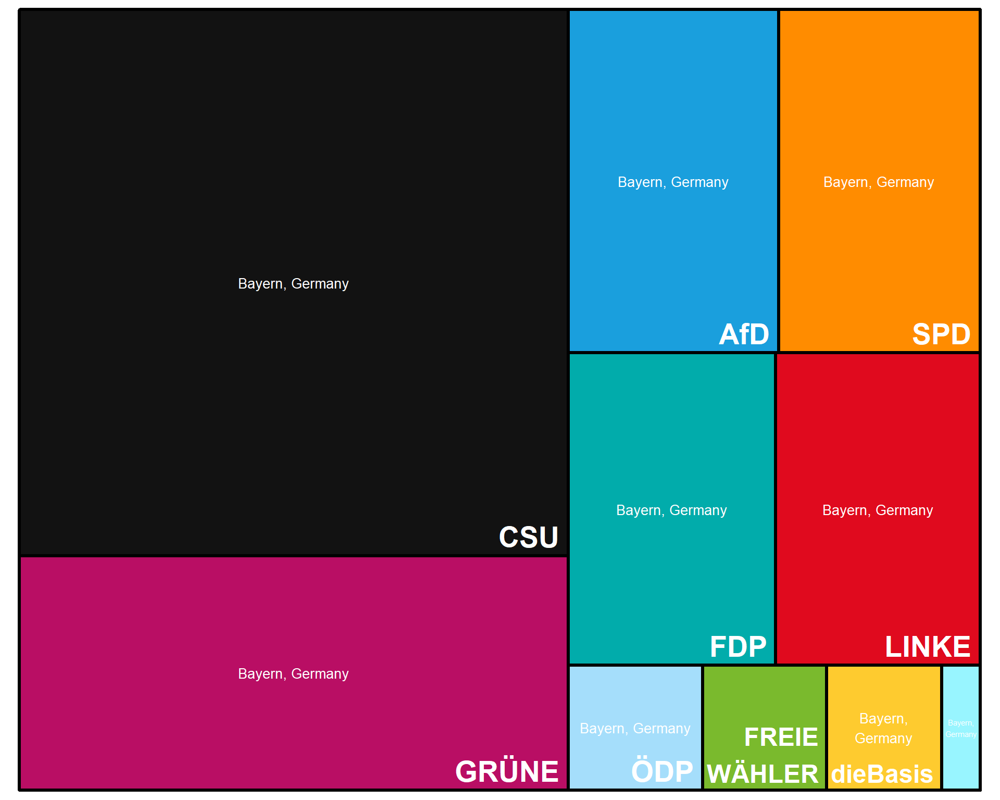
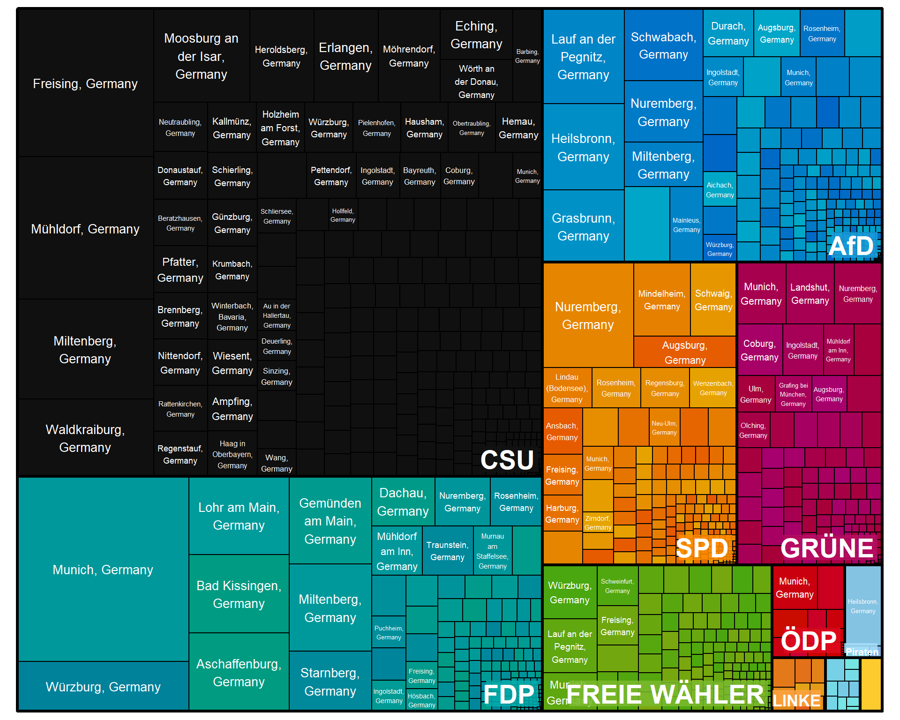
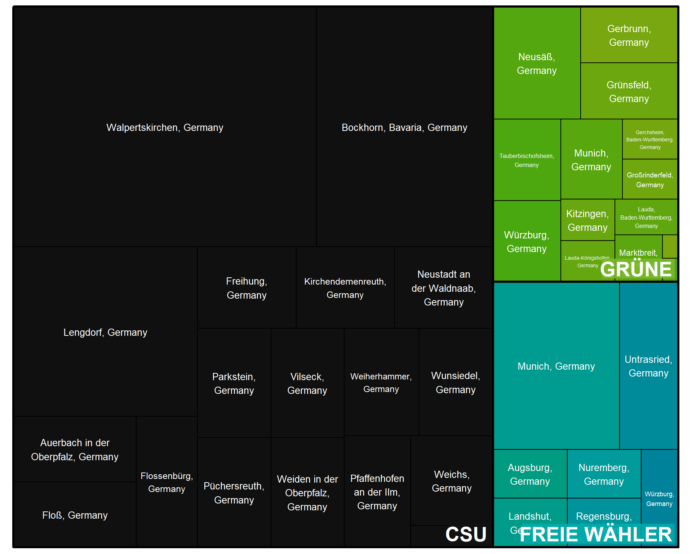

::: {.cell}

:::

::: {.cell}

:::


This section shows spending per *targeting criteria* used by political parties to reach citizens in the run-up to the 2023 Bayern Landtwagswahl for the latest available data. It only includes targeting on Meta platforms (Facebook and Instagram), which offers the most detailed targeting options to political advertisers.


## Spending per Targeting Criteria 

How much did campaigns spend on different targeting methods? The graphs below show spending *overall* across all parties and *by party*.

> Note: targeting criteria can overlap so the percentages do not sum up to 100%.

::: {.panel-tabset}


### Sep 3rd - Oct 2nd 2023 (Last 30 days) 

::: {.panel-tabset}


#### Overall


::: {.cell}
::: {.cell-output-display}
```{=html}
<div class="highchart html-widget html-fill-item-overflow-hidden html-fill-item" id="htmlwidget-486ab8147183eb793cb4" style="width:100%;height:406px;"></div>
<script type="application/json" data-for="htmlwidget-486ab8147183eb793cb4">{"x":{"hc_opts":{"chart":{"reflow":true},"title":{"text":null},"yAxis":{"title":{"text":"Budget spent on targeting method (% of Total spend)"},"type":"linear"},"credits":{"enabled":true,"text":"Source: Meta Ad Library. Data Viz: Fabio Votta (@favstats)."},"exporting":{"enabled":true},"boost":{"enabled":false},"plotOptions":{"series":{"label":{"enabled":false},"turboThreshold":0,"showInLegend":false},"treemap":{"layoutAlgorithm":"squarified"},"scatter":{"marker":{"symbol":"circle"}},"bar":{"color":"darkgrey"}},"series":[{"group":"group","data":[{"spend_per":132876.122538644,"target":"GEOGRAPHY: Regions","total":323846,"perc":41.0306511547599,"n":1,"spend_perlab":"132,876","y":41.0306511547599,"name":"GEOGRAPHY: Regions"},{"spend_per":88254.2380494377,"target":"Detailed","total":323846,"perc":27.2519154318527,"n":1,"spend_perlab":"88,254","y":27.2519154318527,"name":"Detailed"},{"spend_per":82415.4239140144,"target":"GEOGRAPHY: City","total":323846,"perc":25.4489553411234,"n":1,"spend_perlab":"82,415","y":25.4489553411234,"name":"GEOGRAPHY: City"},{"spend_per":67979.816403058,"target":"Language","total":323846,"perc":20.9914022106365,"n":1,"spend_perlab":"67,980","y":20.9914022106365,"name":"Language"},{"spend_per":54913.3019210513,"target":"GEOGRAPHY: Postal Code","total":323846,"perc":16.956609598714,"n":1,"spend_perlab":"54,913","y":16.956609598714,"name":"GEOGRAPHY: Postal Code"},{"spend_per":28941.9793232752,"target":"Lookalike Audiences","total":323846,"perc":8.93695748080111,"n":1,"spend_perlab":"28,942","y":8.93695748080111,"name":"Lookalike Audiences"},{"spend_per":10162.9008752546,"target":"GEOGRAPHY: Entire Country","total":323846,"perc":3.13818940955101,"n":1,"spend_perlab":"10,163","y":3.13818940955101,"name":"GEOGRAPHY: Entire Country"},{"spend_per":7865,"target":"Age","total":323846,"perc":2.42862348153135,"n":1,"spend_perlab":"7,865","y":2.42862348153135,"name":"Age"},{"spend_per":7625.3248202283,"target":"GEOGRAPHY: Neighborhood","total":323846,"perc":2.3546144834978,"n":1,"spend_perlab":"7,625","y":2.3546144834978,"name":"GEOGRAPHY: Neighborhood"},{"spend_per":5267.29565293202,"target":"Custom Audiences","total":323846,"perc":1.62648161562348,"n":1,"spend_perlab":"5,267","y":1.62648161562348,"name":"Custom Audiences"},{"spend_per":1505.4616206116,"target":"Gender","total":323846,"perc":0.464869604877505,"n":1,"spend_perlab":"1,505","y":0.464869604877505,"name":"Gender"},{"spend_per":97.1122455097784,"target":"LANDKREIS","total":323846,"perc":0.0299871684411042,"n":1,"spend_perlab":"97","y":0.0299871684411042,"name":"LANDKREIS"}],"type":"bar"}],"xAxis":{"type":"category","title":{"text":"target"},"labels":{"style":{"fontSize":"10px"}}},"tooltip":{"pointFormat":"<b>{point.target}<\/b><br>% of Total Budget Spent: {point.y:.1f}%<br>Spend a total of €{point.spend_perlab} on this method.","headerFormat":""}},"theme":{"colors":["#0266C8","#F90101","#F2B50F","#00933B"],"chart":{"style":{"fontFamily":"Roboto","color":"#444444"}},"xAxis":{"gridLineWidth":1,"gridLineColor":"#F3F3F3","lineColor":"#F3F3F3","minorGridLineColor":"#F3F3F3","tickColor":"#F3F3F3","tickWidth":1},"yAxis":{"gridLineColor":"#F3F3F3","lineColor":"#F3F3F3","minorGridLineColor":"#F3F3F3","tickColor":"#F3F3F3","tickWidth":1},"legendBackgroundColor":"rgba(0, 0, 0, 0.5)","background2":"#505053","dataLabelsColor":"#B0B0B3","textColor":"#C0C0C0","contrastTextColor":"#F0F0F3","maskColor":"rgba(255,255,255,0.3)"},"conf_opts":{"global":{"Date":null,"VMLRadialGradientURL":"http =//code.highcharts.com/list(version)/gfx/vml-radial-gradient.png","canvasToolsURL":"http =//code.highcharts.com/list(version)/modules/canvas-tools.js","getTimezoneOffset":null,"timezoneOffset":0,"useUTC":true},"lang":{"contextButtonTitle":"Chart context menu","decimalPoint":".","downloadCSV":"Download CSV","downloadJPEG":"Download JPEG image","downloadPDF":"Download PDF document","downloadPNG":"Download PNG image","downloadSVG":"Download SVG vector image","downloadXLS":"Download XLS","drillUpText":"◁ Back to {series.name}","exitFullscreen":"Exit from full screen","exportData":{"annotationHeader":"Annotations","categoryDatetimeHeader":"DateTime","categoryHeader":"Category"},"hideData":"Hide data table","invalidDate":null,"loading":"Loading...","months":["January","February","March","April","May","June","July","August","September","October","November","December"],"noData":"No data to display","numericSymbolMagnitude":1000,"numericSymbols":["k","M","G","T","P","E"],"printChart":"Print chart","resetZoom":"Reset zoom","resetZoomTitle":"Reset zoom level 1:1","shortMonths":["Jan","Feb","Mar","Apr","May","Jun","Jul","Aug","Sep","Oct","Nov","Dec"],"shortWeekdays":["Sat","Sun","Mon","Tue","Wed","Thu","Fri"],"thousandsSep":" ","viewData":"View data table","viewFullscreen":"View in full screen","weekdays":["Sunday","Monday","Tuesday","Wednesday","Thursday","Friday","Saturday"]}},"type":"chart","fonts":"Roboto","debug":false},"evals":[],"jsHooks":[]}</script>
```
:::
:::


#### By Party


::: {.cell}

:::

::: {.cell-output-display}
```{=html}
<div class="container">
<div>
<div class="row">
<div style="width: 50%; float: left;">
<div id="htmlwidget-c6c520753ac5b6d8a008" style="width:100%;height:300px;" class="highchart html-widget "></div>
<script type="application/json" data-for="htmlwidget-c6c520753ac5b6d8a008">{"x":{"hc_opts":{"chart":{"reflow":true,"height":300},"title":{"text":"AfD","align":"left","style":{"fontWeight":"bold"}},"yAxis":{"title":{"text":"% Party Budget spent on targeting method"},"type":"linear","max":100,"min":0},"credits":{"enabled":false},"exporting":{"enabled":true},"boost":{"enabled":false},"plotOptions":{"series":{"label":{"enabled":false},"turboThreshold":0,"showInLegend":false},"treemap":{"layoutAlgorithm":"squarified"},"scatter":{"marker":{"symbol":"circle"}},"bar":{"horizontal":true,"stacking":"normal"}},"series":[{"group":"group","data":[{"spend_per":12680.6732177971,"target":"GEOGRAPHY: Regions","total":30327,"perc":41.8131474191218,"party":"AfD","n":1,"spend_perlab":"12,681","y":41.8131474191218,"name":"GEOGRAPHY: Regions"},{"spend_per":12124.5054875475,"target":"GEOGRAPHY: City","total":30327,"perc":39.9792445264864,"party":"AfD","n":1,"spend_perlab":"12,125","y":39.9792445264864,"name":"GEOGRAPHY: City"},{"spend_per":2730.63981345904,"target":"Detailed","total":30327,"perc":9.00398922893474,"party":"AfD","n":1,"spend_perlab":"2,731","y":9.00398922893474,"name":"Detailed"},{"spend_per":1149,"target":"Age","total":30327,"perc":3.78870313581957,"party":"AfD","n":1,"spend_perlab":"1,149","y":3.78870313581957,"name":"Age"},{"spend_per":950.973102785792,"target":"GEOGRAPHY: Neighborhood","total":30327,"perc":3.13573087607014,"party":"AfD","n":1,"spend_perlab":"951","y":3.13573087607014,"name":"GEOGRAPHY: Neighborhood"},{"spend_per":669.141250177444,"target":"Gender","total":30327,"perc":2.20642084669583,"party":"AfD","n":1,"spend_perlab":"669","y":2.20642084669583,"name":"Gender"},{"spend_per":410.551339149547,"target":"Custom Audiences","total":30327,"perc":1.3537486040477,"party":"AfD","n":1,"spend_perlab":"411","y":1.3537486040477,"name":"Custom Audiences"},{"spend_per":410.551339149547,"target":"Lookalike Audiences","total":30327,"perc":1.3537486040477,"party":"AfD","n":1,"spend_perlab":"411","y":1.3537486040477,"name":"Lookalike Audiences"},{"spend_per":358.448365547854,"target":"GEOGRAPHY: Entire Country","total":30327,"perc":1.18194468805966,"party":"AfD","n":1,"spend_perlab":"358","y":1.18194468805966,"name":"GEOGRAPHY: Entire Country"}],"type":"bar","color":"#1a9fdd"}],"xAxis":{"type":"category","title":"","labels":{"style":{"fontSize":"10px"}}},"tooltip":{"pointFormat":"<b>{point.target}<\/b><br>% of Total Budget Spent: {point.y:.1f}%<br>Spend a total of €{point.spend_perlab} on this method.","headerFormat":""}},"theme":{"colors":["#0266C8","#F90101","#F2B50F","#00933B"],"chart":{"style":{"fontFamily":"Roboto","color":"#444444"}},"xAxis":{"gridLineWidth":1,"gridLineColor":"#F3F3F3","lineColor":"#F3F3F3","minorGridLineColor":"#F3F3F3","tickColor":"#F3F3F3","tickWidth":1},"yAxis":{"gridLineColor":"#F3F3F3","lineColor":"#F3F3F3","minorGridLineColor":"#F3F3F3","tickColor":"#F3F3F3","tickWidth":1},"legendBackgroundColor":"rgba(0, 0, 0, 0.5)","background2":"#505053","dataLabelsColor":"#B0B0B3","textColor":"#C0C0C0","contrastTextColor":"#F0F0F3","maskColor":"rgba(255,255,255,0.3)"},"conf_opts":{"global":{"Date":null,"VMLRadialGradientURL":"http =//code.highcharts.com/list(version)/gfx/vml-radial-gradient.png","canvasToolsURL":"http =//code.highcharts.com/list(version)/modules/canvas-tools.js","getTimezoneOffset":null,"timezoneOffset":0,"useUTC":true},"lang":{"contextButtonTitle":"Chart context menu","decimalPoint":".","downloadCSV":"Download CSV","downloadJPEG":"Download JPEG image","downloadPDF":"Download PDF document","downloadPNG":"Download PNG image","downloadSVG":"Download SVG vector image","downloadXLS":"Download XLS","drillUpText":"◁ Back to {series.name}","exitFullscreen":"Exit from full screen","exportData":{"annotationHeader":"Annotations","categoryDatetimeHeader":"DateTime","categoryHeader":"Category"},"hideData":"Hide data table","invalidDate":null,"loading":"Loading...","months":["January","February","March","April","May","June","July","August","September","October","November","December"],"noData":"No data to display","numericSymbolMagnitude":1000,"numericSymbols":["k","M","G","T","P","E"],"printChart":"Print chart","resetZoom":"Reset zoom","resetZoomTitle":"Reset zoom level 1:1","shortMonths":["Jan","Feb","Mar","Apr","May","Jun","Jul","Aug","Sep","Oct","Nov","Dec"],"shortWeekdays":["Sat","Sun","Mon","Tue","Wed","Thu","Fri"],"thousandsSep":" ","viewData":"View data table","viewFullscreen":"View in full screen","weekdays":["Sunday","Monday","Tuesday","Wednesday","Thursday","Friday","Saturday"]}},"type":"chart","fonts":"Roboto","debug":false},"evals":[],"jsHooks":[]}</script>
</div>
<div style="width: 50%; float: left;">
<div id="htmlwidget-3951a450f8dad5df1671" style="width:100%;height:300px;" class="highchart html-widget "></div>
<script type="application/json" data-for="htmlwidget-3951a450f8dad5df1671">{"x":{"hc_opts":{"chart":{"reflow":true,"height":300},"title":{"text":"Bayernpartei","align":"left","style":{"fontWeight":"bold"}},"yAxis":{"title":{"text":"% Party Budget spent on targeting method"},"type":"linear","max":100,"min":0},"credits":{"enabled":false},"exporting":{"enabled":true},"boost":{"enabled":false},"plotOptions":{"series":{"label":{"enabled":false},"turboThreshold":0,"showInLegend":false},"treemap":{"layoutAlgorithm":"squarified"},"scatter":{"marker":{"symbol":"circle"}},"bar":{"horizontal":true,"stacking":"normal"}},"series":[{"group":"group","data":[{"spend_per":845.701093739728,"target":"GEOGRAPHY: Regions","total":1827,"perc":46.289058223302,"party":"Bayernpartei","n":1,"spend_perlab":"846","y":46.289058223302,"name":"GEOGRAPHY: Regions"},{"spend_per":690.240672009451,"target":"Detailed","total":1827,"perc":37.780003941404,"party":"Bayernpartei","n":1,"spend_perlab":"690","y":37.780003941404,"name":"Detailed"},{"spend_per":540.961062208503,"target":"GEOGRAPHY: Entire Country","total":1827,"perc":29.60925354179,"party":"Bayernpartei","n":1,"spend_perlab":"541","y":29.60925354179,"name":"GEOGRAPHY: Entire Country"},{"spend_per":300.619490245017,"target":"GEOGRAPHY: City","total":1827,"perc":16.45426875999,"party":"Bayernpartei","n":1,"spend_perlab":"301","y":16.45426875999,"name":"GEOGRAPHY: City"}],"type":"bar","color":"#98f5ff"}],"xAxis":{"type":"category","title":"","labels":{"style":{"fontSize":"10px"}}},"tooltip":{"pointFormat":"<b>{point.target}<\/b><br>% of Total Budget Spent: {point.y:.1f}%<br>Spend a total of €{point.spend_perlab} on this method.","headerFormat":""}},"theme":{"colors":["#0266C8","#F90101","#F2B50F","#00933B"],"chart":{"style":{"fontFamily":"Roboto","color":"#444444"}},"xAxis":{"gridLineWidth":1,"gridLineColor":"#F3F3F3","lineColor":"#F3F3F3","minorGridLineColor":"#F3F3F3","tickColor":"#F3F3F3","tickWidth":1},"yAxis":{"gridLineColor":"#F3F3F3","lineColor":"#F3F3F3","minorGridLineColor":"#F3F3F3","tickColor":"#F3F3F3","tickWidth":1},"legendBackgroundColor":"rgba(0, 0, 0, 0.5)","background2":"#505053","dataLabelsColor":"#B0B0B3","textColor":"#C0C0C0","contrastTextColor":"#F0F0F3","maskColor":"rgba(255,255,255,0.3)"},"conf_opts":{"global":{"Date":null,"VMLRadialGradientURL":"http =//code.highcharts.com/list(version)/gfx/vml-radial-gradient.png","canvasToolsURL":"http =//code.highcharts.com/list(version)/modules/canvas-tools.js","getTimezoneOffset":null,"timezoneOffset":0,"useUTC":true},"lang":{"contextButtonTitle":"Chart context menu","decimalPoint":".","downloadCSV":"Download CSV","downloadJPEG":"Download JPEG image","downloadPDF":"Download PDF document","downloadPNG":"Download PNG image","downloadSVG":"Download SVG vector image","downloadXLS":"Download XLS","drillUpText":"◁ Back to {series.name}","exitFullscreen":"Exit from full screen","exportData":{"annotationHeader":"Annotations","categoryDatetimeHeader":"DateTime","categoryHeader":"Category"},"hideData":"Hide data table","invalidDate":null,"loading":"Loading...","months":["January","February","March","April","May","June","July","August","September","October","November","December"],"noData":"No data to display","numericSymbolMagnitude":1000,"numericSymbols":["k","M","G","T","P","E"],"printChart":"Print chart","resetZoom":"Reset zoom","resetZoomTitle":"Reset zoom level 1:1","shortMonths":["Jan","Feb","Mar","Apr","May","Jun","Jul","Aug","Sep","Oct","Nov","Dec"],"shortWeekdays":["Sat","Sun","Mon","Tue","Wed","Thu","Fri"],"thousandsSep":" ","viewData":"View data table","viewFullscreen":"View in full screen","weekdays":["Sunday","Monday","Tuesday","Wednesday","Thursday","Friday","Saturday"]}},"type":"chart","fonts":"Roboto","debug":false},"evals":[],"jsHooks":[]}</script>
</div>
</div>
<div class="row">
<div style="width: 50%; float: left;">
<div id="htmlwidget-0f196f25300467debeaa" style="width:100%;height:300px;" class="highchart html-widget "></div>
<script type="application/json" data-for="htmlwidget-0f196f25300467debeaa">{"x":{"hc_opts":{"chart":{"reflow":true,"height":300},"title":{"text":"CSU","align":"left","style":{"fontWeight":"bold"}},"yAxis":{"title":{"text":"% Party Budget spent on targeting method"},"type":"linear","max":100,"min":0},"credits":{"enabled":false},"exporting":{"enabled":true},"boost":{"enabled":false},"plotOptions":{"series":{"label":{"enabled":false},"turboThreshold":0,"showInLegend":false},"treemap":{"layoutAlgorithm":"squarified"},"scatter":{"marker":{"symbol":"circle"}},"bar":{"horizontal":true,"stacking":"normal"}},"series":[{"group":"group","data":[{"spend_per":52577.6646458493,"target":"GEOGRAPHY: Regions","total":99191,"perc":53.0064871267043,"party":"CSU","n":1,"spend_perlab":"52,578","y":53.0064871267043,"name":"GEOGRAPHY: Regions"},{"spend_per":32406.8381460458,"target":"GEOGRAPHY: City","total":99191,"perc":32.6711477311912,"party":"CSU","n":1,"spend_perlab":"32,407","y":32.6711477311912,"name":"GEOGRAPHY: City"},{"spend_per":7053.25965844842,"target":"Language","total":99191,"perc":7.11078591651301,"party":"CSU","n":1,"spend_perlab":"7,053","y":7.11078591651301,"name":"Language"},{"spend_per":6775.70130522739,"target":"GEOGRAPHY: Postal Code","total":99191,"perc":6.83096380238871,"party":"CSU","n":1,"spend_perlab":"6,776","y":6.83096380238871,"name":"GEOGRAPHY: Postal Code"},{"spend_per":4893.36637742134,"target":"GEOGRAPHY: Neighborhood","total":99191,"perc":4.93327658499394,"party":"CSU","n":1,"spend_perlab":"4,893","y":4.93327658499394,"name":"GEOGRAPHY: Neighborhood"},{"spend_per":2850.65409463053,"target":"GEOGRAPHY: Entire Country","total":99191,"perc":2.87390397781102,"party":"CSU","n":1,"spend_perlab":"2,851","y":2.87390397781102,"name":"GEOGRAPHY: Entire Country"},{"spend_per":2470.31299138371,"target":"Detailed","total":99191,"perc":2.49046081941276,"party":"CSU","n":1,"spend_perlab":"2,470","y":2.49046081941276,"name":"Detailed"},{"spend_per":2017,"target":"Age","total":99191,"perc":2.03345061547923,"party":"CSU","n":1,"spend_perlab":"2,017","y":2.03345061547923,"name":"Age"},{"spend_per":653,"target":"Custom Audiences","total":99191,"perc":0.658325856176468,"party":"CSU","n":1,"spend_perlab":"653","y":0.658325856176468,"name":"Custom Audiences"}],"type":"bar","color":"#121212"}],"xAxis":{"type":"category","title":"","labels":{"style":{"fontSize":"10px"}}},"tooltip":{"pointFormat":"<b>{point.target}<\/b><br>% of Total Budget Spent: {point.y:.1f}%<br>Spend a total of €{point.spend_perlab} on this method.","headerFormat":""}},"theme":{"colors":["#0266C8","#F90101","#F2B50F","#00933B"],"chart":{"style":{"fontFamily":"Roboto","color":"#444444"}},"xAxis":{"gridLineWidth":1,"gridLineColor":"#F3F3F3","lineColor":"#F3F3F3","minorGridLineColor":"#F3F3F3","tickColor":"#F3F3F3","tickWidth":1},"yAxis":{"gridLineColor":"#F3F3F3","lineColor":"#F3F3F3","minorGridLineColor":"#F3F3F3","tickColor":"#F3F3F3","tickWidth":1},"legendBackgroundColor":"rgba(0, 0, 0, 0.5)","background2":"#505053","dataLabelsColor":"#B0B0B3","textColor":"#C0C0C0","contrastTextColor":"#F0F0F3","maskColor":"rgba(255,255,255,0.3)"},"conf_opts":{"global":{"Date":null,"VMLRadialGradientURL":"http =//code.highcharts.com/list(version)/gfx/vml-radial-gradient.png","canvasToolsURL":"http =//code.highcharts.com/list(version)/modules/canvas-tools.js","getTimezoneOffset":null,"timezoneOffset":0,"useUTC":true},"lang":{"contextButtonTitle":"Chart context menu","decimalPoint":".","downloadCSV":"Download CSV","downloadJPEG":"Download JPEG image","downloadPDF":"Download PDF document","downloadPNG":"Download PNG image","downloadSVG":"Download SVG vector image","downloadXLS":"Download XLS","drillUpText":"◁ Back to {series.name}","exitFullscreen":"Exit from full screen","exportData":{"annotationHeader":"Annotations","categoryDatetimeHeader":"DateTime","categoryHeader":"Category"},"hideData":"Hide data table","invalidDate":null,"loading":"Loading...","months":["January","February","March","April","May","June","July","August","September","October","November","December"],"noData":"No data to display","numericSymbolMagnitude":1000,"numericSymbols":["k","M","G","T","P","E"],"printChart":"Print chart","resetZoom":"Reset zoom","resetZoomTitle":"Reset zoom level 1:1","shortMonths":["Jan","Feb","Mar","Apr","May","Jun","Jul","Aug","Sep","Oct","Nov","Dec"],"shortWeekdays":["Sat","Sun","Mon","Tue","Wed","Thu","Fri"],"thousandsSep":" ","viewData":"View data table","viewFullscreen":"View in full screen","weekdays":["Sunday","Monday","Tuesday","Wednesday","Thursday","Friday","Saturday"]}},"type":"chart","fonts":"Roboto","debug":false},"evals":[],"jsHooks":[]}</script>
</div>
<div style="width: 50%; float: left;">
<div id="htmlwidget-758b12f2ac9185b5d7ca" style="width:100%;height:300px;" class="highchart html-widget "></div>
<script type="application/json" data-for="htmlwidget-758b12f2ac9185b5d7ca">{"x":{"hc_opts":{"chart":{"reflow":true,"height":300},"title":{"text":"dieBasis","align":"left","style":{"fontWeight":"bold"}},"yAxis":{"title":{"text":"% Party Budget spent on targeting method"},"type":"linear","max":100,"min":0},"credits":{"enabled":false},"exporting":{"enabled":true},"boost":{"enabled":false},"plotOptions":{"series":{"label":{"enabled":false},"turboThreshold":0,"showInLegend":false},"treemap":{"layoutAlgorithm":"squarified"},"scatter":{"marker":{"symbol":"circle"}},"bar":{"horizontal":true,"stacking":"normal"}},"series":[{"group":"group","data":[{"spend_per":2515,"target":"GEOGRAPHY: Regions","total":2841,"perc":88.5251671946498,"party":"dieBasis","n":1,"spend_perlab":"2,515","y":88.5251671946498,"name":"GEOGRAPHY: Regions"},{"spend_per":777.458204937545,"target":"Detailed","total":2841,"perc":27.365653112902,"party":"dieBasis","n":1,"spend_perlab":"777","y":27.365653112902,"name":"Detailed"},{"spend_per":326,"target":"GEOGRAPHY: City","total":2841,"perc":11.4748328053502,"party":"dieBasis","n":1,"spend_perlab":"326","y":11.4748328053502,"name":"GEOGRAPHY: City"},{"spend_per":326,"target":"Age","total":2841,"perc":11.4748328053502,"party":"dieBasis","n":1,"spend_perlab":"326","y":11.4748328053502,"name":"Age"}],"type":"bar","color":"#a5defb"}],"xAxis":{"type":"category","title":"","labels":{"style":{"fontSize":"10px"}}},"tooltip":{"pointFormat":"<b>{point.target}<\/b><br>% of Total Budget Spent: {point.y:.1f}%<br>Spend a total of €{point.spend_perlab} on this method.","headerFormat":""}},"theme":{"colors":["#0266C8","#F90101","#F2B50F","#00933B"],"chart":{"style":{"fontFamily":"Roboto","color":"#444444"}},"xAxis":{"gridLineWidth":1,"gridLineColor":"#F3F3F3","lineColor":"#F3F3F3","minorGridLineColor":"#F3F3F3","tickColor":"#F3F3F3","tickWidth":1},"yAxis":{"gridLineColor":"#F3F3F3","lineColor":"#F3F3F3","minorGridLineColor":"#F3F3F3","tickColor":"#F3F3F3","tickWidth":1},"legendBackgroundColor":"rgba(0, 0, 0, 0.5)","background2":"#505053","dataLabelsColor":"#B0B0B3","textColor":"#C0C0C0","contrastTextColor":"#F0F0F3","maskColor":"rgba(255,255,255,0.3)"},"conf_opts":{"global":{"Date":null,"VMLRadialGradientURL":"http =//code.highcharts.com/list(version)/gfx/vml-radial-gradient.png","canvasToolsURL":"http =//code.highcharts.com/list(version)/modules/canvas-tools.js","getTimezoneOffset":null,"timezoneOffset":0,"useUTC":true},"lang":{"contextButtonTitle":"Chart context menu","decimalPoint":".","downloadCSV":"Download CSV","downloadJPEG":"Download JPEG image","downloadPDF":"Download PDF document","downloadPNG":"Download PNG image","downloadSVG":"Download SVG vector image","downloadXLS":"Download XLS","drillUpText":"◁ Back to {series.name}","exitFullscreen":"Exit from full screen","exportData":{"annotationHeader":"Annotations","categoryDatetimeHeader":"DateTime","categoryHeader":"Category"},"hideData":"Hide data table","invalidDate":null,"loading":"Loading...","months":["January","February","March","April","May","June","July","August","September","October","November","December"],"noData":"No data to display","numericSymbolMagnitude":1000,"numericSymbols":["k","M","G","T","P","E"],"printChart":"Print chart","resetZoom":"Reset zoom","resetZoomTitle":"Reset zoom level 1:1","shortMonths":["Jan","Feb","Mar","Apr","May","Jun","Jul","Aug","Sep","Oct","Nov","Dec"],"shortWeekdays":["Sat","Sun","Mon","Tue","Wed","Thu","Fri"],"thousandsSep":" ","viewData":"View data table","viewFullscreen":"View in full screen","weekdays":["Sunday","Monday","Tuesday","Wednesday","Thursday","Friday","Saturday"]}},"type":"chart","fonts":"Roboto","debug":false},"evals":[],"jsHooks":[]}</script>
</div>
</div>
<div class="row">
<div style="width: 50%; float: left;">
<div id="htmlwidget-a5630ba1a417cb390146" style="width:100%;height:300px;" class="highchart html-widget "></div>
<script type="application/json" data-for="htmlwidget-a5630ba1a417cb390146">{"x":{"hc_opts":{"chart":{"reflow":true,"height":300},"title":{"text":"FDP","align":"left","style":{"fontWeight":"bold"}},"yAxis":{"title":{"text":"% Party Budget spent on targeting method"},"type":"linear","max":100,"min":0},"credits":{"enabled":false},"exporting":{"enabled":true},"boost":{"enabled":false},"plotOptions":{"series":{"label":{"enabled":false},"turboThreshold":0,"showInLegend":false},"treemap":{"layoutAlgorithm":"squarified"},"scatter":{"marker":{"symbol":"circle"}},"bar":{"horizontal":true,"stacking":"normal"}},"series":[{"group":"group","data":[{"spend_per":19629.1885116748,"target":"GEOGRAPHY: Postal Code","total":55509,"perc":35.3621728218394,"party":"FDP","n":1,"spend_perlab":"19,629","y":35.3621728218394,"name":"GEOGRAPHY: Postal Code"},{"spend_per":13601.0683327643,"target":"GEOGRAPHY: City","total":55509,"perc":24.5024560571516,"party":"FDP","n":1,"spend_perlab":"13,601","y":24.5024560571516,"name":"GEOGRAPHY: City"},{"spend_per":12739.9189162501,"target":"Lookalike Audiences","total":55509,"perc":22.9510870602066,"party":"FDP","n":1,"spend_perlab":"12,740","y":22.9510870602066,"name":"Lookalike Audiences"},{"spend_per":12023.6911169585,"target":"Detailed","total":55509,"perc":21.66079575737,"party":"FDP","n":1,"spend_perlab":"12,024","y":21.66079575737,"name":"Detailed"},{"spend_per":11393.4579898736,"target":"GEOGRAPHY: Regions","total":55509,"perc":20.5254246876607,"party":"FDP","n":1,"spend_perlab":"11,393","y":20.5254246876607,"name":"GEOGRAPHY: Regions"},{"spend_per":4622.32786774556,"target":"GEOGRAPHY: Entire Country","total":55509,"perc":8.3271683290017,"party":"FDP","n":1,"spend_perlab":"4,622","y":8.3271683290017,"name":"GEOGRAPHY: Entire Country"},{"spend_per":2497.93904671367,"target":"Custom Audiences","total":55509,"perc":4.50006133548374,"party":"FDP","n":1,"spend_perlab":"2,498","y":4.50006133548374,"name":"Custom Audiences"},{"spend_per":1680,"target":"Age","total":55509,"perc":3.02653623736691,"party":"FDP","n":1,"spend_perlab":"1,680","y":3.02653623736691,"name":"Age"},{"spend_per":1166.32199858096,"target":"Language","total":55509,"perc":2.10114035306159,"party":"FDP","n":1,"spend_perlab":"1,166","y":2.10114035306159,"name":"Language"},{"spend_per":797.697938548687,"target":"GEOGRAPHY: Neighborhood","total":55509,"perc":1.43706054612529,"party":"FDP","n":1,"spend_perlab":"798","y":1.43706054612529,"name":"GEOGRAPHY: Neighborhood"}],"type":"bar","color":"#fecb2f"}],"xAxis":{"type":"category","title":"","labels":{"style":{"fontSize":"10px"}}},"tooltip":{"pointFormat":"<b>{point.target}<\/b><br>% of Total Budget Spent: {point.y:.1f}%<br>Spend a total of €{point.spend_perlab} on this method.","headerFormat":""}},"theme":{"colors":["#0266C8","#F90101","#F2B50F","#00933B"],"chart":{"style":{"fontFamily":"Roboto","color":"#444444"}},"xAxis":{"gridLineWidth":1,"gridLineColor":"#F3F3F3","lineColor":"#F3F3F3","minorGridLineColor":"#F3F3F3","tickColor":"#F3F3F3","tickWidth":1},"yAxis":{"gridLineColor":"#F3F3F3","lineColor":"#F3F3F3","minorGridLineColor":"#F3F3F3","tickColor":"#F3F3F3","tickWidth":1},"legendBackgroundColor":"rgba(0, 0, 0, 0.5)","background2":"#505053","dataLabelsColor":"#B0B0B3","textColor":"#C0C0C0","contrastTextColor":"#F0F0F3","maskColor":"rgba(255,255,255,0.3)"},"conf_opts":{"global":{"Date":null,"VMLRadialGradientURL":"http =//code.highcharts.com/list(version)/gfx/vml-radial-gradient.png","canvasToolsURL":"http =//code.highcharts.com/list(version)/modules/canvas-tools.js","getTimezoneOffset":null,"timezoneOffset":0,"useUTC":true},"lang":{"contextButtonTitle":"Chart context menu","decimalPoint":".","downloadCSV":"Download CSV","downloadJPEG":"Download JPEG image","downloadPDF":"Download PDF document","downloadPNG":"Download PNG image","downloadSVG":"Download SVG vector image","downloadXLS":"Download XLS","drillUpText":"◁ Back to {series.name}","exitFullscreen":"Exit from full screen","exportData":{"annotationHeader":"Annotations","categoryDatetimeHeader":"DateTime","categoryHeader":"Category"},"hideData":"Hide data table","invalidDate":null,"loading":"Loading...","months":["January","February","March","April","May","June","July","August","September","October","November","December"],"noData":"No data to display","numericSymbolMagnitude":1000,"numericSymbols":["k","M","G","T","P","E"],"printChart":"Print chart","resetZoom":"Reset zoom","resetZoomTitle":"Reset zoom level 1:1","shortMonths":["Jan","Feb","Mar","Apr","May","Jun","Jul","Aug","Sep","Oct","Nov","Dec"],"shortWeekdays":["Sat","Sun","Mon","Tue","Wed","Thu","Fri"],"thousandsSep":" ","viewData":"View data table","viewFullscreen":"View in full screen","weekdays":["Sunday","Monday","Tuesday","Wednesday","Thursday","Friday","Saturday"]}},"type":"chart","fonts":"Roboto","debug":false},"evals":[],"jsHooks":[]}</script>
</div>
<div style="width: 50%; float: left;">
<div id="htmlwidget-aec7917ba398778c5c0d" style="width:100%;height:300px;" class="highchart html-widget "></div>
<script type="application/json" data-for="htmlwidget-aec7917ba398778c5c0d">{"x":{"hc_opts":{"chart":{"reflow":true,"height":300},"title":{"text":"FREIE WÄHLER","align":"left","style":{"fontWeight":"bold"}},"yAxis":{"title":{"text":"% Party Budget spent on targeting method"},"type":"linear","max":100,"min":0},"credits":{"enabled":false},"exporting":{"enabled":true},"boost":{"enabled":false},"plotOptions":{"series":{"label":{"enabled":false},"turboThreshold":0,"showInLegend":false},"treemap":{"layoutAlgorithm":"squarified"},"scatter":{"marker":{"symbol":"circle"}},"bar":{"horizontal":true,"stacking":"normal"}},"series":[{"group":"group","data":[{"spend_per":14213.9067951495,"target":"GEOGRAPHY: Postal Code","total":24066,"perc":59.0621906222449,"party":"FREIE WÄHLER","n":1,"spend_perlab":"14,214","y":59.0621906222449,"name":"GEOGRAPHY: Postal Code"},{"spend_per":4635.04535014612,"target":"GEOGRAPHY: City","total":24066,"perc":19.2597247159732,"party":"FREIE WÄHLER","n":1,"spend_perlab":"4,635","y":19.2597247159732,"name":"GEOGRAPHY: City"},{"spend_per":3731.97751914961,"target":"Detailed","total":24066,"perc":15.5072613610471,"party":"FREIE WÄHLER","n":1,"spend_perlab":"3,732","y":15.5072613610471,"name":"Detailed"},{"spend_per":2804.98425137553,"target":"GEOGRAPHY: Regions","total":24066,"perc":11.6553820800114,"party":"FREIE WÄHLER","n":1,"spend_perlab":"2,805","y":11.6553820800114,"name":"GEOGRAPHY: Regions"},{"spend_per":1370.30188750952,"target":"Lookalike Audiences","total":24066,"perc":5.69393288252936,"party":"FREIE WÄHLER","n":1,"spend_perlab":"1,370","y":5.69393288252936,"name":"Lookalike Audiences"},{"spend_per":1362.3170026933,"target":"Custom Audiences","total":24066,"perc":5.66075377168329,"party":"FREIE WÄHLER","n":1,"spend_perlab":"1,362","y":5.66075377168329,"name":"Custom Audiences"},{"spend_per":750.956524427953,"target":"Language","total":24066,"perc":3.12040440633239,"party":"FREIE WÄHLER","n":1,"spend_perlab":"751","y":3.12040440633239,"name":"Language"},{"spend_per":731.043481709216,"target":"GEOGRAPHY: Entire Country","total":24066,"perc":3.037660939538,"party":"FREIE WÄHLER","n":1,"spend_perlab":"731","y":3.037660939538,"name":"GEOGRAPHY: Entire Country"},{"spend_per":649,"target":"Age","total":24066,"perc":2.69675060250976,"party":"FREIE WÄHLER","n":1,"spend_perlab":"649","y":2.69675060250976,"name":"Age"},{"spend_per":130.867175227674,"target":"GEOGRAPHY: Neighborhood","total":24066,"perc":0.543784489436027,"party":"FREIE WÄHLER","n":1,"spend_perlab":"131","y":0.543784489436027,"name":"GEOGRAPHY: Neighborhood"}],"type":"bar","color":"#01acab"}],"xAxis":{"type":"category","title":"","labels":{"style":{"fontSize":"10px"}}},"tooltip":{"pointFormat":"<b>{point.target}<\/b><br>% of Total Budget Spent: {point.y:.1f}%<br>Spend a total of €{point.spend_perlab} on this method.","headerFormat":""}},"theme":{"colors":["#0266C8","#F90101","#F2B50F","#00933B"],"chart":{"style":{"fontFamily":"Roboto","color":"#444444"}},"xAxis":{"gridLineWidth":1,"gridLineColor":"#F3F3F3","lineColor":"#F3F3F3","minorGridLineColor":"#F3F3F3","tickColor":"#F3F3F3","tickWidth":1},"yAxis":{"gridLineColor":"#F3F3F3","lineColor":"#F3F3F3","minorGridLineColor":"#F3F3F3","tickColor":"#F3F3F3","tickWidth":1},"legendBackgroundColor":"rgba(0, 0, 0, 0.5)","background2":"#505053","dataLabelsColor":"#B0B0B3","textColor":"#C0C0C0","contrastTextColor":"#F0F0F3","maskColor":"rgba(255,255,255,0.3)"},"conf_opts":{"global":{"Date":null,"VMLRadialGradientURL":"http =//code.highcharts.com/list(version)/gfx/vml-radial-gradient.png","canvasToolsURL":"http =//code.highcharts.com/list(version)/modules/canvas-tools.js","getTimezoneOffset":null,"timezoneOffset":0,"useUTC":true},"lang":{"contextButtonTitle":"Chart context menu","decimalPoint":".","downloadCSV":"Download CSV","downloadJPEG":"Download JPEG image","downloadPDF":"Download PDF document","downloadPNG":"Download PNG image","downloadSVG":"Download SVG vector image","downloadXLS":"Download XLS","drillUpText":"◁ Back to {series.name}","exitFullscreen":"Exit from full screen","exportData":{"annotationHeader":"Annotations","categoryDatetimeHeader":"DateTime","categoryHeader":"Category"},"hideData":"Hide data table","invalidDate":null,"loading":"Loading...","months":["January","February","March","April","May","June","July","August","September","October","November","December"],"noData":"No data to display","numericSymbolMagnitude":1000,"numericSymbols":["k","M","G","T","P","E"],"printChart":"Print chart","resetZoom":"Reset zoom","resetZoomTitle":"Reset zoom level 1:1","shortMonths":["Jan","Feb","Mar","Apr","May","Jun","Jul","Aug","Sep","Oct","Nov","Dec"],"shortWeekdays":["Sat","Sun","Mon","Tue","Wed","Thu","Fri"],"thousandsSep":" ","viewData":"View data table","viewFullscreen":"View in full screen","weekdays":["Sunday","Monday","Tuesday","Wednesday","Thursday","Friday","Saturday"]}},"type":"chart","fonts":"Roboto","debug":false},"evals":[],"jsHooks":[]}</script>
</div>
</div>
<div class="row">
<div style="width: 50%; float: left;">
<div id="htmlwidget-c4527c6daedd4ae918bf" style="width:100%;height:300px;" class="highchart html-widget "></div>
<script type="application/json" data-for="htmlwidget-c4527c6daedd4ae918bf">{"x":{"hc_opts":{"chart":{"reflow":true,"height":300},"title":{"text":"GRÜNE","align":"left","style":{"fontWeight":"bold"}},"yAxis":{"title":{"text":"% Party Budget spent on targeting method"},"type":"linear","max":100,"min":0},"credits":{"enabled":false},"exporting":{"enabled":true},"boost":{"enabled":false},"plotOptions":{"series":{"label":{"enabled":false},"turboThreshold":0,"showInLegend":false},"treemap":{"layoutAlgorithm":"squarified"},"scatter":{"marker":{"symbol":"circle"}},"bar":{"horizontal":true,"stacking":"normal"}},"series":[{"group":"group","data":[{"spend_per":55762.7031277548,"target":"Detailed","total":65381,"perc":85.2888501671047,"party":"GRÜNE","n":1,"spend_perlab":"55,763","y":85.2888501671047,"name":"Detailed"},{"spend_per":55288.2114361566,"target":"Language","total":65381,"perc":84.5631168629367,"party":"GRÜNE","n":1,"spend_perlab":"55,288","y":84.5631168629367,"name":"Language"},{"spend_per":22555.3135796426,"target":"GEOGRAPHY: Regions","total":65381,"perc":34.498269496708,"party":"GRÜNE","n":1,"spend_perlab":"22,555","y":34.498269496708,"name":"GEOGRAPHY: Regions"},{"spend_per":8998.76573841154,"target":"GEOGRAPHY: Postal Code","total":65381,"perc":13.7635792331282,"party":"GRÜNE","n":1,"spend_perlab":"8,999","y":13.7635792331282,"name":"GEOGRAPHY: Postal Code"},{"spend_per":8388.17080984675,"target":"GEOGRAPHY: City","total":65381,"perc":12.8296765265853,"party":"GRÜNE","n":1,"spend_perlab":"8,388","y":12.8296765265853,"name":"GEOGRAPHY: City"},{"spend_per":2604.43805772588,"target":"Lookalike Audiences","total":65381,"perc":3.98347846886079,"party":"GRÜNE","n":1,"spend_perlab":"2,604","y":3.98347846886079,"name":"Lookalike Audiences"},{"spend_per":860.880216561908,"target":"GEOGRAPHY: Entire Country","total":65381,"perc":1.31671313770347,"party":"GRÜNE","n":1,"spend_perlab":"861","y":1.31671313770347,"name":"GEOGRAPHY: Entire Country"},{"spend_per":846,"target":"Age","total":65381,"perc":1.29395390098041,"party":"GRÜNE","n":1,"spend_perlab":"846","y":1.29395390098041,"name":"Age"},{"spend_per":758.290363600993,"target":"GEOGRAPHY: Neighborhood","total":65381,"perc":1.15980233340113,"party":"GRÜNE","n":1,"spend_perlab":"758","y":1.15980233340113,"name":"GEOGRAPHY: Neighborhood"},{"spend_per":361.426754088053,"target":"Gender","total":65381,"perc":0.55280089641953,"party":"GRÜNE","n":1,"spend_perlab":"361","y":0.55280089641953,"name":"Gender"}],"type":"bar","color":"#7aba2d"}],"xAxis":{"type":"category","title":"","labels":{"style":{"fontSize":"10px"}}},"tooltip":{"pointFormat":"<b>{point.target}<\/b><br>% of Total Budget Spent: {point.y:.1f}%<br>Spend a total of €{point.spend_perlab} on this method.","headerFormat":""}},"theme":{"colors":["#0266C8","#F90101","#F2B50F","#00933B"],"chart":{"style":{"fontFamily":"Roboto","color":"#444444"}},"xAxis":{"gridLineWidth":1,"gridLineColor":"#F3F3F3","lineColor":"#F3F3F3","minorGridLineColor":"#F3F3F3","tickColor":"#F3F3F3","tickWidth":1},"yAxis":{"gridLineColor":"#F3F3F3","lineColor":"#F3F3F3","minorGridLineColor":"#F3F3F3","tickColor":"#F3F3F3","tickWidth":1},"legendBackgroundColor":"rgba(0, 0, 0, 0.5)","background2":"#505053","dataLabelsColor":"#B0B0B3","textColor":"#C0C0C0","contrastTextColor":"#F0F0F3","maskColor":"rgba(255,255,255,0.3)"},"conf_opts":{"global":{"Date":null,"VMLRadialGradientURL":"http =//code.highcharts.com/list(version)/gfx/vml-radial-gradient.png","canvasToolsURL":"http =//code.highcharts.com/list(version)/modules/canvas-tools.js","getTimezoneOffset":null,"timezoneOffset":0,"useUTC":true},"lang":{"contextButtonTitle":"Chart context menu","decimalPoint":".","downloadCSV":"Download CSV","downloadJPEG":"Download JPEG image","downloadPDF":"Download PDF document","downloadPNG":"Download PNG image","downloadSVG":"Download SVG vector image","downloadXLS":"Download XLS","drillUpText":"◁ Back to {series.name}","exitFullscreen":"Exit from full screen","exportData":{"annotationHeader":"Annotations","categoryDatetimeHeader":"DateTime","categoryHeader":"Category"},"hideData":"Hide data table","invalidDate":null,"loading":"Loading...","months":["January","February","March","April","May","June","July","August","September","October","November","December"],"noData":"No data to display","numericSymbolMagnitude":1000,"numericSymbols":["k","M","G","T","P","E"],"printChart":"Print chart","resetZoom":"Reset zoom","resetZoomTitle":"Reset zoom level 1:1","shortMonths":["Jan","Feb","Mar","Apr","May","Jun","Jul","Aug","Sep","Oct","Nov","Dec"],"shortWeekdays":["Sat","Sun","Mon","Tue","Wed","Thu","Fri"],"thousandsSep":" ","viewData":"View data table","viewFullscreen":"View in full screen","weekdays":["Sunday","Monday","Tuesday","Wednesday","Thursday","Friday","Saturday"]}},"type":"chart","fonts":"Roboto","debug":false},"evals":[],"jsHooks":[]}</script>
</div>
<div style="width: 50%; float: left;">
<div id="htmlwidget-5f5b37e1337fc58c3277" style="width:100%;height:300px;" class="highchart html-widget "></div>
<script type="application/json" data-for="htmlwidget-5f5b37e1337fc58c3277">{"x":{"hc_opts":{"chart":{"reflow":true,"height":300},"title":{"text":"LINKE","align":"left","style":{"fontWeight":"bold"}},"yAxis":{"title":{"text":"% Party Budget spent on targeting method"},"type":"linear","max":100,"min":0},"credits":{"enabled":false},"exporting":{"enabled":true},"boost":{"enabled":false},"plotOptions":{"series":{"label":{"enabled":false},"turboThreshold":0,"showInLegend":false},"treemap":{"layoutAlgorithm":"squarified"},"scatter":{"marker":{"symbol":"circle"}},"bar":{"horizontal":true,"stacking":"normal"}},"series":[{"group":"group","data":[{"spend_per":11679.1788099732,"target":"Lookalike Audiences","total":13778,"perc":84.7668660906752,"party":"LINKE","n":1,"spend_perlab":"11,679","y":84.7668660906752,"name":"Lookalike Audiences"},{"spend_per":11201.7945524305,"target":"GEOGRAPHY: Regions","total":13778,"perc":81.3020362347985,"party":"LINKE","n":1,"spend_perlab":"11,202","y":81.3020362347985,"name":"GEOGRAPHY: Regions"},{"spend_per":2524.19538753714,"target":"Language","total":13778,"perc":18.3204774824876,"party":"LINKE","n":1,"spend_perlab":"2,524","y":18.3204774824876,"name":"Language"},{"spend_per":2276.08797756926,"target":"Detailed","total":13778,"perc":16.5197269383746,"party":"LINKE","n":1,"spend_perlab":"2,276","y":16.5197269383746,"name":"Detailed"},{"spend_per":386.491542943815,"target":"GEOGRAPHY: Postal Code","total":13778,"perc":2.80513530950657,"party":"LINKE","n":1,"spend_perlab":"386","y":2.80513530950657,"name":"GEOGRAPHY: Postal Code"},{"spend_per":350.008960057815,"target":"GEOGRAPHY: City","total":13778,"perc":2.54034663998995,"party":"LINKE","n":1,"spend_perlab":"350","y":2.54034663998995,"name":"GEOGRAPHY: City"},{"spend_per":172.85516248664,"target":"Custom Audiences","total":13778,"perc":1.25457368621454,"party":"LINKE","n":1,"spend_perlab":"173","y":1.25457368621454,"name":"Custom Audiences"},{"spend_per":69.4420739547149,"target":"LANDKREIS","total":13778,"perc":0.504006923753193,"party":"LINKE","n":1,"spend_perlab":"69","y":0.504006923753193,"name":"LANDKREIS"}],"type":"bar","color":"#b90e64"}],"xAxis":{"type":"category","title":"","labels":{"style":{"fontSize":"10px"}}},"tooltip":{"pointFormat":"<b>{point.target}<\/b><br>% of Total Budget Spent: {point.y:.1f}%<br>Spend a total of €{point.spend_perlab} on this method.","headerFormat":""}},"theme":{"colors":["#0266C8","#F90101","#F2B50F","#00933B"],"chart":{"style":{"fontFamily":"Roboto","color":"#444444"}},"xAxis":{"gridLineWidth":1,"gridLineColor":"#F3F3F3","lineColor":"#F3F3F3","minorGridLineColor":"#F3F3F3","tickColor":"#F3F3F3","tickWidth":1},"yAxis":{"gridLineColor":"#F3F3F3","lineColor":"#F3F3F3","minorGridLineColor":"#F3F3F3","tickColor":"#F3F3F3","tickWidth":1},"legendBackgroundColor":"rgba(0, 0, 0, 0.5)","background2":"#505053","dataLabelsColor":"#B0B0B3","textColor":"#C0C0C0","contrastTextColor":"#F0F0F3","maskColor":"rgba(255,255,255,0.3)"},"conf_opts":{"global":{"Date":null,"VMLRadialGradientURL":"http =//code.highcharts.com/list(version)/gfx/vml-radial-gradient.png","canvasToolsURL":"http =//code.highcharts.com/list(version)/modules/canvas-tools.js","getTimezoneOffset":null,"timezoneOffset":0,"useUTC":true},"lang":{"contextButtonTitle":"Chart context menu","decimalPoint":".","downloadCSV":"Download CSV","downloadJPEG":"Download JPEG image","downloadPDF":"Download PDF document","downloadPNG":"Download PNG image","downloadSVG":"Download SVG vector image","downloadXLS":"Download XLS","drillUpText":"◁ Back to {series.name}","exitFullscreen":"Exit from full screen","exportData":{"annotationHeader":"Annotations","categoryDatetimeHeader":"DateTime","categoryHeader":"Category"},"hideData":"Hide data table","invalidDate":null,"loading":"Loading...","months":["January","February","March","April","May","June","July","August","September","October","November","December"],"noData":"No data to display","numericSymbolMagnitude":1000,"numericSymbols":["k","M","G","T","P","E"],"printChart":"Print chart","resetZoom":"Reset zoom","resetZoomTitle":"Reset zoom level 1:1","shortMonths":["Jan","Feb","Mar","Apr","May","Jun","Jul","Aug","Sep","Oct","Nov","Dec"],"shortWeekdays":["Sat","Sun","Mon","Tue","Wed","Thu","Fri"],"thousandsSep":" ","viewData":"View data table","viewFullscreen":"View in full screen","weekdays":["Sunday","Monday","Tuesday","Wednesday","Thursday","Friday","Saturday"]}},"type":"chart","fonts":"Roboto","debug":false},"evals":[],"jsHooks":[]}</script>
</div>
</div>
<div class="row">
<div style="width: 50%; float: left;">
<div id="htmlwidget-f62479beb832cbee024f" style="width:100%;height:300px;" class="highchart html-widget "></div>
<script type="application/json" data-for="htmlwidget-f62479beb832cbee024f">{"x":{"hc_opts":{"chart":{"reflow":true,"height":300},"title":{"text":"ÖDP","align":"left","style":{"fontWeight":"bold"}},"yAxis":{"title":{"text":"% Party Budget spent on targeting method"},"type":"linear","max":100,"min":0},"credits":{"enabled":false},"exporting":{"enabled":true},"boost":{"enabled":false},"plotOptions":{"series":{"label":{"enabled":false},"turboThreshold":0,"showInLegend":false},"treemap":{"layoutAlgorithm":"squarified"},"scatter":{"marker":{"symbol":"circle"}},"bar":{"horizontal":true,"stacking":"normal"}},"series":[{"group":"group","data":[{"spend_per":2949.73264180673,"target":"GEOGRAPHY: Regions","total":4290,"perc":68.7583366388515,"party":"ÖDP","n":1,"spend_perlab":"2,950","y":68.7583366388515,"name":"GEOGRAPHY: Regions"},{"spend_per":1167.18078781513,"target":"GEOGRAPHY: City","total":4290,"perc":27.207011370982,"party":"ÖDP","n":1,"spend_perlab":"1,167","y":27.207011370982,"name":"GEOGRAPHY: City"},{"spend_per":655.547584033615,"target":"Detailed","total":4290,"perc":15.280829464653,"party":"ÖDP","n":1,"spend_perlab":"656","y":15.280829464653,"name":"Detailed"},{"spend_per":611,"target":"Age","total":4290,"perc":14.2424242424242,"party":"ÖDP","n":1,"spend_perlab":"611","y":14.2424242424242,"name":"Age"},{"spend_per":561,"target":"Language","total":4290,"perc":13.0769230769231,"party":"ÖDP","n":1,"spend_perlab":"561","y":13.0769230769231,"name":"Language"}],"type":"bar","color":"#ff8c00"}],"xAxis":{"type":"category","title":"","labels":{"style":{"fontSize":"10px"}}},"tooltip":{"pointFormat":"<b>{point.target}<\/b><br>% of Total Budget Spent: {point.y:.1f}%<br>Spend a total of €{point.spend_perlab} on this method.","headerFormat":""}},"theme":{"colors":["#0266C8","#F90101","#F2B50F","#00933B"],"chart":{"style":{"fontFamily":"Roboto","color":"#444444"}},"xAxis":{"gridLineWidth":1,"gridLineColor":"#F3F3F3","lineColor":"#F3F3F3","minorGridLineColor":"#F3F3F3","tickColor":"#F3F3F3","tickWidth":1},"yAxis":{"gridLineColor":"#F3F3F3","lineColor":"#F3F3F3","minorGridLineColor":"#F3F3F3","tickColor":"#F3F3F3","tickWidth":1},"legendBackgroundColor":"rgba(0, 0, 0, 0.5)","background2":"#505053","dataLabelsColor":"#B0B0B3","textColor":"#C0C0C0","contrastTextColor":"#F0F0F3","maskColor":"rgba(255,255,255,0.3)"},"conf_opts":{"global":{"Date":null,"VMLRadialGradientURL":"http =//code.highcharts.com/list(version)/gfx/vml-radial-gradient.png","canvasToolsURL":"http =//code.highcharts.com/list(version)/modules/canvas-tools.js","getTimezoneOffset":null,"timezoneOffset":0,"useUTC":true},"lang":{"contextButtonTitle":"Chart context menu","decimalPoint":".","downloadCSV":"Download CSV","downloadJPEG":"Download JPEG image","downloadPDF":"Download PDF document","downloadPNG":"Download PNG image","downloadSVG":"Download SVG vector image","downloadXLS":"Download XLS","drillUpText":"◁ Back to {series.name}","exitFullscreen":"Exit from full screen","exportData":{"annotationHeader":"Annotations","categoryDatetimeHeader":"DateTime","categoryHeader":"Category"},"hideData":"Hide data table","invalidDate":null,"loading":"Loading...","months":["January","February","March","April","May","June","July","August","September","October","November","December"],"noData":"No data to display","numericSymbolMagnitude":1000,"numericSymbols":["k","M","G","T","P","E"],"printChart":"Print chart","resetZoom":"Reset zoom","resetZoomTitle":"Reset zoom level 1:1","shortMonths":["Jan","Feb","Mar","Apr","May","Jun","Jul","Aug","Sep","Oct","Nov","Dec"],"shortWeekdays":["Sat","Sun","Mon","Tue","Wed","Thu","Fri"],"thousandsSep":" ","viewData":"View data table","viewFullscreen":"View in full screen","weekdays":["Sunday","Monday","Tuesday","Wednesday","Thursday","Friday","Saturday"]}},"type":"chart","fonts":"Roboto","debug":false},"evals":[],"jsHooks":[]}</script>
</div>
<div style="width: 50%; float: left;">
<div id="htmlwidget-2bf9796fd9c641c058f1" style="width:100%;height:300px;" class="highchart html-widget "></div>
<script type="application/json" data-for="htmlwidget-2bf9796fd9c641c058f1">{"x":{"hc_opts":{"chart":{"reflow":true,"height":300},"title":{"text":"Piraten","align":"left","style":{"fontWeight":"bold"}},"yAxis":{"title":{"text":"% Party Budget spent on targeting method"},"type":"linear","max":100,"min":0},"credits":{"enabled":false},"exporting":{"enabled":true},"boost":{"enabled":false},"plotOptions":{"series":{"label":{"enabled":false},"turboThreshold":0,"showInLegend":false},"treemap":{"layoutAlgorithm":"squarified"},"scatter":{"marker":{"symbol":"circle"}},"bar":{"horizontal":true,"stacking":"normal"}},"series":[{"group":"group","data":[{"spend_per":607.514772549629,"target":"GEOGRAPHY: City","total":960,"perc":63.282788807253,"party":"Piraten","n":1,"spend_perlab":"608","y":63.282788807253,"name":"GEOGRAPHY: City"},{"spend_per":446.409254337974,"target":"Detailed","total":960,"perc":46.500963993539,"party":"Piraten","n":1,"spend_perlab":"446","y":46.500963993539,"name":"Detailed"}],"type":"bar","color":"#fca241"}],"xAxis":{"type":"category","title":"","labels":{"style":{"fontSize":"10px"}}},"tooltip":{"pointFormat":"<b>{point.target}<\/b><br>% of Total Budget Spent: {point.y:.1f}%<br>Spend a total of €{point.spend_perlab} on this method.","headerFormat":""}},"theme":{"colors":["#0266C8","#F90101","#F2B50F","#00933B"],"chart":{"style":{"fontFamily":"Roboto","color":"#444444"}},"xAxis":{"gridLineWidth":1,"gridLineColor":"#F3F3F3","lineColor":"#F3F3F3","minorGridLineColor":"#F3F3F3","tickColor":"#F3F3F3","tickWidth":1},"yAxis":{"gridLineColor":"#F3F3F3","lineColor":"#F3F3F3","minorGridLineColor":"#F3F3F3","tickColor":"#F3F3F3","tickWidth":1},"legendBackgroundColor":"rgba(0, 0, 0, 0.5)","background2":"#505053","dataLabelsColor":"#B0B0B3","textColor":"#C0C0C0","contrastTextColor":"#F0F0F3","maskColor":"rgba(255,255,255,0.3)"},"conf_opts":{"global":{"Date":null,"VMLRadialGradientURL":"http =//code.highcharts.com/list(version)/gfx/vml-radial-gradient.png","canvasToolsURL":"http =//code.highcharts.com/list(version)/modules/canvas-tools.js","getTimezoneOffset":null,"timezoneOffset":0,"useUTC":true},"lang":{"contextButtonTitle":"Chart context menu","decimalPoint":".","downloadCSV":"Download CSV","downloadJPEG":"Download JPEG image","downloadPDF":"Download PDF document","downloadPNG":"Download PNG image","downloadSVG":"Download SVG vector image","downloadXLS":"Download XLS","drillUpText":"◁ Back to {series.name}","exitFullscreen":"Exit from full screen","exportData":{"annotationHeader":"Annotations","categoryDatetimeHeader":"DateTime","categoryHeader":"Category"},"hideData":"Hide data table","invalidDate":null,"loading":"Loading...","months":["January","February","March","April","May","June","July","August","September","October","November","December"],"noData":"No data to display","numericSymbolMagnitude":1000,"numericSymbols":["k","M","G","T","P","E"],"printChart":"Print chart","resetZoom":"Reset zoom","resetZoomTitle":"Reset zoom level 1:1","shortMonths":["Jan","Feb","Mar","Apr","May","Jun","Jul","Aug","Sep","Oct","Nov","Dec"],"shortWeekdays":["Sat","Sun","Mon","Tue","Wed","Thu","Fri"],"thousandsSep":" ","viewData":"View data table","viewFullscreen":"View in full screen","weekdays":["Sunday","Monday","Tuesday","Wednesday","Thursday","Friday","Saturday"]}},"type":"chart","fonts":"Roboto","debug":false},"evals":[],"jsHooks":[]}</script>
</div>
</div>
<div class="row">
<div style="width: 50%; float: left;">
<div id="htmlwidget-c590cecde339d4e38191" style="width:100%;height:300px;" class="highchart html-widget "></div>
<script type="application/json" data-for="htmlwidget-c590cecde339d4e38191">{"x":{"hc_opts":{"chart":{"reflow":true,"height":300},"title":{"text":"SPD","align":"left","style":{"fontWeight":"bold"}},"yAxis":{"title":{"text":"% Party Budget spent on targeting method"},"type":"linear","max":100,"min":0},"credits":{"enabled":false},"exporting":{"enabled":true},"boost":{"enabled":false},"plotOptions":{"series":{"label":{"enabled":false},"turboThreshold":0,"showInLegend":false},"treemap":{"layoutAlgorithm":"squarified"},"scatter":{"marker":{"symbol":"circle"}},"bar":{"horizontal":true,"stacking":"normal"}},"series":[{"group":"group","data":[{"spend_per":13351.8005661287,"target":"GEOGRAPHY: Regions","total":25676,"perc":52.0010927174355,"party":"SPD","n":1,"spend_perlab":"13,352","y":52.0010927174355,"name":"GEOGRAPHY: Regions"},{"spend_per":8508.47177699633,"target":"GEOGRAPHY: City","total":25676,"perc":33.1378399166394,"party":"SPD","n":1,"spend_perlab":"8,508","y":33.1378399166394,"name":"GEOGRAPHY: City"},{"spend_per":6689.16978784428,"target":"Detailed","total":25676,"perc":26.0522269350533,"party":"SPD","n":1,"spend_perlab":"6,689","y":26.0522269350533,"name":"Detailed"},{"spend_per":4889.26410050789,"target":"GEOGRAPHY: Postal Code","total":25676,"perc":19.0421564905277,"party":"SPD","n":1,"spend_perlab":"4,889","y":19.0421564905277,"name":"GEOGRAPHY: Postal Code"},{"spend_per":635.871397906865,"target":"Language","total":25676,"perc":2.47652047790491,"party":"SPD","n":1,"spend_perlab":"636","y":2.47652047790491,"name":"Language"},{"spend_per":587,"target":"Age","total":25676,"perc":2.28618164823181,"party":"SPD","n":1,"spend_perlab":"587","y":2.28618164823181,"name":"Age"},{"spend_per":294.001029726326,"target":"Gender","total":25676,"perc":1.14504217840133,"party":"SPD","n":1,"spend_perlab":"294","y":1.14504217840133,"name":"Gender"},{"spend_per":190.726818888821,"target":"GEOGRAPHY: Entire Country","total":25676,"perc":0.742821385296858,"party":"SPD","n":1,"spend_perlab":"191","y":0.742821385296858,"name":"GEOGRAPHY: Entire Country"},{"spend_per":129.731344704692,"target":"Custom Audiences","total":25676,"perc":0.505263065526919,"party":"SPD","n":1,"spend_perlab":"130","y":0.505263065526919,"name":"Custom Audiences"},{"spend_per":129.731344704692,"target":"Lookalike Audiences","total":25676,"perc":0.505263065526919,"party":"SPD","n":1,"spend_perlab":"130","y":0.505263065526919,"name":"Lookalike Audiences"}],"type":"bar","color":"#e00a1e"}],"xAxis":{"type":"category","title":"","labels":{"style":{"fontSize":"10px"}}},"tooltip":{"pointFormat":"<b>{point.target}<\/b><br>% of Total Budget Spent: {point.y:.1f}%<br>Spend a total of €{point.spend_perlab} on this method.","headerFormat":""}},"theme":{"colors":["#0266C8","#F90101","#F2B50F","#00933B"],"chart":{"style":{"fontFamily":"Roboto","color":"#444444"}},"xAxis":{"gridLineWidth":1,"gridLineColor":"#F3F3F3","lineColor":"#F3F3F3","minorGridLineColor":"#F3F3F3","tickColor":"#F3F3F3","tickWidth":1},"yAxis":{"gridLineColor":"#F3F3F3","lineColor":"#F3F3F3","minorGridLineColor":"#F3F3F3","tickColor":"#F3F3F3","tickWidth":1},"legendBackgroundColor":"rgba(0, 0, 0, 0.5)","background2":"#505053","dataLabelsColor":"#B0B0B3","textColor":"#C0C0C0","contrastTextColor":"#F0F0F3","maskColor":"rgba(255,255,255,0.3)"},"conf_opts":{"global":{"Date":null,"VMLRadialGradientURL":"http =//code.highcharts.com/list(version)/gfx/vml-radial-gradient.png","canvasToolsURL":"http =//code.highcharts.com/list(version)/modules/canvas-tools.js","getTimezoneOffset":null,"timezoneOffset":0,"useUTC":true},"lang":{"contextButtonTitle":"Chart context menu","decimalPoint":".","downloadCSV":"Download CSV","downloadJPEG":"Download JPEG image","downloadPDF":"Download PDF document","downloadPNG":"Download PNG image","downloadSVG":"Download SVG vector image","downloadXLS":"Download XLS","drillUpText":"◁ Back to {series.name}","exitFullscreen":"Exit from full screen","exportData":{"annotationHeader":"Annotations","categoryDatetimeHeader":"DateTime","categoryHeader":"Category"},"hideData":"Hide data table","invalidDate":null,"loading":"Loading...","months":["January","February","March","April","May","June","July","August","September","October","November","December"],"noData":"No data to display","numericSymbolMagnitude":1000,"numericSymbols":["k","M","G","T","P","E"],"printChart":"Print chart","resetZoom":"Reset zoom","resetZoomTitle":"Reset zoom level 1:1","shortMonths":["Jan","Feb","Mar","Apr","May","Jun","Jul","Aug","Sep","Oct","Nov","Dec"],"shortWeekdays":["Sat","Sun","Mon","Tue","Wed","Thu","Fri"],"thousandsSep":" ","viewData":"View data table","viewFullscreen":"View in full screen","weekdays":["Sunday","Monday","Tuesday","Wednesday","Thursday","Friday","Saturday"]}},"type":"chart","fonts":"Roboto","debug":false},"evals":[],"jsHooks":[]}</script>
</div>
<div style="width: 50%; float: left;"></div>
</div>
</div>
</div>
```
:::


::: 

### Sep 26th - Oct 2nd 2023 (Last 7 days)


::: {.panel-tabset}


#### Overall


::: {.cell}
::: {.cell-output-display}
```{=html}
<div class="highchart html-widget html-fill-item-overflow-hidden html-fill-item" id="htmlwidget-9e7c10f83b979b89850d" style="width:100%;height:406px;"></div>
<script type="application/json" data-for="htmlwidget-9e7c10f83b979b89850d">{"x":{"hc_opts":{"chart":{"reflow":true},"title":{"text":null},"yAxis":{"title":{"text":"Budget spent on targeting method (% of Total spend)"},"type":"linear"},"credits":{"enabled":true,"text":"Source: Meta Ad Library. Data Viz: Fabio Votta (@favstats)."},"exporting":{"enabled":true},"boost":{"enabled":false},"plotOptions":{"series":{"label":{"enabled":false},"turboThreshold":0,"showInLegend":false},"treemap":{"layoutAlgorithm":"squarified"},"scatter":{"marker":{"symbol":"circle"}},"bar":{"color":"darkgrey"}},"series":[{"group":"group","data":[{"spend_per":65790.220634142,"target":"GEOGRAPHY: Regions","total":141862,"perc":46.3762111306354,"n":1,"spend_perlab":"65,790","y":46.3762111306354,"name":"GEOGRAPHY: Regions"},{"spend_per":34592.0722329583,"target":"Detailed","total":141862,"perc":24.3843116782213,"n":1,"spend_perlab":"34,592","y":24.3843116782213,"name":"Detailed"},{"spend_per":30395.8240043053,"target":"Language","total":141862,"perc":21.4263326361572,"n":1,"spend_perlab":"30,396","y":21.4263326361572,"name":"Language"},{"spend_per":29733.2266378532,"target":"GEOGRAPHY: City","total":141862,"perc":20.9592608576315,"n":1,"spend_perlab":"29,733","y":20.9592608576315,"name":"GEOGRAPHY: City"},{"spend_per":20930.9111730091,"target":"GEOGRAPHY: Postal Code","total":141862,"perc":14.7544170905592,"n":1,"spend_perlab":"20,931","y":14.7544170905592,"name":"GEOGRAPHY: Postal Code"},{"spend_per":20156.7794651641,"target":"Lookalike Audiences","total":141862,"perc":14.2087235941719,"n":1,"spend_perlab":"20,157","y":14.2087235941719,"name":"Lookalike Audiences"},{"spend_per":6353.83298059671,"target":"GEOGRAPHY: Entire Country","total":141862,"perc":4.47888298529325,"n":1,"spend_perlab":"6,354","y":4.47888298529325,"name":"GEOGRAPHY: Entire Country"},{"spend_per":2657,"target":"Age","total":141862,"perc":1.87294694844285,"n":1,"spend_perlab":"2,657","y":1.87294694844285,"name":"Age"},{"spend_per":1672.98520684384,"target":"GEOGRAPHY: Neighborhood","total":141862,"perc":1.17930468119993,"n":1,"spend_perlab":"1,673","y":1.17930468119993,"name":"GEOGRAPHY: Neighborhood"},{"spend_per":1326.73381562954,"target":"Custom Audiences","total":141862,"perc":0.935228472479975,"n":1,"spend_perlab":"1,327","y":0.935228472479975,"name":"Custom Audiences"},{"spend_per":513.904066267982,"target":"Gender","total":141862,"perc":0.362256323940155,"n":1,"spend_perlab":"514","y":0.362256323940155,"name":"Gender"},{"spend_per":69.4389809926662,"target":"LANDKREIS","total":141862,"perc":0.0489482602759486,"n":1,"spend_perlab":"69","y":0.0489482602759486,"name":"LANDKREIS"}],"type":"bar"}],"xAxis":{"type":"category","title":{"text":"target"},"labels":{"style":{"fontSize":"10px"}}},"tooltip":{"pointFormat":"<b>{point.target}<\/b><br>% of Total Budget Spent: {point.y:.1f}%<br>Spend a total of €{point.spend_perlab} on this method.","headerFormat":""}},"theme":{"colors":["#0266C8","#F90101","#F2B50F","#00933B"],"chart":{"style":{"fontFamily":"Roboto","color":"#444444"}},"xAxis":{"gridLineWidth":1,"gridLineColor":"#F3F3F3","lineColor":"#F3F3F3","minorGridLineColor":"#F3F3F3","tickColor":"#F3F3F3","tickWidth":1},"yAxis":{"gridLineColor":"#F3F3F3","lineColor":"#F3F3F3","minorGridLineColor":"#F3F3F3","tickColor":"#F3F3F3","tickWidth":1},"legendBackgroundColor":"rgba(0, 0, 0, 0.5)","background2":"#505053","dataLabelsColor":"#B0B0B3","textColor":"#C0C0C0","contrastTextColor":"#F0F0F3","maskColor":"rgba(255,255,255,0.3)"},"conf_opts":{"global":{"Date":null,"VMLRadialGradientURL":"http =//code.highcharts.com/list(version)/gfx/vml-radial-gradient.png","canvasToolsURL":"http =//code.highcharts.com/list(version)/modules/canvas-tools.js","getTimezoneOffset":null,"timezoneOffset":0,"useUTC":true},"lang":{"contextButtonTitle":"Chart context menu","decimalPoint":".","downloadCSV":"Download CSV","downloadJPEG":"Download JPEG image","downloadPDF":"Download PDF document","downloadPNG":"Download PNG image","downloadSVG":"Download SVG vector image","downloadXLS":"Download XLS","drillUpText":"◁ Back to {series.name}","exitFullscreen":"Exit from full screen","exportData":{"annotationHeader":"Annotations","categoryDatetimeHeader":"DateTime","categoryHeader":"Category"},"hideData":"Hide data table","invalidDate":null,"loading":"Loading...","months":["January","February","March","April","May","June","July","August","September","October","November","December"],"noData":"No data to display","numericSymbolMagnitude":1000,"numericSymbols":["k","M","G","T","P","E"],"printChart":"Print chart","resetZoom":"Reset zoom","resetZoomTitle":"Reset zoom level 1:1","shortMonths":["Jan","Feb","Mar","Apr","May","Jun","Jul","Aug","Sep","Oct","Nov","Dec"],"shortWeekdays":["Sat","Sun","Mon","Tue","Wed","Thu","Fri"],"thousandsSep":" ","viewData":"View data table","viewFullscreen":"View in full screen","weekdays":["Sunday","Monday","Tuesday","Wednesday","Thursday","Friday","Saturday"]}},"type":"chart","fonts":"Roboto","debug":false},"evals":[],"jsHooks":[]}</script>
```
:::
:::


#### By Party


::: {.cell}

:::

::: {.cell-output-display}
```{=html}
<div class="container">
<div>
<div class="row">
<div style="width: 50%; float: left;">
<div id="htmlwidget-83903777eca4e9761601" style="width:100%;height:300px;" class="highchart html-widget "></div>
<script type="application/json" data-for="htmlwidget-83903777eca4e9761601">{"x":{"hc_opts":{"chart":{"reflow":true,"height":300},"title":{"text":"AfD","align":"left","style":{"fontWeight":"bold"}},"yAxis":{"title":{"text":"% Party Budget spent on targeting method"},"type":"linear","max":100,"min":0},"credits":{"enabled":false},"exporting":{"enabled":true},"boost":{"enabled":false},"plotOptions":{"series":{"label":{"enabled":false},"turboThreshold":0,"showInLegend":false},"treemap":{"layoutAlgorithm":"squarified"},"scatter":{"marker":{"symbol":"circle"}},"bar":{"horizontal":true,"stacking":"normal"}},"series":[{"group":"group","data":[{"spend_per":5164.0291865694,"target":"GEOGRAPHY: Regions","total":11685,"perc":44.1936601332426,"party":"AfD","n":1,"spend_perlab":"5,164","y":44.1936601332426,"name":"GEOGRAPHY: Regions"},{"spend_per":4495.8397768421,"target":"GEOGRAPHY: City","total":11685,"perc":38.4753083170056,"party":"AfD","n":1,"spend_perlab":"4,496","y":38.4753083170056,"name":"GEOGRAPHY: City"},{"spend_per":623.988725194119,"target":"Detailed","total":11685,"perc":5.34008322801984,"party":"AfD","n":1,"spend_perlab":"624","y":5.34008322801984,"name":"Detailed"},{"spend_per":412,"target":"Age","total":11685,"perc":3.52588789045785,"party":"AfD","n":1,"spend_perlab":"412","y":3.52588789045785,"name":"Age"},{"spend_per":324.287758212777,"target":"GEOGRAPHY: Neighborhood","total":11685,"perc":2.77524825171397,"party":"AfD","n":1,"spend_perlab":"324","y":2.77524825171397,"name":"GEOGRAPHY: Neighborhood"},{"spend_per":193.202834859809,"target":"Gender","total":11685,"perc":1.65342605785031,"party":"AfD","n":1,"spend_perlab":"193","y":1.65342605785031,"name":"Gender"},{"spend_per":80.425963488844,"target":"Custom Audiences","total":11685,"perc":0.688283812484758,"party":"AfD","n":1,"spend_perlab":"80","y":0.688283812484758,"name":"Custom Audiences"},{"spend_per":80.425963488844,"target":"Lookalike Audiences","total":11685,"perc":0.688283812484758,"party":"AfD","n":1,"spend_perlab":"80","y":0.688283812484758,"name":"Lookalike Audiences"}],"type":"bar","color":"#1a9fdd"}],"xAxis":{"type":"category","title":"","labels":{"style":{"fontSize":"10px"}}},"tooltip":{"pointFormat":"<b>{point.target}<\/b><br>% of Total Budget Spent: {point.y:.1f}%<br>Spend a total of €{point.spend_perlab} on this method.","headerFormat":""}},"theme":{"colors":["#0266C8","#F90101","#F2B50F","#00933B"],"chart":{"style":{"fontFamily":"Roboto","color":"#444444"}},"xAxis":{"gridLineWidth":1,"gridLineColor":"#F3F3F3","lineColor":"#F3F3F3","minorGridLineColor":"#F3F3F3","tickColor":"#F3F3F3","tickWidth":1},"yAxis":{"gridLineColor":"#F3F3F3","lineColor":"#F3F3F3","minorGridLineColor":"#F3F3F3","tickColor":"#F3F3F3","tickWidth":1},"legendBackgroundColor":"rgba(0, 0, 0, 0.5)","background2":"#505053","dataLabelsColor":"#B0B0B3","textColor":"#C0C0C0","contrastTextColor":"#F0F0F3","maskColor":"rgba(255,255,255,0.3)"},"conf_opts":{"global":{"Date":null,"VMLRadialGradientURL":"http =//code.highcharts.com/list(version)/gfx/vml-radial-gradient.png","canvasToolsURL":"http =//code.highcharts.com/list(version)/modules/canvas-tools.js","getTimezoneOffset":null,"timezoneOffset":0,"useUTC":true},"lang":{"contextButtonTitle":"Chart context menu","decimalPoint":".","downloadCSV":"Download CSV","downloadJPEG":"Download JPEG image","downloadPDF":"Download PDF document","downloadPNG":"Download PNG image","downloadSVG":"Download SVG vector image","downloadXLS":"Download XLS","drillUpText":"◁ Back to {series.name}","exitFullscreen":"Exit from full screen","exportData":{"annotationHeader":"Annotations","categoryDatetimeHeader":"DateTime","categoryHeader":"Category"},"hideData":"Hide data table","invalidDate":null,"loading":"Loading...","months":["January","February","March","April","May","June","July","August","September","October","November","December"],"noData":"No data to display","numericSymbolMagnitude":1000,"numericSymbols":["k","M","G","T","P","E"],"printChart":"Print chart","resetZoom":"Reset zoom","resetZoomTitle":"Reset zoom level 1:1","shortMonths":["Jan","Feb","Mar","Apr","May","Jun","Jul","Aug","Sep","Oct","Nov","Dec"],"shortWeekdays":["Sat","Sun","Mon","Tue","Wed","Thu","Fri"],"thousandsSep":" ","viewData":"View data table","viewFullscreen":"View in full screen","weekdays":["Sunday","Monday","Tuesday","Wednesday","Thursday","Friday","Saturday"]}},"type":"chart","fonts":"Roboto","debug":false},"evals":[],"jsHooks":[]}</script>
</div>
<div style="width: 50%; float: left;">
<div id="htmlwidget-74fc058a4ec66294112a" style="width:100%;height:300px;" class="highchart html-widget "></div>
<script type="application/json" data-for="htmlwidget-74fc058a4ec66294112a">{"x":{"hc_opts":{"chart":{"reflow":true,"height":300},"title":{"text":"Bayernpartei","align":"left","style":{"fontWeight":"bold"}},"yAxis":{"title":{"text":"% Party Budget spent on targeting method"},"type":"linear","max":100,"min":0},"credits":{"enabled":false},"exporting":{"enabled":true},"boost":{"enabled":false},"plotOptions":{"series":{"label":{"enabled":false},"turboThreshold":0,"showInLegend":false},"treemap":{"layoutAlgorithm":"squarified"},"scatter":{"marker":{"symbol":"circle"}},"bar":{"horizontal":true,"stacking":"normal"}},"series":[{"group":"group","data":[{"spend_per":407.068538617283,"target":"GEOGRAPHY: Regions","total":904,"perc":45.029705599257,"party":"Bayernpartei","n":1,"spend_perlab":"407","y":45.029705599257,"name":"GEOGRAPHY: Regions"},{"spend_per":371.843473065813,"target":"Detailed","total":904,"perc":41.133127551528,"party":"Bayernpartei","n":1,"spend_perlab":"372","y":41.133127551528,"name":"Detailed"},{"spend_per":300.623231216874,"target":"GEOGRAPHY: City","total":904,"perc":33.254782214256,"party":"Bayernpartei","n":1,"spend_perlab":"301","y":33.254782214256,"name":"GEOGRAPHY: City"},{"spend_per":154.462212486305,"target":"GEOGRAPHY: Entire Country","total":904,"perc":17.086527929901,"party":"Bayernpartei","n":1,"spend_perlab":"154","y":17.086527929901,"name":"GEOGRAPHY: Entire Country"}],"type":"bar","color":"#98f5ff"}],"xAxis":{"type":"category","title":"","labels":{"style":{"fontSize":"10px"}}},"tooltip":{"pointFormat":"<b>{point.target}<\/b><br>% of Total Budget Spent: {point.y:.1f}%<br>Spend a total of €{point.spend_perlab} on this method.","headerFormat":""}},"theme":{"colors":["#0266C8","#F90101","#F2B50F","#00933B"],"chart":{"style":{"fontFamily":"Roboto","color":"#444444"}},"xAxis":{"gridLineWidth":1,"gridLineColor":"#F3F3F3","lineColor":"#F3F3F3","minorGridLineColor":"#F3F3F3","tickColor":"#F3F3F3","tickWidth":1},"yAxis":{"gridLineColor":"#F3F3F3","lineColor":"#F3F3F3","minorGridLineColor":"#F3F3F3","tickColor":"#F3F3F3","tickWidth":1},"legendBackgroundColor":"rgba(0, 0, 0, 0.5)","background2":"#505053","dataLabelsColor":"#B0B0B3","textColor":"#C0C0C0","contrastTextColor":"#F0F0F3","maskColor":"rgba(255,255,255,0.3)"},"conf_opts":{"global":{"Date":null,"VMLRadialGradientURL":"http =//code.highcharts.com/list(version)/gfx/vml-radial-gradient.png","canvasToolsURL":"http =//code.highcharts.com/list(version)/modules/canvas-tools.js","getTimezoneOffset":null,"timezoneOffset":0,"useUTC":true},"lang":{"contextButtonTitle":"Chart context menu","decimalPoint":".","downloadCSV":"Download CSV","downloadJPEG":"Download JPEG image","downloadPDF":"Download PDF document","downloadPNG":"Download PNG image","downloadSVG":"Download SVG vector image","downloadXLS":"Download XLS","drillUpText":"◁ Back to {series.name}","exitFullscreen":"Exit from full screen","exportData":{"annotationHeader":"Annotations","categoryDatetimeHeader":"DateTime","categoryHeader":"Category"},"hideData":"Hide data table","invalidDate":null,"loading":"Loading...","months":["January","February","March","April","May","June","July","August","September","October","November","December"],"noData":"No data to display","numericSymbolMagnitude":1000,"numericSymbols":["k","M","G","T","P","E"],"printChart":"Print chart","resetZoom":"Reset zoom","resetZoomTitle":"Reset zoom level 1:1","shortMonths":["Jan","Feb","Mar","Apr","May","Jun","Jul","Aug","Sep","Oct","Nov","Dec"],"shortWeekdays":["Sat","Sun","Mon","Tue","Wed","Thu","Fri"],"thousandsSep":" ","viewData":"View data table","viewFullscreen":"View in full screen","weekdays":["Sunday","Monday","Tuesday","Wednesday","Thursday","Friday","Saturday"]}},"type":"chart","fonts":"Roboto","debug":false},"evals":[],"jsHooks":[]}</script>
</div>
</div>
<div class="row">
<div style="width: 50%; float: left;">
<div id="htmlwidget-ef1487008e7ca6862770" style="width:100%;height:300px;" class="highchart html-widget "></div>
<script type="application/json" data-for="htmlwidget-ef1487008e7ca6862770">{"x":{"hc_opts":{"chart":{"reflow":true,"height":300},"title":{"text":"CSU","align":"left","style":{"fontWeight":"bold"}},"yAxis":{"title":{"text":"% Party Budget spent on targeting method"},"type":"linear","max":100,"min":0},"credits":{"enabled":false},"exporting":{"enabled":true},"boost":{"enabled":false},"plotOptions":{"series":{"label":{"enabled":false},"turboThreshold":0,"showInLegend":false},"treemap":{"layoutAlgorithm":"squarified"},"scatter":{"marker":{"symbol":"circle"}},"bar":{"horizontal":true,"stacking":"normal"}},"series":[{"group":"group","data":[{"spend_per":23098.2335554555,"target":"GEOGRAPHY: Regions","total":42311,"perc":54.5915567002801,"party":"CSU","n":1,"spend_perlab":"23,098","y":54.5915567002801,"name":"GEOGRAPHY: Regions"},{"spend_per":11812.5414808706,"target":"GEOGRAPHY: City","total":42311,"perc":27.9183698822306,"party":"CSU","n":1,"spend_perlab":"11,813","y":27.9183698822306,"name":"GEOGRAPHY: City"},{"spend_per":2002.63773407088,"target":"Language","total":42311,"perc":4.7331373261584,"party":"CSU","n":1,"spend_perlab":"2,003","y":4.7331373261584,"name":"Language"},{"spend_per":1911.9750530787,"target":"GEOGRAPHY: Postal Code","total":42311,"perc":4.5188604690948,"party":"CSU","n":1,"spend_perlab":"1,912","y":4.5188604690948,"name":"GEOGRAPHY: Postal Code"},{"spend_per":1074,"target":"GEOGRAPHY: Entire Country","total":42311,"perc":2.53834700196166,"party":"CSU","n":1,"spend_perlab":"1,074","y":2.53834700196166,"name":"GEOGRAPHY: Entire Country"},{"spend_per":814.227596418827,"target":"Detailed","total":42311,"perc":1.9243875030579,"party":"CSU","n":1,"spend_perlab":"814","y":1.9243875030579,"name":"Detailed"},{"spend_per":779.695221142671,"target":"GEOGRAPHY: Neighborhood","total":42311,"perc":1.84277190598821,"party":"CSU","n":1,"spend_perlab":"780","y":1.84277190598821,"name":"GEOGRAPHY: Neighborhood"},{"spend_per":596,"target":"Age","total":42311,"perc":1.4086171444778,"party":"CSU","n":1,"spend_perlab":"596","y":1.4086171444778,"name":"Age"}],"type":"bar","color":"#121212"}],"xAxis":{"type":"category","title":"","labels":{"style":{"fontSize":"10px"}}},"tooltip":{"pointFormat":"<b>{point.target}<\/b><br>% of Total Budget Spent: {point.y:.1f}%<br>Spend a total of €{point.spend_perlab} on this method.","headerFormat":""}},"theme":{"colors":["#0266C8","#F90101","#F2B50F","#00933B"],"chart":{"style":{"fontFamily":"Roboto","color":"#444444"}},"xAxis":{"gridLineWidth":1,"gridLineColor":"#F3F3F3","lineColor":"#F3F3F3","minorGridLineColor":"#F3F3F3","tickColor":"#F3F3F3","tickWidth":1},"yAxis":{"gridLineColor":"#F3F3F3","lineColor":"#F3F3F3","minorGridLineColor":"#F3F3F3","tickColor":"#F3F3F3","tickWidth":1},"legendBackgroundColor":"rgba(0, 0, 0, 0.5)","background2":"#505053","dataLabelsColor":"#B0B0B3","textColor":"#C0C0C0","contrastTextColor":"#F0F0F3","maskColor":"rgba(255,255,255,0.3)"},"conf_opts":{"global":{"Date":null,"VMLRadialGradientURL":"http =//code.highcharts.com/list(version)/gfx/vml-radial-gradient.png","canvasToolsURL":"http =//code.highcharts.com/list(version)/modules/canvas-tools.js","getTimezoneOffset":null,"timezoneOffset":0,"useUTC":true},"lang":{"contextButtonTitle":"Chart context menu","decimalPoint":".","downloadCSV":"Download CSV","downloadJPEG":"Download JPEG image","downloadPDF":"Download PDF document","downloadPNG":"Download PNG image","downloadSVG":"Download SVG vector image","downloadXLS":"Download XLS","drillUpText":"◁ Back to {series.name}","exitFullscreen":"Exit from full screen","exportData":{"annotationHeader":"Annotations","categoryDatetimeHeader":"DateTime","categoryHeader":"Category"},"hideData":"Hide data table","invalidDate":null,"loading":"Loading...","months":["January","February","March","April","May","June","July","August","September","October","November","December"],"noData":"No data to display","numericSymbolMagnitude":1000,"numericSymbols":["k","M","G","T","P","E"],"printChart":"Print chart","resetZoom":"Reset zoom","resetZoomTitle":"Reset zoom level 1:1","shortMonths":["Jan","Feb","Mar","Apr","May","Jun","Jul","Aug","Sep","Oct","Nov","Dec"],"shortWeekdays":["Sat","Sun","Mon","Tue","Wed","Thu","Fri"],"thousandsSep":" ","viewData":"View data table","viewFullscreen":"View in full screen","weekdays":["Sunday","Monday","Tuesday","Wednesday","Thursday","Friday","Saturday"]}},"type":"chart","fonts":"Roboto","debug":false},"evals":[],"jsHooks":[]}</script>
</div>
<div style="width: 50%; float: left;">
<div id="htmlwidget-1bb3dea0c23b6c5e1426" style="width:100%;height:300px;" class="highchart html-widget "></div>
<script type="application/json" data-for="htmlwidget-1bb3dea0c23b6c5e1426">{"x":{"hc_opts":{"chart":{"reflow":true,"height":300},"title":{"text":"dieBasis","align":"left","style":{"fontWeight":"bold"}},"yAxis":{"title":{"text":"% Party Budget spent on targeting method"},"type":"linear","max":100,"min":0},"credits":{"enabled":false},"exporting":{"enabled":true},"boost":{"enabled":false},"plotOptions":{"series":{"label":{"enabled":false},"turboThreshold":0,"showInLegend":false},"treemap":{"layoutAlgorithm":"squarified"},"scatter":{"marker":{"symbol":"circle"}},"bar":{"horizontal":true,"stacking":"normal"}},"series":[{"group":"group","data":[{"spend_per":821,"target":"GEOGRAPHY: Regions","total":871,"perc":94.2594718714122,"party":"dieBasis","n":1,"spend_perlab":"821","y":94.2594718714122,"name":"GEOGRAPHY: Regions"},{"spend_per":180.233933663151,"target":"Detailed","total":871,"perc":20.692759318387,"party":"dieBasis","n":1,"spend_perlab":"180","y":20.692759318387,"name":"Detailed"},{"spend_per":50,"target":"GEOGRAPHY: City","total":871,"perc":5.74052812858783,"party":"dieBasis","n":1,"spend_perlab":"50","y":5.74052812858783,"name":"GEOGRAPHY: City"},{"spend_per":50,"target":"Age","total":871,"perc":5.74052812858783,"party":"dieBasis","n":1,"spend_perlab":"50","y":5.74052812858783,"name":"Age"}],"type":"bar","color":"#a5defb"}],"xAxis":{"type":"category","title":"","labels":{"style":{"fontSize":"10px"}}},"tooltip":{"pointFormat":"<b>{point.target}<\/b><br>% of Total Budget Spent: {point.y:.1f}%<br>Spend a total of €{point.spend_perlab} on this method.","headerFormat":""}},"theme":{"colors":["#0266C8","#F90101","#F2B50F","#00933B"],"chart":{"style":{"fontFamily":"Roboto","color":"#444444"}},"xAxis":{"gridLineWidth":1,"gridLineColor":"#F3F3F3","lineColor":"#F3F3F3","minorGridLineColor":"#F3F3F3","tickColor":"#F3F3F3","tickWidth":1},"yAxis":{"gridLineColor":"#F3F3F3","lineColor":"#F3F3F3","minorGridLineColor":"#F3F3F3","tickColor":"#F3F3F3","tickWidth":1},"legendBackgroundColor":"rgba(0, 0, 0, 0.5)","background2":"#505053","dataLabelsColor":"#B0B0B3","textColor":"#C0C0C0","contrastTextColor":"#F0F0F3","maskColor":"rgba(255,255,255,0.3)"},"conf_opts":{"global":{"Date":null,"VMLRadialGradientURL":"http =//code.highcharts.com/list(version)/gfx/vml-radial-gradient.png","canvasToolsURL":"http =//code.highcharts.com/list(version)/modules/canvas-tools.js","getTimezoneOffset":null,"timezoneOffset":0,"useUTC":true},"lang":{"contextButtonTitle":"Chart context menu","decimalPoint":".","downloadCSV":"Download CSV","downloadJPEG":"Download JPEG image","downloadPDF":"Download PDF document","downloadPNG":"Download PNG image","downloadSVG":"Download SVG vector image","downloadXLS":"Download XLS","drillUpText":"◁ Back to {series.name}","exitFullscreen":"Exit from full screen","exportData":{"annotationHeader":"Annotations","categoryDatetimeHeader":"DateTime","categoryHeader":"Category"},"hideData":"Hide data table","invalidDate":null,"loading":"Loading...","months":["January","February","March","April","May","June","July","August","September","October","November","December"],"noData":"No data to display","numericSymbolMagnitude":1000,"numericSymbols":["k","M","G","T","P","E"],"printChart":"Print chart","resetZoom":"Reset zoom","resetZoomTitle":"Reset zoom level 1:1","shortMonths":["Jan","Feb","Mar","Apr","May","Jun","Jul","Aug","Sep","Oct","Nov","Dec"],"shortWeekdays":["Sat","Sun","Mon","Tue","Wed","Thu","Fri"],"thousandsSep":" ","viewData":"View data table","viewFullscreen":"View in full screen","weekdays":["Sunday","Monday","Tuesday","Wednesday","Thursday","Friday","Saturday"]}},"type":"chart","fonts":"Roboto","debug":false},"evals":[],"jsHooks":[]}</script>
</div>
</div>
<div class="row">
<div style="width: 50%; float: left;">
<div id="htmlwidget-30ad3c85050cb6ce8949" style="width:100%;height:300px;" class="highchart html-widget "></div>
<script type="application/json" data-for="htmlwidget-30ad3c85050cb6ce8949">{"x":{"hc_opts":{"chart":{"reflow":true,"height":300},"title":{"text":"FDP","align":"left","style":{"fontWeight":"bold"}},"yAxis":{"title":{"text":"% Party Budget spent on targeting method"},"type":"linear","max":100,"min":0},"credits":{"enabled":false},"exporting":{"enabled":true},"boost":{"enabled":false},"plotOptions":{"series":{"label":{"enabled":false},"turboThreshold":0,"showInLegend":false},"treemap":{"layoutAlgorithm":"squarified"},"scatter":{"marker":{"symbol":"circle"}},"bar":{"horizontal":true,"stacking":"normal"}},"series":[{"group":"group","data":[{"spend_per":10629.3659346915,"target":"GEOGRAPHY: Postal Code","total":30522,"perc":34.8252602538875,"party":"FDP","n":1,"spend_perlab":"10,629","y":34.8252602538875,"name":"GEOGRAPHY: Postal Code"},{"spend_per":9735.91284597986,"target":"Lookalike Audiences","total":30522,"perc":31.8980173185894,"party":"FDP","n":1,"spend_perlab":"9,736","y":31.8980173185894,"name":"Lookalike Audiences"},{"spend_per":7644.28929776355,"target":"GEOGRAPHY: Regions","total":30522,"perc":25.0451782247675,"party":"FDP","n":1,"spend_perlab":"7,644","y":25.0451782247675,"name":"GEOGRAPHY: Regions"},{"spend_per":5034.26468037006,"target":"GEOGRAPHY: City","total":30522,"perc":16.4938886061531,"party":"FDP","n":1,"spend_perlab":"5,034","y":16.4938886061531,"name":"GEOGRAPHY: City"},{"spend_per":4220.07359603681,"target":"GEOGRAPHY: Entire Country","total":30522,"perc":13.8263337790342,"party":"FDP","n":1,"spend_perlab":"4,220","y":13.8263337790342,"name":"GEOGRAPHY: Entire Country"},{"spend_per":4110.74750376748,"target":"Detailed","total":30522,"perc":13.4681459398712,"party":"FDP","n":1,"spend_perlab":"4,111","y":13.4681459398712,"name":"Detailed"},{"spend_per":581,"target":"Age","total":30522,"perc":1.90354498394601,"party":"FDP","n":1,"spend_perlab":"581","y":1.90354498394601,"name":"Age"},{"spend_per":572.524221523235,"target":"Custom Audiences","total":30522,"perc":1.87577557670938,"party":"FDP","n":1,"spend_perlab":"573","y":1.87577557670938,"name":"Custom Audiences"}],"type":"bar","color":"#fecb2f"}],"xAxis":{"type":"category","title":"","labels":{"style":{"fontSize":"10px"}}},"tooltip":{"pointFormat":"<b>{point.target}<\/b><br>% of Total Budget Spent: {point.y:.1f}%<br>Spend a total of €{point.spend_perlab} on this method.","headerFormat":""}},"theme":{"colors":["#0266C8","#F90101","#F2B50F","#00933B"],"chart":{"style":{"fontFamily":"Roboto","color":"#444444"}},"xAxis":{"gridLineWidth":1,"gridLineColor":"#F3F3F3","lineColor":"#F3F3F3","minorGridLineColor":"#F3F3F3","tickColor":"#F3F3F3","tickWidth":1},"yAxis":{"gridLineColor":"#F3F3F3","lineColor":"#F3F3F3","minorGridLineColor":"#F3F3F3","tickColor":"#F3F3F3","tickWidth":1},"legendBackgroundColor":"rgba(0, 0, 0, 0.5)","background2":"#505053","dataLabelsColor":"#B0B0B3","textColor":"#C0C0C0","contrastTextColor":"#F0F0F3","maskColor":"rgba(255,255,255,0.3)"},"conf_opts":{"global":{"Date":null,"VMLRadialGradientURL":"http =//code.highcharts.com/list(version)/gfx/vml-radial-gradient.png","canvasToolsURL":"http =//code.highcharts.com/list(version)/modules/canvas-tools.js","getTimezoneOffset":null,"timezoneOffset":0,"useUTC":true},"lang":{"contextButtonTitle":"Chart context menu","decimalPoint":".","downloadCSV":"Download CSV","downloadJPEG":"Download JPEG image","downloadPDF":"Download PDF document","downloadPNG":"Download PNG image","downloadSVG":"Download SVG vector image","downloadXLS":"Download XLS","drillUpText":"◁ Back to {series.name}","exitFullscreen":"Exit from full screen","exportData":{"annotationHeader":"Annotations","categoryDatetimeHeader":"DateTime","categoryHeader":"Category"},"hideData":"Hide data table","invalidDate":null,"loading":"Loading...","months":["January","February","March","April","May","June","July","August","September","October","November","December"],"noData":"No data to display","numericSymbolMagnitude":1000,"numericSymbols":["k","M","G","T","P","E"],"printChart":"Print chart","resetZoom":"Reset zoom","resetZoomTitle":"Reset zoom level 1:1","shortMonths":["Jan","Feb","Mar","Apr","May","Jun","Jul","Aug","Sep","Oct","Nov","Dec"],"shortWeekdays":["Sat","Sun","Mon","Tue","Wed","Thu","Fri"],"thousandsSep":" ","viewData":"View data table","viewFullscreen":"View in full screen","weekdays":["Sunday","Monday","Tuesday","Wednesday","Thursday","Friday","Saturday"]}},"type":"chart","fonts":"Roboto","debug":false},"evals":[],"jsHooks":[]}</script>
</div>
<div style="width: 50%; float: left;">
<div id="htmlwidget-c1dc927662111902d4a8" style="width:100%;height:300px;" class="highchart html-widget "></div>
<script type="application/json" data-for="htmlwidget-c1dc927662111902d4a8">{"x":{"hc_opts":{"chart":{"reflow":true,"height":300},"title":{"text":"FREIE WÄHLER","align":"left","style":{"fontWeight":"bold"}},"yAxis":{"title":{"text":"% Party Budget spent on targeting method"},"type":"linear","max":100,"min":0},"credits":{"enabled":false},"exporting":{"enabled":true},"boost":{"enabled":false},"plotOptions":{"series":{"label":{"enabled":false},"turboThreshold":0,"showInLegend":false},"treemap":{"layoutAlgorithm":"squarified"},"scatter":{"marker":{"symbol":"circle"}},"bar":{"horizontal":true,"stacking":"normal"}},"series":[{"group":"group","data":[{"spend_per":3175.44285454064,"target":"GEOGRAPHY: Postal Code","total":6497,"perc":48.8755249275149,"party":"FREIE WÄHLER","n":1,"spend_perlab":"3,175","y":48.8755249275149,"name":"GEOGRAPHY: Postal Code"},{"spend_per":1724.09050182985,"target":"GEOGRAPHY: City","total":6497,"perc":26.5367169744475,"party":"FREIE WÄHLER","n":1,"spend_perlab":"1,724","y":26.5367169744475,"name":"GEOGRAPHY: City"},{"spend_per":1087.45954887692,"target":"Detailed","total":6497,"perc":16.7378720775268,"party":"FREIE WÄHLER","n":1,"spend_perlab":"1,087","y":16.7378720775268,"name":"Detailed"},{"spend_per":982.027270085084,"target":"GEOGRAPHY: Regions","total":6497,"perc":15.1150880419437,"party":"FREIE WÄHLER","n":1,"spend_perlab":"982","y":15.1150880419437,"name":"GEOGRAPHY: Regions"},{"spend_per":532.600276087082,"target":"Lookalike Audiences","total":6497,"perc":8.19763392468958,"party":"FREIE WÄHLER","n":1,"spend_perlab":"533","y":8.19763392468958,"name":"Lookalike Audiences"},{"spend_per":504.674070263565,"target":"Custom Audiences","total":6497,"perc":7.76780160479552,"party":"FREIE WÄHLER","n":1,"spend_perlab":"505","y":7.76780160479552,"name":"Custom Audiences"},{"spend_per":382.22312909854,"target":"GEOGRAPHY: Entire Country","total":6497,"perc":5.88307109586794,"party":"FREIE WÄHLER","n":1,"spend_perlab":"382","y":5.88307109586794,"name":"GEOGRAPHY: Entire Country"},{"spend_per":251.947610912097,"target":"Language","total":6497,"perc":3.87790689413724,"party":"FREIE WÄHLER","n":1,"spend_perlab":"252","y":3.87790689413724,"name":"Language"},{"spend_per":193,"target":"Age","total":6497,"perc":2.97060181622287,"party":"FREIE WÄHLER","n":1,"spend_perlab":"193","y":2.97060181622287,"name":"Age"}],"type":"bar","color":"#01acab"}],"xAxis":{"type":"category","title":"","labels":{"style":{"fontSize":"10px"}}},"tooltip":{"pointFormat":"<b>{point.target}<\/b><br>% of Total Budget Spent: {point.y:.1f}%<br>Spend a total of €{point.spend_perlab} on this method.","headerFormat":""}},"theme":{"colors":["#0266C8","#F90101","#F2B50F","#00933B"],"chart":{"style":{"fontFamily":"Roboto","color":"#444444"}},"xAxis":{"gridLineWidth":1,"gridLineColor":"#F3F3F3","lineColor":"#F3F3F3","minorGridLineColor":"#F3F3F3","tickColor":"#F3F3F3","tickWidth":1},"yAxis":{"gridLineColor":"#F3F3F3","lineColor":"#F3F3F3","minorGridLineColor":"#F3F3F3","tickColor":"#F3F3F3","tickWidth":1},"legendBackgroundColor":"rgba(0, 0, 0, 0.5)","background2":"#505053","dataLabelsColor":"#B0B0B3","textColor":"#C0C0C0","contrastTextColor":"#F0F0F3","maskColor":"rgba(255,255,255,0.3)"},"conf_opts":{"global":{"Date":null,"VMLRadialGradientURL":"http =//code.highcharts.com/list(version)/gfx/vml-radial-gradient.png","canvasToolsURL":"http =//code.highcharts.com/list(version)/modules/canvas-tools.js","getTimezoneOffset":null,"timezoneOffset":0,"useUTC":true},"lang":{"contextButtonTitle":"Chart context menu","decimalPoint":".","downloadCSV":"Download CSV","downloadJPEG":"Download JPEG image","downloadPDF":"Download PDF document","downloadPNG":"Download PNG image","downloadSVG":"Download SVG vector image","downloadXLS":"Download XLS","drillUpText":"◁ Back to {series.name}","exitFullscreen":"Exit from full screen","exportData":{"annotationHeader":"Annotations","categoryDatetimeHeader":"DateTime","categoryHeader":"Category"},"hideData":"Hide data table","invalidDate":null,"loading":"Loading...","months":["January","February","March","April","May","June","July","August","September","October","November","December"],"noData":"No data to display","numericSymbolMagnitude":1000,"numericSymbols":["k","M","G","T","P","E"],"printChart":"Print chart","resetZoom":"Reset zoom","resetZoomTitle":"Reset zoom level 1:1","shortMonths":["Jan","Feb","Mar","Apr","May","Jun","Jul","Aug","Sep","Oct","Nov","Dec"],"shortWeekdays":["Sat","Sun","Mon","Tue","Wed","Thu","Fri"],"thousandsSep":" ","viewData":"View data table","viewFullscreen":"View in full screen","weekdays":["Sunday","Monday","Tuesday","Wednesday","Thursday","Friday","Saturday"]}},"type":"chart","fonts":"Roboto","debug":false},"evals":[],"jsHooks":[]}</script>
</div>
</div>
<div class="row">
<div style="width: 50%; float: left;">
<div id="htmlwidget-f1426696864624ffac36" style="width:100%;height:300px;" class="highchart html-widget "></div>
<script type="application/json" data-for="htmlwidget-f1426696864624ffac36">{"x":{"hc_opts":{"chart":{"reflow":true,"height":300},"title":{"text":"GRÜNE","align":"left","style":{"fontWeight":"bold"}},"yAxis":{"title":{"text":"% Party Budget spent on targeting method"},"type":"linear","max":100,"min":0},"credits":{"enabled":false},"exporting":{"enabled":true},"boost":{"enabled":false},"plotOptions":{"series":{"label":{"enabled":false},"turboThreshold":0,"showInLegend":false},"treemap":{"layoutAlgorithm":"squarified"},"scatter":{"marker":{"symbol":"circle"}},"bar":{"horizontal":true,"stacking":"normal"}},"series":[{"group":"group","data":[{"spend_per":25132.6586084906,"target":"Language","total":28614,"perc":87.833433314079,"party":"GRÜNE","n":1,"spend_perlab":"25,133","y":87.833433314079,"name":"Language"},{"spend_per":24632.1322089547,"target":"Detailed","total":28614,"perc":86.084197277398,"party":"GRÜNE","n":1,"spend_perlab":"24,632","y":86.084197277398,"name":"Detailed"},{"spend_per":12583.7393543533,"target":"GEOGRAPHY: Regions","total":28614,"perc":43.977561174087,"party":"GRÜNE","n":1,"spend_perlab":"12,584","y":43.977561174087,"name":"GEOGRAPHY: Regions"},{"spend_per":3958.72104988503,"target":"GEOGRAPHY: Postal Code","total":28614,"perc":13.8349096592054,"party":"GRÜNE","n":1,"spend_perlab":"3,959","y":13.8349096592054,"name":"GEOGRAPHY: Postal Code"},{"spend_per":3532.45239697234,"target":"GEOGRAPHY: City","total":28614,"perc":12.3451890577072,"party":"GRÜNE","n":1,"spend_perlab":"3,532","y":12.3451890577072,"name":"GEOGRAPHY: City"},{"spend_per":760.981039331619,"target":"Lookalike Audiences","total":28614,"perc":2.65947102583218,"party":"GRÜNE","n":1,"spend_perlab":"761","y":2.65947102583218,"name":"Lookalike Audiences"},{"spend_per":410.732918859231,"target":"GEOGRAPHY: Entire Country","total":28614,"perc":1.43542643062568,"party":"GRÜNE","n":1,"spend_perlab":"411","y":1.43542643062568,"name":"GEOGRAPHY: Entire Country"},{"spend_per":404,"target":"GEOGRAPHY: Neighborhood","total":28614,"perc":1.41189627455092,"party":"GRÜNE","n":1,"spend_perlab":"404","y":1.41189627455092,"name":"GEOGRAPHY: Neighborhood"},{"spend_per":334,"target":"Age","total":28614,"perc":1.16726078143566,"party":"GRÜNE","n":1,"spend_perlab":"334","y":1.16726078143566,"name":"Age"},{"spend_per":223.006805280772,"target":"Gender","total":28614,"perc":0.779362568256001,"party":"GRÜNE","n":1,"spend_perlab":"223","y":0.779362568256001,"name":"Gender"}],"type":"bar","color":"#7aba2d"}],"xAxis":{"type":"category","title":"","labels":{"style":{"fontSize":"10px"}}},"tooltip":{"pointFormat":"<b>{point.target}<\/b><br>% of Total Budget Spent: {point.y:.1f}%<br>Spend a total of €{point.spend_perlab} on this method.","headerFormat":""}},"theme":{"colors":["#0266C8","#F90101","#F2B50F","#00933B"],"chart":{"style":{"fontFamily":"Roboto","color":"#444444"}},"xAxis":{"gridLineWidth":1,"gridLineColor":"#F3F3F3","lineColor":"#F3F3F3","minorGridLineColor":"#F3F3F3","tickColor":"#F3F3F3","tickWidth":1},"yAxis":{"gridLineColor":"#F3F3F3","lineColor":"#F3F3F3","minorGridLineColor":"#F3F3F3","tickColor":"#F3F3F3","tickWidth":1},"legendBackgroundColor":"rgba(0, 0, 0, 0.5)","background2":"#505053","dataLabelsColor":"#B0B0B3","textColor":"#C0C0C0","contrastTextColor":"#F0F0F3","maskColor":"rgba(255,255,255,0.3)"},"conf_opts":{"global":{"Date":null,"VMLRadialGradientURL":"http =//code.highcharts.com/list(version)/gfx/vml-radial-gradient.png","canvasToolsURL":"http =//code.highcharts.com/list(version)/modules/canvas-tools.js","getTimezoneOffset":null,"timezoneOffset":0,"useUTC":true},"lang":{"contextButtonTitle":"Chart context menu","decimalPoint":".","downloadCSV":"Download CSV","downloadJPEG":"Download JPEG image","downloadPDF":"Download PDF document","downloadPNG":"Download PNG image","downloadSVG":"Download SVG vector image","downloadXLS":"Download XLS","drillUpText":"◁ Back to {series.name}","exitFullscreen":"Exit from full screen","exportData":{"annotationHeader":"Annotations","categoryDatetimeHeader":"DateTime","categoryHeader":"Category"},"hideData":"Hide data table","invalidDate":null,"loading":"Loading...","months":["January","February","March","April","May","June","July","August","September","October","November","December"],"noData":"No data to display","numericSymbolMagnitude":1000,"numericSymbols":["k","M","G","T","P","E"],"printChart":"Print chart","resetZoom":"Reset zoom","resetZoomTitle":"Reset zoom level 1:1","shortMonths":["Jan","Feb","Mar","Apr","May","Jun","Jul","Aug","Sep","Oct","Nov","Dec"],"shortWeekdays":["Sat","Sun","Mon","Tue","Wed","Thu","Fri"],"thousandsSep":" ","viewData":"View data table","viewFullscreen":"View in full screen","weekdays":["Sunday","Monday","Tuesday","Wednesday","Thursday","Friday","Saturday"]}},"type":"chart","fonts":"Roboto","debug":false},"evals":[],"jsHooks":[]}</script>
</div>
<div style="width: 50%; float: left;">
<div id="htmlwidget-831988585b2ec7c31229" style="width:100%;height:300px;" class="highchart html-widget "></div>
<script type="application/json" data-for="htmlwidget-831988585b2ec7c31229">{"x":{"hc_opts":{"chart":{"reflow":true,"height":300},"title":{"text":"LINKE","align":"left","style":{"fontWeight":"bold"}},"yAxis":{"title":{"text":"% Party Budget spent on targeting method"},"type":"linear","max":100,"min":0},"credits":{"enabled":false},"exporting":{"enabled":true},"boost":{"enabled":false},"plotOptions":{"series":{"label":{"enabled":false},"turboThreshold":0,"showInLegend":false},"treemap":{"layoutAlgorithm":"squarified"},"scatter":{"marker":{"symbol":"circle"}},"bar":{"horizontal":true,"stacking":"normal"}},"series":[{"group":"group","data":[{"spend_per":9038.98735412491,"target":"Lookalike Audiences","total":10903,"perc":82.903671962991,"party":"LINKE","n":1,"spend_perlab":"9,039","y":82.903671962991,"name":"Lookalike Audiences"},{"spend_per":8925.30902233848,"target":"GEOGRAPHY: Regions","total":10903,"perc":81.861038451238,"party":"LINKE","n":1,"spend_perlab":"8,925","y":81.861038451238,"name":"GEOGRAPHY: Regions"},{"spend_per":2524.08295943562,"target":"Language","total":10903,"perc":23.150352741774,"party":"LINKE","n":1,"spend_perlab":"2,524","y":23.150352741774,"name":"Language"},{"spend_per":386.47432854329,"target":"GEOGRAPHY: Postal Code","total":10903,"perc":3.5446604470631,"party":"LINKE","n":1,"spend_perlab":"386","y":3.5446604470631,"name":"GEOGRAPHY: Postal Code"},{"spend_per":109.508392979652,"target":"GEOGRAPHY: City","total":10903,"perc":1.0043877187898,"party":"LINKE","n":1,"spend_perlab":"110","y":1.0043877187898,"name":"GEOGRAPHY: City"},{"spend_per":69.4389809926662,"target":"LANDKREIS","total":10903,"perc":0.63687958353358,"party":"LINKE","n":1,"spend_perlab":"69","y":0.63687958353358,"name":"LANDKREIS"}],"type":"bar","color":"#b90e64"}],"xAxis":{"type":"category","title":"","labels":{"style":{"fontSize":"10px"}}},"tooltip":{"pointFormat":"<b>{point.target}<\/b><br>% of Total Budget Spent: {point.y:.1f}%<br>Spend a total of €{point.spend_perlab} on this method.","headerFormat":""}},"theme":{"colors":["#0266C8","#F90101","#F2B50F","#00933B"],"chart":{"style":{"fontFamily":"Roboto","color":"#444444"}},"xAxis":{"gridLineWidth":1,"gridLineColor":"#F3F3F3","lineColor":"#F3F3F3","minorGridLineColor":"#F3F3F3","tickColor":"#F3F3F3","tickWidth":1},"yAxis":{"gridLineColor":"#F3F3F3","lineColor":"#F3F3F3","minorGridLineColor":"#F3F3F3","tickColor":"#F3F3F3","tickWidth":1},"legendBackgroundColor":"rgba(0, 0, 0, 0.5)","background2":"#505053","dataLabelsColor":"#B0B0B3","textColor":"#C0C0C0","contrastTextColor":"#F0F0F3","maskColor":"rgba(255,255,255,0.3)"},"conf_opts":{"global":{"Date":null,"VMLRadialGradientURL":"http =//code.highcharts.com/list(version)/gfx/vml-radial-gradient.png","canvasToolsURL":"http =//code.highcharts.com/list(version)/modules/canvas-tools.js","getTimezoneOffset":null,"timezoneOffset":0,"useUTC":true},"lang":{"contextButtonTitle":"Chart context menu","decimalPoint":".","downloadCSV":"Download CSV","downloadJPEG":"Download JPEG image","downloadPDF":"Download PDF document","downloadPNG":"Download PNG image","downloadSVG":"Download SVG vector image","downloadXLS":"Download XLS","drillUpText":"◁ Back to {series.name}","exitFullscreen":"Exit from full screen","exportData":{"annotationHeader":"Annotations","categoryDatetimeHeader":"DateTime","categoryHeader":"Category"},"hideData":"Hide data table","invalidDate":null,"loading":"Loading...","months":["January","February","March","April","May","June","July","August","September","October","November","December"],"noData":"No data to display","numericSymbolMagnitude":1000,"numericSymbols":["k","M","G","T","P","E"],"printChart":"Print chart","resetZoom":"Reset zoom","resetZoomTitle":"Reset zoom level 1:1","shortMonths":["Jan","Feb","Mar","Apr","May","Jun","Jul","Aug","Sep","Oct","Nov","Dec"],"shortWeekdays":["Sat","Sun","Mon","Tue","Wed","Thu","Fri"],"thousandsSep":" ","viewData":"View data table","viewFullscreen":"View in full screen","weekdays":["Sunday","Monday","Tuesday","Wednesday","Thursday","Friday","Saturday"]}},"type":"chart","fonts":"Roboto","debug":false},"evals":[],"jsHooks":[]}</script>
</div>
</div>
<div class="row">
<div style="width: 50%; float: left;">
<div id="htmlwidget-ac53179763d3c336f603" style="width:100%;height:300px;" class="highchart html-widget "></div>
<script type="application/json" data-for="htmlwidget-ac53179763d3c336f603">{"x":{"hc_opts":{"chart":{"reflow":true,"height":300},"title":{"text":"ÖDP","align":"left","style":{"fontWeight":"bold"}},"yAxis":{"title":{"text":"% Party Budget spent on targeting method"},"type":"linear","max":100,"min":0},"credits":{"enabled":false},"exporting":{"enabled":true},"boost":{"enabled":false},"plotOptions":{"series":{"label":{"enabled":false},"turboThreshold":0,"showInLegend":false},"treemap":{"layoutAlgorithm":"squarified"},"scatter":{"marker":{"symbol":"circle"}},"bar":{"horizontal":true,"stacking":"normal"}},"series":[{"group":"group","data":[{"spend_per":236.147838272266,"target":"GEOGRAPHY: City","total":474,"perc":49.8202190447819,"party":"ÖDP","n":1,"spend_perlab":"236","y":49.8202190447819,"name":"GEOGRAPHY: City"},{"spend_per":211.69232988501,"target":"GEOGRAPHY: Regions","total":474,"perc":44.6608290896645,"party":"ÖDP","n":1,"spend_perlab":"212","y":44.6608290896645,"name":"GEOGRAPHY: Regions"},{"spend_per":210.585047191196,"target":"Detailed","total":474,"perc":44.427225145822,"party":"ÖDP","n":1,"spend_perlab":"211","y":44.427225145822,"name":"Detailed"},{"spend_per":181,"target":"Age","total":474,"perc":38.1856540084388,"party":"ÖDP","n":1,"spend_perlab":"181","y":38.1856540084388,"name":"Age"},{"spend_per":181,"target":"Language","total":474,"perc":38.1856540084388,"party":"ÖDP","n":1,"spend_perlab":"181","y":38.1856540084388,"name":"Language"},{"spend_per":7.87198615175366,"target":"GEOGRAPHY: Entire Country","total":474,"perc":1.66075657209993,"party":"ÖDP","n":1,"spend_perlab":"8","y":1.66075657209993,"name":"GEOGRAPHY: Entire Country"},{"spend_per":7.87198615175366,"target":"Lookalike Audiences","total":474,"perc":1.66075657209993,"party":"ÖDP","n":1,"spend_perlab":"8","y":1.66075657209993,"name":"Lookalike Audiences"}],"type":"bar","color":"#ff8c00"}],"xAxis":{"type":"category","title":"","labels":{"style":{"fontSize":"10px"}}},"tooltip":{"pointFormat":"<b>{point.target}<\/b><br>% of Total Budget Spent: {point.y:.1f}%<br>Spend a total of €{point.spend_perlab} on this method.","headerFormat":""}},"theme":{"colors":["#0266C8","#F90101","#F2B50F","#00933B"],"chart":{"style":{"fontFamily":"Roboto","color":"#444444"}},"xAxis":{"gridLineWidth":1,"gridLineColor":"#F3F3F3","lineColor":"#F3F3F3","minorGridLineColor":"#F3F3F3","tickColor":"#F3F3F3","tickWidth":1},"yAxis":{"gridLineColor":"#F3F3F3","lineColor":"#F3F3F3","minorGridLineColor":"#F3F3F3","tickColor":"#F3F3F3","tickWidth":1},"legendBackgroundColor":"rgba(0, 0, 0, 0.5)","background2":"#505053","dataLabelsColor":"#B0B0B3","textColor":"#C0C0C0","contrastTextColor":"#F0F0F3","maskColor":"rgba(255,255,255,0.3)"},"conf_opts":{"global":{"Date":null,"VMLRadialGradientURL":"http =//code.highcharts.com/list(version)/gfx/vml-radial-gradient.png","canvasToolsURL":"http =//code.highcharts.com/list(version)/modules/canvas-tools.js","getTimezoneOffset":null,"timezoneOffset":0,"useUTC":true},"lang":{"contextButtonTitle":"Chart context menu","decimalPoint":".","downloadCSV":"Download CSV","downloadJPEG":"Download JPEG image","downloadPDF":"Download PDF document","downloadPNG":"Download PNG image","downloadSVG":"Download SVG vector image","downloadXLS":"Download XLS","drillUpText":"◁ Back to {series.name}","exitFullscreen":"Exit from full screen","exportData":{"annotationHeader":"Annotations","categoryDatetimeHeader":"DateTime","categoryHeader":"Category"},"hideData":"Hide data table","invalidDate":null,"loading":"Loading...","months":["January","February","March","April","May","June","July","August","September","October","November","December"],"noData":"No data to display","numericSymbolMagnitude":1000,"numericSymbols":["k","M","G","T","P","E"],"printChart":"Print chart","resetZoom":"Reset zoom","resetZoomTitle":"Reset zoom level 1:1","shortMonths":["Jan","Feb","Mar","Apr","May","Jun","Jul","Aug","Sep","Oct","Nov","Dec"],"shortWeekdays":["Sat","Sun","Mon","Tue","Wed","Thu","Fri"],"thousandsSep":" ","viewData":"View data table","viewFullscreen":"View in full screen","weekdays":["Sunday","Monday","Tuesday","Wednesday","Thursday","Friday","Saturday"]}},"type":"chart","fonts":"Roboto","debug":false},"evals":[],"jsHooks":[]}</script>
</div>
<div style="width: 50%; float: left;">
<div id="htmlwidget-c9d67f907688001bdba4" style="width:100%;height:300px;" class="highchart html-widget "></div>
<script type="application/json" data-for="htmlwidget-c9d67f907688001bdba4">{"x":{"hc_opts":{"chart":{"reflow":true,"height":300},"title":{"text":"Piraten","align":"left","style":{"fontWeight":"bold"}},"yAxis":{"title":{"text":"% Party Budget spent on targeting method"},"type":"linear","max":100,"min":0},"credits":{"enabled":false},"exporting":{"enabled":true},"boost":{"enabled":false},"plotOptions":{"series":{"label":{"enabled":false},"turboThreshold":0,"showInLegend":false},"treemap":{"layoutAlgorithm":"squarified"},"scatter":{"marker":{"symbol":"circle"}},"bar":{"horizontal":true,"stacking":"normal"}},"series":[{"group":"group","data":[{"spend_per":210,"target":"Detailed","total":210,"perc":100,"party":"Piraten","n":1,"spend_perlab":"210","y":100,"name":"Detailed"},{"spend_per":210,"target":"Age","total":210,"perc":100,"party":"Piraten","n":1,"spend_perlab":"210","y":100,"name":"Age"},{"spend_per":118.771887971755,"target":"GEOGRAPHY: City","total":210,"perc":56.558041891312,"party":"Piraten","n":1,"spend_perlab":"119","y":56.558041891312,"name":"GEOGRAPHY: City"}],"type":"bar","color":"#fca241"}],"xAxis":{"type":"category","title":"","labels":{"style":{"fontSize":"10px"}}},"tooltip":{"pointFormat":"<b>{point.target}<\/b><br>% of Total Budget Spent: {point.y:.1f}%<br>Spend a total of €{point.spend_perlab} on this method.","headerFormat":""}},"theme":{"colors":["#0266C8","#F90101","#F2B50F","#00933B"],"chart":{"style":{"fontFamily":"Roboto","color":"#444444"}},"xAxis":{"gridLineWidth":1,"gridLineColor":"#F3F3F3","lineColor":"#F3F3F3","minorGridLineColor":"#F3F3F3","tickColor":"#F3F3F3","tickWidth":1},"yAxis":{"gridLineColor":"#F3F3F3","lineColor":"#F3F3F3","minorGridLineColor":"#F3F3F3","tickColor":"#F3F3F3","tickWidth":1},"legendBackgroundColor":"rgba(0, 0, 0, 0.5)","background2":"#505053","dataLabelsColor":"#B0B0B3","textColor":"#C0C0C0","contrastTextColor":"#F0F0F3","maskColor":"rgba(255,255,255,0.3)"},"conf_opts":{"global":{"Date":null,"VMLRadialGradientURL":"http =//code.highcharts.com/list(version)/gfx/vml-radial-gradient.png","canvasToolsURL":"http =//code.highcharts.com/list(version)/modules/canvas-tools.js","getTimezoneOffset":null,"timezoneOffset":0,"useUTC":true},"lang":{"contextButtonTitle":"Chart context menu","decimalPoint":".","downloadCSV":"Download CSV","downloadJPEG":"Download JPEG image","downloadPDF":"Download PDF document","downloadPNG":"Download PNG image","downloadSVG":"Download SVG vector image","downloadXLS":"Download XLS","drillUpText":"◁ Back to {series.name}","exitFullscreen":"Exit from full screen","exportData":{"annotationHeader":"Annotations","categoryDatetimeHeader":"DateTime","categoryHeader":"Category"},"hideData":"Hide data table","invalidDate":null,"loading":"Loading...","months":["January","February","March","April","May","June","July","August","September","October","November","December"],"noData":"No data to display","numericSymbolMagnitude":1000,"numericSymbols":["k","M","G","T","P","E"],"printChart":"Print chart","resetZoom":"Reset zoom","resetZoomTitle":"Reset zoom level 1:1","shortMonths":["Jan","Feb","Mar","Apr","May","Jun","Jul","Aug","Sep","Oct","Nov","Dec"],"shortWeekdays":["Sat","Sun","Mon","Tue","Wed","Thu","Fri"],"thousandsSep":" ","viewData":"View data table","viewFullscreen":"View in full screen","weekdays":["Sunday","Monday","Tuesday","Wednesday","Thursday","Friday","Saturday"]}},"type":"chart","fonts":"Roboto","debug":false},"evals":[],"jsHooks":[]}</script>
</div>
</div>
<div class="row">
<div style="width: 50%; float: left;">
<div id="htmlwidget-bcfd3684413c0ac43e0b" style="width:100%;height:300px;" class="highchart html-widget "></div>
<script type="application/json" data-for="htmlwidget-bcfd3684413c0ac43e0b">{"x":{"hc_opts":{"chart":{"reflow":true,"height":300},"title":{"text":"SPD","align":"left","style":{"fontWeight":"bold"}},"yAxis":{"title":{"text":"% Party Budget spent on targeting method"},"type":"linear","max":100,"min":0},"credits":{"enabled":false},"exporting":{"enabled":true},"boost":{"enabled":false},"plotOptions":{"series":{"label":{"enabled":false},"turboThreshold":0,"showInLegend":false},"treemap":{"layoutAlgorithm":"squarified"},"scatter":{"marker":{"symbol":"circle"}},"bar":{"horizontal":true,"stacking":"normal"}},"series":[{"group":"group","data":[{"spend_per":5952.83207907447,"target":"GEOGRAPHY: Regions","total":8871,"perc":67.1044085117176,"party":"SPD","n":1,"spend_perlab":"5,953","y":67.1044085117176,"name":"GEOGRAPHY: Regions"},{"spend_per":2350.85419582613,"target":"Detailed","total":8871,"perc":26.5004418422515,"party":"SPD","n":1,"spend_perlab":"2,351","y":26.5004418422515,"name":"Detailed"},{"spend_per":2318.98645052766,"target":"GEOGRAPHY: City","total":8871,"perc":26.1412067470145,"party":"SPD","n":1,"spend_perlab":"2,319","y":26.1412067470145,"name":"GEOGRAPHY: City"},{"spend_per":865.136654773675,"target":"GEOGRAPHY: Postal Code","total":8871,"perc":9.75241409957924,"party":"SPD","n":1,"spend_perlab":"865","y":9.75241409957924,"name":"GEOGRAPHY: Postal Code"},{"spend_per":246.740372390199,"target":"Language","total":8871,"perc":2.78142681084656,"party":"SPD","n":1,"spend_perlab":"247","y":2.78142681084656,"name":"Language"},{"spend_per":100,"target":"Age","total":8871,"perc":1.12726862811408,"party":"SPD","n":1,"spend_perlab":"100","y":1.12726862811408,"name":"Age"},{"spend_per":76.5114915294396,"target":"Gender","total":8871,"perc":0.862490040913534,"party":"SPD","n":1,"spend_perlab":"77","y":0.862490040913534,"name":"Gender"},{"spend_per":56.1679209255308,"target":"GEOGRAPHY: Entire Country","total":8871,"perc":0.633163351657432,"party":"SPD","n":1,"spend_perlab":"56","y":0.633163351657432,"name":"GEOGRAPHY: Entire Country"}],"type":"bar","color":"#e00a1e"}],"xAxis":{"type":"category","title":"","labels":{"style":{"fontSize":"10px"}}},"tooltip":{"pointFormat":"<b>{point.target}<\/b><br>% of Total Budget Spent: {point.y:.1f}%<br>Spend a total of €{point.spend_perlab} on this method.","headerFormat":""}},"theme":{"colors":["#0266C8","#F90101","#F2B50F","#00933B"],"chart":{"style":{"fontFamily":"Roboto","color":"#444444"}},"xAxis":{"gridLineWidth":1,"gridLineColor":"#F3F3F3","lineColor":"#F3F3F3","minorGridLineColor":"#F3F3F3","tickColor":"#F3F3F3","tickWidth":1},"yAxis":{"gridLineColor":"#F3F3F3","lineColor":"#F3F3F3","minorGridLineColor":"#F3F3F3","tickColor":"#F3F3F3","tickWidth":1},"legendBackgroundColor":"rgba(0, 0, 0, 0.5)","background2":"#505053","dataLabelsColor":"#B0B0B3","textColor":"#C0C0C0","contrastTextColor":"#F0F0F3","maskColor":"rgba(255,255,255,0.3)"},"conf_opts":{"global":{"Date":null,"VMLRadialGradientURL":"http =//code.highcharts.com/list(version)/gfx/vml-radial-gradient.png","canvasToolsURL":"http =//code.highcharts.com/list(version)/modules/canvas-tools.js","getTimezoneOffset":null,"timezoneOffset":0,"useUTC":true},"lang":{"contextButtonTitle":"Chart context menu","decimalPoint":".","downloadCSV":"Download CSV","downloadJPEG":"Download JPEG image","downloadPDF":"Download PDF document","downloadPNG":"Download PNG image","downloadSVG":"Download SVG vector image","downloadXLS":"Download XLS","drillUpText":"◁ Back to {series.name}","exitFullscreen":"Exit from full screen","exportData":{"annotationHeader":"Annotations","categoryDatetimeHeader":"DateTime","categoryHeader":"Category"},"hideData":"Hide data table","invalidDate":null,"loading":"Loading...","months":["January","February","March","April","May","June","July","August","September","October","November","December"],"noData":"No data to display","numericSymbolMagnitude":1000,"numericSymbols":["k","M","G","T","P","E"],"printChart":"Print chart","resetZoom":"Reset zoom","resetZoomTitle":"Reset zoom level 1:1","shortMonths":["Jan","Feb","Mar","Apr","May","Jun","Jul","Aug","Sep","Oct","Nov","Dec"],"shortWeekdays":["Sat","Sun","Mon","Tue","Wed","Thu","Fri"],"thousandsSep":" ","viewData":"View data table","viewFullscreen":"View in full screen","weekdays":["Sunday","Monday","Tuesday","Wednesday","Thursday","Friday","Saturday"]}},"type":"chart","fonts":"Roboto","debug":false},"evals":[],"jsHooks":[]}</script>
</div>
<div style="width: 50%; float: left;"></div>
</div>
</div>
</div>
```
:::


::: 


::: 

# Detailed Audiences

## Top Targeted (Detailed) Audiences 

Here, we show the *top targeted audiences* for each party for the "detailed" targeting that Meta offers (ranked by amount of Euro spend). Most (but not all) of these audiences are “interest” audiences, i.e. the parties targeted people interested in “Books” or “Politics”.

::: {.panel-tabset}


::: {.cell}

:::


### Sep 3rd - Oct 2nd 2023 (Last 30 days)


::: {.cell}

:::

::: {.cell-output-display}
```{=html}
<div class="container">
<div>
<div class="row">
<div style="width: 50%; float: left;">
<div id="htmlwidget-a8854ed0bbb49e322207" style="width:100%;height:300px;" class="highchart html-widget "></div>
<script type="application/json" data-for="htmlwidget-a8854ed0bbb49e322207">{"x":{"hc_opts":{"chart":{"reflow":true,"height":300},"title":{"text":"AfD","align":"left","style":{"fontWeight":"bold"}},"yAxis":{"title":{"text":"% Party Budget spent on targeting audience"},"type":"linear","max":7.77154008759901},"credits":{"enabled":false},"exporting":{"enabled":true},"boost":{"enabled":false},"plotOptions":{"series":{"label":{"enabled":false},"turboThreshold":0,"showInLegend":false},"treemap":{"layoutAlgorithm":"squarified"},"scatter":{"marker":{"symbol":"circle"}},"bar":{"horizontal":true,"stacking":"normal"}},"series":[{"group":"group","data":[{"party":"AfD","value":"Politics","is_exclusion":false,"detailed_type":"INTERESTS","total_spend":2376.30381258515,"total_spenderino":30577,"perc":7.77154008759901,"spend_perlab":"2,376","y":7.77154008759901,"name":"Politics"},{"party":"AfD","value":"Political party","is_exclusion":false,"detailed_type":"INTERESTS","total_spend":1481.12759093988,"total_spenderino":30577,"perc":4.84392710514399,"spend_perlab":"1,481","y":4.84392710514399,"name":"Political party"},{"party":"AfD","value":"Automobiles","is_exclusion":false,"detailed_type":"INTERESTS","total_spend":1199.50033514546,"total_spenderino":30577,"perc":3.92288430894286,"spend_perlab":"1,200","y":3.92288430894286,"name":"Automobiles"},{"party":"AfD","value":"Politics and social issues","is_exclusion":false,"detailed_type":"INTERESTS","total_spend":898.842372075834,"total_spenderino":30577,"perc":2.93960287822819,"spend_perlab":"899","y":2.93960287822819,"name":"Politics and social issues"},{"party":"AfD","value":"Data migration","is_exclusion":false,"detailed_type":"INTERESTS","total_spend":874.950141013152,"total_spenderino":30577,"perc":2.86146496063431,"spend_perlab":"875","y":2.86146496063431,"name":"Data migration"},{"party":"AfD","value":"Motorcycling","is_exclusion":false,"detailed_type":"INTERESTS","total_spend":852.406159490504,"total_spenderino":30577,"perc":2.78773640151259,"spend_perlab":"852","y":2.78773640151259,"name":"Motorcycling"},{"party":"AfD","value":"Germany","is_exclusion":false,"detailed_type":"INTERESTS","total_spend":821.47245210803,"total_spenderino":30577,"perc":2.68656981426572,"spend_perlab":"821","y":2.68656981426572,"name":"Germany"},{"party":"AfD","value":"Beer","is_exclusion":false,"detailed_type":"INTERESTS","total_spend":792.715943079188,"total_spenderino":30577,"perc":2.59252360623733,"spend_perlab":"793","y":2.59252360623733,"name":"Beer"},{"party":"AfD","value":"Job hunting","is_exclusion":false,"detailed_type":"INTERESTS","total_spend":779.275526004191,"total_spenderino":30577,"perc":2.5485676358184,"spend_perlab":"779","y":2.5485676358184,"name":"Job hunting"},{"party":"AfD","value":"Classic car","is_exclusion":false,"detailed_type":"INTERESTS","total_spend":713.983091302741,"total_spenderino":30577,"perc":2.33503316644125,"spend_perlab":"714","y":2.33503316644125,"name":"Classic car"}],"type":"bar","color":"#1a9fdd"}],"xAxis":{"type":"category","title":"","labels":{"style":{"fontSize":"10px"}}},"tooltip":{"pointFormat":"<b>{point.value}<\/b><br>% of Total Budget Spent: {point.y:.1f}%<br>Spend a total of €{point.spend_perlab} on ads including this audience.","headerFormat":""}},"theme":{"colors":["#0266C8","#F90101","#F2B50F","#00933B"],"chart":{"style":{"fontFamily":"Roboto","color":"#444444"}},"xAxis":{"gridLineWidth":1,"gridLineColor":"#F3F3F3","lineColor":"#F3F3F3","minorGridLineColor":"#F3F3F3","tickColor":"#F3F3F3","tickWidth":1},"yAxis":{"gridLineColor":"#F3F3F3","lineColor":"#F3F3F3","minorGridLineColor":"#F3F3F3","tickColor":"#F3F3F3","tickWidth":1},"legendBackgroundColor":"rgba(0, 0, 0, 0.5)","background2":"#505053","dataLabelsColor":"#B0B0B3","textColor":"#C0C0C0","contrastTextColor":"#F0F0F3","maskColor":"rgba(255,255,255,0.3)"},"conf_opts":{"global":{"Date":null,"VMLRadialGradientURL":"http =//code.highcharts.com/list(version)/gfx/vml-radial-gradient.png","canvasToolsURL":"http =//code.highcharts.com/list(version)/modules/canvas-tools.js","getTimezoneOffset":null,"timezoneOffset":0,"useUTC":true},"lang":{"contextButtonTitle":"Chart context menu","decimalPoint":".","downloadCSV":"Download CSV","downloadJPEG":"Download JPEG image","downloadPDF":"Download PDF document","downloadPNG":"Download PNG image","downloadSVG":"Download SVG vector image","downloadXLS":"Download XLS","drillUpText":"◁ Back to {series.name}","exitFullscreen":"Exit from full screen","exportData":{"annotationHeader":"Annotations","categoryDatetimeHeader":"DateTime","categoryHeader":"Category"},"hideData":"Hide data table","invalidDate":null,"loading":"Loading...","months":["January","February","March","April","May","June","July","August","September","October","November","December"],"noData":"No data to display","numericSymbolMagnitude":1000,"numericSymbols":["k","M","G","T","P","E"],"printChart":"Print chart","resetZoom":"Reset zoom","resetZoomTitle":"Reset zoom level 1:1","shortMonths":["Jan","Feb","Mar","Apr","May","Jun","Jul","Aug","Sep","Oct","Nov","Dec"],"shortWeekdays":["Sat","Sun","Mon","Tue","Wed","Thu","Fri"],"thousandsSep":" ","viewData":"View data table","viewFullscreen":"View in full screen","weekdays":["Sunday","Monday","Tuesday","Wednesday","Thursday","Friday","Saturday"]}},"type":"chart","fonts":"Roboto","debug":false},"evals":[],"jsHooks":[]}</script>
</div>
<div style="width: 50%; float: left;">
<div id="htmlwidget-2c065fc2920917674074" style="width:100%;height:300px;" class="highchart html-widget "></div>
<script type="application/json" data-for="htmlwidget-2c065fc2920917674074">{"x":{"hc_opts":{"chart":{"reflow":true,"height":300},"title":{"text":"Bayernpartei","align":"left","style":{"fontWeight":"bold"}},"yAxis":{"title":{"text":"% Party Budget spent on targeting audience"},"type":"linear","max":37.780003941404},"credits":{"enabled":false},"exporting":{"enabled":true},"boost":{"enabled":false},"plotOptions":{"series":{"label":{"enabled":false},"turboThreshold":0,"showInLegend":false},"treemap":{"layoutAlgorithm":"squarified"},"scatter":{"marker":{"symbol":"circle"}},"bar":{"horizontal":true,"stacking":"normal"}},"series":[{"group":"group","data":[{"party":"Bayernpartei","value":"Audi","is_exclusion":false,"detailed_type":"INTERESTS","total_spend":690.240672009451,"total_spenderino":1827,"perc":37.780003941404,"spend_perlab":"690","y":37.780003941404,"name":"Audi"},{"party":"Bayernpartei","value":"Folk art","is_exclusion":false,"detailed_type":"INTERESTS","total_spend":690.240672009451,"total_spenderino":1827,"perc":37.780003941404,"spend_perlab":"690","y":37.780003941404,"name":"Folk art"},{"party":"Bayernpartei","value":"Folk costume","is_exclusion":false,"detailed_type":"INTERESTS","total_spend":690.240672009451,"total_spenderino":1827,"perc":37.780003941404,"spend_perlab":"690","y":37.780003941404,"name":"Folk costume"},{"party":"Bayernpartei","value":"Folk music","is_exclusion":false,"detailed_type":"INTERESTS","total_spend":690.240672009451,"total_spenderino":1827,"perc":37.780003941404,"spend_perlab":"690","y":37.780003941404,"name":"Folk music"},{"party":"Bayernpartei","value":"Alps","is_exclusion":false,"detailed_type":"INTERESTS","total_spend":679.34924127964,"total_spenderino":1827,"perc":37.183866517769,"spend_perlab":"679","y":37.183866517769,"name":"Alps"},{"party":"Bayernpartei","value":"BMW","is_exclusion":false,"detailed_type":"INTERESTS","total_spend":679.34924127964,"total_spenderino":1827,"perc":37.183866517769,"spend_perlab":"679","y":37.183866517769,"name":"BMW"},{"party":"Bayernpartei","value":"FC Bayern Munich","is_exclusion":false,"detailed_type":"INTERESTS","total_spend":679.34924127964,"total_spenderino":1827,"perc":37.183866517769,"spend_perlab":"679","y":37.183866517769,"name":"FC Bayern Munich"},{"party":"Bayernpartei","value":"Munich","is_exclusion":false,"detailed_type":"INTERESTS","total_spend":679.34924127964,"total_spenderino":1827,"perc":37.183866517769,"spend_perlab":"679","y":37.183866517769,"name":"Munich"},{"party":"Bayernpartei","value":"Politics","is_exclusion":false,"detailed_type":"INTERESTS","total_spend":679.34924127964,"total_spenderino":1827,"perc":37.183866517769,"spend_perlab":"679","y":37.183866517769,"name":"Politics"},{"party":"Bayernpartei","value":"South Tyrol","is_exclusion":false,"detailed_type":"INTERESTS","total_spend":679.34924127964,"total_spenderino":1827,"perc":37.183866517769,"spend_perlab":"679","y":37.183866517769,"name":"South Tyrol"}],"type":"bar","color":"#98f5ff"}],"xAxis":{"type":"category","title":"","labels":{"style":{"fontSize":"10px"}}},"tooltip":{"pointFormat":"<b>{point.value}<\/b><br>% of Total Budget Spent: {point.y:.1f}%<br>Spend a total of €{point.spend_perlab} on ads including this audience.","headerFormat":""}},"theme":{"colors":["#0266C8","#F90101","#F2B50F","#00933B"],"chart":{"style":{"fontFamily":"Roboto","color":"#444444"}},"xAxis":{"gridLineWidth":1,"gridLineColor":"#F3F3F3","lineColor":"#F3F3F3","minorGridLineColor":"#F3F3F3","tickColor":"#F3F3F3","tickWidth":1},"yAxis":{"gridLineColor":"#F3F3F3","lineColor":"#F3F3F3","minorGridLineColor":"#F3F3F3","tickColor":"#F3F3F3","tickWidth":1},"legendBackgroundColor":"rgba(0, 0, 0, 0.5)","background2":"#505053","dataLabelsColor":"#B0B0B3","textColor":"#C0C0C0","contrastTextColor":"#F0F0F3","maskColor":"rgba(255,255,255,0.3)"},"conf_opts":{"global":{"Date":null,"VMLRadialGradientURL":"http =//code.highcharts.com/list(version)/gfx/vml-radial-gradient.png","canvasToolsURL":"http =//code.highcharts.com/list(version)/modules/canvas-tools.js","getTimezoneOffset":null,"timezoneOffset":0,"useUTC":true},"lang":{"contextButtonTitle":"Chart context menu","decimalPoint":".","downloadCSV":"Download CSV","downloadJPEG":"Download JPEG image","downloadPDF":"Download PDF document","downloadPNG":"Download PNG image","downloadSVG":"Download SVG vector image","downloadXLS":"Download XLS","drillUpText":"◁ Back to {series.name}","exitFullscreen":"Exit from full screen","exportData":{"annotationHeader":"Annotations","categoryDatetimeHeader":"DateTime","categoryHeader":"Category"},"hideData":"Hide data table","invalidDate":null,"loading":"Loading...","months":["January","February","March","April","May","June","July","August","September","October","November","December"],"noData":"No data to display","numericSymbolMagnitude":1000,"numericSymbols":["k","M","G","T","P","E"],"printChart":"Print chart","resetZoom":"Reset zoom","resetZoomTitle":"Reset zoom level 1:1","shortMonths":["Jan","Feb","Mar","Apr","May","Jun","Jul","Aug","Sep","Oct","Nov","Dec"],"shortWeekdays":["Sat","Sun","Mon","Tue","Wed","Thu","Fri"],"thousandsSep":" ","viewData":"View data table","viewFullscreen":"View in full screen","weekdays":["Sunday","Monday","Tuesday","Wednesday","Thursday","Friday","Saturday"]}},"type":"chart","fonts":"Roboto","debug":false},"evals":[],"jsHooks":[]}</script>
</div>
</div>
<div class="row">
<div style="width: 50%; float: left;">
<div id="htmlwidget-14061658af9161a91688" style="width:100%;height:300px;" class="highchart html-widget "></div>
<script type="application/json" data-for="htmlwidget-14061658af9161a91688">{"x":{"hc_opts":{"chart":{"reflow":true,"height":300},"title":{"text":"CSU","align":"left","style":{"fontWeight":"bold"}},"yAxis":{"title":{"text":"% Party Budget spent on targeting audience"},"type":"linear","max":2.15748311840815},"credits":{"enabled":false},"exporting":{"enabled":true},"boost":{"enabled":false},"plotOptions":{"series":{"label":{"enabled":false},"turboThreshold":0,"showInLegend":false},"treemap":{"layoutAlgorithm":"squarified"},"scatter":{"marker":{"symbol":"circle"}},"bar":{"horizontal":true,"stacking":"normal"}},"series":[{"group":"group","data":[{"party":"CSU","value":"Politics","is_exclusion":false,"detailed_type":"INTERESTS","total_spend":2143.26530465784,"total_spenderino":99341,"perc":2.15748311840815,"spend_perlab":"2,143","y":2.15748311840815,"name":"Politics"},{"party":"CSU","value":"Volunteering","is_exclusion":false,"detailed_type":"INTERESTS","total_spend":1370.87143878743,"total_spenderino":99341,"perc":1.3799654108449,"spend_perlab":"1,371","y":1.3799654108449,"name":"Volunteering"},{"party":"CSU","value":"Politics and social issues","is_exclusion":false,"detailed_type":"INTERESTS","total_spend":1157.29400581324,"total_spenderino":99341,"perc":1.16497116579583,"spend_perlab":"1,157","y":1.16497116579583,"name":"Politics and social issues"},{"party":"CSU","value":"Current events","is_exclusion":false,"detailed_type":"INTERESTS","total_spend":976.522550434354,"total_spenderino":99341,"perc":0.983000523886767,"spend_perlab":"977","y":0.983000523886767,"name":"Current events"},{"party":"CSU","value":"Government","is_exclusion":false,"detailed_type":"INTERESTS","total_spend":886.019000829226,"total_spenderino":99341,"perc":0.8918965994194,"spend_perlab":"886","y":0.8918965994194,"name":"Government"},{"party":"CSU","value":"Charitable organization","is_exclusion":false,"detailed_type":"INTERESTS","total_spend":876.570252418979,"total_spenderino":99341,"perc":0.882385170693851,"spend_perlab":"877","y":0.882385170693851,"name":"Charitable organization"},{"party":"CSU","value":"Nonprofit organization","is_exclusion":false,"detailed_type":"INTERESTS","total_spend":876.570252418979,"total_spenderino":99341,"perc":0.882385170693851,"spend_perlab":"877","y":0.882385170693851,"name":"Nonprofit organization"},{"party":"CSU","value":"Charity and causes","is_exclusion":false,"detailed_type":"INTERESTS","total_spend":837.550370576349,"total_spenderino":99341,"perc":0.843106442029322,"spend_perlab":"838","y":0.843106442029322,"name":"Charity and causes"},{"party":"CSU","value":"Social media","is_exclusion":false,"detailed_type":"INTERESTS","total_spend":837.550370576349,"total_spenderino":99341,"perc":0.843106442029322,"spend_perlab":"838","y":0.843106442029322,"name":"Social media"},{"party":"CSU","value":"Advertising","is_exclusion":false,"detailed_type":"INTERESTS","total_spend":799.974997678856,"total_spenderino":99341,"perc":0.805281804772306,"spend_perlab":"800","y":0.805281804772306,"name":"Advertising"}],"type":"bar","color":"#121212"}],"xAxis":{"type":"category","title":"","labels":{"style":{"fontSize":"10px"}}},"tooltip":{"pointFormat":"<b>{point.value}<\/b><br>% of Total Budget Spent: {point.y:.1f}%<br>Spend a total of €{point.spend_perlab} on ads including this audience.","headerFormat":""}},"theme":{"colors":["#0266C8","#F90101","#F2B50F","#00933B"],"chart":{"style":{"fontFamily":"Roboto","color":"#444444"}},"xAxis":{"gridLineWidth":1,"gridLineColor":"#F3F3F3","lineColor":"#F3F3F3","minorGridLineColor":"#F3F3F3","tickColor":"#F3F3F3","tickWidth":1},"yAxis":{"gridLineColor":"#F3F3F3","lineColor":"#F3F3F3","minorGridLineColor":"#F3F3F3","tickColor":"#F3F3F3","tickWidth":1},"legendBackgroundColor":"rgba(0, 0, 0, 0.5)","background2":"#505053","dataLabelsColor":"#B0B0B3","textColor":"#C0C0C0","contrastTextColor":"#F0F0F3","maskColor":"rgba(255,255,255,0.3)"},"conf_opts":{"global":{"Date":null,"VMLRadialGradientURL":"http =//code.highcharts.com/list(version)/gfx/vml-radial-gradient.png","canvasToolsURL":"http =//code.highcharts.com/list(version)/modules/canvas-tools.js","getTimezoneOffset":null,"timezoneOffset":0,"useUTC":true},"lang":{"contextButtonTitle":"Chart context menu","decimalPoint":".","downloadCSV":"Download CSV","downloadJPEG":"Download JPEG image","downloadPDF":"Download PDF document","downloadPNG":"Download PNG image","downloadSVG":"Download SVG vector image","downloadXLS":"Download XLS","drillUpText":"◁ Back to {series.name}","exitFullscreen":"Exit from full screen","exportData":{"annotationHeader":"Annotations","categoryDatetimeHeader":"DateTime","categoryHeader":"Category"},"hideData":"Hide data table","invalidDate":null,"loading":"Loading...","months":["January","February","March","April","May","June","July","August","September","October","November","December"],"noData":"No data to display","numericSymbolMagnitude":1000,"numericSymbols":["k","M","G","T","P","E"],"printChart":"Print chart","resetZoom":"Reset zoom","resetZoomTitle":"Reset zoom level 1:1","shortMonths":["Jan","Feb","Mar","Apr","May","Jun","Jul","Aug","Sep","Oct","Nov","Dec"],"shortWeekdays":["Sat","Sun","Mon","Tue","Wed","Thu","Fri"],"thousandsSep":" ","viewData":"View data table","viewFullscreen":"View in full screen","weekdays":["Sunday","Monday","Tuesday","Wednesday","Thursday","Friday","Saturday"]}},"type":"chart","fonts":"Roboto","debug":false},"evals":[],"jsHooks":[]}</script>
</div>
<div style="width: 50%; float: left;">
<div id="htmlwidget-7c589892cca17ad58e3a" style="width:100%;height:300px;" class="highchart html-widget "></div>
<script type="application/json" data-for="htmlwidget-7c589892cca17ad58e3a">{"x":{"hc_opts":{"chart":{"reflow":true,"height":300},"title":{"text":"dieBasis","align":"left","style":{"fontWeight":"bold"}},"yAxis":{"title":{"text":"% Party Budget spent on targeting audience"},"type":"linear","max":27.365653112902},"credits":{"enabled":false},"exporting":{"enabled":true},"boost":{"enabled":false},"plotOptions":{"series":{"label":{"enabled":false},"turboThreshold":0,"showInLegend":false},"treemap":{"layoutAlgorithm":"squarified"},"scatter":{"marker":{"symbol":"circle"}},"bar":{"horizontal":true,"stacking":"normal"}},"series":[{"group":"group","data":[{"party":"dieBasis","value":"Politics","is_exclusion":false,"detailed_type":"INTERESTS","total_spend":777.458204937545,"total_spenderino":2841,"perc":27.365653112902,"spend_perlab":"777","y":27.365653112902,"name":"Politics"},{"party":"dieBasis","value":"Political party","is_exclusion":false,"detailed_type":"INTERESTS","total_spend":732.283148220394,"total_spenderino":2841,"perc":25.7755420000139,"spend_perlab":"732","y":25.7755420000139,"name":"Political party"},{"party":"dieBasis","value":"Germany","is_exclusion":false,"detailed_type":"INTERESTS","total_spend":396.578423147415,"total_spenderino":2841,"perc":13.9591138031473,"spend_perlab":"397","y":13.9591138031473,"name":"Germany"},{"party":"dieBasis","value":"Election","is_exclusion":false,"detailed_type":"INTERESTS","total_spend":386.608462789423,"total_spenderino":2841,"perc":13.60818242835,"spend_perlab":"387","y":13.60818242835,"name":"Election"},{"party":"dieBasis","value":"Democracy","is_exclusion":false,"detailed_type":"INTERESTS","total_spend":368.058536546574,"total_spenderino":2841,"perc":12.95524591857,"spend_perlab":"368","y":12.95524591857,"name":"Democracy"},{"party":"dieBasis","value":"People","is_exclusion":false,"detailed_type":"INTERESTS","total_spend":360.248567600135,"total_spenderino":2841,"perc":12.6803438085229,"spend_perlab":"360","y":12.6803438085229,"name":"People"},{"party":"dieBasis","value":"Profession","is_exclusion":false,"detailed_type":"INTERESTS","total_spend":331.728680999268,"total_spenderino":2841,"perc":11.6764759239447,"spend_perlab":"332","y":11.6764759239447,"name":"Profession"},{"party":"dieBasis","value":"Community issues","is_exclusion":false,"detailed_type":"INTERESTS","total_spend":326,"total_spenderino":2841,"perc":11.4748328053502,"spend_perlab":"326","y":11.4748328053502,"name":"Community issues"},{"party":"dieBasis","value":"Law","is_exclusion":false,"detailed_type":"INTERESTS","total_spend":326,"total_spenderino":2841,"perc":11.4748328053502,"spend_perlab":"326","y":11.4748328053502,"name":"Law"},{"party":"dieBasis","value":"Organic food","is_exclusion":false,"detailed_type":"INTERESTS","total_spend":326,"total_spenderino":2841,"perc":11.4748328053502,"spend_perlab":"326","y":11.4748328053502,"name":"Organic food"}],"type":"bar","color":"#a5defb"}],"xAxis":{"type":"category","title":"","labels":{"style":{"fontSize":"10px"}}},"tooltip":{"pointFormat":"<b>{point.value}<\/b><br>% of Total Budget Spent: {point.y:.1f}%<br>Spend a total of €{point.spend_perlab} on ads including this audience.","headerFormat":""}},"theme":{"colors":["#0266C8","#F90101","#F2B50F","#00933B"],"chart":{"style":{"fontFamily":"Roboto","color":"#444444"}},"xAxis":{"gridLineWidth":1,"gridLineColor":"#F3F3F3","lineColor":"#F3F3F3","minorGridLineColor":"#F3F3F3","tickColor":"#F3F3F3","tickWidth":1},"yAxis":{"gridLineColor":"#F3F3F3","lineColor":"#F3F3F3","minorGridLineColor":"#F3F3F3","tickColor":"#F3F3F3","tickWidth":1},"legendBackgroundColor":"rgba(0, 0, 0, 0.5)","background2":"#505053","dataLabelsColor":"#B0B0B3","textColor":"#C0C0C0","contrastTextColor":"#F0F0F3","maskColor":"rgba(255,255,255,0.3)"},"conf_opts":{"global":{"Date":null,"VMLRadialGradientURL":"http =//code.highcharts.com/list(version)/gfx/vml-radial-gradient.png","canvasToolsURL":"http =//code.highcharts.com/list(version)/modules/canvas-tools.js","getTimezoneOffset":null,"timezoneOffset":0,"useUTC":true},"lang":{"contextButtonTitle":"Chart context menu","decimalPoint":".","downloadCSV":"Download CSV","downloadJPEG":"Download JPEG image","downloadPDF":"Download PDF document","downloadPNG":"Download PNG image","downloadSVG":"Download SVG vector image","downloadXLS":"Download XLS","drillUpText":"◁ Back to {series.name}","exitFullscreen":"Exit from full screen","exportData":{"annotationHeader":"Annotations","categoryDatetimeHeader":"DateTime","categoryHeader":"Category"},"hideData":"Hide data table","invalidDate":null,"loading":"Loading...","months":["January","February","March","April","May","June","July","August","September","October","November","December"],"noData":"No data to display","numericSymbolMagnitude":1000,"numericSymbols":["k","M","G","T","P","E"],"printChart":"Print chart","resetZoom":"Reset zoom","resetZoomTitle":"Reset zoom level 1:1","shortMonths":["Jan","Feb","Mar","Apr","May","Jun","Jul","Aug","Sep","Oct","Nov","Dec"],"shortWeekdays":["Sat","Sun","Mon","Tue","Wed","Thu","Fri"],"thousandsSep":" ","viewData":"View data table","viewFullscreen":"View in full screen","weekdays":["Sunday","Monday","Tuesday","Wednesday","Thursday","Friday","Saturday"]}},"type":"chart","fonts":"Roboto","debug":false},"evals":[],"jsHooks":[]}</script>
</div>
</div>
<div class="row">
<div style="width: 50%; float: left;">
<div id="htmlwidget-e94ca4861209fed27170" style="width:100%;height:300px;" class="highchart html-widget "></div>
<script type="application/json" data-for="htmlwidget-e94ca4861209fed27170">{"x":{"hc_opts":{"chart":{"reflow":true,"height":300},"title":{"text":"FDP","align":"left","style":{"fontWeight":"bold"}},"yAxis":{"title":{"text":"% Party Budget spent on targeting audience"},"type":"linear","max":14.3429929143769},"credits":{"enabled":false},"exporting":{"enabled":true},"boost":{"enabled":false},"plotOptions":{"series":{"label":{"enabled":false},"turboThreshold":0,"showInLegend":false},"treemap":{"layoutAlgorithm":"squarified"},"scatter":{"marker":{"symbol":"circle"}},"bar":{"horizontal":true,"stacking":"normal"}},"series":[{"group":"group","data":[{"party":"FDP","value":"Politics","is_exclusion":false,"detailed_type":"INTERESTS","total_spend":8004.68091558461,"total_spenderino":55809,"perc":14.3429929143769,"spend_perlab":"8,005","y":14.3429929143769,"name":"Politics"},{"party":"FDP","value":"Economics","is_exclusion":false,"detailed_type":"INTERESTS","total_spend":7895.14151317851,"total_spenderino":55809,"perc":14.1467173989473,"spend_perlab":"7,895","y":14.1467173989473,"name":"Economics"},{"party":"FDP","value":"Business","is_exclusion":false,"detailed_type":"INTERESTS","total_spend":7013.7485764727,"total_spenderino":55809,"perc":12.5674148909185,"spend_perlab":"7,014","y":12.5674148909185,"name":"Business"},{"party":"FDP","value":"Self-employment","is_exclusion":false,"detailed_type":"INTERESTS","total_spend":6001.49608534972,"total_spenderino":55809,"perc":10.7536348713464,"spend_perlab":"6,001","y":10.7536348713464,"name":"Self-employment"},{"party":"FDP","value":"Science","is_exclusion":false,"detailed_type":"INTERESTS","total_spend":3187.25249112298,"total_spenderino":55809,"perc":5.71100089792504,"spend_perlab":"3,187","y":5.71100089792504,"name":"Science"},{"party":"FDP","value":"Politics and social issues","is_exclusion":false,"detailed_type":"INTERESTS","total_spend":3111.55322777186,"total_spenderino":55809,"perc":5.57536101304783,"spend_perlab":"3,112","y":5.57536101304783,"name":"Politics and social issues"},{"party":"FDP","value":"College","is_exclusion":false,"detailed_type":"INTERESTS","total_spend":2664.70333928975,"total_spenderino":55809,"perc":4.77468390275718,"spend_perlab":"2,665","y":4.77468390275718,"name":"College"},{"party":"FDP","value":"Startup company","is_exclusion":false,"detailed_type":"INTERESTS","total_spend":2406.20399646654,"total_spenderino":55809,"perc":4.31149813912906,"spend_perlab":"2,406","y":4.31149813912906,"name":"Startup company"},{"party":"FDP","value":"University","is_exclusion":false,"detailed_type":"INTERESTS","total_spend":2325.01442133621,"total_spenderino":55809,"perc":4.1660205725532,"spend_perlab":"2,325","y":4.1660205725532,"name":"University"},{"party":"FDP","value":"Arts and music","is_exclusion":false,"detailed_type":"INTERESTS","total_spend":2175,"total_spenderino":55809,"perc":3.89722087835295,"spend_perlab":"2,175","y":3.89722087835295,"name":"Arts and music"}],"type":"bar","color":"#fecb2f"}],"xAxis":{"type":"category","title":"","labels":{"style":{"fontSize":"10px"}}},"tooltip":{"pointFormat":"<b>{point.value}<\/b><br>% of Total Budget Spent: {point.y:.1f}%<br>Spend a total of €{point.spend_perlab} on ads including this audience.","headerFormat":""}},"theme":{"colors":["#0266C8","#F90101","#F2B50F","#00933B"],"chart":{"style":{"fontFamily":"Roboto","color":"#444444"}},"xAxis":{"gridLineWidth":1,"gridLineColor":"#F3F3F3","lineColor":"#F3F3F3","minorGridLineColor":"#F3F3F3","tickColor":"#F3F3F3","tickWidth":1},"yAxis":{"gridLineColor":"#F3F3F3","lineColor":"#F3F3F3","minorGridLineColor":"#F3F3F3","tickColor":"#F3F3F3","tickWidth":1},"legendBackgroundColor":"rgba(0, 0, 0, 0.5)","background2":"#505053","dataLabelsColor":"#B0B0B3","textColor":"#C0C0C0","contrastTextColor":"#F0F0F3","maskColor":"rgba(255,255,255,0.3)"},"conf_opts":{"global":{"Date":null,"VMLRadialGradientURL":"http =//code.highcharts.com/list(version)/gfx/vml-radial-gradient.png","canvasToolsURL":"http =//code.highcharts.com/list(version)/modules/canvas-tools.js","getTimezoneOffset":null,"timezoneOffset":0,"useUTC":true},"lang":{"contextButtonTitle":"Chart context menu","decimalPoint":".","downloadCSV":"Download CSV","downloadJPEG":"Download JPEG image","downloadPDF":"Download PDF document","downloadPNG":"Download PNG image","downloadSVG":"Download SVG vector image","downloadXLS":"Download XLS","drillUpText":"◁ Back to {series.name}","exitFullscreen":"Exit from full screen","exportData":{"annotationHeader":"Annotations","categoryDatetimeHeader":"DateTime","categoryHeader":"Category"},"hideData":"Hide data table","invalidDate":null,"loading":"Loading...","months":["January","February","March","April","May","June","July","August","September","October","November","December"],"noData":"No data to display","numericSymbolMagnitude":1000,"numericSymbols":["k","M","G","T","P","E"],"printChart":"Print chart","resetZoom":"Reset zoom","resetZoomTitle":"Reset zoom level 1:1","shortMonths":["Jan","Feb","Mar","Apr","May","Jun","Jul","Aug","Sep","Oct","Nov","Dec"],"shortWeekdays":["Sat","Sun","Mon","Tue","Wed","Thu","Fri"],"thousandsSep":" ","viewData":"View data table","viewFullscreen":"View in full screen","weekdays":["Sunday","Monday","Tuesday","Wednesday","Thursday","Friday","Saturday"]}},"type":"chart","fonts":"Roboto","debug":false},"evals":[],"jsHooks":[]}</script>
</div>
<div style="width: 50%; float: left;">
<div id="htmlwidget-470a56d218786cc6a7e2" style="width:100%;height:300px;" class="highchart html-widget "></div>
<script type="application/json" data-for="htmlwidget-470a56d218786cc6a7e2">{"x":{"hc_opts":{"chart":{"reflow":true,"height":300},"title":{"text":"FREIE WÄHLER","align":"left","style":{"fontWeight":"bold"}},"yAxis":{"title":{"text":"% Party Budget spent on targeting audience"},"type":"linear","max":10.0139523056323},"credits":{"enabled":false},"exporting":{"enabled":true},"boost":{"enabled":false},"plotOptions":{"series":{"label":{"enabled":false},"turboThreshold":0,"showInLegend":false},"treemap":{"layoutAlgorithm":"squarified"},"scatter":{"marker":{"symbol":"circle"}},"bar":{"horizontal":true,"stacking":"normal"}},"series":[{"group":"group","data":[{"party":"FREIE WÄHLER","value":"Politics","is_exclusion":false,"detailed_type":"INTERESTS","total_spend":2424.97869033192,"total_spenderino":24216,"perc":10.0139523056323,"spend_perlab":"2,425","y":10.0139523056323,"name":"Politics"},{"party":"FREIE WÄHLER","value":"Politics and social issues","is_exclusion":false,"detailed_type":"INTERESTS","total_spend":2285.15188620903,"total_spenderino":24216,"perc":9.43653735633066,"spend_perlab":"2,285","y":9.43653735633066,"name":"Politics and social issues"},{"party":"FREIE WÄHLER","value":"Government","is_exclusion":false,"detailed_type":"INTERESTS","total_spend":1702.10841063698,"total_spenderino":24216,"perc":7.02885864980581,"spend_perlab":"1,702","y":7.02885864980581,"name":"Government"},{"party":"FREIE WÄHLER","value":"Agriculture","is_exclusion":false,"detailed_type":"INTERESTS","total_spend":986.844530978702,"total_spenderino":24216,"perc":4.07517563172573,"spend_perlab":"987","y":4.07517563172573,"name":"Agriculture"},{"party":"FREIE WÄHLER","value":"Farm","is_exclusion":false,"detailed_type":"INTERESTS","total_spend":966.108487661825,"total_spenderino":24216,"perc":3.98954611687242,"spend_perlab":"966","y":3.98954611687242,"name":"Farm"},{"party":"FREIE WÄHLER","value":"Eigentümer","is_exclusion":false,"detailed_type":"DEMOGRAPHICS","total_spend":884.891589363024,"total_spenderino":24216,"perc":3.65416084143964,"spend_perlab":"885","y":3.65416084143964,"name":"Eigentümer"},{"party":"FREIE WÄHLER","value":"Single-family detached home","is_exclusion":false,"detailed_type":"INTERESTS","total_spend":884.891589363024,"total_spenderino":24216,"perc":3.65416084143964,"spend_perlab":"885","y":3.65416084143964,"name":"Single-family detached home"},{"party":"FREIE WÄHLER","value":"Freiwillige Feuerwehr","is_exclusion":false,"detailed_type":"DEMOGRAPHICS","total_spend":879.012043908471,"total_spenderino":24216,"perc":3.62988125168678,"spend_perlab":"879","y":3.62988125168678,"name":"Freiwillige Feuerwehr"},{"party":"FREIE WÄHLER","value":"Health policy","is_exclusion":false,"detailed_type":"INTERESTS","total_spend":660.488482632541,"total_spenderino":24216,"perc":2.72748795272771,"spend_perlab":"660","y":2.72748795272771,"name":"Health policy"},{"party":"FREIE WÄHLER","value":"Munich","is_exclusion":false,"detailed_type":"INTERESTS","total_spend":502,"total_spenderino":24216,"perc":2.07300958044268,"spend_perlab":"502","y":2.07300958044268,"name":"Munich"}],"type":"bar","color":"#01acab"}],"xAxis":{"type":"category","title":"","labels":{"style":{"fontSize":"10px"}}},"tooltip":{"pointFormat":"<b>{point.value}<\/b><br>% of Total Budget Spent: {point.y:.1f}%<br>Spend a total of €{point.spend_perlab} on ads including this audience.","headerFormat":""}},"theme":{"colors":["#0266C8","#F90101","#F2B50F","#00933B"],"chart":{"style":{"fontFamily":"Roboto","color":"#444444"}},"xAxis":{"gridLineWidth":1,"gridLineColor":"#F3F3F3","lineColor":"#F3F3F3","minorGridLineColor":"#F3F3F3","tickColor":"#F3F3F3","tickWidth":1},"yAxis":{"gridLineColor":"#F3F3F3","lineColor":"#F3F3F3","minorGridLineColor":"#F3F3F3","tickColor":"#F3F3F3","tickWidth":1},"legendBackgroundColor":"rgba(0, 0, 0, 0.5)","background2":"#505053","dataLabelsColor":"#B0B0B3","textColor":"#C0C0C0","contrastTextColor":"#F0F0F3","maskColor":"rgba(255,255,255,0.3)"},"conf_opts":{"global":{"Date":null,"VMLRadialGradientURL":"http =//code.highcharts.com/list(version)/gfx/vml-radial-gradient.png","canvasToolsURL":"http =//code.highcharts.com/list(version)/modules/canvas-tools.js","getTimezoneOffset":null,"timezoneOffset":0,"useUTC":true},"lang":{"contextButtonTitle":"Chart context menu","decimalPoint":".","downloadCSV":"Download CSV","downloadJPEG":"Download JPEG image","downloadPDF":"Download PDF document","downloadPNG":"Download PNG image","downloadSVG":"Download SVG vector image","downloadXLS":"Download XLS","drillUpText":"◁ Back to {series.name}","exitFullscreen":"Exit from full screen","exportData":{"annotationHeader":"Annotations","categoryDatetimeHeader":"DateTime","categoryHeader":"Category"},"hideData":"Hide data table","invalidDate":null,"loading":"Loading...","months":["January","February","March","April","May","June","July","August","September","October","November","December"],"noData":"No data to display","numericSymbolMagnitude":1000,"numericSymbols":["k","M","G","T","P","E"],"printChart":"Print chart","resetZoom":"Reset zoom","resetZoomTitle":"Reset zoom level 1:1","shortMonths":["Jan","Feb","Mar","Apr","May","Jun","Jul","Aug","Sep","Oct","Nov","Dec"],"shortWeekdays":["Sat","Sun","Mon","Tue","Wed","Thu","Fri"],"thousandsSep":" ","viewData":"View data table","viewFullscreen":"View in full screen","weekdays":["Sunday","Monday","Tuesday","Wednesday","Thursday","Friday","Saturday"]}},"type":"chart","fonts":"Roboto","debug":false},"evals":[],"jsHooks":[]}</script>
</div>
</div>
<div class="row">
<div style="width: 50%; float: left;">
<div id="htmlwidget-1c72e2a518660fcdc412" style="width:100%;height:300px;" class="highchart html-widget "></div>
<script type="application/json" data-for="htmlwidget-1c72e2a518660fcdc412">{"x":{"hc_opts":{"chart":{"reflow":true,"height":300},"title":{"text":"GRÜNE","align":"left","style":{"fontWeight":"bold"}},"yAxis":{"title":{"text":"% Party Budget spent on targeting audience"},"type":"linear","max":3.92100683594526},"credits":{"enabled":false},"exporting":{"enabled":true},"boost":{"enabled":false},"plotOptions":{"series":{"label":{"enabled":false},"turboThreshold":0,"showInLegend":false},"treemap":{"layoutAlgorithm":"squarified"},"scatter":{"marker":{"symbol":"circle"}},"bar":{"horizontal":true,"stacking":"normal"}},"series":[{"group":"group","data":[{"party":"GRÜNE","value":"Ecology","is_exclusion":false,"detailed_type":"INTERESTS","total_spend":2579.27750675315,"total_spenderino":65781,"perc":3.92100683594526,"spend_perlab":"2,579","y":3.92100683594526,"name":"Ecology"},{"party":"GRÜNE","value":"Ethical consumerism","is_exclusion":false,"detailed_type":"INTERESTS","total_spend":1727.51301976875,"total_spenderino":65781,"perc":2.62615803920394,"spend_perlab":"1,728","y":2.62615803920394,"name":"Ethical consumerism"},{"party":"GRÜNE","value":"Sustainable energy","is_exclusion":false,"detailed_type":"INTERESTS","total_spend":1560.35414656634,"total_spenderino":65781,"perc":2.37204382202512,"spend_perlab":"1,560","y":2.37204382202512,"name":"Sustainable energy"},{"party":"GRÜNE","value":"Renewable energy","is_exclusion":false,"detailed_type":"INTERESTS","total_spend":1418.58959162142,"total_spenderino":65781,"perc":2.15653394083614,"spend_perlab":"1,419","y":2.15653394083614,"name":"Renewable energy"},{"party":"GRÜNE","value":"Natural environment","is_exclusion":false,"detailed_type":"INTERESTS","total_spend":1368.98798769987,"total_spenderino":65781,"perc":2.08112979082086,"spend_perlab":"1,369","y":2.08112979082086,"name":"Natural environment"},{"party":"GRÜNE","value":"Umweltschutz","is_exclusion":false,"detailed_type":"DEMOGRAPHICS","total_spend":1286.40391337912,"total_spenderino":65781,"perc":1.95558582779088,"spend_perlab":"1,286","y":1.95558582779088,"name":"Umweltschutz"},{"party":"GRÜNE","value":"Healthcare and Medical Services","is_exclusion":false,"detailed_type":"DEMOGRAPHICS","total_spend":1242.60782567974,"total_spenderino":65781,"perc":1.88900719916046,"spend_perlab":"1,243","y":1.88900719916046,"name":"Healthcare and Medical Services"},{"party":"GRÜNE","value":"Nature (science)","is_exclusion":false,"detailed_type":"INTERESTS","total_spend":1040.0975603864,"total_spenderino":65781,"perc":1.58115194415774,"spend_perlab":"1,040","y":1.58115194415774,"name":"Nature (science)"},{"party":"GRÜNE","value":"Altenpflege","is_exclusion":false,"detailed_type":"DEMOGRAPHICS","total_spend":1024.38097028061,"total_spenderino":65781,"perc":1.55725964986944,"spend_perlab":"1,024","y":1.55725964986944,"name":"Altenpflege"},{"party":"GRÜNE","value":"Ecotourism","is_exclusion":false,"detailed_type":"INTERESTS","total_spend":969.811552617131,"total_spenderino":65781,"perc":1.47430345026243,"spend_perlab":"970","y":1.47430345026243,"name":"Ecotourism"}],"type":"bar","color":"#7aba2d"}],"xAxis":{"type":"category","title":"","labels":{"style":{"fontSize":"10px"}}},"tooltip":{"pointFormat":"<b>{point.value}<\/b><br>% of Total Budget Spent: {point.y:.1f}%<br>Spend a total of €{point.spend_perlab} on ads including this audience.","headerFormat":""}},"theme":{"colors":["#0266C8","#F90101","#F2B50F","#00933B"],"chart":{"style":{"fontFamily":"Roboto","color":"#444444"}},"xAxis":{"gridLineWidth":1,"gridLineColor":"#F3F3F3","lineColor":"#F3F3F3","minorGridLineColor":"#F3F3F3","tickColor":"#F3F3F3","tickWidth":1},"yAxis":{"gridLineColor":"#F3F3F3","lineColor":"#F3F3F3","minorGridLineColor":"#F3F3F3","tickColor":"#F3F3F3","tickWidth":1},"legendBackgroundColor":"rgba(0, 0, 0, 0.5)","background2":"#505053","dataLabelsColor":"#B0B0B3","textColor":"#C0C0C0","contrastTextColor":"#F0F0F3","maskColor":"rgba(255,255,255,0.3)"},"conf_opts":{"global":{"Date":null,"VMLRadialGradientURL":"http =//code.highcharts.com/list(version)/gfx/vml-radial-gradient.png","canvasToolsURL":"http =//code.highcharts.com/list(version)/modules/canvas-tools.js","getTimezoneOffset":null,"timezoneOffset":0,"useUTC":true},"lang":{"contextButtonTitle":"Chart context menu","decimalPoint":".","downloadCSV":"Download CSV","downloadJPEG":"Download JPEG image","downloadPDF":"Download PDF document","downloadPNG":"Download PNG image","downloadSVG":"Download SVG vector image","downloadXLS":"Download XLS","drillUpText":"◁ Back to {series.name}","exitFullscreen":"Exit from full screen","exportData":{"annotationHeader":"Annotations","categoryDatetimeHeader":"DateTime","categoryHeader":"Category"},"hideData":"Hide data table","invalidDate":null,"loading":"Loading...","months":["January","February","March","April","May","June","July","August","September","October","November","December"],"noData":"No data to display","numericSymbolMagnitude":1000,"numericSymbols":["k","M","G","T","P","E"],"printChart":"Print chart","resetZoom":"Reset zoom","resetZoomTitle":"Reset zoom level 1:1","shortMonths":["Jan","Feb","Mar","Apr","May","Jun","Jul","Aug","Sep","Oct","Nov","Dec"],"shortWeekdays":["Sat","Sun","Mon","Tue","Wed","Thu","Fri"],"thousandsSep":" ","viewData":"View data table","viewFullscreen":"View in full screen","weekdays":["Sunday","Monday","Tuesday","Wednesday","Thursday","Friday","Saturday"]}},"type":"chart","fonts":"Roboto","debug":false},"evals":[],"jsHooks":[]}</script>
</div>
<div style="width: 50%; float: left;">
<div id="htmlwidget-f782b5e43803dce3275f" style="width:100%;height:300px;" class="highchart html-widget "></div>
<script type="application/json" data-for="htmlwidget-f782b5e43803dce3275f">{"x":{"hc_opts":{"chart":{"reflow":true,"height":300},"title":{"text":"ÖDP","align":"left","style":{"fontWeight":"bold"}},"yAxis":{"title":{"text":"% Party Budget spent on targeting audience"},"type":"linear","max":14.6001689094346},"credits":{"enabled":false},"exporting":{"enabled":true},"boost":{"enabled":false},"plotOptions":{"series":{"label":{"enabled":false},"turboThreshold":0,"showInLegend":false},"treemap":{"layoutAlgorithm":"squarified"},"scatter":{"marker":{"symbol":"circle"}},"bar":{"horizontal":true,"stacking":"normal"}},"series":[{"group":"group","data":[{"party":"ÖDP","value":"Ecology","is_exclusion":false,"detailed_type":"INTERESTS","total_spend":655.547584033615,"total_spenderino":4490,"perc":14.6001689094346,"spend_perlab":"656","y":14.6001689094346,"name":"Ecology"},{"party":"ÖDP","value":"Animal rescue group","is_exclusion":false,"detailed_type":"INTERESTS","total_spend":561,"total_spenderino":4490,"perc":12.4944320712695,"spend_perlab":"561","y":12.4944320712695,"name":"Animal rescue group"},{"party":"ÖDP","value":"Animal welfare","is_exclusion":false,"detailed_type":"INTERESTS","total_spend":561,"total_spenderino":4490,"perc":12.4944320712695,"spend_perlab":"561","y":12.4944320712695,"name":"Animal welfare"},{"party":"ÖDP","value":"Conservation biology","is_exclusion":false,"detailed_type":"INTERESTS","total_spend":561,"total_spenderino":4490,"perc":12.4944320712695,"spend_perlab":"561","y":12.4944320712695,"name":"Conservation biology"},{"party":"ÖDP","value":"Democracy","is_exclusion":false,"detailed_type":"INTERESTS","total_spend":561,"total_spenderino":4490,"perc":12.4944320712695,"spend_perlab":"561","y":12.4944320712695,"name":"Democracy"},{"party":"ÖDP","value":"Environmental science","is_exclusion":false,"detailed_type":"INTERESTS","total_spend":561,"total_spenderino":4490,"perc":12.4944320712695,"spend_perlab":"561","y":12.4944320712695,"name":"Environmental science"},{"party":"ÖDP","value":"Government","is_exclusion":false,"detailed_type":"INTERESTS","total_spend":561,"total_spenderino":4490,"perc":12.4944320712695,"spend_perlab":"561","y":12.4944320712695,"name":"Government"},{"party":"ÖDP","value":"Natural environment","is_exclusion":false,"detailed_type":"INTERESTS","total_spend":561,"total_spenderino":4490,"perc":12.4944320712695,"spend_perlab":"561","y":12.4944320712695,"name":"Natural environment"},{"party":"ÖDP","value":"Natural foods","is_exclusion":false,"detailed_type":"INTERESTS","total_spend":561,"total_spenderino":4490,"perc":12.4944320712695,"spend_perlab":"561","y":12.4944320712695,"name":"Natural foods"},{"party":"ÖDP","value":"Organic farming","is_exclusion":false,"detailed_type":"INTERESTS","total_spend":561,"total_spenderino":4490,"perc":12.4944320712695,"spend_perlab":"561","y":12.4944320712695,"name":"Organic farming"}],"type":"bar","color":"#ff8c00"}],"xAxis":{"type":"category","title":"","labels":{"style":{"fontSize":"10px"}}},"tooltip":{"pointFormat":"<b>{point.value}<\/b><br>% of Total Budget Spent: {point.y:.1f}%<br>Spend a total of €{point.spend_perlab} on ads including this audience.","headerFormat":""}},"theme":{"colors":["#0266C8","#F90101","#F2B50F","#00933B"],"chart":{"style":{"fontFamily":"Roboto","color":"#444444"}},"xAxis":{"gridLineWidth":1,"gridLineColor":"#F3F3F3","lineColor":"#F3F3F3","minorGridLineColor":"#F3F3F3","tickColor":"#F3F3F3","tickWidth":1},"yAxis":{"gridLineColor":"#F3F3F3","lineColor":"#F3F3F3","minorGridLineColor":"#F3F3F3","tickColor":"#F3F3F3","tickWidth":1},"legendBackgroundColor":"rgba(0, 0, 0, 0.5)","background2":"#505053","dataLabelsColor":"#B0B0B3","textColor":"#C0C0C0","contrastTextColor":"#F0F0F3","maskColor":"rgba(255,255,255,0.3)"},"conf_opts":{"global":{"Date":null,"VMLRadialGradientURL":"http =//code.highcharts.com/list(version)/gfx/vml-radial-gradient.png","canvasToolsURL":"http =//code.highcharts.com/list(version)/modules/canvas-tools.js","getTimezoneOffset":null,"timezoneOffset":0,"useUTC":true},"lang":{"contextButtonTitle":"Chart context menu","decimalPoint":".","downloadCSV":"Download CSV","downloadJPEG":"Download JPEG image","downloadPDF":"Download PDF document","downloadPNG":"Download PNG image","downloadSVG":"Download SVG vector image","downloadXLS":"Download XLS","drillUpText":"◁ Back to {series.name}","exitFullscreen":"Exit from full screen","exportData":{"annotationHeader":"Annotations","categoryDatetimeHeader":"DateTime","categoryHeader":"Category"},"hideData":"Hide data table","invalidDate":null,"loading":"Loading...","months":["January","February","March","April","May","June","July","August","September","October","November","December"],"noData":"No data to display","numericSymbolMagnitude":1000,"numericSymbols":["k","M","G","T","P","E"],"printChart":"Print chart","resetZoom":"Reset zoom","resetZoomTitle":"Reset zoom level 1:1","shortMonths":["Jan","Feb","Mar","Apr","May","Jun","Jul","Aug","Sep","Oct","Nov","Dec"],"shortWeekdays":["Sat","Sun","Mon","Tue","Wed","Thu","Fri"],"thousandsSep":" ","viewData":"View data table","viewFullscreen":"View in full screen","weekdays":["Sunday","Monday","Tuesday","Wednesday","Thursday","Friday","Saturday"]}},"type":"chart","fonts":"Roboto","debug":false},"evals":[],"jsHooks":[]}</script>
</div>
</div>
<div class="row">
<div style="width: 50%; float: left;">
<div id="htmlwidget-932d4da5e57f47a2406d" style="width:100%;height:300px;" class="highchart html-widget "></div>
<script type="application/json" data-for="htmlwidget-932d4da5e57f47a2406d">{"x":{"hc_opts":{"chart":{"reflow":true,"height":300},"title":{"text":"Piraten","align":"left","style":{"fontWeight":"bold"}},"yAxis":{"title":{"text":"% Party Budget spent on targeting audience"},"type":"linear","max":46.500963993539},"credits":{"enabled":false},"exporting":{"enabled":true},"boost":{"enabled":false},"plotOptions":{"series":{"label":{"enabled":false},"turboThreshold":0,"showInLegend":false},"treemap":{"layoutAlgorithm":"squarified"},"scatter":{"marker":{"symbol":"circle"}},"bar":{"horizontal":true,"stacking":"normal"}},"series":[{"group":"group","data":[{"party":"Piraten","value":"Computer science","is_exclusion":false,"detailed_type":"INTERESTS","total_spend":446.409254337974,"total_spenderino":960,"perc":46.500963993539,"spend_perlab":"446","y":46.500963993539,"name":"Computer science"},{"party":"Piraten","value":"Electricity","is_exclusion":false,"detailed_type":"INTERESTS","total_spend":446.409254337974,"total_spenderino":960,"perc":46.500963993539,"spend_perlab":"446","y":46.500963993539,"name":"Electricity"},{"party":"Piraten","value":"Environmental law","is_exclusion":false,"detailed_type":"INTERESTS","total_spend":446.409254337974,"total_spenderino":960,"perc":46.500963993539,"spend_perlab":"446","y":46.500963993539,"name":"Environmental law"},{"party":"Piraten","value":"Environmental science","is_exclusion":false,"detailed_type":"INTERESTS","total_spend":446.409254337974,"total_spenderino":960,"perc":46.500963993539,"spend_perlab":"446","y":46.500963993539,"name":"Environmental science"},{"party":"Piraten","value":"Nature (science)","is_exclusion":false,"detailed_type":"INTERESTS","total_spend":446.409254337974,"total_spenderino":960,"perc":46.500963993539,"spend_perlab":"446","y":46.500963993539,"name":"Nature (science)"},{"party":"Piraten","value":"Politics","is_exclusion":false,"detailed_type":"INTERESTS","total_spend":446.409254337974,"total_spenderino":960,"perc":46.500963993539,"spend_perlab":"446","y":46.500963993539,"name":"Politics"},{"party":"Piraten","value":"Politics and social issues","is_exclusion":false,"detailed_type":"INTERESTS","total_spend":446.409254337974,"total_spenderino":960,"perc":46.500963993539,"spend_perlab":"446","y":46.500963993539,"name":"Politics and social issues"},{"party":"Piraten","value":"Science","is_exclusion":false,"detailed_type":"INTERESTS","total_spend":446.409254337974,"total_spenderino":960,"perc":46.500963993539,"spend_perlab":"446","y":46.500963993539,"name":"Science"},{"party":"Piraten","value":"Social science","is_exclusion":false,"detailed_type":"INTERESTS","total_spend":446.409254337974,"total_spenderino":960,"perc":46.500963993539,"spend_perlab":"446","y":46.500963993539,"name":"Social science"},{"party":"Piraten","value":"Internet privacy","is_exclusion":false,"detailed_type":"INTERESTS","total_spend":275.709238705642,"total_spenderino":960,"perc":28.719712365171,"spend_perlab":"276","y":28.719712365171,"name":"Internet privacy"}],"type":"bar","color":"#fca241"}],"xAxis":{"type":"category","title":"","labels":{"style":{"fontSize":"10px"}}},"tooltip":{"pointFormat":"<b>{point.value}<\/b><br>% of Total Budget Spent: {point.y:.1f}%<br>Spend a total of €{point.spend_perlab} on ads including this audience.","headerFormat":""}},"theme":{"colors":["#0266C8","#F90101","#F2B50F","#00933B"],"chart":{"style":{"fontFamily":"Roboto","color":"#444444"}},"xAxis":{"gridLineWidth":1,"gridLineColor":"#F3F3F3","lineColor":"#F3F3F3","minorGridLineColor":"#F3F3F3","tickColor":"#F3F3F3","tickWidth":1},"yAxis":{"gridLineColor":"#F3F3F3","lineColor":"#F3F3F3","minorGridLineColor":"#F3F3F3","tickColor":"#F3F3F3","tickWidth":1},"legendBackgroundColor":"rgba(0, 0, 0, 0.5)","background2":"#505053","dataLabelsColor":"#B0B0B3","textColor":"#C0C0C0","contrastTextColor":"#F0F0F3","maskColor":"rgba(255,255,255,0.3)"},"conf_opts":{"global":{"Date":null,"VMLRadialGradientURL":"http =//code.highcharts.com/list(version)/gfx/vml-radial-gradient.png","canvasToolsURL":"http =//code.highcharts.com/list(version)/modules/canvas-tools.js","getTimezoneOffset":null,"timezoneOffset":0,"useUTC":true},"lang":{"contextButtonTitle":"Chart context menu","decimalPoint":".","downloadCSV":"Download CSV","downloadJPEG":"Download JPEG image","downloadPDF":"Download PDF document","downloadPNG":"Download PNG image","downloadSVG":"Download SVG vector image","downloadXLS":"Download XLS","drillUpText":"◁ Back to {series.name}","exitFullscreen":"Exit from full screen","exportData":{"annotationHeader":"Annotations","categoryDatetimeHeader":"DateTime","categoryHeader":"Category"},"hideData":"Hide data table","invalidDate":null,"loading":"Loading...","months":["January","February","March","April","May","June","July","August","September","October","November","December"],"noData":"No data to display","numericSymbolMagnitude":1000,"numericSymbols":["k","M","G","T","P","E"],"printChart":"Print chart","resetZoom":"Reset zoom","resetZoomTitle":"Reset zoom level 1:1","shortMonths":["Jan","Feb","Mar","Apr","May","Jun","Jul","Aug","Sep","Oct","Nov","Dec"],"shortWeekdays":["Sat","Sun","Mon","Tue","Wed","Thu","Fri"],"thousandsSep":" ","viewData":"View data table","viewFullscreen":"View in full screen","weekdays":["Sunday","Monday","Tuesday","Wednesday","Thursday","Friday","Saturday"]}},"type":"chart","fonts":"Roboto","debug":false},"evals":[],"jsHooks":[]}</script>
</div>
<div style="width: 50%; float: left;">
<div id="htmlwidget-b26e6c53b8313588fde1" style="width:100%;height:300px;" class="highchart html-widget "></div>
<script type="application/json" data-for="htmlwidget-b26e6c53b8313588fde1">{"x":{"hc_opts":{"chart":{"reflow":true,"height":300},"title":{"text":"SPD","align":"left","style":{"fontWeight":"bold"}},"yAxis":{"title":{"text":"% Party Budget spent on targeting audience"},"type":"linear","max":16.9149777353208},"credits":{"enabled":false},"exporting":{"enabled":true},"boost":{"enabled":false},"plotOptions":{"series":{"label":{"enabled":false},"turboThreshold":0,"showInLegend":false},"treemap":{"layoutAlgorithm":"squarified"},"scatter":{"marker":{"symbol":"circle"}},"bar":{"horizontal":true,"stacking":"normal"}},"series":[{"group":"group","data":[{"party":"SPD","value":"Nursing","is_exclusion":false,"detailed_type":"INTERESTS","total_spend":4419.20708312992,"total_spenderino":26126,"perc":16.9149777353208,"spend_perlab":"4,419","y":16.9149777353208,"name":"Nursing"},{"party":"SPD","value":"Child care","is_exclusion":false,"detailed_type":"INTERESTS","total_spend":4185.80599205448,"total_spenderino":26126,"perc":16.0216106256391,"spend_perlab":"4,186","y":16.0216106256391,"name":"Child care"},{"party":"SPD","value":"Day care","is_exclusion":false,"detailed_type":"INTERESTS","total_spend":4141.55486649281,"total_spenderino":26126,"perc":15.8522348101233,"spend_perlab":"4,142","y":15.8522348101233,"name":"Day care"},{"party":"SPD","value":"Health system","is_exclusion":false,"detailed_type":"INTERESTS","total_spend":4110.77003761495,"total_spenderino":26126,"perc":15.7344026548838,"spend_perlab":"4,111","y":15.7344026548838,"name":"Health system"},{"party":"SPD","value":"Parenting","is_exclusion":false,"detailed_type":"INTERESTS","total_spend":4043.07696877418,"total_spenderino":26126,"perc":15.4753003474477,"spend_perlab":"4,043","y":15.4753003474477,"name":"Parenting"},{"party":"SPD","value":"Parents (up to 12 months)","is_exclusion":false,"detailed_type":"DEMOGRAPHICS","total_spend":4008.78278696967,"total_spenderino":26126,"perc":15.3440357765049,"spend_perlab":"4,009","y":15.3440357765049,"name":"Parents (up to 12 months)"},{"party":"SPD","value":"Parents with early school-age children (06-08 years) ","is_exclusion":false,"detailed_type":"DEMOGRAPHICS","total_spend":4008.78278696967,"total_spenderino":26126,"perc":15.3440357765049,"spend_perlab":"4,009","y":15.3440357765049,"name":"Parents with early school-age children (06-08 years) "},{"party":"SPD","value":"Parents with preschoolers (03-05 years) ","is_exclusion":false,"detailed_type":"DEMOGRAPHICS","total_spend":4008.78278696967,"total_spenderino":26126,"perc":15.3440357765049,"spend_perlab":"4,009","y":15.3440357765049,"name":"Parents with preschoolers (03-05 years) "},{"party":"SPD","value":"Parents with preteens (09-12 years)","is_exclusion":false,"detailed_type":"DEMOGRAPHICS","total_spend":4008.78278696967,"total_spenderino":26126,"perc":15.3440357765049,"spend_perlab":"4,009","y":15.3440357765049,"name":"Parents with preteens (09-12 years)"},{"party":"SPD","value":"Parents with teenagers (13-17 years)","is_exclusion":false,"detailed_type":"DEMOGRAPHICS","total_spend":4008.78278696967,"total_spenderino":26126,"perc":15.3440357765049,"spend_perlab":"4,009","y":15.3440357765049,"name":"Parents with teenagers (13-17 years)"}],"type":"bar","color":"#e00a1e"}],"xAxis":{"type":"category","title":"","labels":{"style":{"fontSize":"10px"}}},"tooltip":{"pointFormat":"<b>{point.value}<\/b><br>% of Total Budget Spent: {point.y:.1f}%<br>Spend a total of €{point.spend_perlab} on ads including this audience.","headerFormat":""}},"theme":{"colors":["#0266C8","#F90101","#F2B50F","#00933B"],"chart":{"style":{"fontFamily":"Roboto","color":"#444444"}},"xAxis":{"gridLineWidth":1,"gridLineColor":"#F3F3F3","lineColor":"#F3F3F3","minorGridLineColor":"#F3F3F3","tickColor":"#F3F3F3","tickWidth":1},"yAxis":{"gridLineColor":"#F3F3F3","lineColor":"#F3F3F3","minorGridLineColor":"#F3F3F3","tickColor":"#F3F3F3","tickWidth":1},"legendBackgroundColor":"rgba(0, 0, 0, 0.5)","background2":"#505053","dataLabelsColor":"#B0B0B3","textColor":"#C0C0C0","contrastTextColor":"#F0F0F3","maskColor":"rgba(255,255,255,0.3)"},"conf_opts":{"global":{"Date":null,"VMLRadialGradientURL":"http =//code.highcharts.com/list(version)/gfx/vml-radial-gradient.png","canvasToolsURL":"http =//code.highcharts.com/list(version)/modules/canvas-tools.js","getTimezoneOffset":null,"timezoneOffset":0,"useUTC":true},"lang":{"contextButtonTitle":"Chart context menu","decimalPoint":".","downloadCSV":"Download CSV","downloadJPEG":"Download JPEG image","downloadPDF":"Download PDF document","downloadPNG":"Download PNG image","downloadSVG":"Download SVG vector image","downloadXLS":"Download XLS","drillUpText":"◁ Back to {series.name}","exitFullscreen":"Exit from full screen","exportData":{"annotationHeader":"Annotations","categoryDatetimeHeader":"DateTime","categoryHeader":"Category"},"hideData":"Hide data table","invalidDate":null,"loading":"Loading...","months":["January","February","March","April","May","June","July","August","September","October","November","December"],"noData":"No data to display","numericSymbolMagnitude":1000,"numericSymbols":["k","M","G","T","P","E"],"printChart":"Print chart","resetZoom":"Reset zoom","resetZoomTitle":"Reset zoom level 1:1","shortMonths":["Jan","Feb","Mar","Apr","May","Jun","Jul","Aug","Sep","Oct","Nov","Dec"],"shortWeekdays":["Sat","Sun","Mon","Tue","Wed","Thu","Fri"],"thousandsSep":" ","viewData":"View data table","viewFullscreen":"View in full screen","weekdays":["Sunday","Monday","Tuesday","Wednesday","Thursday","Friday","Saturday"]}},"type":"chart","fonts":"Roboto","debug":false},"evals":[],"jsHooks":[]}</script>
</div>
</div>
</div>
</div>
```
:::


### Sep 26th - Oct 2nd 2023 (Last 7 days)


::: {.cell-output-display}
```{=html}
<div class="container">
<div>
<div class="row">
<div style="width: 50%; float: left;">
<div id="htmlwidget-c62d8a9cb2ace6fbfadb" style="width:100%;height:300px;" class="highchart html-widget "></div>
<script type="application/json" data-for="htmlwidget-c62d8a9cb2ace6fbfadb">{"x":{"hc_opts":{"chart":{"reflow":true,"height":300},"title":{"text":"AfD","align":"left","style":{"fontWeight":"bold"}},"yAxis":{"title":{"text":"% Party Budget spent on targeting audience"},"type":"linear","max":4.48672976574249},"credits":{"enabled":false},"exporting":{"enabled":true},"boost":{"enabled":false},"plotOptions":{"series":{"label":{"enabled":false},"turboThreshold":0,"showInLegend":false},"treemap":{"layoutAlgorithm":"squarified"},"scatter":{"marker":{"symbol":"circle"}},"bar":{"horizontal":true,"stacking":"normal"}},"series":[{"group":"group","data":[{"party":"AfD","value":"Politics","is_exclusion":false,"detailed_type":"INTERESTS","total_spend":537.734562424237,"total_spenderino":11985,"perc":4.48672976574249,"spend_perlab":"538","y":4.48672976574249,"name":"Politics"},{"party":"AfD","value":"Automobiles","is_exclusion":false,"detailed_type":"INTERESTS","total_spend":346.004780403713,"total_spenderino":11985,"perc":2.8869818974027,"spend_perlab":"346","y":2.8869818974027,"name":"Automobiles"},{"party":"AfD","value":"Political party","is_exclusion":false,"detailed_type":"INTERESTS","total_spend":313.541139579785,"total_spenderino":11985,"perc":2.61611297104535,"spend_perlab":"314","y":2.61611297104535,"name":"Political party"},{"party":"AfD","value":"Data migration","is_exclusion":false,"detailed_type":"INTERESTS","total_spend":259.286747370124,"total_spenderino":11985,"perc":2.16342717872444,"spend_perlab":"259","y":2.16342717872444,"name":"Data migration"},{"party":"AfD","value":"Job hunting","is_exclusion":false,"detailed_type":"INTERESTS","total_spend":254.428954423593,"total_spenderino":11985,"perc":2.12289490549514,"spend_perlab":"254","y":2.12289490549514,"name":"Job hunting"},{"party":"AfD","value":"Motorcycling","is_exclusion":false,"detailed_type":"INTERESTS","total_spend":231.321349211854,"total_spenderino":11985,"perc":1.93009052325285,"spend_perlab":"231","y":1.93009052325285,"name":"Motorcycling"},{"party":"AfD","value":"Politics and social issues","is_exclusion":false,"detailed_type":"INTERESTS","total_spend":223.936584828802,"total_spenderino":11985,"perc":1.86847379915563,"spend_perlab":"224","y":1.86847379915563,"name":"Politics and social issues"},{"party":"AfD","value":"Beer","is_exclusion":false,"detailed_type":"INTERESTS","total_spend":219.604389151895,"total_spenderino":11985,"perc":1.83232698499704,"spend_perlab":"220","y":1.83232698499704,"name":"Beer"},{"party":"AfD","value":"Germany","is_exclusion":false,"detailed_type":"INTERESTS","total_spend":215.63136597666,"total_spenderino":11985,"perc":1.79917702108185,"spend_perlab":"216","y":1.79917702108185,"name":"Germany"},{"party":"AfD","value":"Classic car","is_exclusion":false,"detailed_type":"INTERESTS","total_spend":204.761128848764,"total_spenderino":11985,"perc":1.70847833832928,"spend_perlab":"205","y":1.70847833832928,"name":"Classic car"}],"type":"bar","color":"#1a9fdd"}],"xAxis":{"type":"category","title":"","labels":{"style":{"fontSize":"10px"}}},"tooltip":{"pointFormat":"<b>{point.value}<\/b><br>% of Total Budget Spent: {point.y:.1f}%<br>Spend a total of €{point.spend_perlab} on ads including this audience.","headerFormat":""}},"theme":{"colors":["#0266C8","#F90101","#F2B50F","#00933B"],"chart":{"style":{"fontFamily":"Roboto","color":"#444444"}},"xAxis":{"gridLineWidth":1,"gridLineColor":"#F3F3F3","lineColor":"#F3F3F3","minorGridLineColor":"#F3F3F3","tickColor":"#F3F3F3","tickWidth":1},"yAxis":{"gridLineColor":"#F3F3F3","lineColor":"#F3F3F3","minorGridLineColor":"#F3F3F3","tickColor":"#F3F3F3","tickWidth":1},"legendBackgroundColor":"rgba(0, 0, 0, 0.5)","background2":"#505053","dataLabelsColor":"#B0B0B3","textColor":"#C0C0C0","contrastTextColor":"#F0F0F3","maskColor":"rgba(255,255,255,0.3)"},"conf_opts":{"global":{"Date":null,"VMLRadialGradientURL":"http =//code.highcharts.com/list(version)/gfx/vml-radial-gradient.png","canvasToolsURL":"http =//code.highcharts.com/list(version)/modules/canvas-tools.js","getTimezoneOffset":null,"timezoneOffset":0,"useUTC":true},"lang":{"contextButtonTitle":"Chart context menu","decimalPoint":".","downloadCSV":"Download CSV","downloadJPEG":"Download JPEG image","downloadPDF":"Download PDF document","downloadPNG":"Download PNG image","downloadSVG":"Download SVG vector image","downloadXLS":"Download XLS","drillUpText":"◁ Back to {series.name}","exitFullscreen":"Exit from full screen","exportData":{"annotationHeader":"Annotations","categoryDatetimeHeader":"DateTime","categoryHeader":"Category"},"hideData":"Hide data table","invalidDate":null,"loading":"Loading...","months":["January","February","March","April","May","June","July","August","September","October","November","December"],"noData":"No data to display","numericSymbolMagnitude":1000,"numericSymbols":["k","M","G","T","P","E"],"printChart":"Print chart","resetZoom":"Reset zoom","resetZoomTitle":"Reset zoom level 1:1","shortMonths":["Jan","Feb","Mar","Apr","May","Jun","Jul","Aug","Sep","Oct","Nov","Dec"],"shortWeekdays":["Sat","Sun","Mon","Tue","Wed","Thu","Fri"],"thousandsSep":" ","viewData":"View data table","viewFullscreen":"View in full screen","weekdays":["Sunday","Monday","Tuesday","Wednesday","Thursday","Friday","Saturday"]}},"type":"chart","fonts":"Roboto","debug":false},"evals":[],"jsHooks":[]}</script>
</div>
<div style="width: 50%; float: left;">
<div id="htmlwidget-03a9df2aacada98f31e9" style="width:100%;height:300px;" class="highchart html-widget "></div>
<script type="application/json" data-for="htmlwidget-03a9df2aacada98f31e9">{"x":{"hc_opts":{"chart":{"reflow":true,"height":300},"title":{"text":"Bayernpartei","align":"left","style":{"fontWeight":"bold"}},"yAxis":{"title":{"text":"% Party Budget spent on targeting audience"},"type":"linear","max":41.133127551528},"credits":{"enabled":false},"exporting":{"enabled":true},"boost":{"enabled":false},"plotOptions":{"series":{"label":{"enabled":false},"turboThreshold":0,"showInLegend":false},"treemap":{"layoutAlgorithm":"squarified"},"scatter":{"marker":{"symbol":"circle"}},"bar":{"horizontal":true,"stacking":"normal"}},"series":[{"group":"group","data":[{"party":"Bayernpartei","value":"Alps","is_exclusion":false,"detailed_type":"INTERESTS","total_spend":371.843473065813,"total_spenderino":904,"perc":41.133127551528,"spend_perlab":"372","y":41.133127551528,"name":"Alps"},{"party":"Bayernpartei","value":"Audi","is_exclusion":false,"detailed_type":"INTERESTS","total_spend":371.843473065813,"total_spenderino":904,"perc":41.133127551528,"spend_perlab":"372","y":41.133127551528,"name":"Audi"},{"party":"Bayernpartei","value":"BMW","is_exclusion":false,"detailed_type":"INTERESTS","total_spend":371.843473065813,"total_spenderino":904,"perc":41.133127551528,"spend_perlab":"372","y":41.133127551528,"name":"BMW"},{"party":"Bayernpartei","value":"FC Bayern Munich","is_exclusion":false,"detailed_type":"INTERESTS","total_spend":371.843473065813,"total_spenderino":904,"perc":41.133127551528,"spend_perlab":"372","y":41.133127551528,"name":"FC Bayern Munich"},{"party":"Bayernpartei","value":"Folk art","is_exclusion":false,"detailed_type":"INTERESTS","total_spend":371.843473065813,"total_spenderino":904,"perc":41.133127551528,"spend_perlab":"372","y":41.133127551528,"name":"Folk art"},{"party":"Bayernpartei","value":"Folk costume","is_exclusion":false,"detailed_type":"INTERESTS","total_spend":371.843473065813,"total_spenderino":904,"perc":41.133127551528,"spend_perlab":"372","y":41.133127551528,"name":"Folk costume"},{"party":"Bayernpartei","value":"Folk music","is_exclusion":false,"detailed_type":"INTERESTS","total_spend":371.843473065813,"total_spenderino":904,"perc":41.133127551528,"spend_perlab":"372","y":41.133127551528,"name":"Folk music"},{"party":"Bayernpartei","value":"Munich","is_exclusion":false,"detailed_type":"INTERESTS","total_spend":371.843473065813,"total_spenderino":904,"perc":41.133127551528,"spend_perlab":"372","y":41.133127551528,"name":"Munich"},{"party":"Bayernpartei","value":"Politics","is_exclusion":false,"detailed_type":"INTERESTS","total_spend":371.843473065813,"total_spenderino":904,"perc":41.133127551528,"spend_perlab":"372","y":41.133127551528,"name":"Politics"},{"party":"Bayernpartei","value":"South Tyrol","is_exclusion":false,"detailed_type":"INTERESTS","total_spend":371.843473065813,"total_spenderino":904,"perc":41.133127551528,"spend_perlab":"372","y":41.133127551528,"name":"South Tyrol"}],"type":"bar","color":"#98f5ff"}],"xAxis":{"type":"category","title":"","labels":{"style":{"fontSize":"10px"}}},"tooltip":{"pointFormat":"<b>{point.value}<\/b><br>% of Total Budget Spent: {point.y:.1f}%<br>Spend a total of €{point.spend_perlab} on ads including this audience.","headerFormat":""}},"theme":{"colors":["#0266C8","#F90101","#F2B50F","#00933B"],"chart":{"style":{"fontFamily":"Roboto","color":"#444444"}},"xAxis":{"gridLineWidth":1,"gridLineColor":"#F3F3F3","lineColor":"#F3F3F3","minorGridLineColor":"#F3F3F3","tickColor":"#F3F3F3","tickWidth":1},"yAxis":{"gridLineColor":"#F3F3F3","lineColor":"#F3F3F3","minorGridLineColor":"#F3F3F3","tickColor":"#F3F3F3","tickWidth":1},"legendBackgroundColor":"rgba(0, 0, 0, 0.5)","background2":"#505053","dataLabelsColor":"#B0B0B3","textColor":"#C0C0C0","contrastTextColor":"#F0F0F3","maskColor":"rgba(255,255,255,0.3)"},"conf_opts":{"global":{"Date":null,"VMLRadialGradientURL":"http =//code.highcharts.com/list(version)/gfx/vml-radial-gradient.png","canvasToolsURL":"http =//code.highcharts.com/list(version)/modules/canvas-tools.js","getTimezoneOffset":null,"timezoneOffset":0,"useUTC":true},"lang":{"contextButtonTitle":"Chart context menu","decimalPoint":".","downloadCSV":"Download CSV","downloadJPEG":"Download JPEG image","downloadPDF":"Download PDF document","downloadPNG":"Download PNG image","downloadSVG":"Download SVG vector image","downloadXLS":"Download XLS","drillUpText":"◁ Back to {series.name}","exitFullscreen":"Exit from full screen","exportData":{"annotationHeader":"Annotations","categoryDatetimeHeader":"DateTime","categoryHeader":"Category"},"hideData":"Hide data table","invalidDate":null,"loading":"Loading...","months":["January","February","March","April","May","June","July","August","September","October","November","December"],"noData":"No data to display","numericSymbolMagnitude":1000,"numericSymbols":["k","M","G","T","P","E"],"printChart":"Print chart","resetZoom":"Reset zoom","resetZoomTitle":"Reset zoom level 1:1","shortMonths":["Jan","Feb","Mar","Apr","May","Jun","Jul","Aug","Sep","Oct","Nov","Dec"],"shortWeekdays":["Sat","Sun","Mon","Tue","Wed","Thu","Fri"],"thousandsSep":" ","viewData":"View data table","viewFullscreen":"View in full screen","weekdays":["Sunday","Monday","Tuesday","Wednesday","Thursday","Friday","Saturday"]}},"type":"chart","fonts":"Roboto","debug":false},"evals":[],"jsHooks":[]}</script>
</div>
</div>
<div class="row">
<div style="width: 50%; float: left;">
<div id="htmlwidget-e69c07463a3600021dba" style="width:100%;height:300px;" class="highchart html-widget "></div>
<script type="application/json" data-for="htmlwidget-e69c07463a3600021dba">{"x":{"hc_opts":{"chart":{"reflow":true,"height":300},"title":{"text":"CSU","align":"left","style":{"fontWeight":"bold"}},"yAxis":{"title":{"text":"% Party Budget spent on targeting audience"},"type":"linear","max":1.91985003046103},"credits":{"enabled":false},"exporting":{"enabled":true},"boost":{"enabled":false},"plotOptions":{"series":{"label":{"enabled":false},"turboThreshold":0,"showInLegend":false},"treemap":{"layoutAlgorithm":"squarified"},"scatter":{"marker":{"symbol":"circle"}},"bar":{"horizontal":true,"stacking":"normal"}},"series":[{"group":"group","data":[{"party":"CSU","value":"Politics","is_exclusion":false,"detailed_type":"INTERESTS","total_spend":814.227596418827,"total_spenderino":42411,"perc":1.91985003046103,"spend_perlab":"814","y":1.91985003046103,"name":"Politics"},{"party":"CSU","value":"Volunteering","is_exclusion":false,"detailed_type":"INTERESTS","total_spend":650.227596418827,"total_spenderino":42411,"perc":1.53315789870276,"spend_perlab":"650","y":1.53315789870276,"name":"Volunteering"},{"party":"CSU","value":"Advertising","is_exclusion":false,"detailed_type":"INTERESTS","total_spend":519.693301877118,"total_spenderino":42411,"perc":1.22537384611803,"spend_perlab":"520","y":1.22537384611803,"name":"Advertising"},{"party":"CSU","value":"Advertising campaign","is_exclusion":false,"detailed_type":"INTERESTS","total_spend":519.693301877118,"total_spenderino":42411,"perc":1.22537384611803,"spend_perlab":"520","y":1.22537384611803,"name":"Advertising campaign"},{"party":"CSU","value":"Breaking news","is_exclusion":false,"detailed_type":"INTERESTS","total_spend":519.693301877118,"total_spenderino":42411,"perc":1.22537384611803,"spend_perlab":"520","y":1.22537384611803,"name":"Breaking news"},{"party":"CSU","value":"Charitable organization","is_exclusion":false,"detailed_type":"INTERESTS","total_spend":519.693301877118,"total_spenderino":42411,"perc":1.22537384611803,"spend_perlab":"520","y":1.22537384611803,"name":"Charitable organization"},{"party":"CSU","value":"Charity and causes","is_exclusion":false,"detailed_type":"INTERESTS","total_spend":519.693301877118,"total_spenderino":42411,"perc":1.22537384611803,"spend_perlab":"520","y":1.22537384611803,"name":"Charity and causes"},{"party":"CSU","value":"Communication","is_exclusion":false,"detailed_type":"INTERESTS","total_spend":519.693301877118,"total_spenderino":42411,"perc":1.22537384611803,"spend_perlab":"520","y":1.22537384611803,"name":"Communication"},{"party":"CSU","value":"Current events","is_exclusion":false,"detailed_type":"INTERESTS","total_spend":519.693301877118,"total_spenderino":42411,"perc":1.22537384611803,"spend_perlab":"520","y":1.22537384611803,"name":"Current events"},{"party":"CSU","value":"Digital marketing","is_exclusion":false,"detailed_type":"INTERESTS","total_spend":519.693301877118,"total_spenderino":42411,"perc":1.22537384611803,"spend_perlab":"520","y":1.22537384611803,"name":"Digital marketing"}],"type":"bar","color":"#121212"}],"xAxis":{"type":"category","title":"","labels":{"style":{"fontSize":"10px"}}},"tooltip":{"pointFormat":"<b>{point.value}<\/b><br>% of Total Budget Spent: {point.y:.1f}%<br>Spend a total of €{point.spend_perlab} on ads including this audience.","headerFormat":""}},"theme":{"colors":["#0266C8","#F90101","#F2B50F","#00933B"],"chart":{"style":{"fontFamily":"Roboto","color":"#444444"}},"xAxis":{"gridLineWidth":1,"gridLineColor":"#F3F3F3","lineColor":"#F3F3F3","minorGridLineColor":"#F3F3F3","tickColor":"#F3F3F3","tickWidth":1},"yAxis":{"gridLineColor":"#F3F3F3","lineColor":"#F3F3F3","minorGridLineColor":"#F3F3F3","tickColor":"#F3F3F3","tickWidth":1},"legendBackgroundColor":"rgba(0, 0, 0, 0.5)","background2":"#505053","dataLabelsColor":"#B0B0B3","textColor":"#C0C0C0","contrastTextColor":"#F0F0F3","maskColor":"rgba(255,255,255,0.3)"},"conf_opts":{"global":{"Date":null,"VMLRadialGradientURL":"http =//code.highcharts.com/list(version)/gfx/vml-radial-gradient.png","canvasToolsURL":"http =//code.highcharts.com/list(version)/modules/canvas-tools.js","getTimezoneOffset":null,"timezoneOffset":0,"useUTC":true},"lang":{"contextButtonTitle":"Chart context menu","decimalPoint":".","downloadCSV":"Download CSV","downloadJPEG":"Download JPEG image","downloadPDF":"Download PDF document","downloadPNG":"Download PNG image","downloadSVG":"Download SVG vector image","downloadXLS":"Download XLS","drillUpText":"◁ Back to {series.name}","exitFullscreen":"Exit from full screen","exportData":{"annotationHeader":"Annotations","categoryDatetimeHeader":"DateTime","categoryHeader":"Category"},"hideData":"Hide data table","invalidDate":null,"loading":"Loading...","months":["January","February","March","April","May","June","July","August","September","October","November","December"],"noData":"No data to display","numericSymbolMagnitude":1000,"numericSymbols":["k","M","G","T","P","E"],"printChart":"Print chart","resetZoom":"Reset zoom","resetZoomTitle":"Reset zoom level 1:1","shortMonths":["Jan","Feb","Mar","Apr","May","Jun","Jul","Aug","Sep","Oct","Nov","Dec"],"shortWeekdays":["Sat","Sun","Mon","Tue","Wed","Thu","Fri"],"thousandsSep":" ","viewData":"View data table","viewFullscreen":"View in full screen","weekdays":["Sunday","Monday","Tuesday","Wednesday","Thursday","Friday","Saturday"]}},"type":"chart","fonts":"Roboto","debug":false},"evals":[],"jsHooks":[]}</script>
</div>
<div style="width: 50%; float: left;">
<div id="htmlwidget-d0da1537c1960e87029c" style="width:100%;height:300px;" class="highchart html-widget "></div>
<script type="application/json" data-for="htmlwidget-d0da1537c1960e87029c">{"x":{"hc_opts":{"chart":{"reflow":true,"height":300},"title":{"text":"dieBasis","align":"left","style":{"fontWeight":"bold"}},"yAxis":{"title":{"text":"% Party Budget spent on targeting audience"},"type":"linear","max":24.9982555551738},"credits":{"enabled":false},"exporting":{"enabled":true},"boost":{"enabled":false},"plotOptions":{"series":{"label":{"enabled":false},"turboThreshold":0,"showInLegend":false},"treemap":{"layoutAlgorithm":"squarified"},"scatter":{"marker":{"symbol":"circle"}},"bar":{"horizontal":true,"stacking":"normal"}},"series":[{"group":"group","data":[{"party":"dieBasis","value":"Political party","is_exclusion":false,"detailed_type":"INTERESTS","total_spend":230.233933663151,"total_spenderino":921,"perc":24.9982555551738,"spend_perlab":"230","y":24.9982555551738,"name":"Political party"},{"party":"dieBasis","value":"Politics","is_exclusion":false,"detailed_type":"INTERESTS","total_spend":230.233933663151,"total_spenderino":921,"perc":24.9982555551738,"spend_perlab":"230","y":24.9982555551738,"name":"Politics"},{"party":"dieBasis","value":"Election","is_exclusion":false,"detailed_type":"INTERESTS","total_spend":130.233933663151,"total_spenderino":921,"perc":14.1404922544137,"spend_perlab":"130","y":14.1404922544137,"name":"Election"},{"party":"dieBasis","value":"Democracy","is_exclusion":false,"detailed_type":"INTERESTS","total_spend":111.646235956423,"total_spenderino":921,"perc":12.1222840343564,"spend_perlab":"112","y":12.1222840343564,"name":"Democracy"},{"party":"dieBasis","value":"Germany","is_exclusion":false,"detailed_type":"INTERESTS","total_spend":111.646235956423,"total_spenderino":921,"perc":12.1222840343564,"spend_perlab":"112","y":12.1222840343564,"name":"Germany"},{"party":"dieBasis","value":"People","is_exclusion":false,"detailed_type":"INTERESTS","total_spend":111.646235956423,"total_spenderino":921,"perc":12.1222840343564,"spend_perlab":"112","y":12.1222840343564,"name":"People"},{"party":"dieBasis","value":"Profession","is_exclusion":false,"detailed_type":"INTERESTS","total_spend":111.646235956423,"total_spenderino":921,"perc":12.1222840343564,"spend_perlab":"112","y":12.1222840343564,"name":"Profession"},{"party":"dieBasis","value":"Community issues","is_exclusion":false,"detailed_type":"INTERESTS","total_spend":100,"total_spenderino":921,"perc":10.85776330076,"spend_perlab":"100","y":10.85776330076,"name":"Community issues"},{"party":"dieBasis","value":"Current events","is_exclusion":false,"detailed_type":"INTERESTS","total_spend":100,"total_spenderino":921,"perc":10.85776330076,"spend_perlab":"100","y":10.85776330076,"name":"Current events"},{"party":"dieBasis","value":"Do it yourself (DIY)","is_exclusion":false,"detailed_type":"INTERESTS","total_spend":100,"total_spenderino":921,"perc":10.85776330076,"spend_perlab":"100","y":10.85776330076,"name":"Do it yourself (DIY)"}],"type":"bar","color":"#a5defb"}],"xAxis":{"type":"category","title":"","labels":{"style":{"fontSize":"10px"}}},"tooltip":{"pointFormat":"<b>{point.value}<\/b><br>% of Total Budget Spent: {point.y:.1f}%<br>Spend a total of €{point.spend_perlab} on ads including this audience.","headerFormat":""}},"theme":{"colors":["#0266C8","#F90101","#F2B50F","#00933B"],"chart":{"style":{"fontFamily":"Roboto","color":"#444444"}},"xAxis":{"gridLineWidth":1,"gridLineColor":"#F3F3F3","lineColor":"#F3F3F3","minorGridLineColor":"#F3F3F3","tickColor":"#F3F3F3","tickWidth":1},"yAxis":{"gridLineColor":"#F3F3F3","lineColor":"#F3F3F3","minorGridLineColor":"#F3F3F3","tickColor":"#F3F3F3","tickWidth":1},"legendBackgroundColor":"rgba(0, 0, 0, 0.5)","background2":"#505053","dataLabelsColor":"#B0B0B3","textColor":"#C0C0C0","contrastTextColor":"#F0F0F3","maskColor":"rgba(255,255,255,0.3)"},"conf_opts":{"global":{"Date":null,"VMLRadialGradientURL":"http =//code.highcharts.com/list(version)/gfx/vml-radial-gradient.png","canvasToolsURL":"http =//code.highcharts.com/list(version)/modules/canvas-tools.js","getTimezoneOffset":null,"timezoneOffset":0,"useUTC":true},"lang":{"contextButtonTitle":"Chart context menu","decimalPoint":".","downloadCSV":"Download CSV","downloadJPEG":"Download JPEG image","downloadPDF":"Download PDF document","downloadPNG":"Download PNG image","downloadSVG":"Download SVG vector image","downloadXLS":"Download XLS","drillUpText":"◁ Back to {series.name}","exitFullscreen":"Exit from full screen","exportData":{"annotationHeader":"Annotations","categoryDatetimeHeader":"DateTime","categoryHeader":"Category"},"hideData":"Hide data table","invalidDate":null,"loading":"Loading...","months":["January","February","March","April","May","June","July","August","September","October","November","December"],"noData":"No data to display","numericSymbolMagnitude":1000,"numericSymbols":["k","M","G","T","P","E"],"printChart":"Print chart","resetZoom":"Reset zoom","resetZoomTitle":"Reset zoom level 1:1","shortMonths":["Jan","Feb","Mar","Apr","May","Jun","Jul","Aug","Sep","Oct","Nov","Dec"],"shortWeekdays":["Sat","Sun","Mon","Tue","Wed","Thu","Fri"],"thousandsSep":" ","viewData":"View data table","viewFullscreen":"View in full screen","weekdays":["Sunday","Monday","Tuesday","Wednesday","Thursday","Friday","Saturday"]}},"type":"chart","fonts":"Roboto","debug":false},"evals":[],"jsHooks":[]}</script>
</div>
</div>
<div class="row">
<div style="width: 50%; float: left;">
<div id="htmlwidget-a5601b631f6402171571" style="width:100%;height:300px;" class="highchart html-widget "></div>
<script type="application/json" data-for="htmlwidget-a5601b631f6402171571">{"x":{"hc_opts":{"chart":{"reflow":true,"height":300},"title":{"text":"FDP","align":"left","style":{"fontWeight":"bold"}},"yAxis":{"title":{"text":"% Party Budget spent on targeting audience"},"type":"linear","max":7.28330843885162},"credits":{"enabled":false},"exporting":{"enabled":true},"boost":{"enabled":false},"plotOptions":{"series":{"label":{"enabled":false},"turboThreshold":0,"showInLegend":false},"treemap":{"layoutAlgorithm":"squarified"},"scatter":{"marker":{"symbol":"circle"}},"bar":{"horizontal":true,"stacking":"normal"}},"series":[{"group":"group","data":[{"party":"FDP","value":"Economics","is_exclusion":false,"detailed_type":"INTERESTS","total_spend":2244.86132702285,"total_spenderino":30822,"perc":7.28330843885162,"spend_perlab":"2,245","y":7.28330843885162,"name":"Economics"},{"party":"FDP","value":"Politics","is_exclusion":false,"detailed_type":"INTERESTS","total_spend":2190.38756045679,"total_spenderino":30822,"perc":7.10657180084613,"spend_perlab":"2,190","y":7.10657180084613,"name":"Politics"},{"party":"FDP","value":"Business","is_exclusion":false,"detailed_type":"INTERESTS","total_spend":1620.00617686597,"total_spenderino":30822,"perc":5.25600602448241,"spend_perlab":"1,620","y":5.25600602448241,"name":"Business"},{"party":"FDP","value":"Self-employment","is_exclusion":false,"detailed_type":"INTERESTS","total_spend":1547.12352334737,"total_spenderino":30822,"perc":5.01954293474585,"spend_perlab":"1,547","y":5.01954293474585,"name":"Self-employment"},{"party":"FDP","value":"Politics and social issues","is_exclusion":false,"detailed_type":"INTERESTS","total_spend":1400.98290542786,"total_spenderino":30822,"perc":4.54539908321285,"spend_perlab":"1,401","y":4.54539908321285,"name":"Politics and social issues"},{"party":"FDP","value":"College","is_exclusion":false,"detailed_type":"INTERESTS","total_spend":1072.01350067234,"total_spenderino":30822,"perc":3.47807897174857,"spend_perlab":"1,072","y":3.47807897174857,"name":"College"},{"party":"FDP","value":"Startup company","is_exclusion":false,"detailed_type":"INTERESTS","total_spend":941,"total_spenderino":30822,"perc":3.05301408085134,"spend_perlab":"941","y":3.05301408085134,"name":"Startup company"},{"party":"FDP","value":"Science","is_exclusion":false,"detailed_type":"INTERESTS","total_spend":913.882653518602,"total_spenderino":30822,"perc":2.96503359132633,"spend_perlab":"914","y":2.96503359132633,"name":"Science"},{"party":"FDP","value":"Arts and music","is_exclusion":false,"detailed_type":"INTERESTS","total_spend":841,"total_spenderino":30822,"perc":2.72857050158977,"spend_perlab":"841","y":2.72857050158977,"name":"Arts and music"},{"party":"FDP","value":"Culture","is_exclusion":false,"detailed_type":"INTERESTS","total_spend":841,"total_spenderino":30822,"perc":2.72857050158977,"spend_perlab":"841","y":2.72857050158977,"name":"Culture"}],"type":"bar","color":"#fecb2f"}],"xAxis":{"type":"category","title":"","labels":{"style":{"fontSize":"10px"}}},"tooltip":{"pointFormat":"<b>{point.value}<\/b><br>% of Total Budget Spent: {point.y:.1f}%<br>Spend a total of €{point.spend_perlab} on ads including this audience.","headerFormat":""}},"theme":{"colors":["#0266C8","#F90101","#F2B50F","#00933B"],"chart":{"style":{"fontFamily":"Roboto","color":"#444444"}},"xAxis":{"gridLineWidth":1,"gridLineColor":"#F3F3F3","lineColor":"#F3F3F3","minorGridLineColor":"#F3F3F3","tickColor":"#F3F3F3","tickWidth":1},"yAxis":{"gridLineColor":"#F3F3F3","lineColor":"#F3F3F3","minorGridLineColor":"#F3F3F3","tickColor":"#F3F3F3","tickWidth":1},"legendBackgroundColor":"rgba(0, 0, 0, 0.5)","background2":"#505053","dataLabelsColor":"#B0B0B3","textColor":"#C0C0C0","contrastTextColor":"#F0F0F3","maskColor":"rgba(255,255,255,0.3)"},"conf_opts":{"global":{"Date":null,"VMLRadialGradientURL":"http =//code.highcharts.com/list(version)/gfx/vml-radial-gradient.png","canvasToolsURL":"http =//code.highcharts.com/list(version)/modules/canvas-tools.js","getTimezoneOffset":null,"timezoneOffset":0,"useUTC":true},"lang":{"contextButtonTitle":"Chart context menu","decimalPoint":".","downloadCSV":"Download CSV","downloadJPEG":"Download JPEG image","downloadPDF":"Download PDF document","downloadPNG":"Download PNG image","downloadSVG":"Download SVG vector image","downloadXLS":"Download XLS","drillUpText":"◁ Back to {series.name}","exitFullscreen":"Exit from full screen","exportData":{"annotationHeader":"Annotations","categoryDatetimeHeader":"DateTime","categoryHeader":"Category"},"hideData":"Hide data table","invalidDate":null,"loading":"Loading...","months":["January","February","March","April","May","June","July","August","September","October","November","December"],"noData":"No data to display","numericSymbolMagnitude":1000,"numericSymbols":["k","M","G","T","P","E"],"printChart":"Print chart","resetZoom":"Reset zoom","resetZoomTitle":"Reset zoom level 1:1","shortMonths":["Jan","Feb","Mar","Apr","May","Jun","Jul","Aug","Sep","Oct","Nov","Dec"],"shortWeekdays":["Sat","Sun","Mon","Tue","Wed","Thu","Fri"],"thousandsSep":" ","viewData":"View data table","viewFullscreen":"View in full screen","weekdays":["Sunday","Monday","Tuesday","Wednesday","Thursday","Friday","Saturday"]}},"type":"chart","fonts":"Roboto","debug":false},"evals":[],"jsHooks":[]}</script>
</div>
<div style="width: 50%; float: left;">
<div id="htmlwidget-d62732bac5b8ff5e5e38" style="width:100%;height:300px;" class="highchart html-widget "></div>
<script type="application/json" data-for="htmlwidget-d62732bac5b8ff5e5e38">{"x":{"hc_opts":{"chart":{"reflow":true,"height":300},"title":{"text":"FREIE WÄHLER","align":"left","style":{"fontWeight":"bold"}},"yAxis":{"title":{"text":"% Party Budget spent on targeting audience"},"type":"linear","max":13.2248742569151},"credits":{"enabled":false},"exporting":{"enabled":true},"boost":{"enabled":false},"plotOptions":{"series":{"label":{"enabled":false},"turboThreshold":0,"showInLegend":false},"treemap":{"layoutAlgorithm":"squarified"},"scatter":{"marker":{"symbol":"circle"}},"bar":{"horizontal":true,"stacking":"normal"}},"series":[{"group":"group","data":[{"party":"FREIE WÄHLER","value":"Politics","is_exclusion":false,"detailed_type":"INTERESTS","total_spend":885.669828985606,"total_spenderino":6697,"perc":13.2248742569151,"spend_perlab":"886","y":13.2248742569151,"name":"Politics"},{"party":"FREIE WÄHLER","value":"Politics and social issues","is_exclusion":false,"detailed_type":"INTERESTS","total_spend":715.150090934139,"total_spenderino":6697,"perc":10.6786634453358,"spend_perlab":"715","y":10.6786634453358,"name":"Politics and social issues"},{"party":"FREIE WÄHLER","value":"Government","is_exclusion":false,"detailed_type":"INTERESTS","total_spend":625.097701846241,"total_spenderino":6697,"perc":9.33399584659163,"spend_perlab":"625","y":9.33399584659163,"name":"Government"},{"party":"FREIE WÄHLER","value":"Freiwillige Feuerwehr","is_exclusion":false,"detailed_type":"DEMOGRAPHICS","total_spend":282.202215486355,"total_spenderino":6697,"perc":4.21386016852852,"spend_perlab":"282","y":4.21386016852852,"name":"Freiwillige Feuerwehr"},{"party":"FREIE WÄHLER","value":"Eigentümer","is_exclusion":false,"detailed_type":"DEMOGRAPHICS","total_spend":281.902298153759,"total_spenderino":6697,"perc":4.20938178518379,"spend_perlab":"282","y":4.20938178518379,"name":"Eigentümer"},{"party":"FREIE WÄHLER","value":"Single-family detached home","is_exclusion":false,"detailed_type":"INTERESTS","total_spend":281.902298153759,"total_spenderino":6697,"perc":4.20938178518379,"spend_perlab":"282","y":4.20938178518379,"name":"Single-family detached home"},{"party":"FREIE WÄHLER","value":"Munich","is_exclusion":false,"detailed_type":"INTERESTS","total_spend":251,"total_spenderino":6697,"perc":3.74794684186949,"spend_perlab":"251","y":3.74794684186949,"name":"Munich"},{"party":"FREIE WÄHLER","value":"Society","is_exclusion":false,"detailed_type":"INTERESTS","total_spend":251,"total_spenderino":6697,"perc":3.74794684186949,"spend_perlab":"251","y":3.74794684186949,"name":"Society"},{"party":"FREIE WÄHLER","value":"Dorfleben","is_exclusion":false,"detailed_type":"INTERESTS","total_spend":186.04871865528,"total_spenderino":6697,"perc":2.77809046819889,"spend_perlab":"186","y":2.77809046819889,"name":"Dorfleben"},{"party":"FREIE WÄHLER","value":"Parents (All)","is_exclusion":false,"detailed_type":"DEMOGRAPHICS","total_spend":150.91328822773,"total_spenderino":6697,"perc":2.25344614346319,"spend_perlab":"151","y":2.25344614346319,"name":"Parents (All)"}],"type":"bar","color":"#01acab"}],"xAxis":{"type":"category","title":"","labels":{"style":{"fontSize":"10px"}}},"tooltip":{"pointFormat":"<b>{point.value}<\/b><br>% of Total Budget Spent: {point.y:.1f}%<br>Spend a total of €{point.spend_perlab} on ads including this audience.","headerFormat":""}},"theme":{"colors":["#0266C8","#F90101","#F2B50F","#00933B"],"chart":{"style":{"fontFamily":"Roboto","color":"#444444"}},"xAxis":{"gridLineWidth":1,"gridLineColor":"#F3F3F3","lineColor":"#F3F3F3","minorGridLineColor":"#F3F3F3","tickColor":"#F3F3F3","tickWidth":1},"yAxis":{"gridLineColor":"#F3F3F3","lineColor":"#F3F3F3","minorGridLineColor":"#F3F3F3","tickColor":"#F3F3F3","tickWidth":1},"legendBackgroundColor":"rgba(0, 0, 0, 0.5)","background2":"#505053","dataLabelsColor":"#B0B0B3","textColor":"#C0C0C0","contrastTextColor":"#F0F0F3","maskColor":"rgba(255,255,255,0.3)"},"conf_opts":{"global":{"Date":null,"VMLRadialGradientURL":"http =//code.highcharts.com/list(version)/gfx/vml-radial-gradient.png","canvasToolsURL":"http =//code.highcharts.com/list(version)/modules/canvas-tools.js","getTimezoneOffset":null,"timezoneOffset":0,"useUTC":true},"lang":{"contextButtonTitle":"Chart context menu","decimalPoint":".","downloadCSV":"Download CSV","downloadJPEG":"Download JPEG image","downloadPDF":"Download PDF document","downloadPNG":"Download PNG image","downloadSVG":"Download SVG vector image","downloadXLS":"Download XLS","drillUpText":"◁ Back to {series.name}","exitFullscreen":"Exit from full screen","exportData":{"annotationHeader":"Annotations","categoryDatetimeHeader":"DateTime","categoryHeader":"Category"},"hideData":"Hide data table","invalidDate":null,"loading":"Loading...","months":["January","February","March","April","May","June","July","August","September","October","November","December"],"noData":"No data to display","numericSymbolMagnitude":1000,"numericSymbols":["k","M","G","T","P","E"],"printChart":"Print chart","resetZoom":"Reset zoom","resetZoomTitle":"Reset zoom level 1:1","shortMonths":["Jan","Feb","Mar","Apr","May","Jun","Jul","Aug","Sep","Oct","Nov","Dec"],"shortWeekdays":["Sat","Sun","Mon","Tue","Wed","Thu","Fri"],"thousandsSep":" ","viewData":"View data table","viewFullscreen":"View in full screen","weekdays":["Sunday","Monday","Tuesday","Wednesday","Thursday","Friday","Saturday"]}},"type":"chart","fonts":"Roboto","debug":false},"evals":[],"jsHooks":[]}</script>
</div>
</div>
<div class="row">
<div style="width: 50%; float: left;">
<div id="htmlwidget-0d1cdac99a422b2e201b" style="width:100%;height:300px;" class="highchart html-widget "></div>
<script type="application/json" data-for="htmlwidget-0d1cdac99a422b2e201b">{"x":{"hc_opts":{"chart":{"reflow":true,"height":300},"title":{"text":"GRÜNE","align":"left","style":{"fontWeight":"bold"}},"yAxis":{"title":{"text":"% Party Budget spent on targeting audience"},"type":"linear","max":2.96784697753182},"credits":{"enabled":false},"exporting":{"enabled":true},"boost":{"enabled":false},"plotOptions":{"series":{"label":{"enabled":false},"turboThreshold":0,"showInLegend":false},"treemap":{"layoutAlgorithm":"squarified"},"scatter":{"marker":{"symbol":"circle"}},"bar":{"horizontal":true,"stacking":"normal"}},"series":[{"group":"group","data":[{"party":"GRÜNE","value":"Ecology","is_exclusion":false,"detailed_type":"INTERESTS","total_spend":864.058969038613,"total_spenderino":29114,"perc":2.96784697753182,"spend_perlab":"864","y":2.96784697753182,"name":"Ecology"},{"party":"GRÜNE","value":"Natural environment","is_exclusion":false,"detailed_type":"INTERESTS","total_spend":724.857142857143,"total_spenderino":29114,"perc":2.48972021315224,"spend_perlab":"725","y":2.48972021315224,"name":"Natural environment"},{"party":"GRÜNE","value":"Nature (science)","is_exclusion":false,"detailed_type":"INTERESTS","total_spend":576.965987912365,"total_spenderino":29114,"perc":1.98174757131402,"spend_perlab":"577","y":1.98174757131402,"name":"Nature (science)"},{"party":"GRÜNE","value":"Ethical consumerism","is_exclusion":false,"detailed_type":"INTERESTS","total_spend":517.058969038613,"total_spenderino":29114,"perc":1.77598052153127,"spend_perlab":"517","y":1.77598052153127,"name":"Ethical consumerism"},{"party":"GRÜNE","value":"Politics and social issues","is_exclusion":false,"detailed_type":"INTERESTS","total_spend":513,"total_spenderino":29114,"perc":1.7620388816377,"spend_perlab":"513","y":1.7620388816377,"name":"Politics and social issues"},{"party":"GRÜNE","value":"Nonprofit organization","is_exclusion":false,"detailed_type":"INTERESTS","total_spend":504,"total_spenderino":29114,"perc":1.73112591880195,"spend_perlab":"504","y":1.73112591880195,"name":"Nonprofit organization"},{"party":"GRÜNE","value":"Ecotourism","is_exclusion":false,"detailed_type":"INTERESTS","total_spend":482.705188679246,"total_spenderino":29114,"perc":1.65798306202942,"spend_perlab":"483","y":1.65798306202942,"name":"Ecotourism"},{"party":"GRÜNE","value":"Drinking water","is_exclusion":false,"detailed_type":"INTERESTS","total_spend":438.353780359367,"total_spenderino":29114,"perc":1.50564601346214,"spend_perlab":"438","y":1.50564601346214,"name":"Drinking water"},{"party":"GRÜNE","value":"Auszubildende zur Gesundheits- und Krankenpflegerin","is_exclusion":false,"detailed_type":"DEMOGRAPHICS","total_spend":404,"total_spenderino":29114,"perc":1.38764855396029,"spend_perlab":"404","y":1.38764855396029,"name":"Auszubildende zur Gesundheits- und Krankenpflegerin"},{"party":"GRÜNE","value":"Community and Social Services","is_exclusion":false,"detailed_type":"DEMOGRAPHICS","total_spend":404,"total_spenderino":29114,"perc":1.38764855396029,"spend_perlab":"404","y":1.38764855396029,"name":"Community and Social Services"}],"type":"bar","color":"#7aba2d"}],"xAxis":{"type":"category","title":"","labels":{"style":{"fontSize":"10px"}}},"tooltip":{"pointFormat":"<b>{point.value}<\/b><br>% of Total Budget Spent: {point.y:.1f}%<br>Spend a total of €{point.spend_perlab} on ads including this audience.","headerFormat":""}},"theme":{"colors":["#0266C8","#F90101","#F2B50F","#00933B"],"chart":{"style":{"fontFamily":"Roboto","color":"#444444"}},"xAxis":{"gridLineWidth":1,"gridLineColor":"#F3F3F3","lineColor":"#F3F3F3","minorGridLineColor":"#F3F3F3","tickColor":"#F3F3F3","tickWidth":1},"yAxis":{"gridLineColor":"#F3F3F3","lineColor":"#F3F3F3","minorGridLineColor":"#F3F3F3","tickColor":"#F3F3F3","tickWidth":1},"legendBackgroundColor":"rgba(0, 0, 0, 0.5)","background2":"#505053","dataLabelsColor":"#B0B0B3","textColor":"#C0C0C0","contrastTextColor":"#F0F0F3","maskColor":"rgba(255,255,255,0.3)"},"conf_opts":{"global":{"Date":null,"VMLRadialGradientURL":"http =//code.highcharts.com/list(version)/gfx/vml-radial-gradient.png","canvasToolsURL":"http =//code.highcharts.com/list(version)/modules/canvas-tools.js","getTimezoneOffset":null,"timezoneOffset":0,"useUTC":true},"lang":{"contextButtonTitle":"Chart context menu","decimalPoint":".","downloadCSV":"Download CSV","downloadJPEG":"Download JPEG image","downloadPDF":"Download PDF document","downloadPNG":"Download PNG image","downloadSVG":"Download SVG vector image","downloadXLS":"Download XLS","drillUpText":"◁ Back to {series.name}","exitFullscreen":"Exit from full screen","exportData":{"annotationHeader":"Annotations","categoryDatetimeHeader":"DateTime","categoryHeader":"Category"},"hideData":"Hide data table","invalidDate":null,"loading":"Loading...","months":["January","February","March","April","May","June","July","August","September","October","November","December"],"noData":"No data to display","numericSymbolMagnitude":1000,"numericSymbols":["k","M","G","T","P","E"],"printChart":"Print chart","resetZoom":"Reset zoom","resetZoomTitle":"Reset zoom level 1:1","shortMonths":["Jan","Feb","Mar","Apr","May","Jun","Jul","Aug","Sep","Oct","Nov","Dec"],"shortWeekdays":["Sat","Sun","Mon","Tue","Wed","Thu","Fri"],"thousandsSep":" ","viewData":"View data table","viewFullscreen":"View in full screen","weekdays":["Sunday","Monday","Tuesday","Wednesday","Thursday","Friday","Saturday"]}},"type":"chart","fonts":"Roboto","debug":false},"evals":[],"jsHooks":[]}</script>
</div>
<div style="width: 50%; float: left;">
<div id="htmlwidget-7cb80f9462c5b5217e49" style="width:100%;height:300px;" class="highchart html-widget "></div>
<script type="application/json" data-for="htmlwidget-7cb80f9462c5b5217e49">{"x":{"hc_opts":{"chart":{"reflow":true,"height":300},"title":{"text":"ÖDP","align":"left","style":{"fontWeight":"bold"}},"yAxis":{"title":{"text":"% Party Budget spent on targeting audience"},"type":"linear","max":40.1879861051902},"credits":{"enabled":false},"exporting":{"enabled":true},"boost":{"enabled":false},"plotOptions":{"series":{"label":{"enabled":false},"turboThreshold":0,"showInLegend":false},"treemap":{"layoutAlgorithm":"squarified"},"scatter":{"marker":{"symbol":"circle"}},"bar":{"horizontal":true,"stacking":"normal"}},"series":[{"group":"group","data":[{"party":"ÖDP","value":"Ecology","is_exclusion":false,"detailed_type":"INTERESTS","total_spend":210.585047191196,"total_spenderino":524,"perc":40.1879861051902,"spend_perlab":"211","y":40.1879861051902,"name":"Ecology"},{"party":"ÖDP","value":"Animal rescue group","is_exclusion":false,"detailed_type":"INTERESTS","total_spend":181,"total_spenderino":524,"perc":34.5419847328244,"spend_perlab":"181","y":34.5419847328244,"name":"Animal rescue group"},{"party":"ÖDP","value":"Animal welfare","is_exclusion":false,"detailed_type":"INTERESTS","total_spend":181,"total_spenderino":524,"perc":34.5419847328244,"spend_perlab":"181","y":34.5419847328244,"name":"Animal welfare"},{"party":"ÖDP","value":"Conservation biology","is_exclusion":false,"detailed_type":"INTERESTS","total_spend":181,"total_spenderino":524,"perc":34.5419847328244,"spend_perlab":"181","y":34.5419847328244,"name":"Conservation biology"},{"party":"ÖDP","value":"Democracy","is_exclusion":false,"detailed_type":"INTERESTS","total_spend":181,"total_spenderino":524,"perc":34.5419847328244,"spend_perlab":"181","y":34.5419847328244,"name":"Democracy"},{"party":"ÖDP","value":"Environmental science","is_exclusion":false,"detailed_type":"INTERESTS","total_spend":181,"total_spenderino":524,"perc":34.5419847328244,"spend_perlab":"181","y":34.5419847328244,"name":"Environmental science"},{"party":"ÖDP","value":"Government","is_exclusion":false,"detailed_type":"INTERESTS","total_spend":181,"total_spenderino":524,"perc":34.5419847328244,"spend_perlab":"181","y":34.5419847328244,"name":"Government"},{"party":"ÖDP","value":"Natural environment","is_exclusion":false,"detailed_type":"INTERESTS","total_spend":181,"total_spenderino":524,"perc":34.5419847328244,"spend_perlab":"181","y":34.5419847328244,"name":"Natural environment"},{"party":"ÖDP","value":"Natural foods","is_exclusion":false,"detailed_type":"INTERESTS","total_spend":181,"total_spenderino":524,"perc":34.5419847328244,"spend_perlab":"181","y":34.5419847328244,"name":"Natural foods"},{"party":"ÖDP","value":"Organic farming","is_exclusion":false,"detailed_type":"INTERESTS","total_spend":181,"total_spenderino":524,"perc":34.5419847328244,"spend_perlab":"181","y":34.5419847328244,"name":"Organic farming"}],"type":"bar","color":"#ff8c00"}],"xAxis":{"type":"category","title":"","labels":{"style":{"fontSize":"10px"}}},"tooltip":{"pointFormat":"<b>{point.value}<\/b><br>% of Total Budget Spent: {point.y:.1f}%<br>Spend a total of €{point.spend_perlab} on ads including this audience.","headerFormat":""}},"theme":{"colors":["#0266C8","#F90101","#F2B50F","#00933B"],"chart":{"style":{"fontFamily":"Roboto","color":"#444444"}},"xAxis":{"gridLineWidth":1,"gridLineColor":"#F3F3F3","lineColor":"#F3F3F3","minorGridLineColor":"#F3F3F3","tickColor":"#F3F3F3","tickWidth":1},"yAxis":{"gridLineColor":"#F3F3F3","lineColor":"#F3F3F3","minorGridLineColor":"#F3F3F3","tickColor":"#F3F3F3","tickWidth":1},"legendBackgroundColor":"rgba(0, 0, 0, 0.5)","background2":"#505053","dataLabelsColor":"#B0B0B3","textColor":"#C0C0C0","contrastTextColor":"#F0F0F3","maskColor":"rgba(255,255,255,0.3)"},"conf_opts":{"global":{"Date":null,"VMLRadialGradientURL":"http =//code.highcharts.com/list(version)/gfx/vml-radial-gradient.png","canvasToolsURL":"http =//code.highcharts.com/list(version)/modules/canvas-tools.js","getTimezoneOffset":null,"timezoneOffset":0,"useUTC":true},"lang":{"contextButtonTitle":"Chart context menu","decimalPoint":".","downloadCSV":"Download CSV","downloadJPEG":"Download JPEG image","downloadPDF":"Download PDF document","downloadPNG":"Download PNG image","downloadSVG":"Download SVG vector image","downloadXLS":"Download XLS","drillUpText":"◁ Back to {series.name}","exitFullscreen":"Exit from full screen","exportData":{"annotationHeader":"Annotations","categoryDatetimeHeader":"DateTime","categoryHeader":"Category"},"hideData":"Hide data table","invalidDate":null,"loading":"Loading...","months":["January","February","March","April","May","June","July","August","September","October","November","December"],"noData":"No data to display","numericSymbolMagnitude":1000,"numericSymbols":["k","M","G","T","P","E"],"printChart":"Print chart","resetZoom":"Reset zoom","resetZoomTitle":"Reset zoom level 1:1","shortMonths":["Jan","Feb","Mar","Apr","May","Jun","Jul","Aug","Sep","Oct","Nov","Dec"],"shortWeekdays":["Sat","Sun","Mon","Tue","Wed","Thu","Fri"],"thousandsSep":" ","viewData":"View data table","viewFullscreen":"View in full screen","weekdays":["Sunday","Monday","Tuesday","Wednesday","Thursday","Friday","Saturday"]}},"type":"chart","fonts":"Roboto","debug":false},"evals":[],"jsHooks":[]}</script>
</div>
</div>
<div class="row">
<div style="width: 50%; float: left;">
<div id="htmlwidget-04f24ae8769ef25fe96b" style="width:100%;height:300px;" class="highchart html-widget "></div>
<script type="application/json" data-for="htmlwidget-04f24ae8769ef25fe96b">{"x":{"hc_opts":{"chart":{"reflow":true,"height":300},"title":{"text":"Piraten","align":"left","style":{"fontWeight":"bold"}},"yAxis":{"title":{"text":"% Party Budget spent on targeting audience"},"type":"linear","max":100},"credits":{"enabled":false},"exporting":{"enabled":true},"boost":{"enabled":false},"plotOptions":{"series":{"label":{"enabled":false},"turboThreshold":0,"showInLegend":false},"treemap":{"layoutAlgorithm":"squarified"},"scatter":{"marker":{"symbol":"circle"}},"bar":{"horizontal":true,"stacking":"normal"}},"series":[{"group":"group","data":[{"party":"Piraten","value":"Computer science","is_exclusion":false,"detailed_type":"INTERESTS","total_spend":210,"total_spenderino":210,"perc":100,"spend_perlab":"210","y":100,"name":"Computer science"},{"party":"Piraten","value":"Electricity","is_exclusion":false,"detailed_type":"INTERESTS","total_spend":210,"total_spenderino":210,"perc":100,"spend_perlab":"210","y":100,"name":"Electricity"},{"party":"Piraten","value":"Environmental law","is_exclusion":false,"detailed_type":"INTERESTS","total_spend":210,"total_spenderino":210,"perc":100,"spend_perlab":"210","y":100,"name":"Environmental law"},{"party":"Piraten","value":"Environmental science","is_exclusion":false,"detailed_type":"INTERESTS","total_spend":210,"total_spenderino":210,"perc":100,"spend_perlab":"210","y":100,"name":"Environmental science"},{"party":"Piraten","value":"Internet privacy","is_exclusion":false,"detailed_type":"INTERESTS","total_spend":210,"total_spenderino":210,"perc":100,"spend_perlab":"210","y":100,"name":"Internet privacy"},{"party":"Piraten","value":"Nature (science)","is_exclusion":false,"detailed_type":"INTERESTS","total_spend":210,"total_spenderino":210,"perc":100,"spend_perlab":"210","y":100,"name":"Nature (science)"},{"party":"Piraten","value":"Politics","is_exclusion":false,"detailed_type":"INTERESTS","total_spend":210,"total_spenderino":210,"perc":100,"spend_perlab":"210","y":100,"name":"Politics"},{"party":"Piraten","value":"Politics and social issues","is_exclusion":false,"detailed_type":"INTERESTS","total_spend":210,"total_spenderino":210,"perc":100,"spend_perlab":"210","y":100,"name":"Politics and social issues"},{"party":"Piraten","value":"Science","is_exclusion":false,"detailed_type":"INTERESTS","total_spend":210,"total_spenderino":210,"perc":100,"spend_perlab":"210","y":100,"name":"Science"},{"party":"Piraten","value":"Social science","is_exclusion":false,"detailed_type":"INTERESTS","total_spend":210,"total_spenderino":210,"perc":100,"spend_perlab":"210","y":100,"name":"Social science"}],"type":"bar","color":"#fca241"}],"xAxis":{"type":"category","title":"","labels":{"style":{"fontSize":"10px"}}},"tooltip":{"pointFormat":"<b>{point.value}<\/b><br>% of Total Budget Spent: {point.y:.1f}%<br>Spend a total of €{point.spend_perlab} on ads including this audience.","headerFormat":""}},"theme":{"colors":["#0266C8","#F90101","#F2B50F","#00933B"],"chart":{"style":{"fontFamily":"Roboto","color":"#444444"}},"xAxis":{"gridLineWidth":1,"gridLineColor":"#F3F3F3","lineColor":"#F3F3F3","minorGridLineColor":"#F3F3F3","tickColor":"#F3F3F3","tickWidth":1},"yAxis":{"gridLineColor":"#F3F3F3","lineColor":"#F3F3F3","minorGridLineColor":"#F3F3F3","tickColor":"#F3F3F3","tickWidth":1},"legendBackgroundColor":"rgba(0, 0, 0, 0.5)","background2":"#505053","dataLabelsColor":"#B0B0B3","textColor":"#C0C0C0","contrastTextColor":"#F0F0F3","maskColor":"rgba(255,255,255,0.3)"},"conf_opts":{"global":{"Date":null,"VMLRadialGradientURL":"http =//code.highcharts.com/list(version)/gfx/vml-radial-gradient.png","canvasToolsURL":"http =//code.highcharts.com/list(version)/modules/canvas-tools.js","getTimezoneOffset":null,"timezoneOffset":0,"useUTC":true},"lang":{"contextButtonTitle":"Chart context menu","decimalPoint":".","downloadCSV":"Download CSV","downloadJPEG":"Download JPEG image","downloadPDF":"Download PDF document","downloadPNG":"Download PNG image","downloadSVG":"Download SVG vector image","downloadXLS":"Download XLS","drillUpText":"◁ Back to {series.name}","exitFullscreen":"Exit from full screen","exportData":{"annotationHeader":"Annotations","categoryDatetimeHeader":"DateTime","categoryHeader":"Category"},"hideData":"Hide data table","invalidDate":null,"loading":"Loading...","months":["January","February","March","April","May","June","July","August","September","October","November","December"],"noData":"No data to display","numericSymbolMagnitude":1000,"numericSymbols":["k","M","G","T","P","E"],"printChart":"Print chart","resetZoom":"Reset zoom","resetZoomTitle":"Reset zoom level 1:1","shortMonths":["Jan","Feb","Mar","Apr","May","Jun","Jul","Aug","Sep","Oct","Nov","Dec"],"shortWeekdays":["Sat","Sun","Mon","Tue","Wed","Thu","Fri"],"thousandsSep":" ","viewData":"View data table","viewFullscreen":"View in full screen","weekdays":["Sunday","Monday","Tuesday","Wednesday","Thursday","Friday","Saturday"]}},"type":"chart","fonts":"Roboto","debug":false},"evals":[],"jsHooks":[]}</script>
</div>
<div style="width: 50%; float: left;">
<div id="htmlwidget-63a40b1a9ae95c2eb7a4" style="width:100%;height:300px;" class="highchart html-widget "></div>
<script type="application/json" data-for="htmlwidget-63a40b1a9ae95c2eb7a4">{"x":{"hc_opts":{"chart":{"reflow":true,"height":300},"title":{"text":"SPD","align":"left","style":{"fontWeight":"bold"}},"yAxis":{"title":{"text":"% Party Budget spent on targeting audience"},"type":"linear","max":22.7190155935869},"credits":{"enabled":false},"exporting":{"enabled":true},"boost":{"enabled":false},"plotOptions":{"series":{"label":{"enabled":false},"turboThreshold":0,"showInLegend":false},"treemap":{"layoutAlgorithm":"squarified"},"scatter":{"marker":{"symbol":"circle"}},"bar":{"horizontal":true,"stacking":"normal"}},"series":[{"group":"group","data":[{"party":"SPD","value":"Nursing","is_exclusion":false,"detailed_type":"INTERESTS","total_spend":2094.92042788465,"total_spenderino":9221,"perc":22.7190155935869,"spend_perlab":"2,095","y":22.7190155935869,"name":"Nursing"},{"party":"SPD","value":"Health care","is_exclusion":false,"detailed_type":"INTERESTS","total_spend":1865.73829730046,"total_spenderino":9221,"perc":20.2335787582741,"spend_perlab":"1,866","y":20.2335787582741,"name":"Health care"},{"party":"SPD","value":"Health care reform","is_exclusion":false,"detailed_type":"INTERESTS","total_spend":1865.73829730046,"total_spenderino":9221,"perc":20.2335787582741,"spend_perlab":"1,866","y":20.2335787582741,"name":"Health care reform"},{"party":"SPD","value":"Health system","is_exclusion":false,"detailed_type":"INTERESTS","total_spend":1865.73829730046,"total_spenderino":9221,"perc":20.2335787582741,"spend_perlab":"1,866","y":20.2335787582741,"name":"Health system"},{"party":"SPD","value":"Child care","is_exclusion":false,"detailed_type":"INTERESTS","total_spend":1498.31962462826,"total_spenderino":9221,"perc":16.2489927841694,"spend_perlab":"1,498","y":16.2489927841694,"name":"Child care"},{"party":"SPD","value":"Parenting","is_exclusion":false,"detailed_type":"INTERESTS","total_spend":1437.0412741128,"total_spenderino":9221,"perc":15.5844406692636,"spend_perlab":"1,437","y":15.5844406692636,"name":"Parenting"},{"party":"SPD","value":"Battery (electricity)","is_exclusion":false,"detailed_type":"INTERESTS","total_spend":1422.86751140536,"total_spenderino":9221,"perc":15.4307288949719,"spend_perlab":"1,423","y":15.4307288949719,"name":"Battery (electricity)"},{"party":"SPD","value":"Climate","is_exclusion":false,"detailed_type":"INTERESTS","total_spend":1422.86751140536,"total_spenderino":9221,"perc":15.4307288949719,"spend_perlab":"1,423","y":15.4307288949719,"name":"Climate"},{"party":"SPD","value":"Electric power transmission","is_exclusion":false,"detailed_type":"INTERESTS","total_spend":1422.86751140536,"total_spenderino":9221,"perc":15.4307288949719,"spend_perlab":"1,423","y":15.4307288949719,"name":"Electric power transmission"},{"party":"SPD","value":"Electricity generation","is_exclusion":false,"detailed_type":"INTERESTS","total_spend":1422.86751140536,"total_spenderino":9221,"perc":15.4307288949719,"spend_perlab":"1,423","y":15.4307288949719,"name":"Electricity generation"}],"type":"bar","color":"#e00a1e"}],"xAxis":{"type":"category","title":"","labels":{"style":{"fontSize":"10px"}}},"tooltip":{"pointFormat":"<b>{point.value}<\/b><br>% of Total Budget Spent: {point.y:.1f}%<br>Spend a total of €{point.spend_perlab} on ads including this audience.","headerFormat":""}},"theme":{"colors":["#0266C8","#F90101","#F2B50F","#00933B"],"chart":{"style":{"fontFamily":"Roboto","color":"#444444"}},"xAxis":{"gridLineWidth":1,"gridLineColor":"#F3F3F3","lineColor":"#F3F3F3","minorGridLineColor":"#F3F3F3","tickColor":"#F3F3F3","tickWidth":1},"yAxis":{"gridLineColor":"#F3F3F3","lineColor":"#F3F3F3","minorGridLineColor":"#F3F3F3","tickColor":"#F3F3F3","tickWidth":1},"legendBackgroundColor":"rgba(0, 0, 0, 0.5)","background2":"#505053","dataLabelsColor":"#B0B0B3","textColor":"#C0C0C0","contrastTextColor":"#F0F0F3","maskColor":"rgba(255,255,255,0.3)"},"conf_opts":{"global":{"Date":null,"VMLRadialGradientURL":"http =//code.highcharts.com/list(version)/gfx/vml-radial-gradient.png","canvasToolsURL":"http =//code.highcharts.com/list(version)/modules/canvas-tools.js","getTimezoneOffset":null,"timezoneOffset":0,"useUTC":true},"lang":{"contextButtonTitle":"Chart context menu","decimalPoint":".","downloadCSV":"Download CSV","downloadJPEG":"Download JPEG image","downloadPDF":"Download PDF document","downloadPNG":"Download PNG image","downloadSVG":"Download SVG vector image","downloadXLS":"Download XLS","drillUpText":"◁ Back to {series.name}","exitFullscreen":"Exit from full screen","exportData":{"annotationHeader":"Annotations","categoryDatetimeHeader":"DateTime","categoryHeader":"Category"},"hideData":"Hide data table","invalidDate":null,"loading":"Loading...","months":["January","February","March","April","May","June","July","August","September","October","November","December"],"noData":"No data to display","numericSymbolMagnitude":1000,"numericSymbols":["k","M","G","T","P","E"],"printChart":"Print chart","resetZoom":"Reset zoom","resetZoomTitle":"Reset zoom level 1:1","shortMonths":["Jan","Feb","Mar","Apr","May","Jun","Jul","Aug","Sep","Oct","Nov","Dec"],"shortWeekdays":["Sat","Sun","Mon","Tue","Wed","Thu","Fri"],"thousandsSep":" ","viewData":"View data table","viewFullscreen":"View in full screen","weekdays":["Sunday","Monday","Tuesday","Wednesday","Thursday","Friday","Saturday"]}},"type":"chart","fonts":"Roboto","debug":false},"evals":[],"jsHooks":[]}</script>
</div>
</div>
</div>
</div>
```
:::


:::

## Top Excluded (Detailed) Audiences 

Here, we show the *top excluded audiences* for each party for the "detailed" targeting that Meta offers (ranked by amount of Euro spend). Most (but not all) of these audiences are “interest” audiences, i.e. the parties excluded people interested in “Books” or “Politics”.

::: {.panel-tabset}


::: {.cell}

:::


### Sep 3rd - Oct 2nd 2023 (Last 30 days)


::: {.cell-output-display}
```{=html}
<div class="container">
<div>
<div class="row">
<div style="width: 50%; float: left;">
<div id="htmlwidget-7a0ced09a1626d5fa60c" style="width:100%;height:300px;" class="highchart html-widget "></div>
<script type="application/json" data-for="htmlwidget-7a0ced09a1626d5fa60c">{"x":{"hc_opts":{"chart":{"reflow":true,"height":300},"title":{"text":"GRÜNE","align":"left","style":{"fontWeight":"bold"}},"yAxis":{"title":{"text":"% Party Budget spent on excluding audience"},"type":"linear","max":80.2875969193282},"credits":{"enabled":false},"exporting":{"enabled":true},"boost":{"enabled":false},"plotOptions":{"series":{"label":{"enabled":false},"turboThreshold":0,"showInLegend":false},"treemap":{"layoutAlgorithm":"squarified"},"scatter":{"marker":{"symbol":"circle"}},"bar":{"horizontal":true,"stacking":"normal"}},"series":[{"group":"group","data":[{"party":"GRÜNE","value":"Frei.Wild","is_exclusion":true,"detailed_type":"INTERESTS","total_spend":52813.9841295033,"total_spenderino":65781,"perc":80.2875969193282,"spend_perlab":"52,814","y":80.2875969193282,"name":"Frei.Wild"},{"party":"GRÜNE","value":"Böhse Onkelz","is_exclusion":true,"detailed_type":"INTERESTS","total_spend":52714,"total_spenderino":65781,"perc":80.1356014654688,"spend_perlab":"52,714","y":80.1356014654688,"name":"Böhse Onkelz"},{"party":"GRÜNE","value":"Car tuning","is_exclusion":true,"detailed_type":"INTERESTS","total_spend":2042.758637914,"total_spenderino":65781,"perc":3.10539310426111,"spend_perlab":"2,043","y":3.10539310426111,"name":"Car tuning"},{"party":"GRÜNE","value":"Engine tuning","is_exclusion":true,"detailed_type":"INTERESTS","total_spend":2042.758637914,"total_spenderino":65781,"perc":3.10539310426111,"spend_perlab":"2,043","y":3.10539310426111,"name":"Engine tuning"},{"party":"GRÜNE","value":"Hunting","is_exclusion":true,"detailed_type":"INTERESTS","total_spend":2042.758637914,"total_spenderino":65781,"perc":3.10539310426111,"spend_perlab":"2,043","y":3.10539310426111,"name":"Hunting"},{"party":"GRÜNE","value":"Military history","is_exclusion":true,"detailed_type":"INTERESTS","total_spend":2042.758637914,"total_spenderino":65781,"perc":3.10539310426111,"spend_perlab":"2,043","y":3.10539310426111,"name":"Military history"},{"party":"GRÜNE","value":"ADAC","is_exclusion":true,"detailed_type":"INTERESTS","total_spend":200,"total_spenderino":65781,"perc":0.304039160243839,"spend_perlab":"200","y":0.304039160243839,"name":"ADAC"},{"party":"GRÜNE","value":"Audi","is_exclusion":true,"detailed_type":"INTERESTS","total_spend":200,"total_spenderino":65781,"perc":0.304039160243839,"spend_perlab":"200","y":0.304039160243839,"name":"Audi"},{"party":"GRÜNE","value":"Auto Bild","is_exclusion":true,"detailed_type":"INTERESTS","total_spend":200,"total_spenderino":65781,"perc":0.304039160243839,"spend_perlab":"200","y":0.304039160243839,"name":"Auto Bild"},{"party":"GRÜNE","value":"Auto motor und sport","is_exclusion":true,"detailed_type":"INTERESTS","total_spend":200,"total_spenderino":65781,"perc":0.304039160243839,"spend_perlab":"200","y":0.304039160243839,"name":"Auto motor und sport"}],"type":"bar","color":"#7aba2d"}],"xAxis":{"type":"category","title":"","labels":{"style":{"fontSize":"10px"}}},"tooltip":{"pointFormat":"<b>{point.value}<\/b><br>% of Total Budget Spent: {point.y:.1f}%<br>Spend a total of €{point.spend_perlab} on ads excluding this audience.","headerFormat":""}},"theme":{"colors":["#0266C8","#F90101","#F2B50F","#00933B"],"chart":{"style":{"fontFamily":"Roboto","color":"#444444"}},"xAxis":{"gridLineWidth":1,"gridLineColor":"#F3F3F3","lineColor":"#F3F3F3","minorGridLineColor":"#F3F3F3","tickColor":"#F3F3F3","tickWidth":1},"yAxis":{"gridLineColor":"#F3F3F3","lineColor":"#F3F3F3","minorGridLineColor":"#F3F3F3","tickColor":"#F3F3F3","tickWidth":1},"legendBackgroundColor":"rgba(0, 0, 0, 0.5)","background2":"#505053","dataLabelsColor":"#B0B0B3","textColor":"#C0C0C0","contrastTextColor":"#F0F0F3","maskColor":"rgba(255,255,255,0.3)"},"conf_opts":{"global":{"Date":null,"VMLRadialGradientURL":"http =//code.highcharts.com/list(version)/gfx/vml-radial-gradient.png","canvasToolsURL":"http =//code.highcharts.com/list(version)/modules/canvas-tools.js","getTimezoneOffset":null,"timezoneOffset":0,"useUTC":true},"lang":{"contextButtonTitle":"Chart context menu","decimalPoint":".","downloadCSV":"Download CSV","downloadJPEG":"Download JPEG image","downloadPDF":"Download PDF document","downloadPNG":"Download PNG image","downloadSVG":"Download SVG vector image","downloadXLS":"Download XLS","drillUpText":"◁ Back to {series.name}","exitFullscreen":"Exit from full screen","exportData":{"annotationHeader":"Annotations","categoryDatetimeHeader":"DateTime","categoryHeader":"Category"},"hideData":"Hide data table","invalidDate":null,"loading":"Loading...","months":["January","February","March","April","May","June","July","August","September","October","November","December"],"noData":"No data to display","numericSymbolMagnitude":1000,"numericSymbols":["k","M","G","T","P","E"],"printChart":"Print chart","resetZoom":"Reset zoom","resetZoomTitle":"Reset zoom level 1:1","shortMonths":["Jan","Feb","Mar","Apr","May","Jun","Jul","Aug","Sep","Oct","Nov","Dec"],"shortWeekdays":["Sat","Sun","Mon","Tue","Wed","Thu","Fri"],"thousandsSep":" ","viewData":"View data table","viewFullscreen":"View in full screen","weekdays":["Sunday","Monday","Tuesday","Wednesday","Thursday","Friday","Saturday"]}},"type":"chart","fonts":"Roboto","debug":false},"evals":[],"jsHooks":[]}</script>
</div>
<div style="width: 50%; float: left;">
<div id="htmlwidget-40986ab4fa3e6d0b169e" style="width:100%;height:300px;" class="highchart html-widget "></div>
<script type="application/json" data-for="htmlwidget-40986ab4fa3e6d0b169e">{"x":{"hc_opts":{"chart":{"reflow":true,"height":300},"title":{"text":"LINKE","align":"left","style":{"fontWeight":"bold"}},"yAxis":{"title":{"text":"% Party Budget spent on excluding audience"},"type":"linear","max":16.4599940524245},"credits":{"enabled":false},"exporting":{"enabled":true},"boost":{"enabled":false},"plotOptions":{"series":{"label":{"enabled":false},"turboThreshold":0,"showInLegend":false},"treemap":{"layoutAlgorithm":"squarified"},"scatter":{"marker":{"symbol":"circle"}},"bar":{"horizontal":true,"stacking":"normal"}},"series":[{"group":"group","data":[{"party":"LINKE","value":"Böhse Onkelz","is_exclusion":true,"detailed_type":"INTERESTS","total_spend":2276.08797756926,"total_spenderino":13828,"perc":16.4599940524245,"spend_perlab":"2,276","y":16.4599940524245,"name":"Böhse Onkelz"}],"type":"bar","color":"#b90e64"}],"xAxis":{"type":"category","title":"","labels":{"style":{"fontSize":"10px"}}},"tooltip":{"pointFormat":"<b>{point.value}<\/b><br>% of Total Budget Spent: {point.y:.1f}%<br>Spend a total of €{point.spend_perlab} on ads excluding this audience.","headerFormat":""}},"theme":{"colors":["#0266C8","#F90101","#F2B50F","#00933B"],"chart":{"style":{"fontFamily":"Roboto","color":"#444444"}},"xAxis":{"gridLineWidth":1,"gridLineColor":"#F3F3F3","lineColor":"#F3F3F3","minorGridLineColor":"#F3F3F3","tickColor":"#F3F3F3","tickWidth":1},"yAxis":{"gridLineColor":"#F3F3F3","lineColor":"#F3F3F3","minorGridLineColor":"#F3F3F3","tickColor":"#F3F3F3","tickWidth":1},"legendBackgroundColor":"rgba(0, 0, 0, 0.5)","background2":"#505053","dataLabelsColor":"#B0B0B3","textColor":"#C0C0C0","contrastTextColor":"#F0F0F3","maskColor":"rgba(255,255,255,0.3)"},"conf_opts":{"global":{"Date":null,"VMLRadialGradientURL":"http =//code.highcharts.com/list(version)/gfx/vml-radial-gradient.png","canvasToolsURL":"http =//code.highcharts.com/list(version)/modules/canvas-tools.js","getTimezoneOffset":null,"timezoneOffset":0,"useUTC":true},"lang":{"contextButtonTitle":"Chart context menu","decimalPoint":".","downloadCSV":"Download CSV","downloadJPEG":"Download JPEG image","downloadPDF":"Download PDF document","downloadPNG":"Download PNG image","downloadSVG":"Download SVG vector image","downloadXLS":"Download XLS","drillUpText":"◁ Back to {series.name}","exitFullscreen":"Exit from full screen","exportData":{"annotationHeader":"Annotations","categoryDatetimeHeader":"DateTime","categoryHeader":"Category"},"hideData":"Hide data table","invalidDate":null,"loading":"Loading...","months":["January","February","March","April","May","June","July","August","September","October","November","December"],"noData":"No data to display","numericSymbolMagnitude":1000,"numericSymbols":["k","M","G","T","P","E"],"printChart":"Print chart","resetZoom":"Reset zoom","resetZoomTitle":"Reset zoom level 1:1","shortMonths":["Jan","Feb","Mar","Apr","May","Jun","Jul","Aug","Sep","Oct","Nov","Dec"],"shortWeekdays":["Sat","Sun","Mon","Tue","Wed","Thu","Fri"],"thousandsSep":" ","viewData":"View data table","viewFullscreen":"View in full screen","weekdays":["Sunday","Monday","Tuesday","Wednesday","Thursday","Friday","Saturday"]}},"type":"chart","fonts":"Roboto","debug":false},"evals":[],"jsHooks":[]}</script>
</div>
</div>
</div>
</div>
```
:::


### Sep 26th - Oct 2nd 2023 (Last 7 days)


::: {.cell-output-display}
```{=html}
<div class="container">
<div>
<div class="row">
<div style="width: 50%; float: left;">
<div id="htmlwidget-8c60e8cba32c8059eddc" style="width:100%;height:300px;" class="highchart html-widget "></div>
<script type="application/json" data-for="htmlwidget-8c60e8cba32c8059eddc">{"x":{"hc_opts":{"chart":{"reflow":true,"height":300},"title":{"text":"GRÜNE","align":"left","style":{"fontWeight":"bold"}},"yAxis":{"title":{"text":"% Party Budget spent on excluding audience"},"type":"linear","max":80.4389640722676},"credits":{"enabled":false},"exporting":{"enabled":true},"boost":{"enabled":false},"plotOptions":{"series":{"label":{"enabled":false},"turboThreshold":0,"showInLegend":false},"treemap":{"layoutAlgorithm":"squarified"},"scatter":{"marker":{"symbol":"circle"}},"bar":{"horizontal":true,"stacking":"normal"}},"series":[{"group":"group","data":[{"party":"GRÜNE","value":"Böhse Onkelz","is_exclusion":true,"detailed_type":"INTERESTS","total_spend":23419,"total_spenderino":29114,"perc":80.4389640722676,"spend_perlab":"23,419","y":80.4389640722676,"name":"Böhse Onkelz"},{"party":"GRÜNE","value":"Frei.Wild","is_exclusion":true,"detailed_type":"INTERESTS","total_spend":23419,"total_spenderino":29114,"perc":80.4389640722676,"spend_perlab":"23,419","y":80.4389640722676,"name":"Frei.Wild"},{"party":"GRÜNE","value":"Car tuning","is_exclusion":true,"detailed_type":"INTERESTS","total_spend":119,"total_spenderino":29114,"perc":0.408738064161572,"spend_perlab":"119","y":0.408738064161572,"name":"Car tuning"},{"party":"GRÜNE","value":"Engine tuning","is_exclusion":true,"detailed_type":"INTERESTS","total_spend":119,"total_spenderino":29114,"perc":0.408738064161572,"spend_perlab":"119","y":0.408738064161572,"name":"Engine tuning"},{"party":"GRÜNE","value":"Hunting","is_exclusion":true,"detailed_type":"INTERESTS","total_spend":119,"total_spenderino":29114,"perc":0.408738064161572,"spend_perlab":"119","y":0.408738064161572,"name":"Hunting"},{"party":"GRÜNE","value":"Military history","is_exclusion":true,"detailed_type":"INTERESTS","total_spend":119,"total_spenderino":29114,"perc":0.408738064161572,"spend_perlab":"119","y":0.408738064161572,"name":"Military history"}],"type":"bar","color":"#7aba2d"}],"xAxis":{"type":"category","title":"","labels":{"style":{"fontSize":"10px"}}},"tooltip":{"pointFormat":"<b>{point.value}<\/b><br>% of Total Budget Spent: {point.y:.1f}%<br>Spend a total of €{point.spend_perlab} on ads excluding this audience.","headerFormat":""}},"theme":{"colors":["#0266C8","#F90101","#F2B50F","#00933B"],"chart":{"style":{"fontFamily":"Roboto","color":"#444444"}},"xAxis":{"gridLineWidth":1,"gridLineColor":"#F3F3F3","lineColor":"#F3F3F3","minorGridLineColor":"#F3F3F3","tickColor":"#F3F3F3","tickWidth":1},"yAxis":{"gridLineColor":"#F3F3F3","lineColor":"#F3F3F3","minorGridLineColor":"#F3F3F3","tickColor":"#F3F3F3","tickWidth":1},"legendBackgroundColor":"rgba(0, 0, 0, 0.5)","background2":"#505053","dataLabelsColor":"#B0B0B3","textColor":"#C0C0C0","contrastTextColor":"#F0F0F3","maskColor":"rgba(255,255,255,0.3)"},"conf_opts":{"global":{"Date":null,"VMLRadialGradientURL":"http =//code.highcharts.com/list(version)/gfx/vml-radial-gradient.png","canvasToolsURL":"http =//code.highcharts.com/list(version)/modules/canvas-tools.js","getTimezoneOffset":null,"timezoneOffset":0,"useUTC":true},"lang":{"contextButtonTitle":"Chart context menu","decimalPoint":".","downloadCSV":"Download CSV","downloadJPEG":"Download JPEG image","downloadPDF":"Download PDF document","downloadPNG":"Download PNG image","downloadSVG":"Download SVG vector image","downloadXLS":"Download XLS","drillUpText":"◁ Back to {series.name}","exitFullscreen":"Exit from full screen","exportData":{"annotationHeader":"Annotations","categoryDatetimeHeader":"DateTime","categoryHeader":"Category"},"hideData":"Hide data table","invalidDate":null,"loading":"Loading...","months":["January","February","March","April","May","June","July","August","September","October","November","December"],"noData":"No data to display","numericSymbolMagnitude":1000,"numericSymbols":["k","M","G","T","P","E"],"printChart":"Print chart","resetZoom":"Reset zoom","resetZoomTitle":"Reset zoom level 1:1","shortMonths":["Jan","Feb","Mar","Apr","May","Jun","Jul","Aug","Sep","Oct","Nov","Dec"],"shortWeekdays":["Sat","Sun","Mon","Tue","Wed","Thu","Fri"],"thousandsSep":" ","viewData":"View data table","viewFullscreen":"View in full screen","weekdays":["Sunday","Monday","Tuesday","Wednesday","Thursday","Friday","Saturday"]}},"type":"chart","fonts":"Roboto","debug":false},"evals":[],"jsHooks":[]}</script>
</div>
<div style="width: 50%; float: left;"></div>
</div>
</div>
</div>
```
:::


:::

## Top Contested Audiences 

Here, we show the *top most contested audiences*, i.e. where all parties have spent considerable amounts of money competing to reach voters with the same interests. 


::: {.panel-tabset}


::: {.cell}

:::


### Sep 3rd - Oct 2nd 2023 (Last 30 days)


::: {.cell}
::: {.cell-output-display}
```{=html}
<div class="highchart html-widget html-fill-item-overflow-hidden html-fill-item" id="htmlwidget-ed03a81c95ebda99e580" style="width:100%;height:464px;"></div>
<script type="application/json" data-for="htmlwidget-ed03a81c95ebda99e580">{"x":{"hc_opts":{"chart":{"reflow":true},"title":{"text":null},"yAxis":{"title":{"text":"% of budget spent on targeting method"},"type":"linear","labels":{"format":"{value}%"},"max":100,"min":0},"credits":{"enabled":true,"text":"Source: Meta Ad Library and data compiled by Who Targets Me. Data Viz: Fabio Votta (@favstats)."},"exporting":{"enabled":false},"boost":{"enabled":false},"plotOptions":{"series":{"label":{"enabled":false},"turboThreshold":0,"showInLegend":true},"treemap":{"layoutAlgorithm":"squarified"},"scatter":{"marker":{"symbol":"circle"}},"bar":{"stacking":"normal"}},"series":[{"name":"AfD","data":[{"party":"AfD","value":"INTERESTS: Politics","is_exclusion":false,"detailed_type":"INTERESTS","total_spend":2376.30381258515,"n":10,"total_spenderino":18838.6980220439,"perc":12.6139492750748,"labb":null,"colors":"#1a9fdd","y":12.6139492750748,"color":"#1a9fdd","name":"INTERESTS: Politics"},{"party":"AfD","value":"INTERESTS: Political party","is_exclusion":false,"detailed_type":"INTERESTS","total_spend":1481.12759093988,"n":6,"total_spenderino":3487.58763677445,"perc":42.4685411578567,"labb":null,"colors":"#1a9fdd","y":42.4685411578567,"color":"#1a9fdd","name":"INTERESTS: Political party"},{"party":"AfD","value":"INTERESTS: Politics and social issues","is_exclusion":false,"detailed_type":"INTERESTS","total_spend":898.842372075834,"n":7,"total_spenderino":9313.32471243126,"perc":9.65114392367395,"labb":null,"colors":"#1a9fdd","y":9.65114392367395,"color":"#1a9fdd","name":"INTERESTS: Politics and social issues"},{"party":"AfD","value":"INTERESTS: Culture","is_exclusion":false,"detailed_type":"INTERESTS","total_spend":367.367392087556,"n":4,"total_spenderino":3306.45511796606,"perc":11.1106117875733,"labb":null,"colors":"#1a9fdd","y":11.1106117875733,"color":"#1a9fdd","name":"INTERESTS: Culture"},{"party":"AfD","value":"INTERESTS: Agriculture","is_exclusion":false,"detailed_type":"INTERESTS","total_spend":227.327163139567,"n":4,"total_spenderino":2410.33886089818,"perc":9.43133626675448,"labb":null,"colors":"#1a9fdd","y":9.43133626675448,"color":"#1a9fdd","name":"INTERESTS: Agriculture"}],"type":"bar","showInLegend":true},{"name":"Bayernpartei","data":[{"party":"Bayernpartei","value":"INTERESTS: Politics","is_exclusion":false,"detailed_type":"INTERESTS","total_spend":679.34924127964,"n":10,"total_spenderino":18838.6980220439,"perc":3.60613690226737,"labb":null,"colors":"#98f5ff","y":3.60613690226737,"color":"#98f5ff","name":"INTERESTS: Politics"}],"type":"bar","showInLegend":true},{"name":"CSU","data":[{"party":"CSU","value":"INTERESTS: Politics","is_exclusion":false,"detailed_type":"INTERESTS","total_spend":2143.26530465784,"n":10,"total_spenderino":18838.6980220439,"perc":11.3769290327278,"labb":null,"colors":"#121212","y":11.3769290327278,"color":"#121212","name":"INTERESTS: Politics"},{"party":"CSU","value":"INTERESTS: Volunteering","is_exclusion":false,"detailed_type":"INTERESTS","total_spend":1370.87143878743,"n":3,"total_spenderino":2373.04849482128,"perc":57.7683701693873,"labb":null,"colors":"#121212","y":57.7683701693873,"color":"#121212","name":"INTERESTS: Volunteering"},{"party":"CSU","value":"INTERESTS: Politics and social issues","is_exclusion":false,"detailed_type":"INTERESTS","total_spend":1157.29400581324,"n":7,"total_spenderino":9313.32471243126,"perc":12.4262177208157,"labb":null,"colors":"#121212","y":12.4262177208157,"color":"#121212","name":"INTERESTS: Politics and social issues"},{"party":"CSU","value":"INTERESTS: Government","is_exclusion":false,"detailed_type":"INTERESTS","total_spend":886.019000829226,"n":5,"total_spenderino":3771.84652650315,"perc":23.4903248211069,"labb":null,"colors":"#121212","y":23.4903248211069,"color":"#121212","name":"INTERESTS: Government"},{"party":"CSU","value":"INTERESTS: Social change","is_exclusion":false,"detailed_type":"INTERESTS","total_spend":737.598072560974,"n":4,"total_spenderino":2426.72733232898,"perc":30.3947651116241,"labb":null,"colors":"#121212","y":30.3947651116241,"color":"#121212","name":"INTERESTS: Social change"},{"party":"CSU","value":"DEMOGRAPHICS: Umweltschutz","is_exclusion":false,"detailed_type":"DEMOGRAPHICS","total_spend":713,"n":3,"total_spenderino":2175.0662551018,"perc":32.7806106286462,"labb":null,"colors":"#121212","y":32.7806106286462,"color":"#121212","name":"DEMOGRAPHICS: Umweltschutz"},{"party":"CSU","value":"DEMOGRAPHICS: Healthcare and Medical Services","is_exclusion":false,"detailed_type":"DEMOGRAPHICS","total_spend":438.998474888246,"n":3,"total_spenderino":2362.97956652121,"perc":18.5781748224993,"labb":null,"colors":"#121212","y":18.5781748224993,"color":"#121212","name":"DEMOGRAPHICS: Healthcare and Medical Services"},{"party":"CSU","value":"INTERESTS: Political party","is_exclusion":false,"detailed_type":"INTERESTS","total_spend":413.192768110923,"n":6,"total_spenderino":3487.58763677445,"perc":11.8475235935023,"labb":null,"colors":"#121212","y":11.8475235935023,"color":"#121212","name":"INTERESTS: Political party"},{"party":"CSU","value":"INTERESTS: Health care","is_exclusion":false,"detailed_type":"INTERESTS","total_spend":399.978593045617,"n":3,"total_spenderino":5390.22904226041,"perc":7.42043779419593,"labb":null,"colors":"#121212","y":7.42043779419593,"color":"#121212","name":"INTERESTS: Health care"},{"party":"CSU","value":"INTERESTS: Health policy","is_exclusion":false,"detailed_type":"INTERESTS","total_spend":300.026295030242,"n":4,"total_spenderino":2588.22344443422,"perc":11.5919781066594,"labb":null,"colors":"#121212","y":11.5919781066594,"color":"#121212","name":"INTERESTS: Health policy"},{"party":"CSU","value":"INTERESTS: Parenting","is_exclusion":false,"detailed_type":"INTERESTS","total_spend":238.924477873379,"n":3,"total_spenderino":4465.14618460012,"perc":5.35087694771131,"labb":null,"colors":"#121212","y":5.35087694771131,"color":"#121212","name":"INTERESTS: Parenting"},{"party":"CSU","value":"INTERESTS: Agriculture","is_exclusion":false,"detailed_type":"INTERESTS","total_spend":158.907464988817,"n":4,"total_spenderino":2410.33886089818,"perc":6.59274376589533,"labb":null,"colors":"#121212","y":6.59274376589533,"color":"#121212","name":"INTERESTS: Agriculture"},{"party":"CSU","value":"INTERESTS: Economics","is_exclusion":false,"detailed_type":"INTERESTS","total_spend":146.976419323114,"n":4,"total_spenderino":8720.08614077434,"perc":1.68549274571802,"labb":null,"colors":"#121212","y":1.68549274571802,"color":"#121212","name":"INTERESTS: Economics"}],"type":"bar","showInLegend":true},{"name":"dieBasis","data":[{"party":"dieBasis","value":"INTERESTS: Politics","is_exclusion":false,"detailed_type":"INTERESTS","total_spend":777.458204937545,"n":10,"total_spenderino":18838.6980220439,"perc":4.12692110690351,"labb":null,"colors":"#a5defb","y":4.12692110690351,"color":"#a5defb","name":"INTERESTS: Politics"},{"party":"dieBasis","value":"INTERESTS: Political party","is_exclusion":false,"detailed_type":"INTERESTS","total_spend":732.283148220394,"n":6,"total_spenderino":3487.58763677445,"perc":20.9968386313486,"labb":null,"colors":"#a5defb","y":20.9968386313486,"color":"#a5defb","name":"INTERESTS: Political party"},{"party":"dieBasis","value":"INTERESTS: Volunteering","is_exclusion":false,"detailed_type":"INTERESTS","total_spend":280.82494328285,"n":3,"total_spenderino":2373.04849482128,"perc":11.8339319190356,"labb":null,"colors":"#a5defb","y":11.8339319190356,"color":"#a5defb","name":"INTERESTS: Volunteering"}],"type":"bar","showInLegend":true},{"name":"FDP","data":[{"party":"FDP","value":"INTERESTS: Politics","is_exclusion":false,"detailed_type":"INTERESTS","total_spend":8004.68091558461,"n":10,"total_spenderino":18838.6980220439,"perc":42.4906270391829,"labb":null,"colors":"#fecb2f","y":42.4906270391829,"color":"#fecb2f","name":"INTERESTS: Politics"},{"party":"FDP","value":"INTERESTS: Economics","is_exclusion":false,"detailed_type":"INTERESTS","total_spend":7895.14151317851,"n":4,"total_spenderino":8720.08614077434,"perc":90.5397192839821,"labb":null,"colors":"#fecb2f","y":90.5397192839821,"color":"#fecb2f","name":"INTERESTS: Economics"},{"party":"FDP","value":"INTERESTS: Business","is_exclusion":false,"detailed_type":"INTERESTS","total_spend":7013.7485764727,"n":3,"total_spenderino":8116.72879954697,"perc":86.4110252995538,"labb":null,"colors":"#fecb2f","y":86.4110252995538,"color":"#fecb2f","name":"INTERESTS: Business"},{"party":"FDP","value":"INTERESTS: Science","is_exclusion":false,"detailed_type":"INTERESTS","total_spend":3187.25249112298,"n":3,"total_spenderino":4342.52923731044,"perc":73.3962241114817,"labb":null,"colors":"#fecb2f","y":73.3962241114817,"color":"#fecb2f","name":"INTERESTS: Science"},{"party":"FDP","value":"INTERESTS: Politics and social issues","is_exclusion":false,"detailed_type":"INTERESTS","total_spend":3111.55322777186,"n":7,"total_spenderino":9313.32471243126,"perc":33.4096933570739,"labb":null,"colors":"#fecb2f","y":33.4096933570739,"color":"#fecb2f","name":"INTERESTS: Politics and social issues"},{"party":"FDP","value":"INTERESTS: Culture","is_exclusion":false,"detailed_type":"INTERESTS","total_spend":2175,"n":4,"total_spenderino":3306.45511796606,"perc":65.7804180731761,"labb":null,"colors":"#fecb2f","y":65.7804180731761,"color":"#fecb2f","name":"INTERESTS: Culture"},{"party":"FDP","value":"INTERESTS: Agriculture","is_exclusion":false,"detailed_type":"INTERESTS","total_spend":1037.25970179109,"n":4,"total_spenderino":2410.33886089818,"perc":43.0337708368761,"labb":null,"colors":"#fecb2f","y":43.0337708368761,"color":"#fecb2f","name":"INTERESTS: Agriculture"},{"party":"FDP","value":"DEMOGRAPHICS: Parents (All)","is_exclusion":false,"detailed_type":"DEMOGRAPHICS","total_spend":1019.71579845159,"n":4,"total_spenderino":2249.47852686631,"perc":45.331208378865,"labb":null,"colors":"#fecb2f","y":45.331208378865,"color":"#fecb2f","name":"DEMOGRAPHICS: Parents (All)"},{"party":"FDP","value":"INTERESTS: Health care","is_exclusion":false,"detailed_type":"INTERESTS","total_spend":1012.25249112298,"n":3,"total_spenderino":5390.22904226041,"perc":18.7793966302124,"labb":null,"colors":"#fecb2f","y":18.7793966302124,"color":"#fecb2f","name":"INTERESTS: Health care"},{"party":"FDP","value":"INTERESTS: Renewable energy","is_exclusion":false,"detailed_type":"INTERESTS","total_spend":170.4876980564,"n":4,"total_spenderino":4085.67838289959,"perc":4.17281249473692,"labb":null,"colors":"#fecb2f","y":4.17281249473692,"color":"#fecb2f","name":"INTERESTS: Renewable energy"},{"party":"FDP","value":"INTERESTS: Government","is_exclusion":false,"detailed_type":"INTERESTS","total_spend":118.719115036942,"n":5,"total_spenderino":3771.84652650315,"perc":3.14750651180407,"labb":null,"colors":"#fecb2f","y":3.14750651180407,"color":"#fecb2f","name":"INTERESTS: Government"},{"party":"FDP","value":"INTERESTS: Ecology","is_exclusion":false,"detailed_type":"INTERESTS","total_spend":100,"n":3,"total_spenderino":3334.82509078676,"perc":2.99865801886502,"labb":null,"colors":"#fecb2f","y":2.99865801886502,"color":"#fecb2f","name":"INTERESTS: Ecology"}],"type":"bar","showInLegend":true},{"name":"FREIE WÄHLER","data":[{"party":"FREIE WÄHLER","value":"INTERESTS: Politics","is_exclusion":false,"detailed_type":"INTERESTS","total_spend":2424.97869033192,"n":10,"total_spenderino":18838.6980220439,"perc":12.8723263544771,"labb":null,"colors":"#01acab","y":12.8723263544771,"color":"#01acab","name":"INTERESTS: Politics"},{"party":"FREIE WÄHLER","value":"INTERESTS: Politics and social issues","is_exclusion":false,"detailed_type":"INTERESTS","total_spend":2285.15188620903,"n":7,"total_spenderino":9313.32471243126,"perc":24.5363708102956,"labb":null,"colors":"#01acab","y":24.5363708102956,"color":"#01acab","name":"INTERESTS: Politics and social issues"},{"party":"FREIE WÄHLER","value":"INTERESTS: Government","is_exclusion":false,"detailed_type":"INTERESTS","total_spend":1702.10841063698,"n":5,"total_spenderino":3771.84652650315,"perc":45.1266614024985,"labb":null,"colors":"#01acab","y":45.1266614024985,"color":"#01acab","name":"INTERESTS: Government"},{"party":"FREIE WÄHLER","value":"INTERESTS: Agriculture","is_exclusion":false,"detailed_type":"INTERESTS","total_spend":986.844530978702,"n":4,"total_spenderino":2410.33886089818,"perc":40.942149130474,"labb":null,"colors":"#01acab","y":40.942149130474,"color":"#01acab","name":"INTERESTS: Agriculture"},{"party":"FREIE WÄHLER","value":"INTERESTS: Health policy","is_exclusion":false,"detailed_type":"INTERESTS","total_spend":660.488482632541,"n":4,"total_spenderino":2588.22344443422,"perc":25.5189900258755,"labb":null,"colors":"#01acab","y":25.5189900258755,"color":"#01acab","name":"INTERESTS: Health policy"},{"party":"FREIE WÄHLER","value":"INTERESTS: Business","is_exclusion":false,"detailed_type":"INTERESTS","total_spend":477.984078769457,"n":3,"total_spenderino":8116.72879954697,"perc":5.88887580913305,"labb":null,"colors":"#01acab","y":5.88887580913305,"color":"#01acab","name":"INTERESTS: Business"},{"party":"FREIE WÄHLER","value":"INTERESTS: Economics","is_exclusion":false,"detailed_type":"INTERESTS","total_spend":477.984078769457,"n":4,"total_spenderino":8720.08614077434,"perc":5.48141464491327,"labb":null,"colors":"#01acab","y":5.48141464491327,"color":"#01acab","name":"INTERESTS: Economics"},{"party":"FREIE WÄHLER","value":"DEMOGRAPHICS: Parents (All)","is_exclusion":false,"detailed_type":"DEMOGRAPHICS","total_spend":471.994504586777,"n":4,"total_spenderino":2249.47852686631,"perc":20.9823965398905,"labb":null,"colors":"#01acab","y":20.9823965398905,"color":"#01acab","name":"DEMOGRAPHICS: Parents (All)"}],"type":"bar","showInLegend":true},{"name":"GRÜNE","data":[{"party":"GRÜNE","value":"INTERESTS: Ecology","is_exclusion":false,"detailed_type":"INTERESTS","total_spend":2579.27750675315,"n":3,"total_spenderino":3334.82509078676,"perc":77.3437117850351,"labb":null,"colors":"#7aba2d","y":77.3437117850351,"color":"#7aba2d","name":"INTERESTS: Ecology"},{"party":"GRÜNE","value":"INTERESTS: Sustainable energy","is_exclusion":false,"detailed_type":"INTERESTS","total_spend":1560.35414656634,"n":3,"total_spenderino":4198.66668216784,"perc":37.1630868721569,"labb":null,"colors":"#7aba2d","y":37.1630868721569,"color":"#7aba2d","name":"INTERESTS: Sustainable energy"},{"party":"GRÜNE","value":"INTERESTS: Renewable energy","is_exclusion":false,"detailed_type":"INTERESTS","total_spend":1418.58959162142,"n":4,"total_spenderino":4085.67838289959,"perc":34.7210293781042,"labb":null,"colors":"#7aba2d","y":34.7210293781042,"color":"#7aba2d","name":"INTERESTS: Renewable energy"},{"party":"GRÜNE","value":"DEMOGRAPHICS: Umweltschutz","is_exclusion":false,"detailed_type":"DEMOGRAPHICS","total_spend":1286.40391337912,"n":3,"total_spenderino":2175.0662551018,"perc":59.1432058844989,"labb":null,"colors":"#7aba2d","y":59.1432058844989,"color":"#7aba2d","name":"DEMOGRAPHICS: Umweltschutz"},{"party":"GRÜNE","value":"DEMOGRAPHICS: Healthcare and Medical Services","is_exclusion":false,"detailed_type":"DEMOGRAPHICS","total_spend":1242.60782567974,"n":3,"total_spenderino":2362.97956652121,"perc":52.5864820536351,"labb":null,"colors":"#7aba2d","y":52.5864820536351,"color":"#7aba2d","name":"DEMOGRAPHICS: Healthcare and Medical Services"},{"party":"GRÜNE","value":"INTERESTS: Politics","is_exclusion":false,"detailed_type":"INTERESTS","total_spend":814.609503338371,"n":10,"total_spenderino":18838.6980220439,"perc":4.32412846357622,"labb":null,"colors":"#7aba2d","y":4.32412846357622,"color":"#7aba2d","name":"INTERESTS: Politics"},{"party":"GRÜNE","value":"INTERESTS: Politics and social issues","is_exclusion":false,"detailed_type":"INTERESTS","total_spend":735.541875192049,"n":7,"total_spenderino":9313.32471243126,"perc":7.89773682227853,"labb":null,"colors":"#7aba2d","y":7.89773682227853,"color":"#7aba2d","name":"INTERESTS: Politics and social issues"},{"party":"GRÜNE","value":"INTERESTS: Health policy","is_exclusion":false,"detailed_type":"INTERESTS","total_spend":708.867491849478,"n":4,"total_spenderino":2588.22344443422,"perc":27.3881875760705,"labb":null,"colors":"#7aba2d","y":27.3881875760705,"color":"#7aba2d","name":"INTERESTS: Health policy"},{"party":"GRÜNE","value":"INTERESTS: Science","is_exclusion":false,"detailed_type":"INTERESTS","total_spend":708.867491849478,"n":3,"total_spenderino":4342.52923731044,"perc":16.3238392446269,"labb":null,"colors":"#7aba2d","y":16.3238392446269,"color":"#7aba2d","name":"INTERESTS: Science"},{"party":"GRÜNE","value":"DEMOGRAPHICS: Parents (All)","is_exclusion":false,"detailed_type":"DEMOGRAPHICS","total_spend":624.996144304814,"n":4,"total_spenderino":2249.47852686631,"perc":27.7840458061842,"labb":null,"colors":"#7aba2d","y":27.7840458061842,"color":"#7aba2d","name":"DEMOGRAPHICS: Parents (All)"},{"party":"GRÜNE","value":"INTERESTS: Business","is_exclusion":false,"detailed_type":"INTERESTS","total_spend":624.996144304814,"n":3,"total_spenderino":8116.72879954697,"perc":7.70009889131318,"labb":null,"colors":"#7aba2d","y":7.70009889131318,"color":"#7aba2d","name":"INTERESTS: Business"},{"party":"GRÜNE","value":"INTERESTS: Culture","is_exclusion":false,"detailed_type":"INTERESTS","total_spend":200,"n":4,"total_spenderino":3306.45511796606,"perc":6.04877407569435,"labb":null,"colors":"#7aba2d","y":6.04877407569435,"color":"#7aba2d","name":"INTERESTS: Culture"},{"party":"GRÜNE","value":"INTERESTS: Economics","is_exclusion":false,"detailed_type":"INTERESTS","total_spend":199.984129503256,"n":4,"total_spenderino":8720.08614077434,"perc":2.29337332538663,"labb":null,"colors":"#7aba2d","y":2.29337332538663,"color":"#7aba2d","name":"INTERESTS: Economics"},{"party":"GRÜNE","value":"INTERESTS: Political party","is_exclusion":false,"detailed_type":"INTERESTS","total_spend":199.984129503256,"n":6,"total_spenderino":3487.58763677445,"perc":5.73416786418632,"labb":null,"colors":"#7aba2d","y":5.73416786418632,"color":"#7aba2d","name":"INTERESTS: Political party"},{"party":"GRÜNE","value":"INTERESTS: Parenting","is_exclusion":false,"detailed_type":"INTERESTS","total_spend":183.144737952569,"n":3,"total_spenderino":4465.14618460012,"perc":4.10165155587109,"labb":null,"colors":"#7aba2d","y":4.10165155587109,"color":"#7aba2d","name":"INTERESTS: Parenting"},{"party":"GRÜNE","value":"INTERESTS: Social change","is_exclusion":false,"detailed_type":"INTERESTS","total_spend":100,"n":4,"total_spenderino":2426.72733232898,"perc":4.12077610318206,"labb":null,"colors":"#7aba2d","y":4.12077610318206,"color":"#7aba2d","name":"INTERESTS: Social change"}],"type":"bar","showInLegend":true},{"name":"ÖDP","data":[{"party":"ÖDP","value":"INTERESTS: Ecology","is_exclusion":false,"detailed_type":"INTERESTS","total_spend":655.547584033615,"n":3,"total_spenderino":3334.82509078676,"perc":19.6576301960999,"labb":null,"colors":"#ff8c00","y":19.6576301960999,"color":"#ff8c00","name":"INTERESTS: Ecology"},{"party":"ÖDP","value":"INTERESTS: Government","is_exclusion":false,"detailed_type":"INTERESTS","total_spend":561,"n":5,"total_spenderino":3771.84652650315,"perc":14.8733517140237,"labb":null,"colors":"#ff8c00","y":14.8733517140237,"color":"#ff8c00","name":"INTERESTS: Government"},{"party":"ÖDP","value":"INTERESTS: Political party","is_exclusion":false,"detailed_type":"INTERESTS","total_spend":561,"n":6,"total_spenderino":3487.58763677445,"perc":16.085617292727,"labb":null,"colors":"#ff8c00","y":16.085617292727,"color":"#ff8c00","name":"INTERESTS: Political party"},{"party":"ÖDP","value":"INTERESTS: Politics","is_exclusion":false,"detailed_type":"INTERESTS","total_spend":561,"n":10,"total_spenderino":18838.6980220439,"perc":2.97791280131754,"labb":null,"colors":"#ff8c00","y":2.97791280131754,"color":"#ff8c00","name":"INTERESTS: Politics"},{"party":"ÖDP","value":"INTERESTS: Social change","is_exclusion":false,"detailed_type":"INTERESTS","total_spend":561,"n":4,"total_spenderino":2426.72733232898,"perc":23.1175539388513,"labb":null,"colors":"#ff8c00","y":23.1175539388513,"color":"#ff8c00","name":"INTERESTS: Social change"},{"party":"ÖDP","value":"INTERESTS: Sustainable energy","is_exclusion":false,"detailed_type":"INTERESTS","total_spend":561,"n":3,"total_spenderino":4198.66668216784,"perc":13.3613845171998,"labb":null,"colors":"#ff8c00","y":13.3613845171998,"color":"#ff8c00","name":"INTERESTS: Sustainable energy"},{"party":"ÖDP","value":"INTERESTS: Renewable energy","is_exclusion":false,"detailed_type":"INTERESTS","total_spend":492.979711797081,"n":4,"total_spenderino":4085.67838289959,"perc":12.0660430311995,"labb":null,"colors":"#ff8c00","y":12.0660430311995,"color":"#ff8c00","name":"INTERESTS: Renewable energy"}],"type":"bar","showInLegend":true},{"name":"Piraten","data":[{"party":"Piraten","value":"INTERESTS: Politics","is_exclusion":false,"detailed_type":"INTERESTS","total_spend":446.409254337974,"n":10,"total_spenderino":18838.6980220439,"perc":2.36963963122936,"labb":null,"colors":"#fca241","y":2.36963963122936,"color":"#fca241","name":"INTERESTS: Politics"},{"party":"Piraten","value":"INTERESTS: Politics and social issues","is_exclusion":false,"detailed_type":"INTERESTS","total_spend":446.409254337974,"n":7,"total_spenderino":9313.32471243126,"perc":4.79323193512318,"labb":null,"colors":"#fca241","y":4.79323193512318,"color":"#fca241","name":"INTERESTS: Politics and social issues"},{"party":"Piraten","value":"INTERESTS: Science","is_exclusion":false,"detailed_type":"INTERESTS","total_spend":446.409254337974,"n":3,"total_spenderino":4342.52923731044,"perc":10.2799366438914,"labb":null,"colors":"#fca241","y":10.2799366438914,"color":"#fca241","name":"INTERESTS: Science"},{"party":"Piraten","value":"DEMOGRAPHICS: Umweltschutz","is_exclusion":false,"detailed_type":"DEMOGRAPHICS","total_spend":175.662341722685,"n":3,"total_spenderino":2175.0662551018,"perc":8.07618348685488,"labb":null,"colors":"#fca241","y":8.07618348685488,"color":"#fca241","name":"DEMOGRAPHICS: Umweltschutz"}],"type":"bar","showInLegend":true},{"name":"SPD","data":[{"party":"SPD","value":"INTERESTS: Parenting","is_exclusion":false,"detailed_type":"INTERESTS","total_spend":4043.07696877418,"n":3,"total_spenderino":4465.14618460012,"perc":90.5474714964176,"labb":"€4,465","colors":"#e00a1e","y":90.5474714964176,"color":"#e00a1e","name":"INTERESTS: Parenting"},{"party":"SPD","value":"INTERESTS: Health care","is_exclusion":false,"detailed_type":"INTERESTS","total_spend":3977.99795809181,"n":3,"total_spenderino":5390.22904226041,"perc":73.8001655755916,"labb":"€5,390","colors":"#e00a1e","y":73.8001655755916,"color":"#e00a1e","name":"INTERESTS: Health care"},{"party":"SPD","value":"INTERESTS: Sustainable energy","is_exclusion":false,"detailed_type":"INTERESTS","total_spend":2077.3125356015,"n":3,"total_spenderino":4198.66668216784,"perc":49.4755286106433,"labb":"€4,199","colors":"#e00a1e","y":49.4755286106433,"color":"#e00a1e","name":"INTERESTS: Sustainable energy"},{"party":"SPD","value":"INTERESTS: Renewable energy","is_exclusion":false,"detailed_type":"INTERESTS","total_spend":2003.62138142469,"n":4,"total_spenderino":4085.67838289959,"perc":49.0401150959593,"labb":"€4,086","colors":"#e00a1e","y":49.0401150959593,"color":"#e00a1e","name":"INTERESTS: Renewable energy"},{"party":"SPD","value":"INTERESTS: Social change","is_exclusion":false,"detailed_type":"INTERESTS","total_spend":1028.12925976801,"n":4,"total_spenderino":2426.72733232898,"perc":42.3669048463425,"labb":"€2,427","colors":"#e00a1e","y":42.3669048463425,"color":"#e00a1e","name":"INTERESTS: Social change"},{"party":"SPD","value":"INTERESTS: Health policy","is_exclusion":false,"detailed_type":"INTERESTS","total_spend":918.84117492196,"n":4,"total_spenderino":2588.22344443422,"perc":35.5008442913945,"labb":"€2,588","colors":"#e00a1e","y":35.5008442913945,"color":"#e00a1e","name":"INTERESTS: Health policy"},{"party":"SPD","value":"INTERESTS: Volunteering","is_exclusion":false,"detailed_type":"INTERESTS","total_spend":721.352112751002,"n":3,"total_spenderino":2373.04849482128,"perc":30.3976979115771,"labb":"€2,373","colors":"#e00a1e","y":30.3976979115771,"color":"#e00a1e","name":"INTERESTS: Volunteering"},{"party":"SPD","value":"DEMOGRAPHICS: Healthcare and Medical Services","is_exclusion":false,"detailed_type":"DEMOGRAPHICS","total_spend":681.373265953225,"n":3,"total_spenderino":2362.97956652121,"perc":28.8353431238656,"labb":"€2,363","colors":"#e00a1e","y":28.8353431238656,"color":"#e00a1e","name":"DEMOGRAPHICS: Healthcare and Medical Services"},{"party":"SPD","value":"INTERESTS: Politics and social issues","is_exclusion":false,"detailed_type":"INTERESTS","total_spend":678.532091031264,"n":7,"total_spenderino":9313.32471243126,"perc":7.28560543073916,"labb":"€9,313","colors":"#e00a1e","y":7.28560543073916,"color":"#e00a1e","name":"INTERESTS: Politics and social issues"},{"party":"SPD","value":"INTERESTS: Politics","is_exclusion":false,"detailed_type":"INTERESTS","total_spend":610.64309499087,"n":10,"total_spenderino":18838.6980220439,"perc":3.24142939324327,"labb":"€18,839","colors":"#e00a1e","y":3.24142939324327,"color":"#e00a1e","name":"INTERESTS: Politics"},{"party":"SPD","value":"INTERESTS: Culture","is_exclusion":false,"detailed_type":"INTERESTS","total_spend":564.087725878501,"n":4,"total_spenderino":3306.45511796606,"perc":17.0601960635563,"labb":"€3,306","colors":"#e00a1e","y":17.0601960635563,"color":"#e00a1e","name":"INTERESTS: Culture"},{"party":"SPD","value":"INTERESTS: Government","is_exclusion":false,"detailed_type":"INTERESTS","total_spend":504,"n":5,"total_spenderino":3771.84652650315,"perc":13.3621555505668,"labb":"€3,772","colors":"#e00a1e","y":13.3621555505668,"color":"#e00a1e","name":"INTERESTS: Government"},{"party":"SPD","value":"DEMOGRAPHICS: Parents (All)","is_exclusion":false,"detailed_type":"DEMOGRAPHICS","total_spend":132.772079523131,"n":4,"total_spenderino":2249.47852686631,"perc":5.9023492750603,"labb":"€2,249","colors":"#e00a1e","y":5.9023492750603,"color":"#e00a1e","name":"DEMOGRAPHICS: Parents (All)"},{"party":"SPD","value":"INTERESTS: Political party","is_exclusion":false,"detailed_type":"INTERESTS","total_spend":100,"n":6,"total_spenderino":3487.58763677445,"perc":2.86731146037914,"labb":"€3,488","colors":"#e00a1e","y":2.86731146037914,"color":"#e00a1e","name":"INTERESTS: Political party"}],"type":"bar","showInLegend":true}],"xAxis":{"type":"category","title":{"text":"Targeting criteria"},"labels":{"style":{"fontSize":"10px"}},"categories":["INTERESTS: Parenting","INTERESTS: Health care","INTERESTS: Sustainable energy","INTERESTS: Renewable energy","INTERESTS: Social change","INTERESTS: Health policy","INTERESTS: Volunteering","DEMOGRAPHICS: Healthcare and Medical Services","INTERESTS: Culture","INTERESTS: Government","INTERESTS: Politics and social issues","DEMOGRAPHICS: Parents (All)","INTERESTS: Politics","INTERESTS: Political party","INTERESTS: Economics","INTERESTS: Business","INTERESTS: Science","INTERESTS: Ecology","DEMOGRAPHICS: Umweltschutz","INTERESTS: Agriculture"]},"tooltip":{"pointFormat":"<b>{point.party}<\/b><br>..makes up {point.y:.1f}% of total budget spent on {point.value}. <br>..spend a total of €{point.total_spend:.0f} on this audience.<br><br>Total Expenditure on audience is €{point.total_spenderino:.0f}.","headerFormat":""},"legend":{"enabled":true,"verticalAlign":"bottom","layout":"horizontal"},"colors":["#1a9fdd","#98f5ff","#121212","#a5defb","#fecb2f","#01acab","#7aba2d","#ff8c00","#fca241","#e00a1e"]},"theme":{"chart":{"backgroundColor":"transparent"},"colors":["#7cb5ec","#434348","#90ed7d","#f7a35c","#8085e9","#f15c80","#e4d354","#2b908f","#f45b5b","#91e8e1"]},"conf_opts":{"global":{"Date":null,"VMLRadialGradientURL":"http =//code.highcharts.com/list(version)/gfx/vml-radial-gradient.png","canvasToolsURL":"http =//code.highcharts.com/list(version)/modules/canvas-tools.js","getTimezoneOffset":null,"timezoneOffset":0,"useUTC":true},"lang":{"contextButtonTitle":"Chart context menu","decimalPoint":".","downloadCSV":"Download CSV","downloadJPEG":"Download JPEG image","downloadPDF":"Download PDF document","downloadPNG":"Download PNG image","downloadSVG":"Download SVG vector image","downloadXLS":"Download XLS","drillUpText":"◁ Back to {series.name}","exitFullscreen":"Exit from full screen","exportData":{"annotationHeader":"Annotations","categoryDatetimeHeader":"DateTime","categoryHeader":"Category"},"hideData":"Hide data table","invalidDate":null,"loading":"Loading...","months":["January","February","March","April","May","June","July","August","September","October","November","December"],"noData":"No data to display","numericSymbolMagnitude":1000,"numericSymbols":["k","M","G","T","P","E"],"printChart":"Print chart","resetZoom":"Reset zoom","resetZoomTitle":"Reset zoom level 1:1","shortMonths":["Jan","Feb","Mar","Apr","May","Jun","Jul","Aug","Sep","Oct","Nov","Dec"],"shortWeekdays":["Sat","Sun","Mon","Tue","Wed","Thu","Fri"],"thousandsSep":" ","viewData":"View data table","viewFullscreen":"View in full screen","weekdays":["Sunday","Monday","Tuesday","Wednesday","Thursday","Friday","Saturday"]}},"type":"chart","fonts":[],"debug":false},"evals":[],"jsHooks":[]}</script>
```
:::
:::


### Sep 26th - Oct 2nd 2023 (Last 7 days)


::: {.cell}
::: {.cell-output-display}
```{=html}
<div class="highchart html-widget html-fill-item-overflow-hidden html-fill-item" id="htmlwidget-ea18a30cd4a4f0eac27a" style="width:100%;height:975px;"></div>
<script type="application/json" data-for="htmlwidget-ea18a30cd4a4f0eac27a">{"x":{"hc_opts":{"chart":{"reflow":true},"title":{"text":null},"yAxis":{"title":{"text":"% of budget spent on targeting method"},"type":"linear","labels":{"format":"{value}%"},"max":100,"min":0},"credits":{"enabled":true,"text":"Source: Meta Ad Library and data compiled by Who Targets Me. Data Viz: Fabio Votta (@favstats)."},"exporting":{"enabled":false},"boost":{"enabled":false},"plotOptions":{"series":{"label":{"enabled":false},"turboThreshold":0,"showInLegend":true},"treemap":{"layoutAlgorithm":"squarified"},"scatter":{"marker":{"symbol":"circle"}},"bar":{"stacking":"normal"}},"series":[{"name":"AfD","data":[{"party":"AfD","value":"INTERESTS: Politics","is_exclusion":false,"detailed_type":"INTERESTS","total_spend":537.734562424237,"n":10,"total_spenderino":5638.09695501443,"perc":9.53751889537807,"labb":null,"colors":"#1a9fdd","y":9.53751889537807,"color":"#1a9fdd","name":"INTERESTS: Politics"},{"party":"AfD","value":"INTERESTS: Political party","is_exclusion":false,"detailed_type":"INTERESTS","total_spend":313.541139579785,"n":5,"total_spenderino":955.309367784645,"perc":32.8209007629522,"labb":null,"colors":"#1a9fdd","y":32.8209007629522,"color":"#1a9fdd","name":"INTERESTS: Political party"},{"party":"AfD","value":"INTERESTS: Politics and social issues","is_exclusion":false,"detailed_type":"INTERESTS","total_spend":223.936584828802,"n":7,"total_spenderino":3633.70084094347,"perc":6.16276888580235,"labb":null,"colors":"#1a9fdd","y":6.16276888580235,"color":"#1a9fdd","name":"INTERESTS: Politics and social issues"}],"type":"bar","showInLegend":true},{"name":"Bayernpartei","data":[{"party":"Bayernpartei","value":"INTERESTS: Politics","is_exclusion":false,"detailed_type":"INTERESTS","total_spend":371.843473065813,"n":10,"total_spenderino":5638.09695501443,"perc":6.59519472674378,"labb":null,"colors":"#98f5ff","y":6.59519472674378,"color":"#98f5ff","name":"INTERESTS: Politics"}],"type":"bar","showInLegend":true},{"name":"CSU","data":[{"party":"CSU","value":"INTERESTS: Politics","is_exclusion":false,"detailed_type":"INTERESTS","total_spend":814.227596418827,"n":10,"total_spenderino":5638.09695501443,"perc":14.441532363055,"labb":null,"colors":"#121212","y":14.441532363055,"color":"#121212","name":"INTERESTS: Politics"},{"party":"CSU","value":"INTERESTS: Volunteering","is_exclusion":false,"detailed_type":"INTERESTS","total_spend":650.227596418827,"n":4,"total_spenderino":1149.22759641883,"perc":56.5795320652791,"labb":null,"colors":"#121212","y":56.5795320652791,"color":"#121212","name":"INTERESTS: Volunteering"},{"party":"CSU","value":"INTERESTS: Charitable organization","is_exclusion":false,"detailed_type":"INTERESTS","total_spend":519.693301877118,"n":3,"total_spenderino":1087.69330187712,"perc":47.7793970947731,"labb":null,"colors":"#121212","y":47.7793970947731,"color":"#121212","name":"INTERESTS: Charitable organization"},{"party":"CSU","value":"INTERESTS: Charity and causes","is_exclusion":false,"detailed_type":"INTERESTS","total_spend":519.693301877118,"n":3,"total_spenderino":783.693301877118,"perc":66.3133525107766,"labb":null,"colors":"#121212","y":66.3133525107766,"color":"#121212","name":"INTERESTS: Charity and causes"},{"party":"CSU","value":"INTERESTS: Government","is_exclusion":false,"detailed_type":"INTERESTS","total_spend":519.693301877118,"n":4,"total_spenderino":1442.79100372336,"perc":36.0199987757037,"labb":null,"colors":"#121212","y":36.0199987757037,"color":"#121212","name":"INTERESTS: Government"},{"party":"CSU","value":"INTERESTS: Nonprofit organization","is_exclusion":false,"detailed_type":"INTERESTS","total_spend":519.693301877118,"n":3,"total_spenderino":1187.69330187712,"perc":43.7565237638165,"labb":null,"colors":"#121212","y":43.7565237638165,"color":"#121212","name":"INTERESTS: Nonprofit organization"},{"party":"CSU","value":"INTERESTS: Social change","is_exclusion":false,"detailed_type":"INTERESTS","total_spend":519.693301877118,"n":4,"total_spenderino":1029.79026708807,"perc":50.4659364616689,"labb":null,"colors":"#121212","y":50.4659364616689,"color":"#121212","name":"INTERESTS: Social change"},{"party":"CSU","value":"INTERESTS: Politics and social issues","is_exclusion":false,"detailed_type":"INTERESTS","total_spend":294.534294541709,"n":7,"total_spenderino":3633.70084094347,"perc":8.10562859834205,"labb":null,"colors":"#121212","y":8.10562859834205,"color":"#121212","name":"INTERESTS: Politics and social issues"},{"party":"CSU","value":"DEMOGRAPHICS: Umweltschutz","is_exclusion":false,"detailed_type":"DEMOGRAPHICS","total_spend":164,"n":3,"total_spenderino":642.763941025604,"perc":25.5148102642969,"labb":null,"colors":"#121212","y":25.5148102642969,"color":"#121212","name":"DEMOGRAPHICS: Umweltschutz"},{"party":"CSU","value":"INTERESTS: Political party","is_exclusion":false,"detailed_type":"INTERESTS","total_spend":130.534294541709,"n":5,"total_spenderino":955.309367784645,"perc":13.6640861006542,"labb":null,"colors":"#121212","y":13.6640861006542,"color":"#121212","name":"INTERESTS: Political party"}],"type":"bar","showInLegend":true},{"name":"dieBasis","data":[{"party":"dieBasis","value":"INTERESTS: Political party","is_exclusion":false,"detailed_type":"INTERESTS","total_spend":230.233933663151,"n":5,"total_spenderino":955.309367784645,"perc":24.1004580743368,"labb":null,"colors":"#a5defb","y":24.1004580743368,"color":"#a5defb","name":"INTERESTS: Political party"},{"party":"dieBasis","value":"INTERESTS: Politics","is_exclusion":false,"detailed_type":"INTERESTS","total_spend":230.233933663151,"n":10,"total_spenderino":5638.09695501443,"perc":4.0835398096229,"labb":null,"colors":"#a5defb","y":4.0835398096229,"color":"#a5defb","name":"INTERESTS: Politics"},{"party":"dieBasis","value":"INTERESTS: Democracy","is_exclusion":false,"detailed_type":"INTERESTS","total_spend":111.646235956423,"n":3,"total_spenderino":392.646235956423,"perc":28.4343069492238,"labb":null,"colors":"#a5defb","y":28.4343069492238,"color":"#a5defb","name":"INTERESTS: Democracy"},{"party":"dieBasis","value":"INTERESTS: Volunteering","is_exclusion":false,"detailed_type":"INTERESTS","total_spend":100,"n":4,"total_spenderino":1149.22759641883,"perc":8.70149658010438,"labb":null,"colors":"#a5defb","y":8.70149658010438,"color":"#a5defb","name":"INTERESTS: Volunteering"}],"type":"bar","showInLegend":true},{"name":"FDP","data":[{"party":"FDP","value":"INTERESTS: Economics","is_exclusion":false,"detailed_type":"INTERESTS","total_spend":2244.86132702285,"n":3,"total_spenderino":2495.23464457279,"perc":89.9659409549112,"labb":null,"colors":"#fecb2f","y":89.9659409549112,"color":"#fecb2f","name":"INTERESTS: Economics"},{"party":"FDP","value":"INTERESTS: Politics","is_exclusion":false,"detailed_type":"INTERESTS","total_spend":2190.38756045679,"n":10,"total_spenderino":5638.09695501443,"perc":38.8497675356345,"labb":null,"colors":"#fecb2f","y":38.8497675356345,"color":"#fecb2f","name":"INTERESTS: Politics"},{"party":"FDP","value":"INTERESTS: Politics and social issues","is_exclusion":false,"detailed_type":"INTERESTS","total_spend":1400.98290542786,"n":7,"total_spenderino":3633.70084094347,"perc":38.5552627129345,"labb":null,"colors":"#fecb2f","y":38.5552627129345,"color":"#fecb2f","name":"INTERESTS: Politics and social issues"},{"party":"FDP","value":"INTERESTS: Science","is_exclusion":false,"detailed_type":"INTERESTS","total_spend":913.882653518602,"n":3,"total_spenderino":1527.8826535186,"perc":59.8136677194415,"labb":null,"colors":"#fecb2f","y":59.8136677194415,"color":"#fecb2f","name":"INTERESTS: Science"}],"type":"bar","showInLegend":true},{"name":"FREIE WÄHLER","data":[{"party":"FREIE WÄHLER","value":"INTERESTS: Politics","is_exclusion":false,"detailed_type":"INTERESTS","total_spend":885.669828985606,"n":10,"total_spenderino":5638.09695501443,"perc":15.7086661696711,"labb":null,"colors":"#01acab","y":15.7086661696711,"color":"#01acab","name":"INTERESTS: Politics"},{"party":"FREIE WÄHLER","value":"INTERESTS: Politics and social issues","is_exclusion":false,"detailed_type":"INTERESTS","total_spend":715.150090934139,"n":7,"total_spenderino":3633.70084094347,"perc":19.6810393105574,"labb":null,"colors":"#01acab","y":19.6810393105574,"color":"#01acab","name":"INTERESTS: Politics and social issues"},{"party":"FREIE WÄHLER","value":"INTERESTS: Government","is_exclusion":false,"detailed_type":"INTERESTS","total_spend":625.097701846241,"n":4,"total_spenderino":1442.79100372336,"perc":43.3255891000896,"labb":null,"colors":"#01acab","y":43.3255891000896,"color":"#01acab","name":"INTERESTS: Government"},{"party":"FREIE WÄHLER","value":"INTERESTS: Economics","is_exclusion":false,"detailed_type":"INTERESTS","total_spend":150.373317549945,"n":3,"total_spenderino":2495.23464457279,"perc":6.02641991513751,"labb":null,"colors":"#01acab","y":6.02641991513751,"color":"#01acab","name":"INTERESTS: Economics"},{"party":"FREIE WÄHLER","value":"INTERESTS: Health policy","is_exclusion":false,"detailed_type":"INTERESTS","total_spend":144.812180484552,"n":3,"total_spenderino":1004.71596055328,"perc":14.4132457500532,"labb":null,"colors":"#01acab","y":14.4132457500532,"color":"#01acab","name":"INTERESTS: Health policy"}],"type":"bar","showInLegend":true},{"name":"GRÜNE","data":[{"party":"GRÜNE","value":"INTERESTS: Politics and social issues","is_exclusion":false,"detailed_type":"INTERESTS","total_spend":513,"n":7,"total_spenderino":3633.70084094347,"perc":14.1178380514892,"labb":null,"colors":"#7aba2d","y":14.1178380514892,"color":"#7aba2d","name":"INTERESTS: Politics and social issues"},{"party":"GRÜNE","value":"INTERESTS: Nonprofit organization","is_exclusion":false,"detailed_type":"INTERESTS","total_spend":504,"n":3,"total_spenderino":1187.69330187712,"perc":42.4351976392762,"labb":null,"colors":"#7aba2d","y":42.4351976392762,"color":"#7aba2d","name":"INTERESTS: Nonprofit organization"},{"party":"GRÜNE","value":"INTERESTS: Charitable organization","is_exclusion":false,"detailed_type":"INTERESTS","total_spend":404,"n":3,"total_spenderino":1087.69330187712,"perc":37.1428231931543,"labb":null,"colors":"#7aba2d","y":37.1428231931543,"color":"#7aba2d","name":"INTERESTS: Charitable organization"},{"party":"GRÜNE","value":"INTERESTS: Health policy","is_exclusion":false,"detailed_type":"INTERESTS","total_spend":404,"n":3,"total_spenderino":1004.71596055328,"perc":40.2103694836821,"labb":null,"colors":"#7aba2d","y":40.2103694836821,"color":"#7aba2d","name":"INTERESTS: Health policy"},{"party":"GRÜNE","value":"INTERESTS: Science","is_exclusion":false,"detailed_type":"INTERESTS","total_spend":404,"n":3,"total_spenderino":1527.8826535186,"perc":26.4418212399766,"labb":null,"colors":"#7aba2d","y":26.4418212399766,"color":"#7aba2d","name":"INTERESTS: Science"},{"party":"GRÜNE","value":"DEMOGRAPHICS: Umweltschutz","is_exclusion":false,"detailed_type":"DEMOGRAPHICS","total_spend":368.959561045642,"n":3,"total_spenderino":642.763941025604,"perc":57.4020316785233,"labb":null,"colors":"#7aba2d","y":57.4020316785233,"color":"#7aba2d","name":"DEMOGRAPHICS: Umweltschutz"},{"party":"GRÜNE","value":"INTERESTS: Sustainable energy","is_exclusion":false,"detailed_type":"INTERESTS","total_spend":346.846805492252,"n":3,"total_spenderino":1950.71431689761,"perc":17.7805023773995,"labb":null,"colors":"#7aba2d","y":17.7805023773995,"color":"#7aba2d","name":"INTERESTS: Sustainable energy"},{"party":"GRÜNE","value":"INTERESTS: Renewable energy","is_exclusion":false,"detailed_type":"INTERESTS","total_spend":309.322575792777,"n":3,"total_spenderino":706.863934670878,"perc":43.7598469268064,"labb":null,"colors":"#7aba2d","y":43.7598469268064,"color":"#7aba2d","name":"INTERESTS: Renewable energy"},{"party":"GRÜNE","value":"INTERESTS: Charity and causes","is_exclusion":false,"detailed_type":"INTERESTS","total_spend":100,"n":3,"total_spenderino":783.693301877118,"perc":12.760093745918,"labb":null,"colors":"#7aba2d","y":12.760093745918,"color":"#7aba2d","name":"INTERESTS: Charity and causes"},{"party":"GRÜNE","value":"INTERESTS: Democracy","is_exclusion":false,"detailed_type":"INTERESTS","total_spend":100,"n":3,"total_spenderino":392.646235956423,"perc":25.468218167536,"labb":null,"colors":"#7aba2d","y":25.468218167536,"color":"#7aba2d","name":"INTERESTS: Democracy"},{"party":"GRÜNE","value":"INTERESTS: Economics","is_exclusion":false,"detailed_type":"INTERESTS","total_spend":100,"n":3,"total_spenderino":2495.23464457279,"perc":4.00763912995128,"labb":null,"colors":"#7aba2d","y":4.00763912995128,"color":"#7aba2d","name":"INTERESTS: Economics"},{"party":"GRÜNE","value":"INTERESTS: Political party","is_exclusion":false,"detailed_type":"INTERESTS","total_spend":100,"n":5,"total_spenderino":955.309367784645,"perc":10.467813189344,"labb":null,"colors":"#7aba2d","y":10.467813189344,"color":"#7aba2d","name":"INTERESTS: Political party"},{"party":"GRÜNE","value":"INTERESTS: Politics","is_exclusion":false,"detailed_type":"INTERESTS","total_spend":100,"n":10,"total_spenderino":5638.09695501443,"perc":1.7736481085353,"labb":null,"colors":"#7aba2d","y":1.7736481085353,"color":"#7aba2d","name":"INTERESTS: Politics"},{"party":"GRÜNE","value":"INTERESTS: Social change","is_exclusion":false,"detailed_type":"INTERESTS","total_spend":100,"n":4,"total_spenderino":1029.79026708807,"perc":9.71071520055913,"labb":null,"colors":"#7aba2d","y":9.71071520055913,"color":"#7aba2d","name":"INTERESTS: Social change"},{"party":"GRÜNE","value":"INTERESTS: Volunteering","is_exclusion":false,"detailed_type":"INTERESTS","total_spend":100,"n":4,"total_spenderino":1149.22759641883,"perc":8.70149658010438,"labb":null,"colors":"#7aba2d","y":8.70149658010438,"color":"#7aba2d","name":"INTERESTS: Volunteering"}],"type":"bar","showInLegend":true},{"name":"ÖDP","data":[{"party":"ÖDP","value":"INTERESTS: Democracy","is_exclusion":false,"detailed_type":"INTERESTS","total_spend":181,"n":3,"total_spenderino":392.646235956423,"perc":46.0974748832402,"labb":null,"colors":"#ff8c00","y":46.0974748832402,"color":"#ff8c00","name":"INTERESTS: Democracy"},{"party":"ÖDP","value":"INTERESTS: Government","is_exclusion":false,"detailed_type":"INTERESTS","total_spend":181,"n":4,"total_spenderino":1442.79100372336,"perc":12.5451295116826,"labb":null,"colors":"#ff8c00","y":12.5451295116826,"color":"#ff8c00","name":"INTERESTS: Government"},{"party":"ÖDP","value":"INTERESTS: Political party","is_exclusion":false,"detailed_type":"INTERESTS","total_spend":181,"n":5,"total_spenderino":955.309367784645,"perc":18.9467418727127,"labb":null,"colors":"#ff8c00","y":18.9467418727127,"color":"#ff8c00","name":"INTERESTS: Political party"},{"party":"ÖDP","value":"INTERESTS: Politics","is_exclusion":false,"detailed_type":"INTERESTS","total_spend":181,"n":10,"total_spenderino":5638.09695501443,"perc":3.2103030764489,"labb":null,"colors":"#ff8c00","y":3.2103030764489,"color":"#ff8c00","name":"INTERESTS: Politics"},{"party":"ÖDP","value":"INTERESTS: Renewable energy","is_exclusion":false,"detailed_type":"INTERESTS","total_spend":181,"n":3,"total_spenderino":706.863934670878,"perc":25.6060595430258,"labb":null,"colors":"#ff8c00","y":25.6060595430258,"color":"#ff8c00","name":"INTERESTS: Renewable energy"},{"party":"ÖDP","value":"INTERESTS: Social change","is_exclusion":false,"detailed_type":"INTERESTS","total_spend":181,"n":4,"total_spenderino":1029.79026708807,"perc":17.576394513012,"labb":null,"colors":"#ff8c00","y":17.576394513012,"color":"#ff8c00","name":"INTERESTS: Social change"},{"party":"ÖDP","value":"INTERESTS: Sustainable energy","is_exclusion":false,"detailed_type":"INTERESTS","total_spend":181,"n":3,"total_spenderino":1950.71431689761,"perc":9.27865235991397,"labb":null,"colors":"#ff8c00","y":9.27865235991397,"color":"#ff8c00","name":"INTERESTS: Sustainable energy"}],"type":"bar","showInLegend":true},{"name":"Piraten","data":[{"party":"Piraten","value":"INTERESTS: Politics","is_exclusion":false,"detailed_type":"INTERESTS","total_spend":210,"n":10,"total_spenderino":5638.09695501443,"perc":3.72466102792414,"labb":null,"colors":"#fca241","y":3.72466102792414,"color":"#fca241","name":"INTERESTS: Politics"},{"party":"Piraten","value":"INTERESTS: Politics and social issues","is_exclusion":false,"detailed_type":"INTERESTS","total_spend":210,"n":7,"total_spenderino":3633.70084094347,"perc":5.77923195090201,"labb":null,"colors":"#fca241","y":5.77923195090201,"color":"#fca241","name":"INTERESTS: Politics and social issues"},{"party":"Piraten","value":"INTERESTS: Science","is_exclusion":false,"detailed_type":"INTERESTS","total_spend":210,"n":3,"total_spenderino":1527.8826535186,"perc":13.7445110405819,"labb":null,"colors":"#fca241","y":13.7445110405819,"color":"#fca241","name":"INTERESTS: Science"},{"party":"Piraten","value":"DEMOGRAPHICS: Umweltschutz","is_exclusion":false,"detailed_type":"DEMOGRAPHICS","total_spend":109.804379979962,"n":3,"total_spenderino":642.763941025604,"perc":17.0831580571798,"labb":null,"colors":"#fca241","y":17.0831580571798,"color":"#fca241","name":"DEMOGRAPHICS: Umweltschutz"}],"type":"bar","showInLegend":true},{"name":"SPD","data":[{"party":"SPD","value":"INTERESTS: Sustainable energy","is_exclusion":false,"detailed_type":"INTERESTS","total_spend":1422.86751140536,"n":3,"total_spenderino":1950.71431689761,"perc":72.9408452626866,"labb":"€1,951","colors":"#e00a1e","y":72.9408452626866,"color":"#e00a1e","name":"INTERESTS: Sustainable energy"},{"party":"SPD","value":"INTERESTS: Health policy","is_exclusion":false,"detailed_type":"INTERESTS","total_spend":455.903780068729,"n":3,"total_spenderino":1004.71596055328,"perc":45.3763847662647,"labb":"€1,005","colors":"#e00a1e","y":45.3763847662647,"color":"#e00a1e","name":"INTERESTS: Health policy"},{"party":"SPD","value":"INTERESTS: Volunteering","is_exclusion":false,"detailed_type":"INTERESTS","total_spend":299,"n":4,"total_spenderino":1149.22759641883,"perc":26.0174747745121,"labb":"€1,149","colors":"#e00a1e","y":26.0174747745121,"color":"#e00a1e","name":"INTERESTS: Volunteering"},{"party":"SPD","value":"INTERESTS: Politics and social issues","is_exclusion":false,"detailed_type":"INTERESTS","total_spend":276.096965210955,"n":7,"total_spenderino":3633.70084094347,"perc":7.59823048997254,"labb":"€3,634","colors":"#e00a1e","y":7.59823048997254,"color":"#e00a1e","name":"INTERESTS: Politics and social issues"},{"party":"SPD","value":"INTERESTS: Social change","is_exclusion":false,"detailed_type":"INTERESTS","total_spend":229.096965210955,"n":4,"total_spenderino":1029.79026708807,"perc":22.2469538247599,"labb":"€1,030","colors":"#e00a1e","y":22.2469538247599,"color":"#e00a1e","name":"INTERESTS: Social change"},{"party":"SPD","value":"INTERESTS: Renewable energy","is_exclusion":false,"detailed_type":"INTERESTS","total_spend":216.541358878101,"n":3,"total_spenderino":706.863934670878,"perc":30.6340935301678,"labb":"€707","colors":"#e00a1e","y":30.6340935301678,"color":"#e00a1e","name":"INTERESTS: Renewable energy"},{"party":"SPD","value":"INTERESTS: Charitable organization","is_exclusion":false,"detailed_type":"INTERESTS","total_spend":164,"n":3,"total_spenderino":1087.69330187712,"perc":15.0777797120725,"labb":"€1,088","colors":"#e00a1e","y":15.0777797120725,"color":"#e00a1e","name":"INTERESTS: Charitable organization"},{"party":"SPD","value":"INTERESTS: Charity and causes","is_exclusion":false,"detailed_type":"INTERESTS","total_spend":164,"n":3,"total_spenderino":783.693301877118,"perc":20.9265537433054,"labb":"€784","colors":"#e00a1e","y":20.9265537433054,"color":"#e00a1e","name":"INTERESTS: Charity and causes"},{"party":"SPD","value":"INTERESTS: Nonprofit organization","is_exclusion":false,"detailed_type":"INTERESTS","total_spend":164,"n":3,"total_spenderino":1187.69330187712,"perc":13.8082785969073,"labb":"€1,188","colors":"#e00a1e","y":13.8082785969073,"color":"#e00a1e","name":"INTERESTS: Nonprofit organization"},{"party":"SPD","value":"INTERESTS: Government","is_exclusion":false,"detailed_type":"INTERESTS","total_spend":117,"n":4,"total_spenderino":1442.79100372336,"perc":8.10928261252408,"labb":"€1,443","colors":"#e00a1e","y":8.10928261252408,"color":"#e00a1e","name":"INTERESTS: Government"},{"party":"SPD","value":"INTERESTS: Politics","is_exclusion":false,"detailed_type":"INTERESTS","total_spend":117,"n":10,"total_spenderino":5638.09695501443,"perc":2.07516828698631,"labb":"€5,638","colors":"#e00a1e","y":2.07516828698631,"color":"#e00a1e","name":"INTERESTS: Politics"}],"type":"bar","showInLegend":true}],"xAxis":{"type":"category","title":{"text":"Targeting criteria"},"labels":{"style":{"fontSize":"10px"}},"categories":["INTERESTS: Sustainable energy","INTERESTS: Health policy","INTERESTS: Renewable energy","INTERESTS: Volunteering","INTERESTS: Social change","INTERESTS: Charity and causes","INTERESTS: Charitable organization","INTERESTS: Nonprofit organization","INTERESTS: Government","INTERESTS: Politics and social issues","INTERESTS: Politics","INTERESTS: Economics","INTERESTS: Science","DEMOGRAPHICS: Umweltschutz","INTERESTS: Political party","INTERESTS: Democracy"]},"tooltip":{"pointFormat":"<b>{point.party}<\/b><br>..makes up {point.y:.1f}% of total budget spent on {point.value}. <br>..spend a total of €{point.total_spend:.0f} on this audience.<br><br>Total Expenditure on audience is €{point.total_spenderino:.0f}.","headerFormat":""},"legend":{"enabled":true,"verticalAlign":"bottom","layout":"horizontal"},"colors":["#1a9fdd","#98f5ff","#121212","#a5defb","#fecb2f","#01acab","#7aba2d","#ff8c00","#fca241","#e00a1e"]},"theme":{"chart":{"backgroundColor":"transparent"},"colors":["#7cb5ec","#434348","#90ed7d","#f7a35c","#8085e9","#f15c80","#e4d354","#2b908f","#f45b5b","#91e8e1"]},"conf_opts":{"global":{"Date":null,"VMLRadialGradientURL":"http =//code.highcharts.com/list(version)/gfx/vml-radial-gradient.png","canvasToolsURL":"http =//code.highcharts.com/list(version)/modules/canvas-tools.js","getTimezoneOffset":null,"timezoneOffset":0,"useUTC":true},"lang":{"contextButtonTitle":"Chart context menu","decimalPoint":".","downloadCSV":"Download CSV","downloadJPEG":"Download JPEG image","downloadPDF":"Download PDF document","downloadPNG":"Download PNG image","downloadSVG":"Download SVG vector image","downloadXLS":"Download XLS","drillUpText":"◁ Back to {series.name}","exitFullscreen":"Exit from full screen","exportData":{"annotationHeader":"Annotations","categoryDatetimeHeader":"DateTime","categoryHeader":"Category"},"hideData":"Hide data table","invalidDate":null,"loading":"Loading...","months":["January","February","March","April","May","June","July","August","September","October","November","December"],"noData":"No data to display","numericSymbolMagnitude":1000,"numericSymbols":["k","M","G","T","P","E"],"printChart":"Print chart","resetZoom":"Reset zoom","resetZoomTitle":"Reset zoom level 1:1","shortMonths":["Jan","Feb","Mar","Apr","May","Jun","Jul","Aug","Sep","Oct","Nov","Dec"],"shortWeekdays":["Sat","Sun","Mon","Tue","Wed","Thu","Fri"],"thousandsSep":" ","viewData":"View data table","viewFullscreen":"View in full screen","weekdays":["Sunday","Monday","Tuesday","Wednesday","Thursday","Friday","Saturday"]}},"type":"chart","fonts":[],"debug":false},"evals":[],"jsHooks":[]}</script>
```
:::
:::


:::

# Location

## Geographical Targeting 

The graphs below show various kinds of *location targeting* that parties engaged in on Meta platforms. The bigger the area the more money was spend by the party on targeting this location.


::: {.panel-tabset}


### Sep 3rd - Oct 2nd 2023 (Last 30 days)


::: {.panel-tabset}

#### Regions


::: {.cell}
::: {.cell-output-display}
{width=960}
:::
:::


<!--  -->

#### Cities


::: {.cell}
::: {.cell-output-display}
{width=960}
:::
:::


:::

:::

## Geographical Exclusion 

On Meta, political parties can also **exclude** certain geographical units. The graphs below show which locations were excluded from seeing political advertisements and how much money the parties spend on these ads. The bigger the area the more money was spend on ads excluding this location.


::: {.panel-tabset}


### Sep 3rd - Oct 2nd 2023 (Last 30 days)


::: {.panel-tabset}

#### Regions


::: {.cell}
::: {.cell-output-display}
{width=960}
:::
:::


<!--  -->

#### Cities


::: {.cell}
::: {.cell-output-display}
{width=960}
:::
:::


:::

:::

# Demographics

## Age Targeting


The graphs below show targeting by age groups and how much percentage of party budgets were spent on them.

> Note: targeting criteria can overlap so the percentages do not sum up to 100%.


::: {.panel-tabset}


### Sep 3rd - Oct 2nd 2023 (Last 30 days)


::: {.cell}

:::

::: {.cell}

:::

::: {.cell-output-display}
```{=html}
<div class="container">
<div>
<div class="row">
<div style="width: 50%; float: left;">
<div id="htmlwidget-5188dee5409839aacb08" style="width:100%;height:300px;" class="highchart html-widget "></div>
<script type="application/json" data-for="htmlwidget-5188dee5409839aacb08">{"x":{"hc_opts":{"chart":{"reflow":true,"height":300},"title":{"text":"AfD","align":"left","style":{"fontWeight":"bold"}},"yAxis":{"title":{"text":"% Party Budget spent on targeting method"},"type":"linear","max":100,"min":0},"credits":{"enabled":false},"exporting":{"enabled":true},"boost":{"enabled":false},"plotOptions":{"series":{"label":{"enabled":false},"turboThreshold":0,"showInLegend":false},"treemap":{"layoutAlgorithm":"squarified"},"scatter":{"marker":{"symbol":"circle"}},"bar":{"horizontal":true,"stacking":"normal"}},"series":[{"group":"group","data":[{"age_groups":"18-24","party":"AfD","spend_per":27833.9238765449,"total_budget":30577,"perc":91.0289560013895,"spend_perlab":"27,834","y":91.0289560013895,"name":"18-24"},{"age_groups":"25-34","party":"AfD","spend_per":29308.3870968754,"total_budget":30577,"perc":95.8510877354724,"spend_perlab":"29,308","y":95.8510877354724,"name":"25-34"},{"age_groups":"35-44","party":"AfD","spend_per":30475.6617704327,"total_budget":30577,"perc":99.6685802087606,"spend_perlab":"30,476","y":99.6685802087606,"name":"35-44"},{"age_groups":"45-54","party":"AfD","spend_per":30505.2484922495,"total_budget":30577,"perc":99.7653415712774,"spend_perlab":"30,505","y":99.7653415712774,"name":"45-54"},{"age_groups":"55-64","party":"AfD","spend_per":30393.7412063107,"total_budget":30577,"perc":99.400664572426,"spend_perlab":"30,394","y":99.400664572426,"name":"55-64"},{"age_groups":"65+","party":"AfD","spend_per":29806.8703389301,"total_budget":30577,"perc":97.4813432937506,"spend_perlab":"29,807","y":97.4813432937506,"name":"65+"}],"type":"bar","color":"#1a9fdd"}],"xAxis":{"type":"category","title":"","labels":{"style":{"fontSize":"10px"}}},"tooltip":{"pointFormat":"<b>{point.age_groups}<\/b><br>% of Total Budget Spent: {point.y:.1f}%<br>Spend a total of €{point.spend_perlab} on this age group","headerFormat":""}},"theme":{"colors":["#0266C8","#F90101","#F2B50F","#00933B"],"chart":{"style":{"fontFamily":"Roboto","color":"#444444"}},"xAxis":{"gridLineWidth":1,"gridLineColor":"#F3F3F3","lineColor":"#F3F3F3","minorGridLineColor":"#F3F3F3","tickColor":"#F3F3F3","tickWidth":1},"yAxis":{"gridLineColor":"#F3F3F3","lineColor":"#F3F3F3","minorGridLineColor":"#F3F3F3","tickColor":"#F3F3F3","tickWidth":1},"legendBackgroundColor":"rgba(0, 0, 0, 0.5)","background2":"#505053","dataLabelsColor":"#B0B0B3","textColor":"#C0C0C0","contrastTextColor":"#F0F0F3","maskColor":"rgba(255,255,255,0.3)"},"conf_opts":{"global":{"Date":null,"VMLRadialGradientURL":"http =//code.highcharts.com/list(version)/gfx/vml-radial-gradient.png","canvasToolsURL":"http =//code.highcharts.com/list(version)/modules/canvas-tools.js","getTimezoneOffset":null,"timezoneOffset":0,"useUTC":true},"lang":{"contextButtonTitle":"Chart context menu","decimalPoint":".","downloadCSV":"Download CSV","downloadJPEG":"Download JPEG image","downloadPDF":"Download PDF document","downloadPNG":"Download PNG image","downloadSVG":"Download SVG vector image","downloadXLS":"Download XLS","drillUpText":"◁ Back to {series.name}","exitFullscreen":"Exit from full screen","exportData":{"annotationHeader":"Annotations","categoryDatetimeHeader":"DateTime","categoryHeader":"Category"},"hideData":"Hide data table","invalidDate":null,"loading":"Loading...","months":["January","February","March","April","May","June","July","August","September","October","November","December"],"noData":"No data to display","numericSymbolMagnitude":1000,"numericSymbols":["k","M","G","T","P","E"],"printChart":"Print chart","resetZoom":"Reset zoom","resetZoomTitle":"Reset zoom level 1:1","shortMonths":["Jan","Feb","Mar","Apr","May","Jun","Jul","Aug","Sep","Oct","Nov","Dec"],"shortWeekdays":["Sat","Sun","Mon","Tue","Wed","Thu","Fri"],"thousandsSep":" ","viewData":"View data table","viewFullscreen":"View in full screen","weekdays":["Sunday","Monday","Tuesday","Wednesday","Thursday","Friday","Saturday"]}},"type":"chart","fonts":"Roboto","debug":false},"evals":[],"jsHooks":[]}</script>
</div>
<div style="width: 50%; float: left;">
<div id="htmlwidget-52818868d1397af83ac5" style="width:100%;height:300px;" class="highchart html-widget "></div>
<script type="application/json" data-for="htmlwidget-52818868d1397af83ac5">{"x":{"hc_opts":{"chart":{"reflow":true,"height":300},"title":{"text":"Bayernpartei","align":"left","style":{"fontWeight":"bold"}},"yAxis":{"title":{"text":"% Party Budget spent on targeting method"},"type":"linear","max":100,"min":0},"credits":{"enabled":false},"exporting":{"enabled":true},"boost":{"enabled":false},"plotOptions":{"series":{"label":{"enabled":false},"turboThreshold":0,"showInLegend":false},"treemap":{"layoutAlgorithm":"squarified"},"scatter":{"marker":{"symbol":"circle"}},"bar":{"horizontal":true,"stacking":"normal"}},"series":[{"group":"group","data":[{"age_groups":"18-24","party":"Bayernpartei","spend_per":1827,"total_budget":1827,"perc":100,"spend_perlab":"1,827","y":100,"name":"18-24"},{"age_groups":"25-34","party":"Bayernpartei","spend_per":1827,"total_budget":1827,"perc":100,"spend_perlab":"1,827","y":100,"name":"25-34"},{"age_groups":"35-44","party":"Bayernpartei","spend_per":1827,"total_budget":1827,"perc":100,"spend_perlab":"1,827","y":100,"name":"35-44"},{"age_groups":"45-54","party":"Bayernpartei","spend_per":1827,"total_budget":1827,"perc":100,"spend_perlab":"1,827","y":100,"name":"45-54"},{"age_groups":"55-64","party":"Bayernpartei","spend_per":1827,"total_budget":1827,"perc":100,"spend_perlab":"1,827","y":100,"name":"55-64"},{"age_groups":"65+","party":"Bayernpartei","spend_per":1827,"total_budget":1827,"perc":100,"spend_perlab":"1,827","y":100,"name":"65+"}],"type":"bar","color":"#98f5ff"}],"xAxis":{"type":"category","title":"","labels":{"style":{"fontSize":"10px"}}},"tooltip":{"pointFormat":"<b>{point.age_groups}<\/b><br>% of Total Budget Spent: {point.y:.1f}%<br>Spend a total of €{point.spend_perlab} on this age group","headerFormat":""}},"theme":{"colors":["#0266C8","#F90101","#F2B50F","#00933B"],"chart":{"style":{"fontFamily":"Roboto","color":"#444444"}},"xAxis":{"gridLineWidth":1,"gridLineColor":"#F3F3F3","lineColor":"#F3F3F3","minorGridLineColor":"#F3F3F3","tickColor":"#F3F3F3","tickWidth":1},"yAxis":{"gridLineColor":"#F3F3F3","lineColor":"#F3F3F3","minorGridLineColor":"#F3F3F3","tickColor":"#F3F3F3","tickWidth":1},"legendBackgroundColor":"rgba(0, 0, 0, 0.5)","background2":"#505053","dataLabelsColor":"#B0B0B3","textColor":"#C0C0C0","contrastTextColor":"#F0F0F3","maskColor":"rgba(255,255,255,0.3)"},"conf_opts":{"global":{"Date":null,"VMLRadialGradientURL":"http =//code.highcharts.com/list(version)/gfx/vml-radial-gradient.png","canvasToolsURL":"http =//code.highcharts.com/list(version)/modules/canvas-tools.js","getTimezoneOffset":null,"timezoneOffset":0,"useUTC":true},"lang":{"contextButtonTitle":"Chart context menu","decimalPoint":".","downloadCSV":"Download CSV","downloadJPEG":"Download JPEG image","downloadPDF":"Download PDF document","downloadPNG":"Download PNG image","downloadSVG":"Download SVG vector image","downloadXLS":"Download XLS","drillUpText":"◁ Back to {series.name}","exitFullscreen":"Exit from full screen","exportData":{"annotationHeader":"Annotations","categoryDatetimeHeader":"DateTime","categoryHeader":"Category"},"hideData":"Hide data table","invalidDate":null,"loading":"Loading...","months":["January","February","March","April","May","June","July","August","September","October","November","December"],"noData":"No data to display","numericSymbolMagnitude":1000,"numericSymbols":["k","M","G","T","P","E"],"printChart":"Print chart","resetZoom":"Reset zoom","resetZoomTitle":"Reset zoom level 1:1","shortMonths":["Jan","Feb","Mar","Apr","May","Jun","Jul","Aug","Sep","Oct","Nov","Dec"],"shortWeekdays":["Sat","Sun","Mon","Tue","Wed","Thu","Fri"],"thousandsSep":" ","viewData":"View data table","viewFullscreen":"View in full screen","weekdays":["Sunday","Monday","Tuesday","Wednesday","Thursday","Friday","Saturday"]}},"type":"chart","fonts":"Roboto","debug":false},"evals":[],"jsHooks":[]}</script>
</div>
</div>
<div class="row">
<div style="width: 50%; float: left;">
<div id="htmlwidget-cb5c7d690ac9c226907f" style="width:100%;height:300px;" class="highchart html-widget "></div>
<script type="application/json" data-for="htmlwidget-cb5c7d690ac9c226907f">{"x":{"hc_opts":{"chart":{"reflow":true,"height":300},"title":{"text":"CSU","align":"left","style":{"fontWeight":"bold"}},"yAxis":{"title":{"text":"% Party Budget spent on targeting method"},"type":"linear","max":100,"min":0},"credits":{"enabled":false},"exporting":{"enabled":true},"boost":{"enabled":false},"plotOptions":{"series":{"label":{"enabled":false},"turboThreshold":0,"showInLegend":false},"treemap":{"layoutAlgorithm":"squarified"},"scatter":{"marker":{"symbol":"circle"}},"bar":{"horizontal":true,"stacking":"normal"}},"series":[{"group":"group","data":[{"age_groups":"18-24","party":"CSU","spend_per":97803.4415251574,"total_budget":99341,"perc":98.4522417986102,"spend_perlab":"97,803","y":98.4522417986102,"name":"18-24"},{"age_groups":"25-34","party":"CSU","spend_per":98269.7623230618,"total_budget":99341,"perc":98.9216560363413,"spend_perlab":"98,270","y":98.9216560363413,"name":"25-34"},{"age_groups":"35-44","party":"CSU","spend_per":97816.4192862903,"total_budget":99341,"perc":98.4653056505272,"spend_perlab":"97,816","y":98.4653056505272,"name":"35-44"},{"age_groups":"45-54","party":"CSU","spend_per":97924.2731467797,"total_budget":99341,"perc":98.5738749829171,"spend_perlab":"97,924","y":98.5738749829171,"name":"45-54"},{"age_groups":"55-64","party":"CSU","spend_per":96310.100929853,"total_budget":99341,"perc":96.9489948056221,"spend_perlab":"96,310","y":96.9489948056221,"name":"55-64"},{"age_groups":"65+","party":"CSU","spend_per":94321.004466116,"total_budget":99341,"perc":94.9467032404707,"spend_perlab":"94,321","y":94.9467032404707,"name":"65+"}],"type":"bar","color":"#121212"}],"xAxis":{"type":"category","title":"","labels":{"style":{"fontSize":"10px"}}},"tooltip":{"pointFormat":"<b>{point.age_groups}<\/b><br>% of Total Budget Spent: {point.y:.1f}%<br>Spend a total of €{point.spend_perlab} on this age group","headerFormat":""}},"theme":{"colors":["#0266C8","#F90101","#F2B50F","#00933B"],"chart":{"style":{"fontFamily":"Roboto","color":"#444444"}},"xAxis":{"gridLineWidth":1,"gridLineColor":"#F3F3F3","lineColor":"#F3F3F3","minorGridLineColor":"#F3F3F3","tickColor":"#F3F3F3","tickWidth":1},"yAxis":{"gridLineColor":"#F3F3F3","lineColor":"#F3F3F3","minorGridLineColor":"#F3F3F3","tickColor":"#F3F3F3","tickWidth":1},"legendBackgroundColor":"rgba(0, 0, 0, 0.5)","background2":"#505053","dataLabelsColor":"#B0B0B3","textColor":"#C0C0C0","contrastTextColor":"#F0F0F3","maskColor":"rgba(255,255,255,0.3)"},"conf_opts":{"global":{"Date":null,"VMLRadialGradientURL":"http =//code.highcharts.com/list(version)/gfx/vml-radial-gradient.png","canvasToolsURL":"http =//code.highcharts.com/list(version)/modules/canvas-tools.js","getTimezoneOffset":null,"timezoneOffset":0,"useUTC":true},"lang":{"contextButtonTitle":"Chart context menu","decimalPoint":".","downloadCSV":"Download CSV","downloadJPEG":"Download JPEG image","downloadPDF":"Download PDF document","downloadPNG":"Download PNG image","downloadSVG":"Download SVG vector image","downloadXLS":"Download XLS","drillUpText":"◁ Back to {series.name}","exitFullscreen":"Exit from full screen","exportData":{"annotationHeader":"Annotations","categoryDatetimeHeader":"DateTime","categoryHeader":"Category"},"hideData":"Hide data table","invalidDate":null,"loading":"Loading...","months":["January","February","March","April","May","June","July","August","September","October","November","December"],"noData":"No data to display","numericSymbolMagnitude":1000,"numericSymbols":["k","M","G","T","P","E"],"printChart":"Print chart","resetZoom":"Reset zoom","resetZoomTitle":"Reset zoom level 1:1","shortMonths":["Jan","Feb","Mar","Apr","May","Jun","Jul","Aug","Sep","Oct","Nov","Dec"],"shortWeekdays":["Sat","Sun","Mon","Tue","Wed","Thu","Fri"],"thousandsSep":" ","viewData":"View data table","viewFullscreen":"View in full screen","weekdays":["Sunday","Monday","Tuesday","Wednesday","Thursday","Friday","Saturday"]}},"type":"chart","fonts":"Roboto","debug":false},"evals":[],"jsHooks":[]}</script>
</div>
<div style="width: 50%; float: left;">
<div id="htmlwidget-a3d6ed62e076a098bc8d" style="width:100%;height:300px;" class="highchart html-widget "></div>
<script type="application/json" data-for="htmlwidget-a3d6ed62e076a098bc8d">{"x":{"hc_opts":{"chart":{"reflow":true,"height":300},"title":{"text":"dieBasis","align":"left","style":{"fontWeight":"bold"}},"yAxis":{"title":{"text":"% Party Budget spent on targeting method"},"type":"linear","max":100,"min":0},"credits":{"enabled":false},"exporting":{"enabled":true},"boost":{"enabled":false},"plotOptions":{"series":{"label":{"enabled":false},"turboThreshold":0,"showInLegend":false},"treemap":{"layoutAlgorithm":"squarified"},"scatter":{"marker":{"symbol":"circle"}},"bar":{"horizontal":true,"stacking":"normal"}},"series":[{"group":"group","data":[{"age_groups":"18-24","party":"dieBasis","spend_per":2515,"total_budget":2841,"perc":88.5251671946498,"spend_perlab":"2,515","y":88.5251671946498,"name":"18-24"},{"age_groups":"25-34","party":"dieBasis","spend_per":2841,"total_budget":2841,"perc":100,"spend_perlab":"2,841","y":100,"name":"25-34"},{"age_groups":"35-44","party":"dieBasis","spend_per":2841,"total_budget":2841,"perc":100,"spend_perlab":"2,841","y":100,"name":"35-44"},{"age_groups":"45-54","party":"dieBasis","spend_per":2841,"total_budget":2841,"perc":100,"spend_perlab":"2,841","y":100,"name":"45-54"},{"age_groups":"55-64","party":"dieBasis","spend_per":2841,"total_budget":2841,"perc":100,"spend_perlab":"2,841","y":100,"name":"55-64"},{"age_groups":"65+","party":"dieBasis","spend_per":2841,"total_budget":2841,"perc":100,"spend_perlab":"2,841","y":100,"name":"65+"}],"type":"bar","color":"#a5defb"}],"xAxis":{"type":"category","title":"","labels":{"style":{"fontSize":"10px"}}},"tooltip":{"pointFormat":"<b>{point.age_groups}<\/b><br>% of Total Budget Spent: {point.y:.1f}%<br>Spend a total of €{point.spend_perlab} on this age group","headerFormat":""}},"theme":{"colors":["#0266C8","#F90101","#F2B50F","#00933B"],"chart":{"style":{"fontFamily":"Roboto","color":"#444444"}},"xAxis":{"gridLineWidth":1,"gridLineColor":"#F3F3F3","lineColor":"#F3F3F3","minorGridLineColor":"#F3F3F3","tickColor":"#F3F3F3","tickWidth":1},"yAxis":{"gridLineColor":"#F3F3F3","lineColor":"#F3F3F3","minorGridLineColor":"#F3F3F3","tickColor":"#F3F3F3","tickWidth":1},"legendBackgroundColor":"rgba(0, 0, 0, 0.5)","background2":"#505053","dataLabelsColor":"#B0B0B3","textColor":"#C0C0C0","contrastTextColor":"#F0F0F3","maskColor":"rgba(255,255,255,0.3)"},"conf_opts":{"global":{"Date":null,"VMLRadialGradientURL":"http =//code.highcharts.com/list(version)/gfx/vml-radial-gradient.png","canvasToolsURL":"http =//code.highcharts.com/list(version)/modules/canvas-tools.js","getTimezoneOffset":null,"timezoneOffset":0,"useUTC":true},"lang":{"contextButtonTitle":"Chart context menu","decimalPoint":".","downloadCSV":"Download CSV","downloadJPEG":"Download JPEG image","downloadPDF":"Download PDF document","downloadPNG":"Download PNG image","downloadSVG":"Download SVG vector image","downloadXLS":"Download XLS","drillUpText":"◁ Back to {series.name}","exitFullscreen":"Exit from full screen","exportData":{"annotationHeader":"Annotations","categoryDatetimeHeader":"DateTime","categoryHeader":"Category"},"hideData":"Hide data table","invalidDate":null,"loading":"Loading...","months":["January","February","March","April","May","June","July","August","September","October","November","December"],"noData":"No data to display","numericSymbolMagnitude":1000,"numericSymbols":["k","M","G","T","P","E"],"printChart":"Print chart","resetZoom":"Reset zoom","resetZoomTitle":"Reset zoom level 1:1","shortMonths":["Jan","Feb","Mar","Apr","May","Jun","Jul","Aug","Sep","Oct","Nov","Dec"],"shortWeekdays":["Sat","Sun","Mon","Tue","Wed","Thu","Fri"],"thousandsSep":" ","viewData":"View data table","viewFullscreen":"View in full screen","weekdays":["Sunday","Monday","Tuesday","Wednesday","Thursday","Friday","Saturday"]}},"type":"chart","fonts":"Roboto","debug":false},"evals":[],"jsHooks":[]}</script>
</div>
</div>
<div class="row">
<div style="width: 50%; float: left;">
<div id="htmlwidget-b2922ff3f32261526dd3" style="width:100%;height:300px;" class="highchart html-widget "></div>
<script type="application/json" data-for="htmlwidget-b2922ff3f32261526dd3">{"x":{"hc_opts":{"chart":{"reflow":true,"height":300},"title":{"text":"FDP","align":"left","style":{"fontWeight":"bold"}},"yAxis":{"title":{"text":"% Party Budget spent on targeting method"},"type":"linear","max":100,"min":0},"credits":{"enabled":false},"exporting":{"enabled":true},"boost":{"enabled":false},"plotOptions":{"series":{"label":{"enabled":false},"turboThreshold":0,"showInLegend":false},"treemap":{"layoutAlgorithm":"squarified"},"scatter":{"marker":{"symbol":"circle"}},"bar":{"horizontal":true,"stacking":"normal"}},"series":[{"group":"group","data":[{"age_groups":"18-24","party":"FDP","spend_per":55715.4423749774,"total_budget":55809,"perc":99.8323610438771,"spend_perlab":"55,715","y":99.8323610438771,"name":"18-24"},{"age_groups":"25-34","party":"FDP","spend_per":55263.3761794863,"total_budget":55809,"perc":99.0223372206746,"spend_perlab":"55,263","y":99.0223372206746,"name":"25-34"},{"age_groups":"35-44","party":"FDP","spend_per":54270.2246658414,"total_budget":55809,"perc":97.2427828232747,"spend_perlab":"54,270","y":97.2427828232747,"name":"35-44"},{"age_groups":"45-54","party":"FDP","spend_per":53149.7763315198,"total_budget":55809,"perc":95.2351347121786,"spend_perlab":"53,150","y":95.2351347121786,"name":"45-54"},{"age_groups":"55-64","party":"FDP","spend_per":51525.588587004,"total_budget":55809,"perc":92.3248733842283,"spend_perlab":"51,526","y":92.3248733842283,"name":"55-64"},{"age_groups":"65+","party":"FDP","spend_per":49509.6521252317,"total_budget":55809,"perc":88.7126666402044,"spend_perlab":"49,510","y":88.7126666402044,"name":"65+"}],"type":"bar","color":"#fecb2f"}],"xAxis":{"type":"category","title":"","labels":{"style":{"fontSize":"10px"}}},"tooltip":{"pointFormat":"<b>{point.age_groups}<\/b><br>% of Total Budget Spent: {point.y:.1f}%<br>Spend a total of €{point.spend_perlab} on this age group","headerFormat":""}},"theme":{"colors":["#0266C8","#F90101","#F2B50F","#00933B"],"chart":{"style":{"fontFamily":"Roboto","color":"#444444"}},"xAxis":{"gridLineWidth":1,"gridLineColor":"#F3F3F3","lineColor":"#F3F3F3","minorGridLineColor":"#F3F3F3","tickColor":"#F3F3F3","tickWidth":1},"yAxis":{"gridLineColor":"#F3F3F3","lineColor":"#F3F3F3","minorGridLineColor":"#F3F3F3","tickColor":"#F3F3F3","tickWidth":1},"legendBackgroundColor":"rgba(0, 0, 0, 0.5)","background2":"#505053","dataLabelsColor":"#B0B0B3","textColor":"#C0C0C0","contrastTextColor":"#F0F0F3","maskColor":"rgba(255,255,255,0.3)"},"conf_opts":{"global":{"Date":null,"VMLRadialGradientURL":"http =//code.highcharts.com/list(version)/gfx/vml-radial-gradient.png","canvasToolsURL":"http =//code.highcharts.com/list(version)/modules/canvas-tools.js","getTimezoneOffset":null,"timezoneOffset":0,"useUTC":true},"lang":{"contextButtonTitle":"Chart context menu","decimalPoint":".","downloadCSV":"Download CSV","downloadJPEG":"Download JPEG image","downloadPDF":"Download PDF document","downloadPNG":"Download PNG image","downloadSVG":"Download SVG vector image","downloadXLS":"Download XLS","drillUpText":"◁ Back to {series.name}","exitFullscreen":"Exit from full screen","exportData":{"annotationHeader":"Annotations","categoryDatetimeHeader":"DateTime","categoryHeader":"Category"},"hideData":"Hide data table","invalidDate":null,"loading":"Loading...","months":["January","February","March","April","May","June","July","August","September","October","November","December"],"noData":"No data to display","numericSymbolMagnitude":1000,"numericSymbols":["k","M","G","T","P","E"],"printChart":"Print chart","resetZoom":"Reset zoom","resetZoomTitle":"Reset zoom level 1:1","shortMonths":["Jan","Feb","Mar","Apr","May","Jun","Jul","Aug","Sep","Oct","Nov","Dec"],"shortWeekdays":["Sat","Sun","Mon","Tue","Wed","Thu","Fri"],"thousandsSep":" ","viewData":"View data table","viewFullscreen":"View in full screen","weekdays":["Sunday","Monday","Tuesday","Wednesday","Thursday","Friday","Saturday"]}},"type":"chart","fonts":"Roboto","debug":false},"evals":[],"jsHooks":[]}</script>
</div>
<div style="width: 50%; float: left;">
<div id="htmlwidget-aee9e2d19dd3f0233f13" style="width:100%;height:300px;" class="highchart html-widget "></div>
<script type="application/json" data-for="htmlwidget-aee9e2d19dd3f0233f13">{"x":{"hc_opts":{"chart":{"reflow":true,"height":300},"title":{"text":"FREIE WÄHLER","align":"left","style":{"fontWeight":"bold"}},"yAxis":{"title":{"text":"% Party Budget spent on targeting method"},"type":"linear","max":100,"min":0},"credits":{"enabled":false},"exporting":{"enabled":true},"boost":{"enabled":false},"plotOptions":{"series":{"label":{"enabled":false},"turboThreshold":0,"showInLegend":false},"treemap":{"layoutAlgorithm":"squarified"},"scatter":{"marker":{"symbol":"circle"}},"bar":{"horizontal":true,"stacking":"normal"}},"series":[{"group":"group","data":[{"age_groups":"18-24","party":"FREIE WÄHLER","spend_per":22861.5326786315,"total_budget":24216,"perc":94.4067256302919,"spend_perlab":"22,862","y":94.4067256302919,"name":"18-24"},{"age_groups":"25-34","party":"FREIE WÄHLER","spend_per":23783.6257754629,"total_budget":24216,"perc":98.2145101398368,"spend_perlab":"23,784","y":98.2145101398368,"name":"25-34"},{"age_groups":"35-44","party":"FREIE WÄHLER","spend_per":24092.954721824,"total_budget":24216,"perc":99.4918843815,"spend_perlab":"24,093","y":99.4918843815,"name":"35-44"},{"age_groups":"45-54","party":"FREIE WÄHLER","spend_per":24105.9925129275,"total_budget":24216,"perc":99.5457239549368,"spend_perlab":"24,106","y":99.5457239549368,"name":"45-54"},{"age_groups":"55-64","party":"FREIE WÄHLER","spend_per":24093.7694588083,"total_budget":24216,"perc":99.4952488388187,"spend_perlab":"24,094","y":99.4952488388187,"name":"55-64"},{"age_groups":"65+","party":"FREIE WÄHLER","spend_per":24093.7694588083,"total_budget":24216,"perc":99.4952488388187,"spend_perlab":"24,094","y":99.4952488388187,"name":"65+"}],"type":"bar","color":"#01acab"}],"xAxis":{"type":"category","title":"","labels":{"style":{"fontSize":"10px"}}},"tooltip":{"pointFormat":"<b>{point.age_groups}<\/b><br>% of Total Budget Spent: {point.y:.1f}%<br>Spend a total of €{point.spend_perlab} on this age group","headerFormat":""}},"theme":{"colors":["#0266C8","#F90101","#F2B50F","#00933B"],"chart":{"style":{"fontFamily":"Roboto","color":"#444444"}},"xAxis":{"gridLineWidth":1,"gridLineColor":"#F3F3F3","lineColor":"#F3F3F3","minorGridLineColor":"#F3F3F3","tickColor":"#F3F3F3","tickWidth":1},"yAxis":{"gridLineColor":"#F3F3F3","lineColor":"#F3F3F3","minorGridLineColor":"#F3F3F3","tickColor":"#F3F3F3","tickWidth":1},"legendBackgroundColor":"rgba(0, 0, 0, 0.5)","background2":"#505053","dataLabelsColor":"#B0B0B3","textColor":"#C0C0C0","contrastTextColor":"#F0F0F3","maskColor":"rgba(255,255,255,0.3)"},"conf_opts":{"global":{"Date":null,"VMLRadialGradientURL":"http =//code.highcharts.com/list(version)/gfx/vml-radial-gradient.png","canvasToolsURL":"http =//code.highcharts.com/list(version)/modules/canvas-tools.js","getTimezoneOffset":null,"timezoneOffset":0,"useUTC":true},"lang":{"contextButtonTitle":"Chart context menu","decimalPoint":".","downloadCSV":"Download CSV","downloadJPEG":"Download JPEG image","downloadPDF":"Download PDF document","downloadPNG":"Download PNG image","downloadSVG":"Download SVG vector image","downloadXLS":"Download XLS","drillUpText":"◁ Back to {series.name}","exitFullscreen":"Exit from full screen","exportData":{"annotationHeader":"Annotations","categoryDatetimeHeader":"DateTime","categoryHeader":"Category"},"hideData":"Hide data table","invalidDate":null,"loading":"Loading...","months":["January","February","March","April","May","June","July","August","September","October","November","December"],"noData":"No data to display","numericSymbolMagnitude":1000,"numericSymbols":["k","M","G","T","P","E"],"printChart":"Print chart","resetZoom":"Reset zoom","resetZoomTitle":"Reset zoom level 1:1","shortMonths":["Jan","Feb","Mar","Apr","May","Jun","Jul","Aug","Sep","Oct","Nov","Dec"],"shortWeekdays":["Sat","Sun","Mon","Tue","Wed","Thu","Fri"],"thousandsSep":" ","viewData":"View data table","viewFullscreen":"View in full screen","weekdays":["Sunday","Monday","Tuesday","Wednesday","Thursday","Friday","Saturday"]}},"type":"chart","fonts":"Roboto","debug":false},"evals":[],"jsHooks":[]}</script>
</div>
</div>
<div class="row">
<div style="width: 50%; float: left;">
<div id="htmlwidget-01cc2f3d3d9336932b98" style="width:100%;height:300px;" class="highchart html-widget "></div>
<script type="application/json" data-for="htmlwidget-01cc2f3d3d9336932b98">{"x":{"hc_opts":{"chart":{"reflow":true,"height":300},"title":{"text":"GRÜNE","align":"left","style":{"fontWeight":"bold"}},"yAxis":{"title":{"text":"% Party Budget spent on targeting method"},"type":"linear","max":100,"min":0},"credits":{"enabled":false},"exporting":{"enabled":true},"boost":{"enabled":false},"plotOptions":{"series":{"label":{"enabled":false},"turboThreshold":0,"showInLegend":false},"treemap":{"layoutAlgorithm":"squarified"},"scatter":{"marker":{"symbol":"circle"}},"bar":{"horizontal":true,"stacking":"normal"}},"series":[{"group":"group","data":[{"age_groups":"18-24","party":"GRÜNE","spend_per":60876.1200401365,"total_budget":65781,"perc":92.5436220795313,"spend_perlab":"60,876","y":92.5436220795313,"name":"18-24"},{"age_groups":"25-34","party":"GRÜNE","spend_per":62595.959155464,"total_budget":65781,"perc":95.1581142814248,"spend_perlab":"62,596","y":95.1581142814248,"name":"25-34"},{"age_groups":"35-44","party":"GRÜNE","spend_per":62294.754685922,"total_budget":65781,"perc":94.7002245115186,"spend_perlab":"62,295","y":94.7002245115186,"name":"35-44"},{"age_groups":"45-54","party":"GRÜNE","spend_per":61074.2366905217,"total_budget":65781,"perc":92.8447981795984,"spend_perlab":"61,074","y":92.8447981795984,"name":"45-54"},{"age_groups":"55-64","party":"GRÜNE","spend_per":61035.6572050229,"total_budget":65781,"perc":92.7861498077301,"spend_perlab":"61,036","y":92.7861498077301,"name":"55-64"},{"age_groups":"65+","party":"GRÜNE","spend_per":60945.6572050229,"total_budget":65781,"perc":92.6493321856204,"spend_perlab":"60,946","y":92.6493321856204,"name":"65+"}],"type":"bar","color":"#7aba2d"}],"xAxis":{"type":"category","title":"","labels":{"style":{"fontSize":"10px"}}},"tooltip":{"pointFormat":"<b>{point.age_groups}<\/b><br>% of Total Budget Spent: {point.y:.1f}%<br>Spend a total of €{point.spend_perlab} on this age group","headerFormat":""}},"theme":{"colors":["#0266C8","#F90101","#F2B50F","#00933B"],"chart":{"style":{"fontFamily":"Roboto","color":"#444444"}},"xAxis":{"gridLineWidth":1,"gridLineColor":"#F3F3F3","lineColor":"#F3F3F3","minorGridLineColor":"#F3F3F3","tickColor":"#F3F3F3","tickWidth":1},"yAxis":{"gridLineColor":"#F3F3F3","lineColor":"#F3F3F3","minorGridLineColor":"#F3F3F3","tickColor":"#F3F3F3","tickWidth":1},"legendBackgroundColor":"rgba(0, 0, 0, 0.5)","background2":"#505053","dataLabelsColor":"#B0B0B3","textColor":"#C0C0C0","contrastTextColor":"#F0F0F3","maskColor":"rgba(255,255,255,0.3)"},"conf_opts":{"global":{"Date":null,"VMLRadialGradientURL":"http =//code.highcharts.com/list(version)/gfx/vml-radial-gradient.png","canvasToolsURL":"http =//code.highcharts.com/list(version)/modules/canvas-tools.js","getTimezoneOffset":null,"timezoneOffset":0,"useUTC":true},"lang":{"contextButtonTitle":"Chart context menu","decimalPoint":".","downloadCSV":"Download CSV","downloadJPEG":"Download JPEG image","downloadPDF":"Download PDF document","downloadPNG":"Download PNG image","downloadSVG":"Download SVG vector image","downloadXLS":"Download XLS","drillUpText":"◁ Back to {series.name}","exitFullscreen":"Exit from full screen","exportData":{"annotationHeader":"Annotations","categoryDatetimeHeader":"DateTime","categoryHeader":"Category"},"hideData":"Hide data table","invalidDate":null,"loading":"Loading...","months":["January","February","March","April","May","June","July","August","September","October","November","December"],"noData":"No data to display","numericSymbolMagnitude":1000,"numericSymbols":["k","M","G","T","P","E"],"printChart":"Print chart","resetZoom":"Reset zoom","resetZoomTitle":"Reset zoom level 1:1","shortMonths":["Jan","Feb","Mar","Apr","May","Jun","Jul","Aug","Sep","Oct","Nov","Dec"],"shortWeekdays":["Sat","Sun","Mon","Tue","Wed","Thu","Fri"],"thousandsSep":" ","viewData":"View data table","viewFullscreen":"View in full screen","weekdays":["Sunday","Monday","Tuesday","Wednesday","Thursday","Friday","Saturday"]}},"type":"chart","fonts":"Roboto","debug":false},"evals":[],"jsHooks":[]}</script>
</div>
<div style="width: 50%; float: left;">
<div id="htmlwidget-1588d3fbec86cd935699" style="width:100%;height:300px;" class="highchart html-widget "></div>
<script type="application/json" data-for="htmlwidget-1588d3fbec86cd935699">{"x":{"hc_opts":{"chart":{"reflow":true,"height":300},"title":{"text":"LINKE","align":"left","style":{"fontWeight":"bold"}},"yAxis":{"title":{"text":"% Party Budget spent on targeting method"},"type":"linear","max":100,"min":0},"credits":{"enabled":false},"exporting":{"enabled":true},"boost":{"enabled":false},"plotOptions":{"series":{"label":{"enabled":false},"turboThreshold":0,"showInLegend":false},"treemap":{"layoutAlgorithm":"squarified"},"scatter":{"marker":{"symbol":"circle"}},"bar":{"horizontal":true,"stacking":"normal"}},"series":[{"group":"group","data":[{"age_groups":"18-24","party":"LINKE","spend_per":13828,"total_budget":13828,"perc":100,"spend_perlab":"13,828","y":100,"name":"18-24"},{"age_groups":"25-34","party":"LINKE","spend_per":13828,"total_budget":13828,"perc":100,"spend_perlab":"13,828","y":100,"name":"25-34"},{"age_groups":"35-44","party":"LINKE","spend_per":13828,"total_budget":13828,"perc":100,"spend_perlab":"13,828","y":100,"name":"35-44"},{"age_groups":"45-54","party":"LINKE","spend_per":13828,"total_budget":13828,"perc":100,"spend_perlab":"13,828","y":100,"name":"45-54"},{"age_groups":"55-64","party":"LINKE","spend_per":13828,"total_budget":13828,"perc":100,"spend_perlab":"13,828","y":100,"name":"55-64"},{"age_groups":"65+","party":"LINKE","spend_per":13828,"total_budget":13828,"perc":100,"spend_perlab":"13,828","y":100,"name":"65+"}],"type":"bar","color":"#b90e64"}],"xAxis":{"type":"category","title":"","labels":{"style":{"fontSize":"10px"}}},"tooltip":{"pointFormat":"<b>{point.age_groups}<\/b><br>% of Total Budget Spent: {point.y:.1f}%<br>Spend a total of €{point.spend_perlab} on this age group","headerFormat":""}},"theme":{"colors":["#0266C8","#F90101","#F2B50F","#00933B"],"chart":{"style":{"fontFamily":"Roboto","color":"#444444"}},"xAxis":{"gridLineWidth":1,"gridLineColor":"#F3F3F3","lineColor":"#F3F3F3","minorGridLineColor":"#F3F3F3","tickColor":"#F3F3F3","tickWidth":1},"yAxis":{"gridLineColor":"#F3F3F3","lineColor":"#F3F3F3","minorGridLineColor":"#F3F3F3","tickColor":"#F3F3F3","tickWidth":1},"legendBackgroundColor":"rgba(0, 0, 0, 0.5)","background2":"#505053","dataLabelsColor":"#B0B0B3","textColor":"#C0C0C0","contrastTextColor":"#F0F0F3","maskColor":"rgba(255,255,255,0.3)"},"conf_opts":{"global":{"Date":null,"VMLRadialGradientURL":"http =//code.highcharts.com/list(version)/gfx/vml-radial-gradient.png","canvasToolsURL":"http =//code.highcharts.com/list(version)/modules/canvas-tools.js","getTimezoneOffset":null,"timezoneOffset":0,"useUTC":true},"lang":{"contextButtonTitle":"Chart context menu","decimalPoint":".","downloadCSV":"Download CSV","downloadJPEG":"Download JPEG image","downloadPDF":"Download PDF document","downloadPNG":"Download PNG image","downloadSVG":"Download SVG vector image","downloadXLS":"Download XLS","drillUpText":"◁ Back to {series.name}","exitFullscreen":"Exit from full screen","exportData":{"annotationHeader":"Annotations","categoryDatetimeHeader":"DateTime","categoryHeader":"Category"},"hideData":"Hide data table","invalidDate":null,"loading":"Loading...","months":["January","February","March","April","May","June","July","August","September","October","November","December"],"noData":"No data to display","numericSymbolMagnitude":1000,"numericSymbols":["k","M","G","T","P","E"],"printChart":"Print chart","resetZoom":"Reset zoom","resetZoomTitle":"Reset zoom level 1:1","shortMonths":["Jan","Feb","Mar","Apr","May","Jun","Jul","Aug","Sep","Oct","Nov","Dec"],"shortWeekdays":["Sat","Sun","Mon","Tue","Wed","Thu","Fri"],"thousandsSep":" ","viewData":"View data table","viewFullscreen":"View in full screen","weekdays":["Sunday","Monday","Tuesday","Wednesday","Thursday","Friday","Saturday"]}},"type":"chart","fonts":"Roboto","debug":false},"evals":[],"jsHooks":[]}</script>
</div>
</div>
<div class="row">
<div style="width: 50%; float: left;">
<div id="htmlwidget-2e088d2710258980a984" style="width:100%;height:300px;" class="highchart html-widget "></div>
<script type="application/json" data-for="htmlwidget-2e088d2710258980a984">{"x":{"hc_opts":{"chart":{"reflow":true,"height":300},"title":{"text":"ÖDP","align":"left","style":{"fontWeight":"bold"}},"yAxis":{"title":{"text":"% Party Budget spent on targeting method"},"type":"linear","max":100,"min":0},"credits":{"enabled":false},"exporting":{"enabled":true},"boost":{"enabled":false},"plotOptions":{"series":{"label":{"enabled":false},"turboThreshold":0,"showInLegend":false},"treemap":{"layoutAlgorithm":"squarified"},"scatter":{"marker":{"symbol":"circle"}},"bar":{"horizontal":true,"stacking":"normal"}},"series":[{"group":"group","data":[{"age_groups":"18-24","party":"ÖDP","spend_per":3829,"total_budget":4490,"perc":85.2783964365256,"spend_perlab":"3,829","y":85.2783964365256,"name":"18-24"},{"age_groups":"25-34","party":"ÖDP","spend_per":4440,"total_budget":4490,"perc":98.8864142538975,"spend_perlab":"4,440","y":98.8864142538975,"name":"25-34"},{"age_groups":"35-44","party":"ÖDP","spend_per":4490,"total_budget":4490,"perc":100,"spend_perlab":"4,490","y":100,"name":"35-44"},{"age_groups":"45-54","party":"ÖDP","spend_per":4490,"total_budget":4490,"perc":100,"spend_perlab":"4,490","y":100,"name":"45-54"},{"age_groups":"55-64","party":"ÖDP","spend_per":4450,"total_budget":4490,"perc":99.109131403118,"spend_perlab":"4,450","y":99.109131403118,"name":"55-64"},{"age_groups":"65+","party":"ÖDP","spend_per":4390,"total_budget":4490,"perc":97.7728285077951,"spend_perlab":"4,390","y":97.7728285077951,"name":"65+"}],"type":"bar","color":"#ff8c00"}],"xAxis":{"type":"category","title":"","labels":{"style":{"fontSize":"10px"}}},"tooltip":{"pointFormat":"<b>{point.age_groups}<\/b><br>% of Total Budget Spent: {point.y:.1f}%<br>Spend a total of €{point.spend_perlab} on this age group","headerFormat":""}},"theme":{"colors":["#0266C8","#F90101","#F2B50F","#00933B"],"chart":{"style":{"fontFamily":"Roboto","color":"#444444"}},"xAxis":{"gridLineWidth":1,"gridLineColor":"#F3F3F3","lineColor":"#F3F3F3","minorGridLineColor":"#F3F3F3","tickColor":"#F3F3F3","tickWidth":1},"yAxis":{"gridLineColor":"#F3F3F3","lineColor":"#F3F3F3","minorGridLineColor":"#F3F3F3","tickColor":"#F3F3F3","tickWidth":1},"legendBackgroundColor":"rgba(0, 0, 0, 0.5)","background2":"#505053","dataLabelsColor":"#B0B0B3","textColor":"#C0C0C0","contrastTextColor":"#F0F0F3","maskColor":"rgba(255,255,255,0.3)"},"conf_opts":{"global":{"Date":null,"VMLRadialGradientURL":"http =//code.highcharts.com/list(version)/gfx/vml-radial-gradient.png","canvasToolsURL":"http =//code.highcharts.com/list(version)/modules/canvas-tools.js","getTimezoneOffset":null,"timezoneOffset":0,"useUTC":true},"lang":{"contextButtonTitle":"Chart context menu","decimalPoint":".","downloadCSV":"Download CSV","downloadJPEG":"Download JPEG image","downloadPDF":"Download PDF document","downloadPNG":"Download PNG image","downloadSVG":"Download SVG vector image","downloadXLS":"Download XLS","drillUpText":"◁ Back to {series.name}","exitFullscreen":"Exit from full screen","exportData":{"annotationHeader":"Annotations","categoryDatetimeHeader":"DateTime","categoryHeader":"Category"},"hideData":"Hide data table","invalidDate":null,"loading":"Loading...","months":["January","February","March","April","May","June","July","August","September","October","November","December"],"noData":"No data to display","numericSymbolMagnitude":1000,"numericSymbols":["k","M","G","T","P","E"],"printChart":"Print chart","resetZoom":"Reset zoom","resetZoomTitle":"Reset zoom level 1:1","shortMonths":["Jan","Feb","Mar","Apr","May","Jun","Jul","Aug","Sep","Oct","Nov","Dec"],"shortWeekdays":["Sat","Sun","Mon","Tue","Wed","Thu","Fri"],"thousandsSep":" ","viewData":"View data table","viewFullscreen":"View in full screen","weekdays":["Sunday","Monday","Tuesday","Wednesday","Thursday","Friday","Saturday"]}},"type":"chart","fonts":"Roboto","debug":false},"evals":[],"jsHooks":[]}</script>
</div>
<div style="width: 50%; float: left;">
<div id="htmlwidget-2b242c82f7682a818437" style="width:100%;height:300px;" class="highchart html-widget "></div>
<script type="application/json" data-for="htmlwidget-2b242c82f7682a818437">{"x":{"hc_opts":{"chart":{"reflow":true,"height":300},"title":{"text":"Piraten","align":"left","style":{"fontWeight":"bold"}},"yAxis":{"title":{"text":"% Party Budget spent on targeting method"},"type":"linear","max":100,"min":0},"credits":{"enabled":false},"exporting":{"enabled":true},"boost":{"enabled":false},"plotOptions":{"series":{"label":{"enabled":false},"turboThreshold":0,"showInLegend":false},"treemap":{"layoutAlgorithm":"squarified"},"scatter":{"marker":{"symbol":"circle"}},"bar":{"horizontal":true,"stacking":"normal"}},"series":[{"group":"group","data":[{"age_groups":"18-24","party":"Piraten","spend_per":960,"total_budget":960,"perc":100,"spend_perlab":"960","y":100,"name":"18-24"},{"age_groups":"25-34","party":"Piraten","spend_per":960,"total_budget":960,"perc":100,"spend_perlab":"960","y":100,"name":"25-34"},{"age_groups":"35-44","party":"Piraten","spend_per":956.77048616539,"total_budget":960,"perc":99.6635923088948,"spend_perlab":"957","y":99.6635923088948,"name":"35-44"},{"age_groups":"45-54","party":"Piraten","spend_per":832.683320306394,"total_budget":960,"perc":86.7378458652494,"spend_perlab":"833","y":86.7378458652494,"name":"45-54"},{"age_groups":"55-64","party":"Piraten","spend_per":447.52177583242,"total_budget":960,"perc":46.6168516492104,"spend_perlab":"448","y":46.6168516492104,"name":"55-64"},{"age_groups":"65+","party":"Piraten","spend_per":383.759887447238,"total_budget":960,"perc":39.974988275754,"spend_perlab":"384","y":39.974988275754,"name":"65+"}],"type":"bar","color":"#fca241"}],"xAxis":{"type":"category","title":"","labels":{"style":{"fontSize":"10px"}}},"tooltip":{"pointFormat":"<b>{point.age_groups}<\/b><br>% of Total Budget Spent: {point.y:.1f}%<br>Spend a total of €{point.spend_perlab} on this age group","headerFormat":""}},"theme":{"colors":["#0266C8","#F90101","#F2B50F","#00933B"],"chart":{"style":{"fontFamily":"Roboto","color":"#444444"}},"xAxis":{"gridLineWidth":1,"gridLineColor":"#F3F3F3","lineColor":"#F3F3F3","minorGridLineColor":"#F3F3F3","tickColor":"#F3F3F3","tickWidth":1},"yAxis":{"gridLineColor":"#F3F3F3","lineColor":"#F3F3F3","minorGridLineColor":"#F3F3F3","tickColor":"#F3F3F3","tickWidth":1},"legendBackgroundColor":"rgba(0, 0, 0, 0.5)","background2":"#505053","dataLabelsColor":"#B0B0B3","textColor":"#C0C0C0","contrastTextColor":"#F0F0F3","maskColor":"rgba(255,255,255,0.3)"},"conf_opts":{"global":{"Date":null,"VMLRadialGradientURL":"http =//code.highcharts.com/list(version)/gfx/vml-radial-gradient.png","canvasToolsURL":"http =//code.highcharts.com/list(version)/modules/canvas-tools.js","getTimezoneOffset":null,"timezoneOffset":0,"useUTC":true},"lang":{"contextButtonTitle":"Chart context menu","decimalPoint":".","downloadCSV":"Download CSV","downloadJPEG":"Download JPEG image","downloadPDF":"Download PDF document","downloadPNG":"Download PNG image","downloadSVG":"Download SVG vector image","downloadXLS":"Download XLS","drillUpText":"◁ Back to {series.name}","exitFullscreen":"Exit from full screen","exportData":{"annotationHeader":"Annotations","categoryDatetimeHeader":"DateTime","categoryHeader":"Category"},"hideData":"Hide data table","invalidDate":null,"loading":"Loading...","months":["January","February","March","April","May","June","July","August","September","October","November","December"],"noData":"No data to display","numericSymbolMagnitude":1000,"numericSymbols":["k","M","G","T","P","E"],"printChart":"Print chart","resetZoom":"Reset zoom","resetZoomTitle":"Reset zoom level 1:1","shortMonths":["Jan","Feb","Mar","Apr","May","Jun","Jul","Aug","Sep","Oct","Nov","Dec"],"shortWeekdays":["Sat","Sun","Mon","Tue","Wed","Thu","Fri"],"thousandsSep":" ","viewData":"View data table","viewFullscreen":"View in full screen","weekdays":["Sunday","Monday","Tuesday","Wednesday","Thursday","Friday","Saturday"]}},"type":"chart","fonts":"Roboto","debug":false},"evals":[],"jsHooks":[]}</script>
</div>
</div>
<div class="row">
<div style="width: 50%; float: left;">
<div id="htmlwidget-f31455498a78d976eede" style="width:100%;height:300px;" class="highchart html-widget "></div>
<script type="application/json" data-for="htmlwidget-f31455498a78d976eede">{"x":{"hc_opts":{"chart":{"reflow":true,"height":300},"title":{"text":"SPD","align":"left","style":{"fontWeight":"bold"}},"yAxis":{"title":{"text":"% Party Budget spent on targeting method"},"type":"linear","max":100,"min":0},"credits":{"enabled":false},"exporting":{"enabled":true},"boost":{"enabled":false},"plotOptions":{"series":{"label":{"enabled":false},"turboThreshold":0,"showInLegend":false},"treemap":{"layoutAlgorithm":"squarified"},"scatter":{"marker":{"symbol":"circle"}},"bar":{"horizontal":true,"stacking":"normal"}},"series":[{"group":"group","data":[{"age_groups":"18-24","party":"SPD","spend_per":25006.5563041545,"total_budget":26126,"perc":95.7152120652014,"spend_perlab":"25,007","y":95.7152120652014,"name":"18-24"},{"age_groups":"25-34","party":"SPD","spend_per":24411.0281395059,"total_budget":26126,"perc":93.43576567215,"spend_perlab":"24,411","y":93.43576567215,"name":"25-34"},{"age_groups":"35-44","party":"SPD","spend_per":24508.1337051963,"total_budget":26126,"perc":93.807447390325,"spend_perlab":"24,508","y":93.807447390325,"name":"35-44"},{"age_groups":"45-54","party":"SPD","spend_per":22987.1040729198,"total_budget":26126,"perc":87.9855472438175,"spend_perlab":"22,987","y":87.9855472438175,"name":"45-54"},{"age_groups":"55-64","party":"SPD","spend_per":21170.8981794618,"total_budget":26126,"perc":81.0338290571149,"spend_perlab":"21,171","y":81.0338290571149,"name":"55-64"},{"age_groups":"65+","party":"SPD","spend_per":21170.8981794618,"total_budget":26126,"perc":81.0338290571149,"spend_perlab":"21,171","y":81.0338290571149,"name":"65+"}],"type":"bar","color":"#e00a1e"}],"xAxis":{"type":"category","title":"","labels":{"style":{"fontSize":"10px"}}},"tooltip":{"pointFormat":"<b>{point.age_groups}<\/b><br>% of Total Budget Spent: {point.y:.1f}%<br>Spend a total of €{point.spend_perlab} on this age group","headerFormat":""}},"theme":{"colors":["#0266C8","#F90101","#F2B50F","#00933B"],"chart":{"style":{"fontFamily":"Roboto","color":"#444444"}},"xAxis":{"gridLineWidth":1,"gridLineColor":"#F3F3F3","lineColor":"#F3F3F3","minorGridLineColor":"#F3F3F3","tickColor":"#F3F3F3","tickWidth":1},"yAxis":{"gridLineColor":"#F3F3F3","lineColor":"#F3F3F3","minorGridLineColor":"#F3F3F3","tickColor":"#F3F3F3","tickWidth":1},"legendBackgroundColor":"rgba(0, 0, 0, 0.5)","background2":"#505053","dataLabelsColor":"#B0B0B3","textColor":"#C0C0C0","contrastTextColor":"#F0F0F3","maskColor":"rgba(255,255,255,0.3)"},"conf_opts":{"global":{"Date":null,"VMLRadialGradientURL":"http =//code.highcharts.com/list(version)/gfx/vml-radial-gradient.png","canvasToolsURL":"http =//code.highcharts.com/list(version)/modules/canvas-tools.js","getTimezoneOffset":null,"timezoneOffset":0,"useUTC":true},"lang":{"contextButtonTitle":"Chart context menu","decimalPoint":".","downloadCSV":"Download CSV","downloadJPEG":"Download JPEG image","downloadPDF":"Download PDF document","downloadPNG":"Download PNG image","downloadSVG":"Download SVG vector image","downloadXLS":"Download XLS","drillUpText":"◁ Back to {series.name}","exitFullscreen":"Exit from full screen","exportData":{"annotationHeader":"Annotations","categoryDatetimeHeader":"DateTime","categoryHeader":"Category"},"hideData":"Hide data table","invalidDate":null,"loading":"Loading...","months":["January","February","March","April","May","June","July","August","September","October","November","December"],"noData":"No data to display","numericSymbolMagnitude":1000,"numericSymbols":["k","M","G","T","P","E"],"printChart":"Print chart","resetZoom":"Reset zoom","resetZoomTitle":"Reset zoom level 1:1","shortMonths":["Jan","Feb","Mar","Apr","May","Jun","Jul","Aug","Sep","Oct","Nov","Dec"],"shortWeekdays":["Sat","Sun","Mon","Tue","Wed","Thu","Fri"],"thousandsSep":" ","viewData":"View data table","viewFullscreen":"View in full screen","weekdays":["Sunday","Monday","Tuesday","Wednesday","Thursday","Friday","Saturday"]}},"type":"chart","fonts":"Roboto","debug":false},"evals":[],"jsHooks":[]}</script>
</div>
<div style="width: 50%; float: left;"></div>
</div>
</div>
</div>
```
:::


### Sep 26th - Oct 2nd 2023 (Last 7 days)


::: {.cell}

:::

::: {.cell-output-display}
```{=html}
<div class="container">
<div>
<div class="row">
<div style="width: 50%; float: left;">
<div id="htmlwidget-27ec6c6ba21e6faec2c5" style="width:100%;height:300px;" class="highchart html-widget "></div>
<script type="application/json" data-for="htmlwidget-27ec6c6ba21e6faec2c5">{"x":{"hc_opts":{"chart":{"reflow":true,"height":300},"title":{"text":"AfD","align":"left","style":{"fontWeight":"bold"}},"yAxis":{"title":{"text":"% Party Budget spent on targeting method"},"type":"linear","max":100,"min":0},"credits":{"enabled":false},"exporting":{"enabled":true},"boost":{"enabled":false},"plotOptions":{"series":{"label":{"enabled":false},"turboThreshold":0,"showInLegend":false},"treemap":{"layoutAlgorithm":"squarified"},"scatter":{"marker":{"symbol":"circle"}},"bar":{"horizontal":true,"stacking":"normal"}},"series":[{"group":"group","data":[{"age_groups":"18-24","party":"AfD","spend_per":11150.3388581334,"total_budget":11985,"perc":93.0357852159654,"spend_perlab":"11,150","y":93.0357852159654,"name":"18-24"},{"age_groups":"25-34","party":"AfD","spend_per":11630.6215438765,"total_budget":11985,"perc":97.0431501366413,"spend_perlab":"11,631","y":97.0431501366413,"name":"25-34"},{"age_groups":"35-44","party":"AfD","spend_per":11973.2731256193,"total_budget":11985,"perc":99.9021537390012,"spend_perlab":"11,973","y":99.9021537390012,"name":"35-44"},{"age_groups":"45-54","party":"AfD","spend_per":11962.4725824801,"total_budget":11985,"perc":99.8120365663754,"spend_perlab":"11,962","y":99.8120365663754,"name":"45-54"},{"age_groups":"55-64","party":"AfD","spend_per":11888.6775661153,"total_budget":11985,"perc":99.1963084365066,"spend_perlab":"11,889","y":99.1963084365066,"name":"55-64"},{"age_groups":"65+","party":"AfD","spend_per":11609.9168930457,"total_budget":11985,"perc":96.8703954363429,"spend_perlab":"11,610","y":96.8703954363429,"name":"65+"}],"type":"bar","color":"#1a9fdd"}],"xAxis":{"type":"category","title":"","labels":{"style":{"fontSize":"10px"}}},"tooltip":{"pointFormat":"<b>{point.age_groups}<\/b><br>% of Total Budget Spent: {point.y:.1f}%<br>Spend a total of €{point.spend_perlab} on this age group","headerFormat":""}},"theme":{"colors":["#0266C8","#F90101","#F2B50F","#00933B"],"chart":{"style":{"fontFamily":"Roboto","color":"#444444"}},"xAxis":{"gridLineWidth":1,"gridLineColor":"#F3F3F3","lineColor":"#F3F3F3","minorGridLineColor":"#F3F3F3","tickColor":"#F3F3F3","tickWidth":1},"yAxis":{"gridLineColor":"#F3F3F3","lineColor":"#F3F3F3","minorGridLineColor":"#F3F3F3","tickColor":"#F3F3F3","tickWidth":1},"legendBackgroundColor":"rgba(0, 0, 0, 0.5)","background2":"#505053","dataLabelsColor":"#B0B0B3","textColor":"#C0C0C0","contrastTextColor":"#F0F0F3","maskColor":"rgba(255,255,255,0.3)"},"conf_opts":{"global":{"Date":null,"VMLRadialGradientURL":"http =//code.highcharts.com/list(version)/gfx/vml-radial-gradient.png","canvasToolsURL":"http =//code.highcharts.com/list(version)/modules/canvas-tools.js","getTimezoneOffset":null,"timezoneOffset":0,"useUTC":true},"lang":{"contextButtonTitle":"Chart context menu","decimalPoint":".","downloadCSV":"Download CSV","downloadJPEG":"Download JPEG image","downloadPDF":"Download PDF document","downloadPNG":"Download PNG image","downloadSVG":"Download SVG vector image","downloadXLS":"Download XLS","drillUpText":"◁ Back to {series.name}","exitFullscreen":"Exit from full screen","exportData":{"annotationHeader":"Annotations","categoryDatetimeHeader":"DateTime","categoryHeader":"Category"},"hideData":"Hide data table","invalidDate":null,"loading":"Loading...","months":["January","February","March","April","May","June","July","August","September","October","November","December"],"noData":"No data to display","numericSymbolMagnitude":1000,"numericSymbols":["k","M","G","T","P","E"],"printChart":"Print chart","resetZoom":"Reset zoom","resetZoomTitle":"Reset zoom level 1:1","shortMonths":["Jan","Feb","Mar","Apr","May","Jun","Jul","Aug","Sep","Oct","Nov","Dec"],"shortWeekdays":["Sat","Sun","Mon","Tue","Wed","Thu","Fri"],"thousandsSep":" ","viewData":"View data table","viewFullscreen":"View in full screen","weekdays":["Sunday","Monday","Tuesday","Wednesday","Thursday","Friday","Saturday"]}},"type":"chart","fonts":"Roboto","debug":false},"evals":[],"jsHooks":[]}</script>
</div>
<div style="width: 50%; float: left;">
<div id="htmlwidget-d8eea1916ffa4c9a683b" style="width:100%;height:300px;" class="highchart html-widget "></div>
<script type="application/json" data-for="htmlwidget-d8eea1916ffa4c9a683b">{"x":{"hc_opts":{"chart":{"reflow":true,"height":300},"title":{"text":"Bayernpartei","align":"left","style":{"fontWeight":"bold"}},"yAxis":{"title":{"text":"% Party Budget spent on targeting method"},"type":"linear","max":100,"min":0},"credits":{"enabled":false},"exporting":{"enabled":true},"boost":{"enabled":false},"plotOptions":{"series":{"label":{"enabled":false},"turboThreshold":0,"showInLegend":false},"treemap":{"layoutAlgorithm":"squarified"},"scatter":{"marker":{"symbol":"circle"}},"bar":{"horizontal":true,"stacking":"normal"}},"series":[{"group":"group","data":[{"age_groups":"18-24","party":"Bayernpartei","spend_per":904,"total_budget":904,"perc":100,"spend_perlab":"904","y":100,"name":"18-24"},{"age_groups":"25-34","party":"Bayernpartei","spend_per":904,"total_budget":904,"perc":100,"spend_perlab":"904","y":100,"name":"25-34"},{"age_groups":"35-44","party":"Bayernpartei","spend_per":904,"total_budget":904,"perc":100,"spend_perlab":"904","y":100,"name":"35-44"},{"age_groups":"45-54","party":"Bayernpartei","spend_per":904,"total_budget":904,"perc":100,"spend_perlab":"904","y":100,"name":"45-54"},{"age_groups":"55-64","party":"Bayernpartei","spend_per":904,"total_budget":904,"perc":100,"spend_perlab":"904","y":100,"name":"55-64"},{"age_groups":"65+","party":"Bayernpartei","spend_per":904,"total_budget":904,"perc":100,"spend_perlab":"904","y":100,"name":"65+"}],"type":"bar","color":"#98f5ff"}],"xAxis":{"type":"category","title":"","labels":{"style":{"fontSize":"10px"}}},"tooltip":{"pointFormat":"<b>{point.age_groups}<\/b><br>% of Total Budget Spent: {point.y:.1f}%<br>Spend a total of €{point.spend_perlab} on this age group","headerFormat":""}},"theme":{"colors":["#0266C8","#F90101","#F2B50F","#00933B"],"chart":{"style":{"fontFamily":"Roboto","color":"#444444"}},"xAxis":{"gridLineWidth":1,"gridLineColor":"#F3F3F3","lineColor":"#F3F3F3","minorGridLineColor":"#F3F3F3","tickColor":"#F3F3F3","tickWidth":1},"yAxis":{"gridLineColor":"#F3F3F3","lineColor":"#F3F3F3","minorGridLineColor":"#F3F3F3","tickColor":"#F3F3F3","tickWidth":1},"legendBackgroundColor":"rgba(0, 0, 0, 0.5)","background2":"#505053","dataLabelsColor":"#B0B0B3","textColor":"#C0C0C0","contrastTextColor":"#F0F0F3","maskColor":"rgba(255,255,255,0.3)"},"conf_opts":{"global":{"Date":null,"VMLRadialGradientURL":"http =//code.highcharts.com/list(version)/gfx/vml-radial-gradient.png","canvasToolsURL":"http =//code.highcharts.com/list(version)/modules/canvas-tools.js","getTimezoneOffset":null,"timezoneOffset":0,"useUTC":true},"lang":{"contextButtonTitle":"Chart context menu","decimalPoint":".","downloadCSV":"Download CSV","downloadJPEG":"Download JPEG image","downloadPDF":"Download PDF document","downloadPNG":"Download PNG image","downloadSVG":"Download SVG vector image","downloadXLS":"Download XLS","drillUpText":"◁ Back to {series.name}","exitFullscreen":"Exit from full screen","exportData":{"annotationHeader":"Annotations","categoryDatetimeHeader":"DateTime","categoryHeader":"Category"},"hideData":"Hide data table","invalidDate":null,"loading":"Loading...","months":["January","February","March","April","May","June","July","August","September","October","November","December"],"noData":"No data to display","numericSymbolMagnitude":1000,"numericSymbols":["k","M","G","T","P","E"],"printChart":"Print chart","resetZoom":"Reset zoom","resetZoomTitle":"Reset zoom level 1:1","shortMonths":["Jan","Feb","Mar","Apr","May","Jun","Jul","Aug","Sep","Oct","Nov","Dec"],"shortWeekdays":["Sat","Sun","Mon","Tue","Wed","Thu","Fri"],"thousandsSep":" ","viewData":"View data table","viewFullscreen":"View in full screen","weekdays":["Sunday","Monday","Tuesday","Wednesday","Thursday","Friday","Saturday"]}},"type":"chart","fonts":"Roboto","debug":false},"evals":[],"jsHooks":[]}</script>
</div>
</div>
<div class="row">
<div style="width: 50%; float: left;">
<div id="htmlwidget-4da9ebabf252394b9449" style="width:100%;height:300px;" class="highchart html-widget "></div>
<script type="application/json" data-for="htmlwidget-4da9ebabf252394b9449">{"x":{"hc_opts":{"chart":{"reflow":true,"height":300},"title":{"text":"CSU","align":"left","style":{"fontWeight":"bold"}},"yAxis":{"title":{"text":"% Party Budget spent on targeting method"},"type":"linear","max":100,"min":0},"credits":{"enabled":false},"exporting":{"enabled":true},"boost":{"enabled":false},"plotOptions":{"series":{"label":{"enabled":false},"turboThreshold":0,"showInLegend":false},"treemap":{"layoutAlgorithm":"squarified"},"scatter":{"marker":{"symbol":"circle"}},"bar":{"horizontal":true,"stacking":"normal"}},"series":[{"group":"group","data":[{"age_groups":"18-24","party":"CSU","spend_per":41932.933045153,"total_budget":42411,"perc":98.8727760372381,"spend_perlab":"41,933","y":98.8727760372381,"name":"18-24"},{"age_groups":"25-34","party":"CSU","spend_per":42071.1427377697,"total_budget":42411,"perc":99.1986577486258,"spend_perlab":"42,071","y":99.1986577486258,"name":"25-34"},{"age_groups":"35-44","party":"CSU","spend_per":41896.4121468272,"total_budget":42411,"perc":98.7866641834129,"spend_perlab":"41,896","y":98.7866641834129,"name":"35-44"},{"age_groups":"45-54","party":"CSU","spend_per":41944.4669807247,"total_budget":42411,"perc":98.899971660005,"spend_perlab":"41,944","y":98.899971660005,"name":"45-54"},{"age_groups":"55-64","party":"CSU","spend_per":41555.8650145314,"total_budget":42411,"perc":97.9836953020003,"spend_perlab":"41,556","y":97.9836953020003,"name":"55-64"},{"age_groups":"65+","party":"CSU","spend_per":41037.2017087134,"total_budget":42411,"perc":96.7607500618081,"spend_perlab":"41,037","y":96.7607500618081,"name":"65+"}],"type":"bar","color":"#121212"}],"xAxis":{"type":"category","title":"","labels":{"style":{"fontSize":"10px"}}},"tooltip":{"pointFormat":"<b>{point.age_groups}<\/b><br>% of Total Budget Spent: {point.y:.1f}%<br>Spend a total of €{point.spend_perlab} on this age group","headerFormat":""}},"theme":{"colors":["#0266C8","#F90101","#F2B50F","#00933B"],"chart":{"style":{"fontFamily":"Roboto","color":"#444444"}},"xAxis":{"gridLineWidth":1,"gridLineColor":"#F3F3F3","lineColor":"#F3F3F3","minorGridLineColor":"#F3F3F3","tickColor":"#F3F3F3","tickWidth":1},"yAxis":{"gridLineColor":"#F3F3F3","lineColor":"#F3F3F3","minorGridLineColor":"#F3F3F3","tickColor":"#F3F3F3","tickWidth":1},"legendBackgroundColor":"rgba(0, 0, 0, 0.5)","background2":"#505053","dataLabelsColor":"#B0B0B3","textColor":"#C0C0C0","contrastTextColor":"#F0F0F3","maskColor":"rgba(255,255,255,0.3)"},"conf_opts":{"global":{"Date":null,"VMLRadialGradientURL":"http =//code.highcharts.com/list(version)/gfx/vml-radial-gradient.png","canvasToolsURL":"http =//code.highcharts.com/list(version)/modules/canvas-tools.js","getTimezoneOffset":null,"timezoneOffset":0,"useUTC":true},"lang":{"contextButtonTitle":"Chart context menu","decimalPoint":".","downloadCSV":"Download CSV","downloadJPEG":"Download JPEG image","downloadPDF":"Download PDF document","downloadPNG":"Download PNG image","downloadSVG":"Download SVG vector image","downloadXLS":"Download XLS","drillUpText":"◁ Back to {series.name}","exitFullscreen":"Exit from full screen","exportData":{"annotationHeader":"Annotations","categoryDatetimeHeader":"DateTime","categoryHeader":"Category"},"hideData":"Hide data table","invalidDate":null,"loading":"Loading...","months":["January","February","March","April","May","June","July","August","September","October","November","December"],"noData":"No data to display","numericSymbolMagnitude":1000,"numericSymbols":["k","M","G","T","P","E"],"printChart":"Print chart","resetZoom":"Reset zoom","resetZoomTitle":"Reset zoom level 1:1","shortMonths":["Jan","Feb","Mar","Apr","May","Jun","Jul","Aug","Sep","Oct","Nov","Dec"],"shortWeekdays":["Sat","Sun","Mon","Tue","Wed","Thu","Fri"],"thousandsSep":" ","viewData":"View data table","viewFullscreen":"View in full screen","weekdays":["Sunday","Monday","Tuesday","Wednesday","Thursday","Friday","Saturday"]}},"type":"chart","fonts":"Roboto","debug":false},"evals":[],"jsHooks":[]}</script>
</div>
<div style="width: 50%; float: left;">
<div id="htmlwidget-46322f84157e7cf22f06" style="width:100%;height:300px;" class="highchart html-widget "></div>
<script type="application/json" data-for="htmlwidget-46322f84157e7cf22f06">{"x":{"hc_opts":{"chart":{"reflow":true,"height":300},"title":{"text":"dieBasis","align":"left","style":{"fontWeight":"bold"}},"yAxis":{"title":{"text":"% Party Budget spent on targeting method"},"type":"linear","max":100,"min":0},"credits":{"enabled":false},"exporting":{"enabled":true},"boost":{"enabled":false},"plotOptions":{"series":{"label":{"enabled":false},"turboThreshold":0,"showInLegend":false},"treemap":{"layoutAlgorithm":"squarified"},"scatter":{"marker":{"symbol":"circle"}},"bar":{"horizontal":true,"stacking":"normal"}},"series":[{"group":"group","data":[{"age_groups":"18-24","party":"dieBasis","spend_per":821,"total_budget":921,"perc":89.14223669924,"spend_perlab":"821","y":89.14223669924,"name":"18-24"},{"age_groups":"25-34","party":"dieBasis","spend_per":921,"total_budget":921,"perc":100,"spend_perlab":"921","y":100,"name":"25-34"},{"age_groups":"35-44","party":"dieBasis","spend_per":921,"total_budget":921,"perc":100,"spend_perlab":"921","y":100,"name":"35-44"},{"age_groups":"45-54","party":"dieBasis","spend_per":921,"total_budget":921,"perc":100,"spend_perlab":"921","y":100,"name":"45-54"},{"age_groups":"55-64","party":"dieBasis","spend_per":921,"total_budget":921,"perc":100,"spend_perlab":"921","y":100,"name":"55-64"},{"age_groups":"65+","party":"dieBasis","spend_per":921,"total_budget":921,"perc":100,"spend_perlab":"921","y":100,"name":"65+"}],"type":"bar","color":"#a5defb"}],"xAxis":{"type":"category","title":"","labels":{"style":{"fontSize":"10px"}}},"tooltip":{"pointFormat":"<b>{point.age_groups}<\/b><br>% of Total Budget Spent: {point.y:.1f}%<br>Spend a total of €{point.spend_perlab} on this age group","headerFormat":""}},"theme":{"colors":["#0266C8","#F90101","#F2B50F","#00933B"],"chart":{"style":{"fontFamily":"Roboto","color":"#444444"}},"xAxis":{"gridLineWidth":1,"gridLineColor":"#F3F3F3","lineColor":"#F3F3F3","minorGridLineColor":"#F3F3F3","tickColor":"#F3F3F3","tickWidth":1},"yAxis":{"gridLineColor":"#F3F3F3","lineColor":"#F3F3F3","minorGridLineColor":"#F3F3F3","tickColor":"#F3F3F3","tickWidth":1},"legendBackgroundColor":"rgba(0, 0, 0, 0.5)","background2":"#505053","dataLabelsColor":"#B0B0B3","textColor":"#C0C0C0","contrastTextColor":"#F0F0F3","maskColor":"rgba(255,255,255,0.3)"},"conf_opts":{"global":{"Date":null,"VMLRadialGradientURL":"http =//code.highcharts.com/list(version)/gfx/vml-radial-gradient.png","canvasToolsURL":"http =//code.highcharts.com/list(version)/modules/canvas-tools.js","getTimezoneOffset":null,"timezoneOffset":0,"useUTC":true},"lang":{"contextButtonTitle":"Chart context menu","decimalPoint":".","downloadCSV":"Download CSV","downloadJPEG":"Download JPEG image","downloadPDF":"Download PDF document","downloadPNG":"Download PNG image","downloadSVG":"Download SVG vector image","downloadXLS":"Download XLS","drillUpText":"◁ Back to {series.name}","exitFullscreen":"Exit from full screen","exportData":{"annotationHeader":"Annotations","categoryDatetimeHeader":"DateTime","categoryHeader":"Category"},"hideData":"Hide data table","invalidDate":null,"loading":"Loading...","months":["January","February","March","April","May","June","July","August","September","October","November","December"],"noData":"No data to display","numericSymbolMagnitude":1000,"numericSymbols":["k","M","G","T","P","E"],"printChart":"Print chart","resetZoom":"Reset zoom","resetZoomTitle":"Reset zoom level 1:1","shortMonths":["Jan","Feb","Mar","Apr","May","Jun","Jul","Aug","Sep","Oct","Nov","Dec"],"shortWeekdays":["Sat","Sun","Mon","Tue","Wed","Thu","Fri"],"thousandsSep":" ","viewData":"View data table","viewFullscreen":"View in full screen","weekdays":["Sunday","Monday","Tuesday","Wednesday","Thursday","Friday","Saturday"]}},"type":"chart","fonts":"Roboto","debug":false},"evals":[],"jsHooks":[]}</script>
</div>
</div>
<div class="row">
<div style="width: 50%; float: left;">
<div id="htmlwidget-c2ce51e9dcff14699b9e" style="width:100%;height:300px;" class="highchart html-widget "></div>
<script type="application/json" data-for="htmlwidget-c2ce51e9dcff14699b9e">{"x":{"hc_opts":{"chart":{"reflow":true,"height":300},"title":{"text":"FDP","align":"left","style":{"fontWeight":"bold"}},"yAxis":{"title":{"text":"% Party Budget spent on targeting method"},"type":"linear","max":100,"min":0},"credits":{"enabled":false},"exporting":{"enabled":true},"boost":{"enabled":false},"plotOptions":{"series":{"label":{"enabled":false},"turboThreshold":0,"showInLegend":false},"treemap":{"layoutAlgorithm":"squarified"},"scatter":{"marker":{"symbol":"circle"}},"bar":{"horizontal":true,"stacking":"normal"}},"series":[{"group":"group","data":[{"age_groups":"18-24","party":"FDP","spend_per":30822,"total_budget":30822,"perc":100,"spend_perlab":"30,822","y":100,"name":"18-24"},{"age_groups":"25-34","party":"FDP","spend_per":30822,"total_budget":30822,"perc":100,"spend_perlab":"30,822","y":100,"name":"25-34"},{"age_groups":"35-44","party":"FDP","spend_per":30220.2854156902,"total_budget":30822,"perc":98.0477756657263,"spend_perlab":"30,220","y":98.0477756657263,"name":"35-44"},{"age_groups":"45-54","party":"FDP","spend_per":29817.429882192,"total_budget":30822,"perc":96.7407367535916,"spend_perlab":"29,817","y":96.7407367535916,"name":"45-54"},{"age_groups":"55-64","party":"FDP","spend_per":29207.9739347038,"total_budget":30822,"perc":94.7633960635384,"spend_perlab":"29,208","y":94.7633960635384,"name":"55-64"},{"age_groups":"65+","party":"FDP","spend_per":28706.5458190034,"total_budget":30822,"perc":93.1365447375361,"spend_perlab":"28,707","y":93.1365447375361,"name":"65+"}],"type":"bar","color":"#fecb2f"}],"xAxis":{"type":"category","title":"","labels":{"style":{"fontSize":"10px"}}},"tooltip":{"pointFormat":"<b>{point.age_groups}<\/b><br>% of Total Budget Spent: {point.y:.1f}%<br>Spend a total of €{point.spend_perlab} on this age group","headerFormat":""}},"theme":{"colors":["#0266C8","#F90101","#F2B50F","#00933B"],"chart":{"style":{"fontFamily":"Roboto","color":"#444444"}},"xAxis":{"gridLineWidth":1,"gridLineColor":"#F3F3F3","lineColor":"#F3F3F3","minorGridLineColor":"#F3F3F3","tickColor":"#F3F3F3","tickWidth":1},"yAxis":{"gridLineColor":"#F3F3F3","lineColor":"#F3F3F3","minorGridLineColor":"#F3F3F3","tickColor":"#F3F3F3","tickWidth":1},"legendBackgroundColor":"rgba(0, 0, 0, 0.5)","background2":"#505053","dataLabelsColor":"#B0B0B3","textColor":"#C0C0C0","contrastTextColor":"#F0F0F3","maskColor":"rgba(255,255,255,0.3)"},"conf_opts":{"global":{"Date":null,"VMLRadialGradientURL":"http =//code.highcharts.com/list(version)/gfx/vml-radial-gradient.png","canvasToolsURL":"http =//code.highcharts.com/list(version)/modules/canvas-tools.js","getTimezoneOffset":null,"timezoneOffset":0,"useUTC":true},"lang":{"contextButtonTitle":"Chart context menu","decimalPoint":".","downloadCSV":"Download CSV","downloadJPEG":"Download JPEG image","downloadPDF":"Download PDF document","downloadPNG":"Download PNG image","downloadSVG":"Download SVG vector image","downloadXLS":"Download XLS","drillUpText":"◁ Back to {series.name}","exitFullscreen":"Exit from full screen","exportData":{"annotationHeader":"Annotations","categoryDatetimeHeader":"DateTime","categoryHeader":"Category"},"hideData":"Hide data table","invalidDate":null,"loading":"Loading...","months":["January","February","March","April","May","June","July","August","September","October","November","December"],"noData":"No data to display","numericSymbolMagnitude":1000,"numericSymbols":["k","M","G","T","P","E"],"printChart":"Print chart","resetZoom":"Reset zoom","resetZoomTitle":"Reset zoom level 1:1","shortMonths":["Jan","Feb","Mar","Apr","May","Jun","Jul","Aug","Sep","Oct","Nov","Dec"],"shortWeekdays":["Sat","Sun","Mon","Tue","Wed","Thu","Fri"],"thousandsSep":" ","viewData":"View data table","viewFullscreen":"View in full screen","weekdays":["Sunday","Monday","Tuesday","Wednesday","Thursday","Friday","Saturday"]}},"type":"chart","fonts":"Roboto","debug":false},"evals":[],"jsHooks":[]}</script>
</div>
<div style="width: 50%; float: left;">
<div id="htmlwidget-7ff5d7ae4d0aba25505c" style="width:100%;height:300px;" class="highchart html-widget "></div>
<script type="application/json" data-for="htmlwidget-7ff5d7ae4d0aba25505c">{"x":{"hc_opts":{"chart":{"reflow":true,"height":300},"title":{"text":"FREIE WÄHLER","align":"left","style":{"fontWeight":"bold"}},"yAxis":{"title":{"text":"% Party Budget spent on targeting method"},"type":"linear","max":100,"min":0},"credits":{"enabled":false},"exporting":{"enabled":true},"boost":{"enabled":false},"plotOptions":{"series":{"label":{"enabled":false},"turboThreshold":0,"showInLegend":false},"treemap":{"layoutAlgorithm":"squarified"},"scatter":{"marker":{"symbol":"circle"}},"bar":{"horizontal":true,"stacking":"normal"}},"series":[{"group":"group","data":[{"age_groups":"18-24","party":"FREIE WÄHLER","spend_per":6276.16378775473,"total_budget":6697,"perc":93.7160487943068,"spend_perlab":"6,276","y":93.7160487943068,"name":"18-24"},{"age_groups":"25-34","party":"FREIE WÄHLER","spend_per":6557.79186684796,"total_budget":6697,"perc":97.9213359242641,"spend_perlab":"6,558","y":97.9213359242641,"name":"25-34"},{"age_groups":"35-44","party":"FREIE WÄHLER","spend_per":6655.47964193987,"total_budget":6697,"perc":99.3800155583077,"spend_perlab":"6,655","y":99.3800155583077,"name":"35-44"},{"age_groups":"45-54","party":"FREIE WÄHLER","spend_per":6665.4301329506,"total_budget":6697,"perc":99.528596878462,"spend_perlab":"6,665","y":99.528596878462,"name":"45-54"},{"age_groups":"55-64","party":"FREIE WÄHLER","spend_per":6661.92236994511,"total_budget":6697,"perc":99.4762187538466,"spend_perlab":"6,662","y":99.4762187538466,"name":"55-64"},{"age_groups":"65+","party":"FREIE WÄHLER","spend_per":6661.92236994511,"total_budget":6697,"perc":99.4762187538466,"spend_perlab":"6,662","y":99.4762187538466,"name":"65+"}],"type":"bar","color":"#01acab"}],"xAxis":{"type":"category","title":"","labels":{"style":{"fontSize":"10px"}}},"tooltip":{"pointFormat":"<b>{point.age_groups}<\/b><br>% of Total Budget Spent: {point.y:.1f}%<br>Spend a total of €{point.spend_perlab} on this age group","headerFormat":""}},"theme":{"colors":["#0266C8","#F90101","#F2B50F","#00933B"],"chart":{"style":{"fontFamily":"Roboto","color":"#444444"}},"xAxis":{"gridLineWidth":1,"gridLineColor":"#F3F3F3","lineColor":"#F3F3F3","minorGridLineColor":"#F3F3F3","tickColor":"#F3F3F3","tickWidth":1},"yAxis":{"gridLineColor":"#F3F3F3","lineColor":"#F3F3F3","minorGridLineColor":"#F3F3F3","tickColor":"#F3F3F3","tickWidth":1},"legendBackgroundColor":"rgba(0, 0, 0, 0.5)","background2":"#505053","dataLabelsColor":"#B0B0B3","textColor":"#C0C0C0","contrastTextColor":"#F0F0F3","maskColor":"rgba(255,255,255,0.3)"},"conf_opts":{"global":{"Date":null,"VMLRadialGradientURL":"http =//code.highcharts.com/list(version)/gfx/vml-radial-gradient.png","canvasToolsURL":"http =//code.highcharts.com/list(version)/modules/canvas-tools.js","getTimezoneOffset":null,"timezoneOffset":0,"useUTC":true},"lang":{"contextButtonTitle":"Chart context menu","decimalPoint":".","downloadCSV":"Download CSV","downloadJPEG":"Download JPEG image","downloadPDF":"Download PDF document","downloadPNG":"Download PNG image","downloadSVG":"Download SVG vector image","downloadXLS":"Download XLS","drillUpText":"◁ Back to {series.name}","exitFullscreen":"Exit from full screen","exportData":{"annotationHeader":"Annotations","categoryDatetimeHeader":"DateTime","categoryHeader":"Category"},"hideData":"Hide data table","invalidDate":null,"loading":"Loading...","months":["January","February","March","April","May","June","July","August","September","October","November","December"],"noData":"No data to display","numericSymbolMagnitude":1000,"numericSymbols":["k","M","G","T","P","E"],"printChart":"Print chart","resetZoom":"Reset zoom","resetZoomTitle":"Reset zoom level 1:1","shortMonths":["Jan","Feb","Mar","Apr","May","Jun","Jul","Aug","Sep","Oct","Nov","Dec"],"shortWeekdays":["Sat","Sun","Mon","Tue","Wed","Thu","Fri"],"thousandsSep":" ","viewData":"View data table","viewFullscreen":"View in full screen","weekdays":["Sunday","Monday","Tuesday","Wednesday","Thursday","Friday","Saturday"]}},"type":"chart","fonts":"Roboto","debug":false},"evals":[],"jsHooks":[]}</script>
</div>
</div>
<div class="row">
<div style="width: 50%; float: left;">
<div id="htmlwidget-d019a7a26f0b7cc6aee8" style="width:100%;height:300px;" class="highchart html-widget "></div>
<script type="application/json" data-for="htmlwidget-d019a7a26f0b7cc6aee8">{"x":{"hc_opts":{"chart":{"reflow":true,"height":300},"title":{"text":"GRÜNE","align":"left","style":{"fontWeight":"bold"}},"yAxis":{"title":{"text":"% Party Budget spent on targeting method"},"type":"linear","max":100,"min":0},"credits":{"enabled":false},"exporting":{"enabled":true},"boost":{"enabled":false},"plotOptions":{"series":{"label":{"enabled":false},"turboThreshold":0,"showInLegend":false},"treemap":{"layoutAlgorithm":"squarified"},"scatter":{"marker":{"symbol":"circle"}},"bar":{"horizontal":true,"stacking":"normal"}},"series":[{"group":"group","data":[{"age_groups":"18-24","party":"GRÜNE","spend_per":24554.023879918,"total_budget":29114,"perc":84.3375141853334,"spend_perlab":"24,554","y":84.3375141853334,"name":"18-24"},{"age_groups":"25-34","party":"GRÜNE","spend_per":26008.8992470808,"total_budget":29114,"perc":89.3346817581948,"spend_perlab":"26,009","y":89.3346817581948,"name":"25-34"},{"age_groups":"35-44","party":"GRÜNE","spend_per":25975.049405448,"total_budget":29114,"perc":89.2184152141512,"spend_perlab":"25,975","y":89.2184152141512,"name":"35-44"},{"age_groups":"45-54","party":"GRÜNE","spend_per":24916.0379725713,"total_budget":29114,"perc":85.5809506511347,"spend_perlab":"24,916","y":85.5809506511347,"name":"45-54"},{"age_groups":"55-64","party":"GRÜNE","spend_per":24893.51137264,"total_budget":29114,"perc":85.5035768793019,"spend_perlab":"24,894","y":85.5035768793019,"name":"55-64"},{"age_groups":"65+","party":"GRÜNE","spend_per":24803.51137264,"total_budget":29114,"perc":85.1944472509444,"spend_perlab":"24,804","y":85.1944472509444,"name":"65+"}],"type":"bar","color":"#7aba2d"}],"xAxis":{"type":"category","title":"","labels":{"style":{"fontSize":"10px"}}},"tooltip":{"pointFormat":"<b>{point.age_groups}<\/b><br>% of Total Budget Spent: {point.y:.1f}%<br>Spend a total of €{point.spend_perlab} on this age group","headerFormat":""}},"theme":{"colors":["#0266C8","#F90101","#F2B50F","#00933B"],"chart":{"style":{"fontFamily":"Roboto","color":"#444444"}},"xAxis":{"gridLineWidth":1,"gridLineColor":"#F3F3F3","lineColor":"#F3F3F3","minorGridLineColor":"#F3F3F3","tickColor":"#F3F3F3","tickWidth":1},"yAxis":{"gridLineColor":"#F3F3F3","lineColor":"#F3F3F3","minorGridLineColor":"#F3F3F3","tickColor":"#F3F3F3","tickWidth":1},"legendBackgroundColor":"rgba(0, 0, 0, 0.5)","background2":"#505053","dataLabelsColor":"#B0B0B3","textColor":"#C0C0C0","contrastTextColor":"#F0F0F3","maskColor":"rgba(255,255,255,0.3)"},"conf_opts":{"global":{"Date":null,"VMLRadialGradientURL":"http =//code.highcharts.com/list(version)/gfx/vml-radial-gradient.png","canvasToolsURL":"http =//code.highcharts.com/list(version)/modules/canvas-tools.js","getTimezoneOffset":null,"timezoneOffset":0,"useUTC":true},"lang":{"contextButtonTitle":"Chart context menu","decimalPoint":".","downloadCSV":"Download CSV","downloadJPEG":"Download JPEG image","downloadPDF":"Download PDF document","downloadPNG":"Download PNG image","downloadSVG":"Download SVG vector image","downloadXLS":"Download XLS","drillUpText":"◁ Back to {series.name}","exitFullscreen":"Exit from full screen","exportData":{"annotationHeader":"Annotations","categoryDatetimeHeader":"DateTime","categoryHeader":"Category"},"hideData":"Hide data table","invalidDate":null,"loading":"Loading...","months":["January","February","March","April","May","June","July","August","September","October","November","December"],"noData":"No data to display","numericSymbolMagnitude":1000,"numericSymbols":["k","M","G","T","P","E"],"printChart":"Print chart","resetZoom":"Reset zoom","resetZoomTitle":"Reset zoom level 1:1","shortMonths":["Jan","Feb","Mar","Apr","May","Jun","Jul","Aug","Sep","Oct","Nov","Dec"],"shortWeekdays":["Sat","Sun","Mon","Tue","Wed","Thu","Fri"],"thousandsSep":" ","viewData":"View data table","viewFullscreen":"View in full screen","weekdays":["Sunday","Monday","Tuesday","Wednesday","Thursday","Friday","Saturday"]}},"type":"chart","fonts":"Roboto","debug":false},"evals":[],"jsHooks":[]}</script>
</div>
<div style="width: 50%; float: left;">
<div id="htmlwidget-9bfbf99dcecb59133d1f" style="width:100%;height:300px;" class="highchart html-widget "></div>
<script type="application/json" data-for="htmlwidget-9bfbf99dcecb59133d1f">{"x":{"hc_opts":{"chart":{"reflow":true,"height":300},"title":{"text":"LINKE","align":"left","style":{"fontWeight":"bold"}},"yAxis":{"title":{"text":"% Party Budget spent on targeting method"},"type":"linear","max":100,"min":0},"credits":{"enabled":false},"exporting":{"enabled":true},"boost":{"enabled":false},"plotOptions":{"series":{"label":{"enabled":false},"turboThreshold":0,"showInLegend":false},"treemap":{"layoutAlgorithm":"squarified"},"scatter":{"marker":{"symbol":"circle"}},"bar":{"horizontal":true,"stacking":"normal"}},"series":[{"group":"group","data":[{"age_groups":"18-24","party":"LINKE","spend_per":10903,"total_budget":10903,"perc":100,"spend_perlab":"10,903","y":100,"name":"18-24"},{"age_groups":"25-34","party":"LINKE","spend_per":10903,"total_budget":10903,"perc":100,"spend_perlab":"10,903","y":100,"name":"25-34"},{"age_groups":"35-44","party":"LINKE","spend_per":10903,"total_budget":10903,"perc":100,"spend_perlab":"10,903","y":100,"name":"35-44"},{"age_groups":"45-54","party":"LINKE","spend_per":10903,"total_budget":10903,"perc":100,"spend_perlab":"10,903","y":100,"name":"45-54"},{"age_groups":"55-64","party":"LINKE","spend_per":10903,"total_budget":10903,"perc":100,"spend_perlab":"10,903","y":100,"name":"55-64"},{"age_groups":"65+","party":"LINKE","spend_per":10903,"total_budget":10903,"perc":100,"spend_perlab":"10,903","y":100,"name":"65+"}],"type":"bar","color":"#b90e64"}],"xAxis":{"type":"category","title":"","labels":{"style":{"fontSize":"10px"}}},"tooltip":{"pointFormat":"<b>{point.age_groups}<\/b><br>% of Total Budget Spent: {point.y:.1f}%<br>Spend a total of €{point.spend_perlab} on this age group","headerFormat":""}},"theme":{"colors":["#0266C8","#F90101","#F2B50F","#00933B"],"chart":{"style":{"fontFamily":"Roboto","color":"#444444"}},"xAxis":{"gridLineWidth":1,"gridLineColor":"#F3F3F3","lineColor":"#F3F3F3","minorGridLineColor":"#F3F3F3","tickColor":"#F3F3F3","tickWidth":1},"yAxis":{"gridLineColor":"#F3F3F3","lineColor":"#F3F3F3","minorGridLineColor":"#F3F3F3","tickColor":"#F3F3F3","tickWidth":1},"legendBackgroundColor":"rgba(0, 0, 0, 0.5)","background2":"#505053","dataLabelsColor":"#B0B0B3","textColor":"#C0C0C0","contrastTextColor":"#F0F0F3","maskColor":"rgba(255,255,255,0.3)"},"conf_opts":{"global":{"Date":null,"VMLRadialGradientURL":"http =//code.highcharts.com/list(version)/gfx/vml-radial-gradient.png","canvasToolsURL":"http =//code.highcharts.com/list(version)/modules/canvas-tools.js","getTimezoneOffset":null,"timezoneOffset":0,"useUTC":true},"lang":{"contextButtonTitle":"Chart context menu","decimalPoint":".","downloadCSV":"Download CSV","downloadJPEG":"Download JPEG image","downloadPDF":"Download PDF document","downloadPNG":"Download PNG image","downloadSVG":"Download SVG vector image","downloadXLS":"Download XLS","drillUpText":"◁ Back to {series.name}","exitFullscreen":"Exit from full screen","exportData":{"annotationHeader":"Annotations","categoryDatetimeHeader":"DateTime","categoryHeader":"Category"},"hideData":"Hide data table","invalidDate":null,"loading":"Loading...","months":["January","February","March","April","May","June","July","August","September","October","November","December"],"noData":"No data to display","numericSymbolMagnitude":1000,"numericSymbols":["k","M","G","T","P","E"],"printChart":"Print chart","resetZoom":"Reset zoom","resetZoomTitle":"Reset zoom level 1:1","shortMonths":["Jan","Feb","Mar","Apr","May","Jun","Jul","Aug","Sep","Oct","Nov","Dec"],"shortWeekdays":["Sat","Sun","Mon","Tue","Wed","Thu","Fri"],"thousandsSep":" ","viewData":"View data table","viewFullscreen":"View in full screen","weekdays":["Sunday","Monday","Tuesday","Wednesday","Thursday","Friday","Saturday"]}},"type":"chart","fonts":"Roboto","debug":false},"evals":[],"jsHooks":[]}</script>
</div>
</div>
<div class="row">
<div style="width: 50%; float: left;">
<div id="htmlwidget-6b49aa70fb5c399a0a20" style="width:100%;height:300px;" class="highchart html-widget "></div>
<script type="application/json" data-for="htmlwidget-6b49aa70fb5c399a0a20">{"x":{"hc_opts":{"chart":{"reflow":true,"height":300},"title":{"text":"ÖDP","align":"left","style":{"fontWeight":"bold"}},"yAxis":{"title":{"text":"% Party Budget spent on targeting method"},"type":"linear","max":100,"min":0},"credits":{"enabled":false},"exporting":{"enabled":true},"boost":{"enabled":false},"plotOptions":{"series":{"label":{"enabled":false},"turboThreshold":0,"showInLegend":false},"treemap":{"layoutAlgorithm":"squarified"},"scatter":{"marker":{"symbol":"circle"}},"bar":{"horizontal":true,"stacking":"normal"}},"series":[{"group":"group","data":[{"age_groups":"18-24","party":"ÖDP","spend_per":343,"total_budget":524,"perc":65.4580152671756,"spend_perlab":"343","y":65.4580152671756,"name":"18-24"},{"age_groups":"25-34","party":"ÖDP","spend_per":524,"total_budget":524,"perc":100,"spend_perlab":"524","y":100,"name":"25-34"},{"age_groups":"35-44","party":"ÖDP","spend_per":524,"total_budget":524,"perc":100,"spend_perlab":"524","y":100,"name":"35-44"},{"age_groups":"45-54","party":"ÖDP","spend_per":524,"total_budget":524,"perc":100,"spend_perlab":"524","y":100,"name":"45-54"},{"age_groups":"55-64","party":"ÖDP","spend_per":524,"total_budget":524,"perc":100,"spend_perlab":"524","y":100,"name":"55-64"},{"age_groups":"65+","party":"ÖDP","spend_per":524,"total_budget":524,"perc":100,"spend_perlab":"524","y":100,"name":"65+"}],"type":"bar","color":"#ff8c00"}],"xAxis":{"type":"category","title":"","labels":{"style":{"fontSize":"10px"}}},"tooltip":{"pointFormat":"<b>{point.age_groups}<\/b><br>% of Total Budget Spent: {point.y:.1f}%<br>Spend a total of €{point.spend_perlab} on this age group","headerFormat":""}},"theme":{"colors":["#0266C8","#F90101","#F2B50F","#00933B"],"chart":{"style":{"fontFamily":"Roboto","color":"#444444"}},"xAxis":{"gridLineWidth":1,"gridLineColor":"#F3F3F3","lineColor":"#F3F3F3","minorGridLineColor":"#F3F3F3","tickColor":"#F3F3F3","tickWidth":1},"yAxis":{"gridLineColor":"#F3F3F3","lineColor":"#F3F3F3","minorGridLineColor":"#F3F3F3","tickColor":"#F3F3F3","tickWidth":1},"legendBackgroundColor":"rgba(0, 0, 0, 0.5)","background2":"#505053","dataLabelsColor":"#B0B0B3","textColor":"#C0C0C0","contrastTextColor":"#F0F0F3","maskColor":"rgba(255,255,255,0.3)"},"conf_opts":{"global":{"Date":null,"VMLRadialGradientURL":"http =//code.highcharts.com/list(version)/gfx/vml-radial-gradient.png","canvasToolsURL":"http =//code.highcharts.com/list(version)/modules/canvas-tools.js","getTimezoneOffset":null,"timezoneOffset":0,"useUTC":true},"lang":{"contextButtonTitle":"Chart context menu","decimalPoint":".","downloadCSV":"Download CSV","downloadJPEG":"Download JPEG image","downloadPDF":"Download PDF document","downloadPNG":"Download PNG image","downloadSVG":"Download SVG vector image","downloadXLS":"Download XLS","drillUpText":"◁ Back to {series.name}","exitFullscreen":"Exit from full screen","exportData":{"annotationHeader":"Annotations","categoryDatetimeHeader":"DateTime","categoryHeader":"Category"},"hideData":"Hide data table","invalidDate":null,"loading":"Loading...","months":["January","February","March","April","May","June","July","August","September","October","November","December"],"noData":"No data to display","numericSymbolMagnitude":1000,"numericSymbols":["k","M","G","T","P","E"],"printChart":"Print chart","resetZoom":"Reset zoom","resetZoomTitle":"Reset zoom level 1:1","shortMonths":["Jan","Feb","Mar","Apr","May","Jun","Jul","Aug","Sep","Oct","Nov","Dec"],"shortWeekdays":["Sat","Sun","Mon","Tue","Wed","Thu","Fri"],"thousandsSep":" ","viewData":"View data table","viewFullscreen":"View in full screen","weekdays":["Sunday","Monday","Tuesday","Wednesday","Thursday","Friday","Saturday"]}},"type":"chart","fonts":"Roboto","debug":false},"evals":[],"jsHooks":[]}</script>
</div>
<div style="width: 50%; float: left;">
<div id="htmlwidget-96111d081e19683d4de1" style="width:100%;height:300px;" class="highchart html-widget "></div>
<script type="application/json" data-for="htmlwidget-96111d081e19683d4de1">{"x":{"hc_opts":{"chart":{"reflow":true,"height":300},"title":{"text":"Piraten","align":"left","style":{"fontWeight":"bold"}},"yAxis":{"title":{"text":"% Party Budget spent on targeting method"},"type":"linear","max":100,"min":0},"credits":{"enabled":false},"exporting":{"enabled":true},"boost":{"enabled":false},"plotOptions":{"series":{"label":{"enabled":false},"turboThreshold":0,"showInLegend":false},"treemap":{"layoutAlgorithm":"squarified"},"scatter":{"marker":{"symbol":"circle"}},"bar":{"horizontal":true,"stacking":"normal"}},"series":[{"group":"group","data":[{"age_groups":"18-24","party":"Piraten","spend_per":210,"total_budget":210,"perc":100,"spend_perlab":"210","y":100,"name":"18-24"},{"age_groups":"25-34","party":"Piraten","spend_per":210,"total_budget":210,"perc":100,"spend_perlab":"210","y":100,"name":"25-34"},{"age_groups":"35-44","party":"Piraten","spend_per":210,"total_budget":210,"perc":100,"spend_perlab":"210","y":100,"name":"35-44"},{"age_groups":"45-54","party":"Piraten","spend_per":210,"total_budget":210,"perc":100,"spend_perlab":"210","y":100,"name":"45-54"},{"age_groups":"55-64","party":"Piraten","spend_per":21,"total_budget":210,"perc":10,"spend_perlab":"21","y":10,"name":"55-64"},{"age_groups":"65+","party":"Piraten","spend_per":0,"total_budget":210,"perc":0,"spend_perlab":"0","y":0,"name":"65+"}],"type":"bar","color":"#fca241"}],"xAxis":{"type":"category","title":"","labels":{"style":{"fontSize":"10px"}}},"tooltip":{"pointFormat":"<b>{point.age_groups}<\/b><br>% of Total Budget Spent: {point.y:.1f}%<br>Spend a total of €{point.spend_perlab} on this age group","headerFormat":""}},"theme":{"colors":["#0266C8","#F90101","#F2B50F","#00933B"],"chart":{"style":{"fontFamily":"Roboto","color":"#444444"}},"xAxis":{"gridLineWidth":1,"gridLineColor":"#F3F3F3","lineColor":"#F3F3F3","minorGridLineColor":"#F3F3F3","tickColor":"#F3F3F3","tickWidth":1},"yAxis":{"gridLineColor":"#F3F3F3","lineColor":"#F3F3F3","minorGridLineColor":"#F3F3F3","tickColor":"#F3F3F3","tickWidth":1},"legendBackgroundColor":"rgba(0, 0, 0, 0.5)","background2":"#505053","dataLabelsColor":"#B0B0B3","textColor":"#C0C0C0","contrastTextColor":"#F0F0F3","maskColor":"rgba(255,255,255,0.3)"},"conf_opts":{"global":{"Date":null,"VMLRadialGradientURL":"http =//code.highcharts.com/list(version)/gfx/vml-radial-gradient.png","canvasToolsURL":"http =//code.highcharts.com/list(version)/modules/canvas-tools.js","getTimezoneOffset":null,"timezoneOffset":0,"useUTC":true},"lang":{"contextButtonTitle":"Chart context menu","decimalPoint":".","downloadCSV":"Download CSV","downloadJPEG":"Download JPEG image","downloadPDF":"Download PDF document","downloadPNG":"Download PNG image","downloadSVG":"Download SVG vector image","downloadXLS":"Download XLS","drillUpText":"◁ Back to {series.name}","exitFullscreen":"Exit from full screen","exportData":{"annotationHeader":"Annotations","categoryDatetimeHeader":"DateTime","categoryHeader":"Category"},"hideData":"Hide data table","invalidDate":null,"loading":"Loading...","months":["January","February","March","April","May","June","July","August","September","October","November","December"],"noData":"No data to display","numericSymbolMagnitude":1000,"numericSymbols":["k","M","G","T","P","E"],"printChart":"Print chart","resetZoom":"Reset zoom","resetZoomTitle":"Reset zoom level 1:1","shortMonths":["Jan","Feb","Mar","Apr","May","Jun","Jul","Aug","Sep","Oct","Nov","Dec"],"shortWeekdays":["Sat","Sun","Mon","Tue","Wed","Thu","Fri"],"thousandsSep":" ","viewData":"View data table","viewFullscreen":"View in full screen","weekdays":["Sunday","Monday","Tuesday","Wednesday","Thursday","Friday","Saturday"]}},"type":"chart","fonts":"Roboto","debug":false},"evals":[],"jsHooks":[]}</script>
</div>
</div>
<div class="row">
<div style="width: 50%; float: left;">
<div id="htmlwidget-9f0f38ab3cdf592d8243" style="width:100%;height:300px;" class="highchart html-widget "></div>
<script type="application/json" data-for="htmlwidget-9f0f38ab3cdf592d8243">{"x":{"hc_opts":{"chart":{"reflow":true,"height":300},"title":{"text":"SPD","align":"left","style":{"fontWeight":"bold"}},"yAxis":{"title":{"text":"% Party Budget spent on targeting method"},"type":"linear","max":100,"min":0},"credits":{"enabled":false},"exporting":{"enabled":true},"boost":{"enabled":false},"plotOptions":{"series":{"label":{"enabled":false},"turboThreshold":0,"showInLegend":false},"treemap":{"layoutAlgorithm":"squarified"},"scatter":{"marker":{"symbol":"circle"}},"bar":{"horizontal":true,"stacking":"normal"}},"series":[{"group":"group","data":[{"age_groups":"18-24","party":"SPD","spend_per":8894.70948038558,"total_budget":9221,"perc":96.4614410626351,"spend_perlab":"8,895","y":96.4614410626351,"name":"18-24"},{"age_groups":"25-34","party":"SPD","spend_per":9044.66218017073,"total_budget":9221,"perc":98.087649714464,"spend_perlab":"9,045","y":98.087649714464,"name":"25-34"},{"age_groups":"35-44","party":"SPD","spend_per":9093.79064103173,"total_budget":9221,"perc":98.620438575336,"spend_perlab":"9,094","y":98.620438575336,"name":"35-44"},{"age_groups":"45-54","party":"SPD","spend_per":8865.296319342,"total_budget":9221,"perc":96.1424608973213,"spend_perlab":"8,865","y":96.1424608973213,"name":"45-54"},{"age_groups":"55-64","party":"SPD","spend_per":8725.79449443091,"total_budget":9221,"perc":94.6295900057576,"spend_perlab":"8,726","y":94.6295900057576,"name":"55-64"},{"age_groups":"65+","party":"SPD","spend_per":8725.79449443091,"total_budget":9221,"perc":94.6295900057576,"spend_perlab":"8,726","y":94.6295900057576,"name":"65+"}],"type":"bar","color":"#e00a1e"}],"xAxis":{"type":"category","title":"","labels":{"style":{"fontSize":"10px"}}},"tooltip":{"pointFormat":"<b>{point.age_groups}<\/b><br>% of Total Budget Spent: {point.y:.1f}%<br>Spend a total of €{point.spend_perlab} on this age group","headerFormat":""}},"theme":{"colors":["#0266C8","#F90101","#F2B50F","#00933B"],"chart":{"style":{"fontFamily":"Roboto","color":"#444444"}},"xAxis":{"gridLineWidth":1,"gridLineColor":"#F3F3F3","lineColor":"#F3F3F3","minorGridLineColor":"#F3F3F3","tickColor":"#F3F3F3","tickWidth":1},"yAxis":{"gridLineColor":"#F3F3F3","lineColor":"#F3F3F3","minorGridLineColor":"#F3F3F3","tickColor":"#F3F3F3","tickWidth":1},"legendBackgroundColor":"rgba(0, 0, 0, 0.5)","background2":"#505053","dataLabelsColor":"#B0B0B3","textColor":"#C0C0C0","contrastTextColor":"#F0F0F3","maskColor":"rgba(255,255,255,0.3)"},"conf_opts":{"global":{"Date":null,"VMLRadialGradientURL":"http =//code.highcharts.com/list(version)/gfx/vml-radial-gradient.png","canvasToolsURL":"http =//code.highcharts.com/list(version)/modules/canvas-tools.js","getTimezoneOffset":null,"timezoneOffset":0,"useUTC":true},"lang":{"contextButtonTitle":"Chart context menu","decimalPoint":".","downloadCSV":"Download CSV","downloadJPEG":"Download JPEG image","downloadPDF":"Download PDF document","downloadPNG":"Download PNG image","downloadSVG":"Download SVG vector image","downloadXLS":"Download XLS","drillUpText":"◁ Back to {series.name}","exitFullscreen":"Exit from full screen","exportData":{"annotationHeader":"Annotations","categoryDatetimeHeader":"DateTime","categoryHeader":"Category"},"hideData":"Hide data table","invalidDate":null,"loading":"Loading...","months":["January","February","March","April","May","June","July","August","September","October","November","December"],"noData":"No data to display","numericSymbolMagnitude":1000,"numericSymbols":["k","M","G","T","P","E"],"printChart":"Print chart","resetZoom":"Reset zoom","resetZoomTitle":"Reset zoom level 1:1","shortMonths":["Jan","Feb","Mar","Apr","May","Jun","Jul","Aug","Sep","Oct","Nov","Dec"],"shortWeekdays":["Sat","Sun","Mon","Tue","Wed","Thu","Fri"],"thousandsSep":" ","viewData":"View data table","viewFullscreen":"View in full screen","weekdays":["Sunday","Monday","Tuesday","Wednesday","Thursday","Friday","Saturday"]}},"type":"chart","fonts":"Roboto","debug":false},"evals":[],"jsHooks":[]}</script>
</div>
<div style="width: 50%; float: left;"></div>
</div>
</div>
</div>
```
:::


:::

## Gender Targeting

The graphs below show targeting by gender and how much percentage of party budgets were spent on them.

> Note: targeting criteria can overlap so the percentages do not sum up to 100%.

::: {.panel-tabset}


### Sep 3rd - Oct 2nd 2023 (Last 30 days)


::: {.cell}

:::

::: {.cell-output-display}
```{=html}
<div class="container">
<div>
<div class="row">
<div style="width: 50%; float: left;">
<div id="htmlwidget-3cc00fdf2d1ced6f5b48" style="width:100%;height:300px;" class="highchart html-widget "></div>
<script type="application/json" data-for="htmlwidget-3cc00fdf2d1ced6f5b48">{"x":{"hc_opts":{"chart":{"reflow":true,"height":300},"title":{"text":"AfD","align":"left","style":{"fontWeight":"bold"}},"yAxis":{"title":{"text":"% Party Budget spent on targeting method"},"type":"linear","max":2.1883809732068},"credits":{"enabled":false},"exporting":{"enabled":true},"boost":{"enabled":false},"plotOptions":{"series":{"label":{"enabled":false},"turboThreshold":0,"showInLegend":false},"treemap":{"layoutAlgorithm":"squarified"},"scatter":{"marker":{"symbol":"circle"}},"bar":{"horizontal":true,"stacking":"normal"}},"series":[{"group":"group","data":[{"value":"Men","spend_per":669.141250177444,"total_budget":30577,"perc":2.1883809732068,"party":"AfD","percsum":0.021883809732068,"spend_perlab":"669","y":2.1883809732068,"name":"Men"},{"value":"Women","spend_per":0,"total_budget":30577,"perc":0,"party":"AfD","percsum":0.021883809732068,"spend_perlab":"0","y":0,"name":"Women"}],"type":"bar","color":"#1a9fdd"}],"xAxis":{"type":"category","title":"","labels":{"style":{"fontSize":"10px"}}},"tooltip":{"pointFormat":"<b>{point.value}<\/b><br>% of Total Budget Spent: {point.y:.1f}%<br>Spend a total of €{point.spend_perlab} on this gender","headerFormat":""}},"theme":{"colors":["#0266C8","#F90101","#F2B50F","#00933B"],"chart":{"style":{"fontFamily":"Roboto","color":"#444444"}},"xAxis":{"gridLineWidth":1,"gridLineColor":"#F3F3F3","lineColor":"#F3F3F3","minorGridLineColor":"#F3F3F3","tickColor":"#F3F3F3","tickWidth":1},"yAxis":{"gridLineColor":"#F3F3F3","lineColor":"#F3F3F3","minorGridLineColor":"#F3F3F3","tickColor":"#F3F3F3","tickWidth":1},"legendBackgroundColor":"rgba(0, 0, 0, 0.5)","background2":"#505053","dataLabelsColor":"#B0B0B3","textColor":"#C0C0C0","contrastTextColor":"#F0F0F3","maskColor":"rgba(255,255,255,0.3)"},"conf_opts":{"global":{"Date":null,"VMLRadialGradientURL":"http =//code.highcharts.com/list(version)/gfx/vml-radial-gradient.png","canvasToolsURL":"http =//code.highcharts.com/list(version)/modules/canvas-tools.js","getTimezoneOffset":null,"timezoneOffset":0,"useUTC":true},"lang":{"contextButtonTitle":"Chart context menu","decimalPoint":".","downloadCSV":"Download CSV","downloadJPEG":"Download JPEG image","downloadPDF":"Download PDF document","downloadPNG":"Download PNG image","downloadSVG":"Download SVG vector image","downloadXLS":"Download XLS","drillUpText":"◁ Back to {series.name}","exitFullscreen":"Exit from full screen","exportData":{"annotationHeader":"Annotations","categoryDatetimeHeader":"DateTime","categoryHeader":"Category"},"hideData":"Hide data table","invalidDate":null,"loading":"Loading...","months":["January","February","March","April","May","June","July","August","September","October","November","December"],"noData":"No data to display","numericSymbolMagnitude":1000,"numericSymbols":["k","M","G","T","P","E"],"printChart":"Print chart","resetZoom":"Reset zoom","resetZoomTitle":"Reset zoom level 1:1","shortMonths":["Jan","Feb","Mar","Apr","May","Jun","Jul","Aug","Sep","Oct","Nov","Dec"],"shortWeekdays":["Sat","Sun","Mon","Tue","Wed","Thu","Fri"],"thousandsSep":" ","viewData":"View data table","viewFullscreen":"View in full screen","weekdays":["Sunday","Monday","Tuesday","Wednesday","Thursday","Friday","Saturday"]}},"type":"chart","fonts":"Roboto","debug":false},"evals":[],"jsHooks":[]}</script>
</div>
<div style="width: 50%; float: left;">
<div id="htmlwidget-11cf28c9e1238ed64924" style="width:100%;height:300px;" class="highchart html-widget "></div>
<script type="application/json" data-for="htmlwidget-11cf28c9e1238ed64924">{"x":{"hc_opts":{"chart":{"reflow":true,"height":300},"title":{"text":"CSU","align":"left","style":{"fontWeight":"bold"}},"yAxis":{"title":{"text":"% Party Budget spent on targeting method"},"type":"linear","max":2.1883809732068},"credits":{"enabled":false},"exporting":{"enabled":true},"boost":{"enabled":false},"plotOptions":{"series":{"label":{"enabled":false},"turboThreshold":0,"showInLegend":false},"treemap":{"layoutAlgorithm":"squarified"},"scatter":{"marker":{"symbol":"circle"}},"bar":{"horizontal":true,"stacking":"normal"}},"series":[{"group":"group","data":[{"value":"Men","spend_per":0,"total_budget":99341,"perc":0,"party":"CSU","percsum":0.00182092576700237,"spend_perlab":"0","y":0,"name":"Men"},{"value":"Women","spend_per":180.892586619782,"total_budget":99341,"perc":0.182092576700237,"party":"CSU","percsum":0.00182092576700237,"spend_perlab":"181","y":0.182092576700237,"name":"Women"}],"type":"bar","color":"#121212"}],"xAxis":{"type":"category","title":"","labels":{"style":{"fontSize":"10px"}}},"tooltip":{"pointFormat":"<b>{point.value}<\/b><br>% of Total Budget Spent: {point.y:.1f}%<br>Spend a total of €{point.spend_perlab} on this gender","headerFormat":""}},"theme":{"colors":["#0266C8","#F90101","#F2B50F","#00933B"],"chart":{"style":{"fontFamily":"Roboto","color":"#444444"}},"xAxis":{"gridLineWidth":1,"gridLineColor":"#F3F3F3","lineColor":"#F3F3F3","minorGridLineColor":"#F3F3F3","tickColor":"#F3F3F3","tickWidth":1},"yAxis":{"gridLineColor":"#F3F3F3","lineColor":"#F3F3F3","minorGridLineColor":"#F3F3F3","tickColor":"#F3F3F3","tickWidth":1},"legendBackgroundColor":"rgba(0, 0, 0, 0.5)","background2":"#505053","dataLabelsColor":"#B0B0B3","textColor":"#C0C0C0","contrastTextColor":"#F0F0F3","maskColor":"rgba(255,255,255,0.3)"},"conf_opts":{"global":{"Date":null,"VMLRadialGradientURL":"http =//code.highcharts.com/list(version)/gfx/vml-radial-gradient.png","canvasToolsURL":"http =//code.highcharts.com/list(version)/modules/canvas-tools.js","getTimezoneOffset":null,"timezoneOffset":0,"useUTC":true},"lang":{"contextButtonTitle":"Chart context menu","decimalPoint":".","downloadCSV":"Download CSV","downloadJPEG":"Download JPEG image","downloadPDF":"Download PDF document","downloadPNG":"Download PNG image","downloadSVG":"Download SVG vector image","downloadXLS":"Download XLS","drillUpText":"◁ Back to {series.name}","exitFullscreen":"Exit from full screen","exportData":{"annotationHeader":"Annotations","categoryDatetimeHeader":"DateTime","categoryHeader":"Category"},"hideData":"Hide data table","invalidDate":null,"loading":"Loading...","months":["January","February","March","April","May","June","July","August","September","October","November","December"],"noData":"No data to display","numericSymbolMagnitude":1000,"numericSymbols":["k","M","G","T","P","E"],"printChart":"Print chart","resetZoom":"Reset zoom","resetZoomTitle":"Reset zoom level 1:1","shortMonths":["Jan","Feb","Mar","Apr","May","Jun","Jul","Aug","Sep","Oct","Nov","Dec"],"shortWeekdays":["Sat","Sun","Mon","Tue","Wed","Thu","Fri"],"thousandsSep":" ","viewData":"View data table","viewFullscreen":"View in full screen","weekdays":["Sunday","Monday","Tuesday","Wednesday","Thursday","Friday","Saturday"]}},"type":"chart","fonts":"Roboto","debug":false},"evals":[],"jsHooks":[]}</script>
</div>
</div>
<div class="row">
<div style="width: 50%; float: left;">
<div id="htmlwidget-a4f06684362e02b7f80c" style="width:100%;height:300px;" class="highchart html-widget "></div>
<script type="application/json" data-for="htmlwidget-a4f06684362e02b7f80c">{"x":{"hc_opts":{"chart":{"reflow":true,"height":300},"title":{"text":"GRÜNE","align":"left","style":{"fontWeight":"bold"}},"yAxis":{"title":{"text":"% Party Budget spent on targeting method"},"type":"linear","max":2.1883809732068},"credits":{"enabled":false},"exporting":{"enabled":true},"boost":{"enabled":false},"plotOptions":{"series":{"label":{"enabled":false},"turboThreshold":0,"showInLegend":false},"treemap":{"layoutAlgorithm":"squarified"},"scatter":{"marker":{"symbol":"circle"}},"bar":{"horizontal":true,"stacking":"normal"}},"series":[{"group":"group","data":[{"value":"Men","spend_per":0,"total_budget":65781,"perc":0,"party":"GRÜNE","percsum":0.00549439434012942,"spend_perlab":"0","y":0,"name":"Men"},{"value":"Women","spend_per":361.426754088053,"total_budget":65781,"perc":0.549439434012942,"party":"GRÜNE","percsum":0.00549439434012942,"spend_perlab":"361","y":0.549439434012942,"name":"Women"}],"type":"bar","color":"#7aba2d"}],"xAxis":{"type":"category","title":"","labels":{"style":{"fontSize":"10px"}}},"tooltip":{"pointFormat":"<b>{point.value}<\/b><br>% of Total Budget Spent: {point.y:.1f}%<br>Spend a total of €{point.spend_perlab} on this gender","headerFormat":""}},"theme":{"colors":["#0266C8","#F90101","#F2B50F","#00933B"],"chart":{"style":{"fontFamily":"Roboto","color":"#444444"}},"xAxis":{"gridLineWidth":1,"gridLineColor":"#F3F3F3","lineColor":"#F3F3F3","minorGridLineColor":"#F3F3F3","tickColor":"#F3F3F3","tickWidth":1},"yAxis":{"gridLineColor":"#F3F3F3","lineColor":"#F3F3F3","minorGridLineColor":"#F3F3F3","tickColor":"#F3F3F3","tickWidth":1},"legendBackgroundColor":"rgba(0, 0, 0, 0.5)","background2":"#505053","dataLabelsColor":"#B0B0B3","textColor":"#C0C0C0","contrastTextColor":"#F0F0F3","maskColor":"rgba(255,255,255,0.3)"},"conf_opts":{"global":{"Date":null,"VMLRadialGradientURL":"http =//code.highcharts.com/list(version)/gfx/vml-radial-gradient.png","canvasToolsURL":"http =//code.highcharts.com/list(version)/modules/canvas-tools.js","getTimezoneOffset":null,"timezoneOffset":0,"useUTC":true},"lang":{"contextButtonTitle":"Chart context menu","decimalPoint":".","downloadCSV":"Download CSV","downloadJPEG":"Download JPEG image","downloadPDF":"Download PDF document","downloadPNG":"Download PNG image","downloadSVG":"Download SVG vector image","downloadXLS":"Download XLS","drillUpText":"◁ Back to {series.name}","exitFullscreen":"Exit from full screen","exportData":{"annotationHeader":"Annotations","categoryDatetimeHeader":"DateTime","categoryHeader":"Category"},"hideData":"Hide data table","invalidDate":null,"loading":"Loading...","months":["January","February","March","April","May","June","July","August","September","October","November","December"],"noData":"No data to display","numericSymbolMagnitude":1000,"numericSymbols":["k","M","G","T","P","E"],"printChart":"Print chart","resetZoom":"Reset zoom","resetZoomTitle":"Reset zoom level 1:1","shortMonths":["Jan","Feb","Mar","Apr","May","Jun","Jul","Aug","Sep","Oct","Nov","Dec"],"shortWeekdays":["Sat","Sun","Mon","Tue","Wed","Thu","Fri"],"thousandsSep":" ","viewData":"View data table","viewFullscreen":"View in full screen","weekdays":["Sunday","Monday","Tuesday","Wednesday","Thursday","Friday","Saturday"]}},"type":"chart","fonts":"Roboto","debug":false},"evals":[],"jsHooks":[]}</script>
</div>
<div style="width: 50%; float: left;">
<div id="htmlwidget-d17c7957c6515cd95652" style="width:100%;height:300px;" class="highchart html-widget "></div>
<script type="application/json" data-for="htmlwidget-d17c7957c6515cd95652">{"x":{"hc_opts":{"chart":{"reflow":true,"height":300},"title":{"text":"SPD","align":"left","style":{"fontWeight":"bold"}},"yAxis":{"title":{"text":"% Party Budget spent on targeting method"},"type":"linear","max":2.1883809732068},"credits":{"enabled":false},"exporting":{"enabled":true},"boost":{"enabled":false},"plotOptions":{"series":{"label":{"enabled":false},"turboThreshold":0,"showInLegend":false},"treemap":{"layoutAlgorithm":"squarified"},"scatter":{"marker":{"symbol":"circle"}},"bar":{"horizontal":true,"stacking":"normal"}},"series":[{"group":"group","data":[{"value":"Men","spend_per":0,"total_budget":26126,"perc":0,"party":"SPD","percsum":0.0122723818671529,"spend_perlab":"0","y":0,"name":"Men"},{"value":"Women","spend_per":320.628248661237,"total_budget":26126,"perc":1.22723818671529,"party":"SPD","percsum":0.0122723818671529,"spend_perlab":"321","y":1.22723818671529,"name":"Women"}],"type":"bar","color":"#e00a1e"}],"xAxis":{"type":"category","title":"","labels":{"style":{"fontSize":"10px"}}},"tooltip":{"pointFormat":"<b>{point.value}<\/b><br>% of Total Budget Spent: {point.y:.1f}%<br>Spend a total of €{point.spend_perlab} on this gender","headerFormat":""}},"theme":{"colors":["#0266C8","#F90101","#F2B50F","#00933B"],"chart":{"style":{"fontFamily":"Roboto","color":"#444444"}},"xAxis":{"gridLineWidth":1,"gridLineColor":"#F3F3F3","lineColor":"#F3F3F3","minorGridLineColor":"#F3F3F3","tickColor":"#F3F3F3","tickWidth":1},"yAxis":{"gridLineColor":"#F3F3F3","lineColor":"#F3F3F3","minorGridLineColor":"#F3F3F3","tickColor":"#F3F3F3","tickWidth":1},"legendBackgroundColor":"rgba(0, 0, 0, 0.5)","background2":"#505053","dataLabelsColor":"#B0B0B3","textColor":"#C0C0C0","contrastTextColor":"#F0F0F3","maskColor":"rgba(255,255,255,0.3)"},"conf_opts":{"global":{"Date":null,"VMLRadialGradientURL":"http =//code.highcharts.com/list(version)/gfx/vml-radial-gradient.png","canvasToolsURL":"http =//code.highcharts.com/list(version)/modules/canvas-tools.js","getTimezoneOffset":null,"timezoneOffset":0,"useUTC":true},"lang":{"contextButtonTitle":"Chart context menu","decimalPoint":".","downloadCSV":"Download CSV","downloadJPEG":"Download JPEG image","downloadPDF":"Download PDF document","downloadPNG":"Download PNG image","downloadSVG":"Download SVG vector image","downloadXLS":"Download XLS","drillUpText":"◁ Back to {series.name}","exitFullscreen":"Exit from full screen","exportData":{"annotationHeader":"Annotations","categoryDatetimeHeader":"DateTime","categoryHeader":"Category"},"hideData":"Hide data table","invalidDate":null,"loading":"Loading...","months":["January","February","March","April","May","June","July","August","September","October","November","December"],"noData":"No data to display","numericSymbolMagnitude":1000,"numericSymbols":["k","M","G","T","P","E"],"printChart":"Print chart","resetZoom":"Reset zoom","resetZoomTitle":"Reset zoom level 1:1","shortMonths":["Jan","Feb","Mar","Apr","May","Jun","Jul","Aug","Sep","Oct","Nov","Dec"],"shortWeekdays":["Sat","Sun","Mon","Tue","Wed","Thu","Fri"],"thousandsSep":" ","viewData":"View data table","viewFullscreen":"View in full screen","weekdays":["Sunday","Monday","Tuesday","Wednesday","Thursday","Friday","Saturday"]}},"type":"chart","fonts":"Roboto","debug":false},"evals":[],"jsHooks":[]}</script>
</div>
</div>
</div>
</div>
```
:::


### Sep 26th - Oct 2nd 2023 (Last 7 days)


::: {.cell}

:::

::: {.cell-output-display}
```{=html}
<div class="container">
<div>
<div class="row">
<div style="width: 50%; float: left;">
<div id="htmlwidget-741a9bd2440977b76db5" style="width:100%;height:300px;" class="highchart html-widget "></div>
<script type="application/json" data-for="htmlwidget-741a9bd2440977b76db5">{"x":{"hc_opts":{"chart":{"reflow":true,"height":300},"title":{"text":"AfD","align":"left","style":{"fontWeight":"bold"}},"yAxis":{"title":{"text":"% Party Budget spent on targeting method"},"type":"linear","max":1.61203867217196},"credits":{"enabled":false},"exporting":{"enabled":true},"boost":{"enabled":false},"plotOptions":{"series":{"label":{"enabled":false},"turboThreshold":0,"showInLegend":false},"treemap":{"layoutAlgorithm":"squarified"},"scatter":{"marker":{"symbol":"circle"}},"bar":{"horizontal":true,"stacking":"normal"}},"series":[{"group":"group","data":[{"value":"Men","spend_per":193.202834859809,"total_budget":11985,"perc":1.61203867217196,"party":"AfD","percsum":0.0161203867217196,"spend_perlab":"193","y":1.61203867217196,"name":"Men"},{"value":"Women","spend_per":0,"total_budget":11985,"perc":0,"party":"AfD","percsum":0.0161203867217196,"spend_perlab":"0","y":0,"name":"Women"}],"type":"bar","color":"#1a9fdd"}],"xAxis":{"type":"category","title":"","labels":{"style":{"fontSize":"10px"}}},"tooltip":{"pointFormat":"<b>{point.value}<\/b><br>% of Total Budget Spent: {point.y:.1f}%<br>Spend a total of €{point.spend_perlab} on this gender","headerFormat":""}},"theme":{"colors":["#0266C8","#F90101","#F2B50F","#00933B"],"chart":{"style":{"fontFamily":"Roboto","color":"#444444"}},"xAxis":{"gridLineWidth":1,"gridLineColor":"#F3F3F3","lineColor":"#F3F3F3","minorGridLineColor":"#F3F3F3","tickColor":"#F3F3F3","tickWidth":1},"yAxis":{"gridLineColor":"#F3F3F3","lineColor":"#F3F3F3","minorGridLineColor":"#F3F3F3","tickColor":"#F3F3F3","tickWidth":1},"legendBackgroundColor":"rgba(0, 0, 0, 0.5)","background2":"#505053","dataLabelsColor":"#B0B0B3","textColor":"#C0C0C0","contrastTextColor":"#F0F0F3","maskColor":"rgba(255,255,255,0.3)"},"conf_opts":{"global":{"Date":null,"VMLRadialGradientURL":"http =//code.highcharts.com/list(version)/gfx/vml-radial-gradient.png","canvasToolsURL":"http =//code.highcharts.com/list(version)/modules/canvas-tools.js","getTimezoneOffset":null,"timezoneOffset":0,"useUTC":true},"lang":{"contextButtonTitle":"Chart context menu","decimalPoint":".","downloadCSV":"Download CSV","downloadJPEG":"Download JPEG image","downloadPDF":"Download PDF document","downloadPNG":"Download PNG image","downloadSVG":"Download SVG vector image","downloadXLS":"Download XLS","drillUpText":"◁ Back to {series.name}","exitFullscreen":"Exit from full screen","exportData":{"annotationHeader":"Annotations","categoryDatetimeHeader":"DateTime","categoryHeader":"Category"},"hideData":"Hide data table","invalidDate":null,"loading":"Loading...","months":["January","February","March","April","May","June","July","August","September","October","November","December"],"noData":"No data to display","numericSymbolMagnitude":1000,"numericSymbols":["k","M","G","T","P","E"],"printChart":"Print chart","resetZoom":"Reset zoom","resetZoomTitle":"Reset zoom level 1:1","shortMonths":["Jan","Feb","Mar","Apr","May","Jun","Jul","Aug","Sep","Oct","Nov","Dec"],"shortWeekdays":["Sat","Sun","Mon","Tue","Wed","Thu","Fri"],"thousandsSep":" ","viewData":"View data table","viewFullscreen":"View in full screen","weekdays":["Sunday","Monday","Tuesday","Wednesday","Thursday","Friday","Saturday"]}},"type":"chart","fonts":"Roboto","debug":false},"evals":[],"jsHooks":[]}</script>
</div>
<div style="width: 50%; float: left;">
<div id="htmlwidget-572275e1344d26ca21af" style="width:100%;height:300px;" class="highchart html-widget "></div>
<script type="application/json" data-for="htmlwidget-572275e1344d26ca21af">{"x":{"hc_opts":{"chart":{"reflow":true,"height":300},"title":{"text":"CSU","align":"left","style":{"fontWeight":"bold"}},"yAxis":{"title":{"text":"% Party Budget spent on targeting method"},"type":"linear","max":1.61203867217196},"credits":{"enabled":false},"exporting":{"enabled":true},"boost":{"enabled":false},"plotOptions":{"series":{"label":{"enabled":false},"turboThreshold":0,"showInLegend":false},"treemap":{"layoutAlgorithm":"squarified"},"scatter":{"marker":{"symbol":"circle"}},"bar":{"horizontal":true,"stacking":"normal"}},"series":[{"group":"group","data":[{"value":"Men","spend_per":0,"total_budget":42411,"perc":0,"party":"CSU","percsum":0.00049946793515742,"spend_perlab":"0","y":0,"name":"Men"},{"value":"Women","spend_per":21.1829345979613,"total_budget":42411,"perc":0.049946793515742,"party":"CSU","percsum":0.00049946793515742,"spend_perlab":"21","y":0.049946793515742,"name":"Women"}],"type":"bar","color":"#121212"}],"xAxis":{"type":"category","title":"","labels":{"style":{"fontSize":"10px"}}},"tooltip":{"pointFormat":"<b>{point.value}<\/b><br>% of Total Budget Spent: {point.y:.1f}%<br>Spend a total of €{point.spend_perlab} on this gender","headerFormat":""}},"theme":{"colors":["#0266C8","#F90101","#F2B50F","#00933B"],"chart":{"style":{"fontFamily":"Roboto","color":"#444444"}},"xAxis":{"gridLineWidth":1,"gridLineColor":"#F3F3F3","lineColor":"#F3F3F3","minorGridLineColor":"#F3F3F3","tickColor":"#F3F3F3","tickWidth":1},"yAxis":{"gridLineColor":"#F3F3F3","lineColor":"#F3F3F3","minorGridLineColor":"#F3F3F3","tickColor":"#F3F3F3","tickWidth":1},"legendBackgroundColor":"rgba(0, 0, 0, 0.5)","background2":"#505053","dataLabelsColor":"#B0B0B3","textColor":"#C0C0C0","contrastTextColor":"#F0F0F3","maskColor":"rgba(255,255,255,0.3)"},"conf_opts":{"global":{"Date":null,"VMLRadialGradientURL":"http =//code.highcharts.com/list(version)/gfx/vml-radial-gradient.png","canvasToolsURL":"http =//code.highcharts.com/list(version)/modules/canvas-tools.js","getTimezoneOffset":null,"timezoneOffset":0,"useUTC":true},"lang":{"contextButtonTitle":"Chart context menu","decimalPoint":".","downloadCSV":"Download CSV","downloadJPEG":"Download JPEG image","downloadPDF":"Download PDF document","downloadPNG":"Download PNG image","downloadSVG":"Download SVG vector image","downloadXLS":"Download XLS","drillUpText":"◁ Back to {series.name}","exitFullscreen":"Exit from full screen","exportData":{"annotationHeader":"Annotations","categoryDatetimeHeader":"DateTime","categoryHeader":"Category"},"hideData":"Hide data table","invalidDate":null,"loading":"Loading...","months":["January","February","March","April","May","June","July","August","September","October","November","December"],"noData":"No data to display","numericSymbolMagnitude":1000,"numericSymbols":["k","M","G","T","P","E"],"printChart":"Print chart","resetZoom":"Reset zoom","resetZoomTitle":"Reset zoom level 1:1","shortMonths":["Jan","Feb","Mar","Apr","May","Jun","Jul","Aug","Sep","Oct","Nov","Dec"],"shortWeekdays":["Sat","Sun","Mon","Tue","Wed","Thu","Fri"],"thousandsSep":" ","viewData":"View data table","viewFullscreen":"View in full screen","weekdays":["Sunday","Monday","Tuesday","Wednesday","Thursday","Friday","Saturday"]}},"type":"chart","fonts":"Roboto","debug":false},"evals":[],"jsHooks":[]}</script>
</div>
</div>
<div class="row">
<div style="width: 50%; float: left;">
<div id="htmlwidget-601e648425e85d03c31a" style="width:100%;height:300px;" class="highchart html-widget "></div>
<script type="application/json" data-for="htmlwidget-601e648425e85d03c31a">{"x":{"hc_opts":{"chart":{"reflow":true,"height":300},"title":{"text":"GRÜNE","align":"left","style":{"fontWeight":"bold"}},"yAxis":{"title":{"text":"% Party Budget spent on targeting method"},"type":"linear","max":1.61203867217196},"credits":{"enabled":false},"exporting":{"enabled":true},"boost":{"enabled":false},"plotOptions":{"series":{"label":{"enabled":false},"turboThreshold":0,"showInLegend":false},"treemap":{"layoutAlgorithm":"squarified"},"scatter":{"marker":{"symbol":"circle"}},"bar":{"horizontal":true,"stacking":"normal"}},"series":[{"group":"group","data":[{"value":"Men","spend_per":0,"total_budget":29114,"perc":0,"party":"GRÜNE","percsum":0.00808153409595968,"spend_perlab":"0","y":0,"name":"Men"},{"value":"Women","spend_per":235.28578366977,"total_budget":29114,"perc":0.808153409595968,"party":"GRÜNE","percsum":0.00808153409595968,"spend_perlab":"235","y":0.808153409595968,"name":"Women"}],"type":"bar","color":"#7aba2d"}],"xAxis":{"type":"category","title":"","labels":{"style":{"fontSize":"10px"}}},"tooltip":{"pointFormat":"<b>{point.value}<\/b><br>% of Total Budget Spent: {point.y:.1f}%<br>Spend a total of €{point.spend_perlab} on this gender","headerFormat":""}},"theme":{"colors":["#0266C8","#F90101","#F2B50F","#00933B"],"chart":{"style":{"fontFamily":"Roboto","color":"#444444"}},"xAxis":{"gridLineWidth":1,"gridLineColor":"#F3F3F3","lineColor":"#F3F3F3","minorGridLineColor":"#F3F3F3","tickColor":"#F3F3F3","tickWidth":1},"yAxis":{"gridLineColor":"#F3F3F3","lineColor":"#F3F3F3","minorGridLineColor":"#F3F3F3","tickColor":"#F3F3F3","tickWidth":1},"legendBackgroundColor":"rgba(0, 0, 0, 0.5)","background2":"#505053","dataLabelsColor":"#B0B0B3","textColor":"#C0C0C0","contrastTextColor":"#F0F0F3","maskColor":"rgba(255,255,255,0.3)"},"conf_opts":{"global":{"Date":null,"VMLRadialGradientURL":"http =//code.highcharts.com/list(version)/gfx/vml-radial-gradient.png","canvasToolsURL":"http =//code.highcharts.com/list(version)/modules/canvas-tools.js","getTimezoneOffset":null,"timezoneOffset":0,"useUTC":true},"lang":{"contextButtonTitle":"Chart context menu","decimalPoint":".","downloadCSV":"Download CSV","downloadJPEG":"Download JPEG image","downloadPDF":"Download PDF document","downloadPNG":"Download PNG image","downloadSVG":"Download SVG vector image","downloadXLS":"Download XLS","drillUpText":"◁ Back to {series.name}","exitFullscreen":"Exit from full screen","exportData":{"annotationHeader":"Annotations","categoryDatetimeHeader":"DateTime","categoryHeader":"Category"},"hideData":"Hide data table","invalidDate":null,"loading":"Loading...","months":["January","February","March","April","May","June","July","August","September","October","November","December"],"noData":"No data to display","numericSymbolMagnitude":1000,"numericSymbols":["k","M","G","T","P","E"],"printChart":"Print chart","resetZoom":"Reset zoom","resetZoomTitle":"Reset zoom level 1:1","shortMonths":["Jan","Feb","Mar","Apr","May","Jun","Jul","Aug","Sep","Oct","Nov","Dec"],"shortWeekdays":["Sat","Sun","Mon","Tue","Wed","Thu","Fri"],"thousandsSep":" ","viewData":"View data table","viewFullscreen":"View in full screen","weekdays":["Sunday","Monday","Tuesday","Wednesday","Thursday","Friday","Saturday"]}},"type":"chart","fonts":"Roboto","debug":false},"evals":[],"jsHooks":[]}</script>
</div>
<div style="width: 50%; float: left;">
<div id="htmlwidget-7b7a84e2153ab7549fe6" style="width:100%;height:300px;" class="highchart html-widget "></div>
<script type="application/json" data-for="htmlwidget-7b7a84e2153ab7549fe6">{"x":{"hc_opts":{"chart":{"reflow":true,"height":300},"title":{"text":"SPD","align":"left","style":{"fontWeight":"bold"}},"yAxis":{"title":{"text":"% Party Budget spent on targeting method"},"type":"linear","max":1.61203867217196},"credits":{"enabled":false},"exporting":{"enabled":true},"boost":{"enabled":false},"plotOptions":{"series":{"label":{"enabled":false},"turboThreshold":0,"showInLegend":false},"treemap":{"layoutAlgorithm":"squarified"},"scatter":{"marker":{"symbol":"circle"}},"bar":{"horizontal":true,"stacking":"normal"}},"series":[{"group":"group","data":[{"value":"Men","spend_per":0,"total_budget":9221,"perc":0,"party":"SPD","percsum":0.00829752646453092,"spend_perlab":"0","y":0,"name":"Men"},{"value":"Women","spend_per":76.5114915294396,"total_budget":9221,"perc":0.829752646453092,"party":"SPD","percsum":0.00829752646453092,"spend_perlab":"77","y":0.829752646453092,"name":"Women"}],"type":"bar","color":"#e00a1e"}],"xAxis":{"type":"category","title":"","labels":{"style":{"fontSize":"10px"}}},"tooltip":{"pointFormat":"<b>{point.value}<\/b><br>% of Total Budget Spent: {point.y:.1f}%<br>Spend a total of €{point.spend_perlab} on this gender","headerFormat":""}},"theme":{"colors":["#0266C8","#F90101","#F2B50F","#00933B"],"chart":{"style":{"fontFamily":"Roboto","color":"#444444"}},"xAxis":{"gridLineWidth":1,"gridLineColor":"#F3F3F3","lineColor":"#F3F3F3","minorGridLineColor":"#F3F3F3","tickColor":"#F3F3F3","tickWidth":1},"yAxis":{"gridLineColor":"#F3F3F3","lineColor":"#F3F3F3","minorGridLineColor":"#F3F3F3","tickColor":"#F3F3F3","tickWidth":1},"legendBackgroundColor":"rgba(0, 0, 0, 0.5)","background2":"#505053","dataLabelsColor":"#B0B0B3","textColor":"#C0C0C0","contrastTextColor":"#F0F0F3","maskColor":"rgba(255,255,255,0.3)"},"conf_opts":{"global":{"Date":null,"VMLRadialGradientURL":"http =//code.highcharts.com/list(version)/gfx/vml-radial-gradient.png","canvasToolsURL":"http =//code.highcharts.com/list(version)/modules/canvas-tools.js","getTimezoneOffset":null,"timezoneOffset":0,"useUTC":true},"lang":{"contextButtonTitle":"Chart context menu","decimalPoint":".","downloadCSV":"Download CSV","downloadJPEG":"Download JPEG image","downloadPDF":"Download PDF document","downloadPNG":"Download PNG image","downloadSVG":"Download SVG vector image","downloadXLS":"Download XLS","drillUpText":"◁ Back to {series.name}","exitFullscreen":"Exit from full screen","exportData":{"annotationHeader":"Annotations","categoryDatetimeHeader":"DateTime","categoryHeader":"Category"},"hideData":"Hide data table","invalidDate":null,"loading":"Loading...","months":["January","February","March","April","May","June","July","August","September","October","November","December"],"noData":"No data to display","numericSymbolMagnitude":1000,"numericSymbols":["k","M","G","T","P","E"],"printChart":"Print chart","resetZoom":"Reset zoom","resetZoomTitle":"Reset zoom level 1:1","shortMonths":["Jan","Feb","Mar","Apr","May","Jun","Jul","Aug","Sep","Oct","Nov","Dec"],"shortWeekdays":["Sat","Sun","Mon","Tue","Wed","Thu","Fri"],"thousandsSep":" ","viewData":"View data table","viewFullscreen":"View in full screen","weekdays":["Sunday","Monday","Tuesday","Wednesday","Thursday","Friday","Saturday"]}},"type":"chart","fonts":"Roboto","debug":false},"evals":[],"jsHooks":[]}</script>
</div>
</div>
</div>
</div>
```
:::


:::

## Education Targeting

The graphs below show targeting by education levels and how much percentage of party budgets were spent on them.


::: {.panel-tabset}


### Sep 3rd - Oct 2nd 2023 (Last 30 days)


::: {.cell-output-display}
```{=html}
<div class="container">
<div>
<div class="row">
<div style="width: 50%; float: left;">
<div id="htmlwidget-d2ca365cfbe2034322f5" style="width:100%;height:300px;" class="highchart html-widget "></div>
<script type="application/json" data-for="htmlwidget-d2ca365cfbe2034322f5">{"x":{"hc_opts":{"chart":{"reflow":true,"height":300},"title":{"text":"CSU","align":"left","style":{"fontWeight":"bold"}},"yAxis":{"title":{"text":"% Party Budget spent on targeting method"},"type":"linear","max":2.50229713517458},"credits":{"enabled":false},"exporting":{"enabled":true},"boost":{"enabled":false},"plotOptions":{"series":{"label":{"enabled":false},"turboThreshold":0,"showInLegend":false},"treemap":{"layoutAlgorithm":"squarified"},"scatter":{"marker":{"symbol":"circle"}},"bar":{"horizontal":true,"stacking":"normal"}},"series":[{"group":"group","data":[{"value":"In high school","spend_per":110.051735894528,"total_budget":99341,"perc":0.110781787876635,"party":"CSU","spend_perlab":"110","y":0.110781787876635,"name":"In high school"},{"value":"Associate degree","spend_per":99.9522980153748,"total_budget":99341,"perc":0.100615353192916,"party":"CSU","spend_perlab":"100","y":0.100615353192916,"name":"Associate degree"},{"value":"College grad","spend_per":99.9522980153748,"total_budget":99341,"perc":0.100615353192916,"party":"CSU","spend_perlab":"100","y":0.100615353192916,"name":"College grad"},{"value":"Doctorate degree","spend_per":99.9522980153748,"total_budget":99341,"perc":0.100615353192916,"party":"CSU","spend_perlab":"100","y":0.100615353192916,"name":"Doctorate degree"},{"value":"High school grad","spend_per":99.9522980153748,"total_budget":99341,"perc":0.100615353192916,"party":"CSU","spend_perlab":"100","y":0.100615353192916,"name":"High school grad"},{"value":"In college","spend_per":99.9522980153748,"total_budget":99341,"perc":0.100615353192916,"party":"CSU","spend_perlab":"100","y":0.100615353192916,"name":"In college"},{"value":"In grad school","spend_per":99.9522980153748,"total_budget":99341,"perc":0.100615353192916,"party":"CSU","spend_perlab":"100","y":0.100615353192916,"name":"In grad school"},{"value":"Professional degree","spend_per":99.9522980153748,"total_budget":99341,"perc":0.100615353192916,"party":"CSU","spend_perlab":"100","y":0.100615353192916,"name":"Professional degree"}],"type":"bar","color":"#121212"}],"xAxis":{"type":"category","title":"","labels":{"style":{"fontSize":"10px"}}},"tooltip":{"pointFormat":"<b>{point.value}<\/b><br>% of Total Budget Spent: {point.y:.1f}%<br>Spend a total of €{point.spend_perlab} on this education level","headerFormat":""}},"theme":{"colors":["#0266C8","#F90101","#F2B50F","#00933B"],"chart":{"style":{"fontFamily":"Roboto","color":"#444444"}},"xAxis":{"gridLineWidth":1,"gridLineColor":"#F3F3F3","lineColor":"#F3F3F3","minorGridLineColor":"#F3F3F3","tickColor":"#F3F3F3","tickWidth":1},"yAxis":{"gridLineColor":"#F3F3F3","lineColor":"#F3F3F3","minorGridLineColor":"#F3F3F3","tickColor":"#F3F3F3","tickWidth":1},"legendBackgroundColor":"rgba(0, 0, 0, 0.5)","background2":"#505053","dataLabelsColor":"#B0B0B3","textColor":"#C0C0C0","contrastTextColor":"#F0F0F3","maskColor":"rgba(255,255,255,0.3)"},"conf_opts":{"global":{"Date":null,"VMLRadialGradientURL":"http =//code.highcharts.com/list(version)/gfx/vml-radial-gradient.png","canvasToolsURL":"http =//code.highcharts.com/list(version)/modules/canvas-tools.js","getTimezoneOffset":null,"timezoneOffset":0,"useUTC":true},"lang":{"contextButtonTitle":"Chart context menu","decimalPoint":".","downloadCSV":"Download CSV","downloadJPEG":"Download JPEG image","downloadPDF":"Download PDF document","downloadPNG":"Download PNG image","downloadSVG":"Download SVG vector image","downloadXLS":"Download XLS","drillUpText":"◁ Back to {series.name}","exitFullscreen":"Exit from full screen","exportData":{"annotationHeader":"Annotations","categoryDatetimeHeader":"DateTime","categoryHeader":"Category"},"hideData":"Hide data table","invalidDate":null,"loading":"Loading...","months":["January","February","March","April","May","June","July","August","September","October","November","December"],"noData":"No data to display","numericSymbolMagnitude":1000,"numericSymbols":["k","M","G","T","P","E"],"printChart":"Print chart","resetZoom":"Reset zoom","resetZoomTitle":"Reset zoom level 1:1","shortMonths":["Jan","Feb","Mar","Apr","May","Jun","Jul","Aug","Sep","Oct","Nov","Dec"],"shortWeekdays":["Sat","Sun","Mon","Tue","Wed","Thu","Fri"],"thousandsSep":" ","viewData":"View data table","viewFullscreen":"View in full screen","weekdays":["Sunday","Monday","Tuesday","Wednesday","Thursday","Friday","Saturday"]}},"type":"chart","fonts":"Roboto","debug":false},"evals":[],"jsHooks":[]}</script>
</div>
<div style="width: 50%; float: left;">
<div id="htmlwidget-5b66dc7990f281b626de" style="width:100%;height:300px;" class="highchart html-widget "></div>
<script type="application/json" data-for="htmlwidget-5b66dc7990f281b626de">{"x":{"hc_opts":{"chart":{"reflow":true,"height":300},"title":{"text":"FDP","align":"left","style":{"fontWeight":"bold"}},"yAxis":{"title":{"text":"% Party Budget spent on targeting method"},"type":"linear","max":2.50229713517458},"credits":{"enabled":false},"exporting":{"enabled":true},"boost":{"enabled":false},"plotOptions":{"series":{"label":{"enabled":false},"turboThreshold":0,"showInLegend":false},"treemap":{"layoutAlgorithm":"squarified"},"scatter":{"marker":{"symbol":"circle"}},"bar":{"horizontal":true,"stacking":"normal"}},"series":[{"group":"group","data":[{"value":"College grad","spend_per":1396.50700816958,"total_budget":55809,"perc":2.50229713517458,"party":"FDP","spend_perlab":"1,397","y":2.50229713517458,"name":"College grad"},{"value":"High school grad","spend_per":1346.5214295058,"total_budget":55809,"perc":2.41273169113548,"party":"FDP","spend_perlab":"1,347","y":2.41273169113548,"name":"High school grad"},{"value":"In college","spend_per":1296.50700816958,"total_budget":55809,"perc":2.3231145660549,"party":"FDP","spend_perlab":"1,297","y":2.3231145660549,"name":"In college"},{"value":"Professional degree","spend_per":1012.25249112298,"total_budget":55809,"perc":1.81378001957208,"party":"FDP","spend_perlab":"1,012","y":1.81378001957208,"name":"Professional degree"},{"value":"Doctorate degree","spend_per":968.892542648848,"total_budget":55809,"perc":1.73608654992716,"party":"FDP","spend_perlab":"969","y":1.73608654992716,"name":"Doctorate degree"},{"value":"In high school","spend_per":968.892542648848,"total_budget":55809,"perc":1.73608654992716,"party":"FDP","spend_perlab":"969","y":1.73608654992716,"name":"In high school"},{"value":"Master's degree","spend_per":968.892542648848,"total_budget":55809,"perc":1.73608654992716,"party":"FDP","spend_perlab":"969","y":1.73608654992716,"name":"Master's degree"},{"value":"In grad school","spend_per":684.638025602253,"total_budget":55809,"perc":1.22675200344434,"party":"FDP","spend_perlab":"685","y":1.22675200344434,"name":"In grad school"},{"value":"Some college","spend_per":611.868982567325,"total_budget":55809,"perc":1.09636256261056,"party":"FDP","spend_perlab":"612","y":1.09636256261056,"name":"Some college"},{"value":"Some high school","spend_per":284.254517046595,"total_budget":55809,"perc":0.509334546482816,"party":"FDP","spend_perlab":"284","y":0.509334546482816,"name":"Some high school"}],"type":"bar","color":"#fecb2f"}],"xAxis":{"type":"category","title":"","labels":{"style":{"fontSize":"10px"}}},"tooltip":{"pointFormat":"<b>{point.value}<\/b><br>% of Total Budget Spent: {point.y:.1f}%<br>Spend a total of €{point.spend_perlab} on this education level","headerFormat":""}},"theme":{"colors":["#0266C8","#F90101","#F2B50F","#00933B"],"chart":{"style":{"fontFamily":"Roboto","color":"#444444"}},"xAxis":{"gridLineWidth":1,"gridLineColor":"#F3F3F3","lineColor":"#F3F3F3","minorGridLineColor":"#F3F3F3","tickColor":"#F3F3F3","tickWidth":1},"yAxis":{"gridLineColor":"#F3F3F3","lineColor":"#F3F3F3","minorGridLineColor":"#F3F3F3","tickColor":"#F3F3F3","tickWidth":1},"legendBackgroundColor":"rgba(0, 0, 0, 0.5)","background2":"#505053","dataLabelsColor":"#B0B0B3","textColor":"#C0C0C0","contrastTextColor":"#F0F0F3","maskColor":"rgba(255,255,255,0.3)"},"conf_opts":{"global":{"Date":null,"VMLRadialGradientURL":"http =//code.highcharts.com/list(version)/gfx/vml-radial-gradient.png","canvasToolsURL":"http =//code.highcharts.com/list(version)/modules/canvas-tools.js","getTimezoneOffset":null,"timezoneOffset":0,"useUTC":true},"lang":{"contextButtonTitle":"Chart context menu","decimalPoint":".","downloadCSV":"Download CSV","downloadJPEG":"Download JPEG image","downloadPDF":"Download PDF document","downloadPNG":"Download PNG image","downloadSVG":"Download SVG vector image","downloadXLS":"Download XLS","drillUpText":"◁ Back to {series.name}","exitFullscreen":"Exit from full screen","exportData":{"annotationHeader":"Annotations","categoryDatetimeHeader":"DateTime","categoryHeader":"Category"},"hideData":"Hide data table","invalidDate":null,"loading":"Loading...","months":["January","February","March","April","May","June","July","August","September","October","November","December"],"noData":"No data to display","numericSymbolMagnitude":1000,"numericSymbols":["k","M","G","T","P","E"],"printChart":"Print chart","resetZoom":"Reset zoom","resetZoomTitle":"Reset zoom level 1:1","shortMonths":["Jan","Feb","Mar","Apr","May","Jun","Jul","Aug","Sep","Oct","Nov","Dec"],"shortWeekdays":["Sat","Sun","Mon","Tue","Wed","Thu","Fri"],"thousandsSep":" ","viewData":"View data table","viewFullscreen":"View in full screen","weekdays":["Sunday","Monday","Tuesday","Wednesday","Thursday","Friday","Saturday"]}},"type":"chart","fonts":"Roboto","debug":false},"evals":[],"jsHooks":[]}</script>
</div>
</div>
<div class="row">
<div style="width: 50%; float: left;">
<div id="htmlwidget-9fab626461f6bbb20da1" style="width:100%;height:300px;" class="highchart html-widget "></div>
<script type="application/json" data-for="htmlwidget-9fab626461f6bbb20da1">{"x":{"hc_opts":{"chart":{"reflow":true,"height":300},"title":{"text":"GRÜNE","align":"left","style":{"fontWeight":"bold"}},"yAxis":{"title":{"text":"% Party Budget spent on targeting method"},"type":"linear","max":2.50229713517458},"credits":{"enabled":false},"exporting":{"enabled":true},"boost":{"enabled":false},"plotOptions":{"series":{"label":{"enabled":false},"turboThreshold":0,"showInLegend":false},"treemap":{"layoutAlgorithm":"squarified"},"scatter":{"marker":{"symbol":"circle"}},"bar":{"horizontal":true,"stacking":"normal"}},"series":[{"group":"group","data":[{"value":"College grad","spend_per":31.2139063973394,"total_budget":65781,"perc":0.0474512494448844,"party":"GRÜNE","spend_perlab":"31","y":0.0474512494448844,"name":"College grad"},{"value":"In college","spend_per":31.2139063973394,"total_budget":65781,"perc":0.0474512494448844,"party":"GRÜNE","spend_perlab":"31","y":0.0474512494448844,"name":"In college"},{"value":"Master's degree","spend_per":31.2139063973394,"total_budget":65781,"perc":0.0474512494448844,"party":"GRÜNE","spend_perlab":"31","y":0.0474512494448844,"name":"Master's degree"},{"value":"Some college","spend_per":31.2139063973394,"total_budget":65781,"perc":0.0474512494448844,"party":"GRÜNE","spend_perlab":"31","y":0.0474512494448844,"name":"Some college"}],"type":"bar","color":"#7aba2d"}],"xAxis":{"type":"category","title":"","labels":{"style":{"fontSize":"10px"}}},"tooltip":{"pointFormat":"<b>{point.value}<\/b><br>% of Total Budget Spent: {point.y:.1f}%<br>Spend a total of €{point.spend_perlab} on this education level","headerFormat":""}},"theme":{"colors":["#0266C8","#F90101","#F2B50F","#00933B"],"chart":{"style":{"fontFamily":"Roboto","color":"#444444"}},"xAxis":{"gridLineWidth":1,"gridLineColor":"#F3F3F3","lineColor":"#F3F3F3","minorGridLineColor":"#F3F3F3","tickColor":"#F3F3F3","tickWidth":1},"yAxis":{"gridLineColor":"#F3F3F3","lineColor":"#F3F3F3","minorGridLineColor":"#F3F3F3","tickColor":"#F3F3F3","tickWidth":1},"legendBackgroundColor":"rgba(0, 0, 0, 0.5)","background2":"#505053","dataLabelsColor":"#B0B0B3","textColor":"#C0C0C0","contrastTextColor":"#F0F0F3","maskColor":"rgba(255,255,255,0.3)"},"conf_opts":{"global":{"Date":null,"VMLRadialGradientURL":"http =//code.highcharts.com/list(version)/gfx/vml-radial-gradient.png","canvasToolsURL":"http =//code.highcharts.com/list(version)/modules/canvas-tools.js","getTimezoneOffset":null,"timezoneOffset":0,"useUTC":true},"lang":{"contextButtonTitle":"Chart context menu","decimalPoint":".","downloadCSV":"Download CSV","downloadJPEG":"Download JPEG image","downloadPDF":"Download PDF document","downloadPNG":"Download PNG image","downloadSVG":"Download SVG vector image","downloadXLS":"Download XLS","drillUpText":"◁ Back to {series.name}","exitFullscreen":"Exit from full screen","exportData":{"annotationHeader":"Annotations","categoryDatetimeHeader":"DateTime","categoryHeader":"Category"},"hideData":"Hide data table","invalidDate":null,"loading":"Loading...","months":["January","February","March","April","May","June","July","August","September","October","November","December"],"noData":"No data to display","numericSymbolMagnitude":1000,"numericSymbols":["k","M","G","T","P","E"],"printChart":"Print chart","resetZoom":"Reset zoom","resetZoomTitle":"Reset zoom level 1:1","shortMonths":["Jan","Feb","Mar","Apr","May","Jun","Jul","Aug","Sep","Oct","Nov","Dec"],"shortWeekdays":["Sat","Sun","Mon","Tue","Wed","Thu","Fri"],"thousandsSep":" ","viewData":"View data table","viewFullscreen":"View in full screen","weekdays":["Sunday","Monday","Tuesday","Wednesday","Thursday","Friday","Saturday"]}},"type":"chart","fonts":"Roboto","debug":false},"evals":[],"jsHooks":[]}</script>
</div>
<div style="width: 50%; float: left;"></div>
</div>
</div>
</div>
```
:::


### Sep 26th - Oct 2nd 2023 (Last 7 days)


::: {.cell-output-display}
```{=html}
<div class="container">
<div>
<div class="row">
<div style="width: 50%; float: left;">
<div id="htmlwidget-e52bc614423ccae85343" style="width:100%;height:300px;" class="highchart html-widget "></div>
<script type="application/json" data-for="htmlwidget-e52bc614423ccae85343">{"x":{"hc_opts":{"chart":{"reflow":true,"height":300},"title":{"text":"FDP","align":"left","style":{"fontWeight":"bold"}},"yAxis":{"title":{"text":"% Party Budget spent on targeting method"},"type":"linear","max":0.290002384248838},"credits":{"enabled":false},"exporting":{"enabled":true},"boost":{"enabled":false},"plotOptions":{"series":{"label":{"enabled":false},"turboThreshold":0,"showInLegend":false},"treemap":{"layoutAlgorithm":"squarified"},"scatter":{"marker":{"symbol":"circle"}},"bar":{"horizontal":true,"stacking":"normal"}},"series":[{"group":"group","data":[{"value":"College grad","spend_per":89.3845348731768,"total_budget":30822,"perc":0.290002384248838,"party":"FDP","spend_perlab":"89","y":0.290002384248838,"name":"College grad"},{"value":"Doctorate degree","spend_per":89.3845348731768,"total_budget":30822,"perc":0.290002384248838,"party":"FDP","spend_perlab":"89","y":0.290002384248838,"name":"Doctorate degree"},{"value":"High school grad","spend_per":89.3845348731768,"total_budget":30822,"perc":0.290002384248838,"party":"FDP","spend_perlab":"89","y":0.290002384248838,"name":"High school grad"},{"value":"In college","spend_per":89.3845348731768,"total_budget":30822,"perc":0.290002384248838,"party":"FDP","spend_perlab":"89","y":0.290002384248838,"name":"In college"},{"value":"In high school","spend_per":89.3845348731768,"total_budget":30822,"perc":0.290002384248838,"party":"FDP","spend_perlab":"89","y":0.290002384248838,"name":"In high school"},{"value":"Master's degree","spend_per":89.3845348731768,"total_budget":30822,"perc":0.290002384248838,"party":"FDP","spend_perlab":"89","y":0.290002384248838,"name":"Master's degree"},{"value":"In grad school","spend_per":72.8826535186016,"total_budget":30822,"perc":0.236463089736557,"party":"FDP","spend_perlab":"73","y":0.236463089736557,"name":"In grad school"},{"value":"Professional degree","spend_per":72.8826535186016,"total_budget":30822,"perc":0.236463089736557,"party":"FDP","spend_perlab":"73","y":0.236463089736557,"name":"Professional degree"},{"value":"Some college","spend_per":16.5018813545753,"total_budget":30822,"perc":0.053539294512281,"party":"FDP","spend_perlab":"17","y":0.053539294512281,"name":"Some college"},{"value":"Some high school","spend_per":16.5018813545753,"total_budget":30822,"perc":0.053539294512281,"party":"FDP","spend_perlab":"17","y":0.053539294512281,"name":"Some high school"}],"type":"bar","color":"#fecb2f"}],"xAxis":{"type":"category","title":"","labels":{"style":{"fontSize":"10px"}}},"tooltip":{"pointFormat":"<b>{point.value}<\/b><br>% of Total Budget Spent: {point.y:.1f}%<br>Spend a total of €{point.spend_perlab} on this education level","headerFormat":""}},"theme":{"colors":["#0266C8","#F90101","#F2B50F","#00933B"],"chart":{"style":{"fontFamily":"Roboto","color":"#444444"}},"xAxis":{"gridLineWidth":1,"gridLineColor":"#F3F3F3","lineColor":"#F3F3F3","minorGridLineColor":"#F3F3F3","tickColor":"#F3F3F3","tickWidth":1},"yAxis":{"gridLineColor":"#F3F3F3","lineColor":"#F3F3F3","minorGridLineColor":"#F3F3F3","tickColor":"#F3F3F3","tickWidth":1},"legendBackgroundColor":"rgba(0, 0, 0, 0.5)","background2":"#505053","dataLabelsColor":"#B0B0B3","textColor":"#C0C0C0","contrastTextColor":"#F0F0F3","maskColor":"rgba(255,255,255,0.3)"},"conf_opts":{"global":{"Date":null,"VMLRadialGradientURL":"http =//code.highcharts.com/list(version)/gfx/vml-radial-gradient.png","canvasToolsURL":"http =//code.highcharts.com/list(version)/modules/canvas-tools.js","getTimezoneOffset":null,"timezoneOffset":0,"useUTC":true},"lang":{"contextButtonTitle":"Chart context menu","decimalPoint":".","downloadCSV":"Download CSV","downloadJPEG":"Download JPEG image","downloadPDF":"Download PDF document","downloadPNG":"Download PNG image","downloadSVG":"Download SVG vector image","downloadXLS":"Download XLS","drillUpText":"◁ Back to {series.name}","exitFullscreen":"Exit from full screen","exportData":{"annotationHeader":"Annotations","categoryDatetimeHeader":"DateTime","categoryHeader":"Category"},"hideData":"Hide data table","invalidDate":null,"loading":"Loading...","months":["January","February","March","April","May","June","July","August","September","October","November","December"],"noData":"No data to display","numericSymbolMagnitude":1000,"numericSymbols":["k","M","G","T","P","E"],"printChart":"Print chart","resetZoom":"Reset zoom","resetZoomTitle":"Reset zoom level 1:1","shortMonths":["Jan","Feb","Mar","Apr","May","Jun","Jul","Aug","Sep","Oct","Nov","Dec"],"shortWeekdays":["Sat","Sun","Mon","Tue","Wed","Thu","Fri"],"thousandsSep":" ","viewData":"View data table","viewFullscreen":"View in full screen","weekdays":["Sunday","Monday","Tuesday","Wednesday","Thursday","Friday","Saturday"]}},"type":"chart","fonts":"Roboto","debug":false},"evals":[],"jsHooks":[]}</script>
</div>
<div style="width: 50%; float: left;">
<div id="htmlwidget-b3836d49503d7a7dabf0" style="width:100%;height:300px;" class="highchart html-widget "></div>
<script type="application/json" data-for="htmlwidget-b3836d49503d7a7dabf0">{"x":{"hc_opts":{"chart":{"reflow":true,"height":300},"title":{"text":"GRÜNE","align":"left","style":{"fontWeight":"bold"}},"yAxis":{"title":{"text":"% Party Budget spent on targeting method"},"type":"linear","max":0.290002384248838},"credits":{"enabled":false},"exporting":{"enabled":true},"boost":{"enabled":false},"plotOptions":{"series":{"label":{"enabled":false},"turboThreshold":0,"showInLegend":false},"treemap":{"layoutAlgorithm":"squarified"},"scatter":{"marker":{"symbol":"circle"}},"bar":{"horizontal":true,"stacking":"normal"}},"series":[{"group":"group","data":[{"value":"College grad","spend_per":31.3637971698117,"total_budget":29114,"perc":0.107727544033151,"party":"GRÜNE","spend_perlab":"31","y":0.107727544033151,"name":"College grad"},{"value":"In college","spend_per":31.3637971698117,"total_budget":29114,"perc":0.107727544033151,"party":"GRÜNE","spend_perlab":"31","y":0.107727544033151,"name":"In college"},{"value":"Master's degree","spend_per":31.3637971698117,"total_budget":29114,"perc":0.107727544033151,"party":"GRÜNE","spend_perlab":"31","y":0.107727544033151,"name":"Master's degree"},{"value":"Some college","spend_per":31.3637971698117,"total_budget":29114,"perc":0.107727544033151,"party":"GRÜNE","spend_perlab":"31","y":0.107727544033151,"name":"Some college"}],"type":"bar","color":"#7aba2d"}],"xAxis":{"type":"category","title":"","labels":{"style":{"fontSize":"10px"}}},"tooltip":{"pointFormat":"<b>{point.value}<\/b><br>% of Total Budget Spent: {point.y:.1f}%<br>Spend a total of €{point.spend_perlab} on this education level","headerFormat":""}},"theme":{"colors":["#0266C8","#F90101","#F2B50F","#00933B"],"chart":{"style":{"fontFamily":"Roboto","color":"#444444"}},"xAxis":{"gridLineWidth":1,"gridLineColor":"#F3F3F3","lineColor":"#F3F3F3","minorGridLineColor":"#F3F3F3","tickColor":"#F3F3F3","tickWidth":1},"yAxis":{"gridLineColor":"#F3F3F3","lineColor":"#F3F3F3","minorGridLineColor":"#F3F3F3","tickColor":"#F3F3F3","tickWidth":1},"legendBackgroundColor":"rgba(0, 0, 0, 0.5)","background2":"#505053","dataLabelsColor":"#B0B0B3","textColor":"#C0C0C0","contrastTextColor":"#F0F0F3","maskColor":"rgba(255,255,255,0.3)"},"conf_opts":{"global":{"Date":null,"VMLRadialGradientURL":"http =//code.highcharts.com/list(version)/gfx/vml-radial-gradient.png","canvasToolsURL":"http =//code.highcharts.com/list(version)/modules/canvas-tools.js","getTimezoneOffset":null,"timezoneOffset":0,"useUTC":true},"lang":{"contextButtonTitle":"Chart context menu","decimalPoint":".","downloadCSV":"Download CSV","downloadJPEG":"Download JPEG image","downloadPDF":"Download PDF document","downloadPNG":"Download PNG image","downloadSVG":"Download SVG vector image","downloadXLS":"Download XLS","drillUpText":"◁ Back to {series.name}","exitFullscreen":"Exit from full screen","exportData":{"annotationHeader":"Annotations","categoryDatetimeHeader":"DateTime","categoryHeader":"Category"},"hideData":"Hide data table","invalidDate":null,"loading":"Loading...","months":["January","February","March","April","May","June","July","August","September","October","November","December"],"noData":"No data to display","numericSymbolMagnitude":1000,"numericSymbols":["k","M","G","T","P","E"],"printChart":"Print chart","resetZoom":"Reset zoom","resetZoomTitle":"Reset zoom level 1:1","shortMonths":["Jan","Feb","Mar","Apr","May","Jun","Jul","Aug","Sep","Oct","Nov","Dec"],"shortWeekdays":["Sat","Sun","Mon","Tue","Wed","Thu","Fri"],"thousandsSep":" ","viewData":"View data table","viewFullscreen":"View in full screen","weekdays":["Sunday","Monday","Tuesday","Wednesday","Thursday","Friday","Saturday"]}},"type":"chart","fonts":"Roboto","debug":false},"evals":[],"jsHooks":[]}</script>
</div>
</div>
</div>
</div>
```
:::


:::

## Job Targeting

The graphs below show targeting by job (sectors) and how much percentage of party budgets were spent on them.


> Note: targeting criteria can overlap so the percentages do not sum up to 100%.


::: {.panel-tabset}


### Sep 3rd - Oct 2nd 2023 (Last 30 days)


::: {.cell}

:::

::: {.cell-output-display}
```{=html}
<div class="container">
<div>
<div class="row">
<div style="width: 50%; float: left;">
<div id="htmlwidget-ccc3fa1088cd6153e85e" style="width:100%;height:300px;" class="highchart html-widget "></div>
<script type="application/json" data-for="htmlwidget-ccc3fa1088cd6153e85e">{"x":{"hc_opts":{"chart":{"reflow":true,"height":300},"title":{"text":"FREIE WÄHLER","align":"left","style":{"fontWeight":"bold"}},"yAxis":{"title":{"text":"% Party Budget spent on targeting method"},"type":"linear","max":18.298160596113},"credits":{"enabled":false},"exporting":{"enabled":true},"boost":{"enabled":false},"plotOptions":{"series":{"label":{"enabled":false},"turboThreshold":0,"showInLegend":false},"treemap":{"layoutAlgorithm":"squarified"},"scatter":{"marker":{"symbol":"circle"}},"bar":{"horizontal":true,"stacking":"normal"}},"series":[{"group":"group","data":[{"value":"Eigentümer","spend_per":884.891589363024,"total_budget":24216,"perc":3.65416084143964,"party":"FREIE WÄHLER","spend_perlab":"885","y":3.65416084143964,"name":"Eigentümer"},{"value":"Freiwillige Feuerwehr","spend_per":879.012043908471,"total_budget":24216,"perc":3.62988125168678,"party":"FREIE WÄHLER","spend_perlab":"879","y":3.62988125168678,"name":"Freiwillige Feuerwehr"},{"value":"Eigentümer/Geschäftsführer","spend_per":445.385567408788,"total_budget":24216,"perc":1.83922021559625,"party":"FREIE WÄHLER","spend_perlab":"445","y":1.83922021559625,"name":"Eigentümer/Geschäftsführer"},{"value":"Geschäftsführung","spend_per":445.385567408788,"total_budget":24216,"perc":1.83922021559625,"party":"FREIE WÄHLER","spend_perlab":"445","y":1.83922021559625,"name":"Geschäftsführung"},{"value":"Inhaber/Geschäftsführer","spend_per":445.385567408788,"total_budget":24216,"perc":1.83922021559625,"party":"FREIE WÄHLER","spend_perlab":"445","y":1.83922021559625,"name":"Inhaber/Geschäftsführer"}],"type":"bar","color":"#01acab"}],"xAxis":{"type":"category","title":"","labels":{"style":{"fontSize":"10px"}}},"tooltip":{"pointFormat":"<b>{point.value}<\/b><br>% of Total Budget Spent: {point.y:.1f}%<br>Spend a total of €{point.spend_perlab} on this job (sector)","headerFormat":""}},"theme":{"colors":["#0266C8","#F90101","#F2B50F","#00933B"],"chart":{"style":{"fontFamily":"Roboto","color":"#444444"}},"xAxis":{"gridLineWidth":1,"gridLineColor":"#F3F3F3","lineColor":"#F3F3F3","minorGridLineColor":"#F3F3F3","tickColor":"#F3F3F3","tickWidth":1},"yAxis":{"gridLineColor":"#F3F3F3","lineColor":"#F3F3F3","minorGridLineColor":"#F3F3F3","tickColor":"#F3F3F3","tickWidth":1},"legendBackgroundColor":"rgba(0, 0, 0, 0.5)","background2":"#505053","dataLabelsColor":"#B0B0B3","textColor":"#C0C0C0","contrastTextColor":"#F0F0F3","maskColor":"rgba(255,255,255,0.3)"},"conf_opts":{"global":{"Date":null,"VMLRadialGradientURL":"http =//code.highcharts.com/list(version)/gfx/vml-radial-gradient.png","canvasToolsURL":"http =//code.highcharts.com/list(version)/modules/canvas-tools.js","getTimezoneOffset":null,"timezoneOffset":0,"useUTC":true},"lang":{"contextButtonTitle":"Chart context menu","decimalPoint":".","downloadCSV":"Download CSV","downloadJPEG":"Download JPEG image","downloadPDF":"Download PDF document","downloadPNG":"Download PNG image","downloadSVG":"Download SVG vector image","downloadXLS":"Download XLS","drillUpText":"◁ Back to {series.name}","exitFullscreen":"Exit from full screen","exportData":{"annotationHeader":"Annotations","categoryDatetimeHeader":"DateTime","categoryHeader":"Category"},"hideData":"Hide data table","invalidDate":null,"loading":"Loading...","months":["January","February","March","April","May","June","July","August","September","October","November","December"],"noData":"No data to display","numericSymbolMagnitude":1000,"numericSymbols":["k","M","G","T","P","E"],"printChart":"Print chart","resetZoom":"Reset zoom","resetZoomTitle":"Reset zoom level 1:1","shortMonths":["Jan","Feb","Mar","Apr","May","Jun","Jul","Aug","Sep","Oct","Nov","Dec"],"shortWeekdays":["Sat","Sun","Mon","Tue","Wed","Thu","Fri"],"thousandsSep":" ","viewData":"View data table","viewFullscreen":"View in full screen","weekdays":["Sunday","Monday","Tuesday","Wednesday","Thursday","Friday","Saturday"]}},"type":"chart","fonts":"Roboto","debug":false},"evals":[],"jsHooks":[]}</script>
</div>
<div style="width: 50%; float: left;">
<div id="htmlwidget-2c56586bbb05d193ecd3" style="width:100%;height:300px;" class="highchart html-widget "></div>
<script type="application/json" data-for="htmlwidget-2c56586bbb05d193ecd3">{"x":{"hc_opts":{"chart":{"reflow":true,"height":300},"title":{"text":"GRÜNE","align":"left","style":{"fontWeight":"bold"}},"yAxis":{"title":{"text":"% Party Budget spent on targeting method"},"type":"linear","max":18.298160596113},"credits":{"enabled":false},"exporting":{"enabled":true},"boost":{"enabled":false},"plotOptions":{"series":{"label":{"enabled":false},"turboThreshold":0,"showInLegend":false},"treemap":{"layoutAlgorithm":"squarified"},"scatter":{"marker":{"symbol":"circle"}},"bar":{"horizontal":true,"stacking":"normal"}},"series":[{"group":"group","data":[{"value":"Umweltschutz","spend_per":1286.40391337912,"total_budget":65781,"perc":1.95558582779088,"party":"GRÜNE","spend_perlab":"1,286","y":1.95558582779088,"name":"Umweltschutz"},{"value":"Healthcare and Medical Services","spend_per":1242.60782567974,"total_budget":65781,"perc":1.88900719916046,"party":"GRÜNE","spend_perlab":"1,243","y":1.88900719916046,"name":"Healthcare and Medical Services"},{"value":"Altenpflege","spend_per":1024.38097028061,"total_budget":65781,"perc":1.55725964986944,"party":"GRÜNE","spend_perlab":"1,024","y":1.55725964986944,"name":"Altenpflege"}],"type":"bar","color":"#7aba2d"}],"xAxis":{"type":"category","title":"","labels":{"style":{"fontSize":"10px"}}},"tooltip":{"pointFormat":"<b>{point.value}<\/b><br>% of Total Budget Spent: {point.y:.1f}%<br>Spend a total of €{point.spend_perlab} on this job (sector)","headerFormat":""}},"theme":{"colors":["#0266C8","#F90101","#F2B50F","#00933B"],"chart":{"style":{"fontFamily":"Roboto","color":"#444444"}},"xAxis":{"gridLineWidth":1,"gridLineColor":"#F3F3F3","lineColor":"#F3F3F3","minorGridLineColor":"#F3F3F3","tickColor":"#F3F3F3","tickWidth":1},"yAxis":{"gridLineColor":"#F3F3F3","lineColor":"#F3F3F3","minorGridLineColor":"#F3F3F3","tickColor":"#F3F3F3","tickWidth":1},"legendBackgroundColor":"rgba(0, 0, 0, 0.5)","background2":"#505053","dataLabelsColor":"#B0B0B3","textColor":"#C0C0C0","contrastTextColor":"#F0F0F3","maskColor":"rgba(255,255,255,0.3)"},"conf_opts":{"global":{"Date":null,"VMLRadialGradientURL":"http =//code.highcharts.com/list(version)/gfx/vml-radial-gradient.png","canvasToolsURL":"http =//code.highcharts.com/list(version)/modules/canvas-tools.js","getTimezoneOffset":null,"timezoneOffset":0,"useUTC":true},"lang":{"contextButtonTitle":"Chart context menu","decimalPoint":".","downloadCSV":"Download CSV","downloadJPEG":"Download JPEG image","downloadPDF":"Download PDF document","downloadPNG":"Download PNG image","downloadSVG":"Download SVG vector image","downloadXLS":"Download XLS","drillUpText":"◁ Back to {series.name}","exitFullscreen":"Exit from full screen","exportData":{"annotationHeader":"Annotations","categoryDatetimeHeader":"DateTime","categoryHeader":"Category"},"hideData":"Hide data table","invalidDate":null,"loading":"Loading...","months":["January","February","March","April","May","June","July","August","September","October","November","December"],"noData":"No data to display","numericSymbolMagnitude":1000,"numericSymbols":["k","M","G","T","P","E"],"printChart":"Print chart","resetZoom":"Reset zoom","resetZoomTitle":"Reset zoom level 1:1","shortMonths":["Jan","Feb","Mar","Apr","May","Jun","Jul","Aug","Sep","Oct","Nov","Dec"],"shortWeekdays":["Sat","Sun","Mon","Tue","Wed","Thu","Fri"],"thousandsSep":" ","viewData":"View data table","viewFullscreen":"View in full screen","weekdays":["Sunday","Monday","Tuesday","Wednesday","Thursday","Friday","Saturday"]}},"type":"chart","fonts":"Roboto","debug":false},"evals":[],"jsHooks":[]}</script>
</div>
</div>
<div class="row">
<div style="width: 50%; float: left;">
<div id="htmlwidget-7072775faaa387bc17ea" style="width:100%;height:300px;" class="highchart html-widget "></div>
<script type="application/json" data-for="htmlwidget-7072775faaa387bc17ea">{"x":{"hc_opts":{"chart":{"reflow":true,"height":300},"title":{"text":"Piraten","align":"left","style":{"fontWeight":"bold"}},"yAxis":{"title":{"text":"% Party Budget spent on targeting method"},"type":"linear","max":18.298160596113},"credits":{"enabled":false},"exporting":{"enabled":true},"boost":{"enabled":false},"plotOptions":{"series":{"label":{"enabled":false},"turboThreshold":0,"showInLegend":false},"treemap":{"layoutAlgorithm":"squarified"},"scatter":{"marker":{"symbol":"circle"}},"bar":{"horizontal":true,"stacking":"normal"}},"series":[{"group":"group","data":[{"value":"Umweltschutz","spend_per":175.662341722685,"total_budget":960,"perc":18.298160596113,"party":"Piraten","spend_perlab":"176","y":18.298160596113,"name":"Umweltschutz"}],"type":"bar","color":"#fca241"}],"xAxis":{"type":"category","title":"","labels":{"style":{"fontSize":"10px"}}},"tooltip":{"pointFormat":"<b>{point.value}<\/b><br>% of Total Budget Spent: {point.y:.1f}%<br>Spend a total of €{point.spend_perlab} on this job (sector)","headerFormat":""}},"theme":{"colors":["#0266C8","#F90101","#F2B50F","#00933B"],"chart":{"style":{"fontFamily":"Roboto","color":"#444444"}},"xAxis":{"gridLineWidth":1,"gridLineColor":"#F3F3F3","lineColor":"#F3F3F3","minorGridLineColor":"#F3F3F3","tickColor":"#F3F3F3","tickWidth":1},"yAxis":{"gridLineColor":"#F3F3F3","lineColor":"#F3F3F3","minorGridLineColor":"#F3F3F3","tickColor":"#F3F3F3","tickWidth":1},"legendBackgroundColor":"rgba(0, 0, 0, 0.5)","background2":"#505053","dataLabelsColor":"#B0B0B3","textColor":"#C0C0C0","contrastTextColor":"#F0F0F3","maskColor":"rgba(255,255,255,0.3)"},"conf_opts":{"global":{"Date":null,"VMLRadialGradientURL":"http =//code.highcharts.com/list(version)/gfx/vml-radial-gradient.png","canvasToolsURL":"http =//code.highcharts.com/list(version)/modules/canvas-tools.js","getTimezoneOffset":null,"timezoneOffset":0,"useUTC":true},"lang":{"contextButtonTitle":"Chart context menu","decimalPoint":".","downloadCSV":"Download CSV","downloadJPEG":"Download JPEG image","downloadPDF":"Download PDF document","downloadPNG":"Download PNG image","downloadSVG":"Download SVG vector image","downloadXLS":"Download XLS","drillUpText":"◁ Back to {series.name}","exitFullscreen":"Exit from full screen","exportData":{"annotationHeader":"Annotations","categoryDatetimeHeader":"DateTime","categoryHeader":"Category"},"hideData":"Hide data table","invalidDate":null,"loading":"Loading...","months":["January","February","March","April","May","June","July","August","September","October","November","December"],"noData":"No data to display","numericSymbolMagnitude":1000,"numericSymbols":["k","M","G","T","P","E"],"printChart":"Print chart","resetZoom":"Reset zoom","resetZoomTitle":"Reset zoom level 1:1","shortMonths":["Jan","Feb","Mar","Apr","May","Jun","Jul","Aug","Sep","Oct","Nov","Dec"],"shortWeekdays":["Sat","Sun","Mon","Tue","Wed","Thu","Fri"],"thousandsSep":" ","viewData":"View data table","viewFullscreen":"View in full screen","weekdays":["Sunday","Monday","Tuesday","Wednesday","Thursday","Friday","Saturday"]}},"type":"chart","fonts":"Roboto","debug":false},"evals":[],"jsHooks":[]}</script>
</div>
<div style="width: 50%; float: left;">
<div id="htmlwidget-8f3d992be66f23b47764" style="width:100%;height:300px;" class="highchart html-widget "></div>
<script type="application/json" data-for="htmlwidget-8f3d992be66f23b47764">{"x":{"hc_opts":{"chart":{"reflow":true,"height":300},"title":{"text":"SPD","align":"left","style":{"fontWeight":"bold"}},"yAxis":{"title":{"text":"% Party Budget spent on targeting method"},"type":"linear","max":18.298160596113},"credits":{"enabled":false},"exporting":{"enabled":true},"boost":{"enabled":false},"plotOptions":{"series":{"label":{"enabled":false},"turboThreshold":0,"showInLegend":false},"treemap":{"layoutAlgorithm":"squarified"},"scatter":{"marker":{"symbol":"circle"}},"bar":{"horizontal":true,"stacking":"normal"}},"series":[{"group":"group","data":[{"value":"Auszubildene","spend_per":1419.72223619038,"total_budget":26126,"perc":5.43413548262414,"party":"SPD","spend_perlab":"1,420","y":5.43413548262414,"name":"Auszubildene"},{"value":"Healthcare and Medical Services","spend_per":681.373265953225,"total_budget":26126,"perc":2.60802750498823,"party":"SPD","spend_perlab":"681","y":2.60802750498823,"name":"Healthcare and Medical Services"},{"value":"Community and Social Services","spend_per":492.957581194363,"total_budget":26126,"perc":1.88684674727996,"party":"SPD","spend_perlab":"493","y":1.88684674727996,"name":"Community and Social Services"}],"type":"bar","color":"#e00a1e"}],"xAxis":{"type":"category","title":"","labels":{"style":{"fontSize":"10px"}}},"tooltip":{"pointFormat":"<b>{point.value}<\/b><br>% of Total Budget Spent: {point.y:.1f}%<br>Spend a total of €{point.spend_perlab} on this job (sector)","headerFormat":""}},"theme":{"colors":["#0266C8","#F90101","#F2B50F","#00933B"],"chart":{"style":{"fontFamily":"Roboto","color":"#444444"}},"xAxis":{"gridLineWidth":1,"gridLineColor":"#F3F3F3","lineColor":"#F3F3F3","minorGridLineColor":"#F3F3F3","tickColor":"#F3F3F3","tickWidth":1},"yAxis":{"gridLineColor":"#F3F3F3","lineColor":"#F3F3F3","minorGridLineColor":"#F3F3F3","tickColor":"#F3F3F3","tickWidth":1},"legendBackgroundColor":"rgba(0, 0, 0, 0.5)","background2":"#505053","dataLabelsColor":"#B0B0B3","textColor":"#C0C0C0","contrastTextColor":"#F0F0F3","maskColor":"rgba(255,255,255,0.3)"},"conf_opts":{"global":{"Date":null,"VMLRadialGradientURL":"http =//code.highcharts.com/list(version)/gfx/vml-radial-gradient.png","canvasToolsURL":"http =//code.highcharts.com/list(version)/modules/canvas-tools.js","getTimezoneOffset":null,"timezoneOffset":0,"useUTC":true},"lang":{"contextButtonTitle":"Chart context menu","decimalPoint":".","downloadCSV":"Download CSV","downloadJPEG":"Download JPEG image","downloadPDF":"Download PDF document","downloadPNG":"Download PNG image","downloadSVG":"Download SVG vector image","downloadXLS":"Download XLS","drillUpText":"◁ Back to {series.name}","exitFullscreen":"Exit from full screen","exportData":{"annotationHeader":"Annotations","categoryDatetimeHeader":"DateTime","categoryHeader":"Category"},"hideData":"Hide data table","invalidDate":null,"loading":"Loading...","months":["January","February","March","April","May","June","July","August","September","October","November","December"],"noData":"No data to display","numericSymbolMagnitude":1000,"numericSymbols":["k","M","G","T","P","E"],"printChart":"Print chart","resetZoom":"Reset zoom","resetZoomTitle":"Reset zoom level 1:1","shortMonths":["Jan","Feb","Mar","Apr","May","Jun","Jul","Aug","Sep","Oct","Nov","Dec"],"shortWeekdays":["Sat","Sun","Mon","Tue","Wed","Thu","Fri"],"thousandsSep":" ","viewData":"View data table","viewFullscreen":"View in full screen","weekdays":["Sunday","Monday","Tuesday","Wednesday","Thursday","Friday","Saturday"]}},"type":"chart","fonts":"Roboto","debug":false},"evals":[],"jsHooks":[]}</script>
</div>
</div>
</div>
</div>
```
:::


### Sep 26th - Oct 2nd 2023 (Last 7 days)


::: {.cell}

:::

::: {.cell-output-display}
```{=html}
<div class="container">
<div>
<div class="row">
<div style="width: 50%; float: left;">
<div id="htmlwidget-cffb4caecf599abc208b" style="width:100%;height:300px;" class="highchart html-widget "></div>
<script type="application/json" data-for="htmlwidget-cffb4caecf599abc208b">{"x":{"hc_opts":{"chart":{"reflow":true,"height":300},"title":{"text":"FDP","align":"left","style":{"fontWeight":"bold"}},"yAxis":{"title":{"text":"% Party Budget spent on targeting method"},"type":"linear","max":52.287799990458},"credits":{"enabled":false},"exporting":{"enabled":true},"boost":{"enabled":false},"plotOptions":{"series":{"label":{"enabled":false},"turboThreshold":0,"showInLegend":false},"treemap":{"layoutAlgorithm":"squarified"},"scatter":{"marker":{"symbol":"circle"}},"bar":{"horizontal":true,"stacking":"normal"}},"series":[{"group":"group","data":[{"value":"Legalize Marijuana","spend_per":473.806620995971,"total_budget":30822,"perc":1.53723515993761,"party":"FDP","spend_perlab":"474","y":1.53723515993761,"name":"Legalize Marijuana"}],"type":"bar","color":"#fecb2f"}],"xAxis":{"type":"category","title":"","labels":{"style":{"fontSize":"10px"}}},"tooltip":{"pointFormat":"<b>{point.value}<\/b><br>% of Total Budget Spent: {point.y:.1f}%<br>Spend a total of €{point.spend_perlab} on this job (sector)","headerFormat":""}},"theme":{"colors":["#0266C8","#F90101","#F2B50F","#00933B"],"chart":{"style":{"fontFamily":"Roboto","color":"#444444"}},"xAxis":{"gridLineWidth":1,"gridLineColor":"#F3F3F3","lineColor":"#F3F3F3","minorGridLineColor":"#F3F3F3","tickColor":"#F3F3F3","tickWidth":1},"yAxis":{"gridLineColor":"#F3F3F3","lineColor":"#F3F3F3","minorGridLineColor":"#F3F3F3","tickColor":"#F3F3F3","tickWidth":1},"legendBackgroundColor":"rgba(0, 0, 0, 0.5)","background2":"#505053","dataLabelsColor":"#B0B0B3","textColor":"#C0C0C0","contrastTextColor":"#F0F0F3","maskColor":"rgba(255,255,255,0.3)"},"conf_opts":{"global":{"Date":null,"VMLRadialGradientURL":"http =//code.highcharts.com/list(version)/gfx/vml-radial-gradient.png","canvasToolsURL":"http =//code.highcharts.com/list(version)/modules/canvas-tools.js","getTimezoneOffset":null,"timezoneOffset":0,"useUTC":true},"lang":{"contextButtonTitle":"Chart context menu","decimalPoint":".","downloadCSV":"Download CSV","downloadJPEG":"Download JPEG image","downloadPDF":"Download PDF document","downloadPNG":"Download PNG image","downloadSVG":"Download SVG vector image","downloadXLS":"Download XLS","drillUpText":"◁ Back to {series.name}","exitFullscreen":"Exit from full screen","exportData":{"annotationHeader":"Annotations","categoryDatetimeHeader":"DateTime","categoryHeader":"Category"},"hideData":"Hide data table","invalidDate":null,"loading":"Loading...","months":["January","February","March","April","May","June","July","August","September","October","November","December"],"noData":"No data to display","numericSymbolMagnitude":1000,"numericSymbols":["k","M","G","T","P","E"],"printChart":"Print chart","resetZoom":"Reset zoom","resetZoomTitle":"Reset zoom level 1:1","shortMonths":["Jan","Feb","Mar","Apr","May","Jun","Jul","Aug","Sep","Oct","Nov","Dec"],"shortWeekdays":["Sat","Sun","Mon","Tue","Wed","Thu","Fri"],"thousandsSep":" ","viewData":"View data table","viewFullscreen":"View in full screen","weekdays":["Sunday","Monday","Tuesday","Wednesday","Thursday","Friday","Saturday"]}},"type":"chart","fonts":"Roboto","debug":false},"evals":[],"jsHooks":[]}</script>
</div>
<div style="width: 50%; float: left;">
<div id="htmlwidget-12a48c58c7ee521fd361" style="width:100%;height:300px;" class="highchart html-widget "></div>
<script type="application/json" data-for="htmlwidget-12a48c58c7ee521fd361">{"x":{"hc_opts":{"chart":{"reflow":true,"height":300},"title":{"text":"FREIE WÄHLER","align":"left","style":{"fontWeight":"bold"}},"yAxis":{"title":{"text":"% Party Budget spent on targeting method"},"type":"linear","max":52.287799990458},"credits":{"enabled":false},"exporting":{"enabled":true},"boost":{"enabled":false},"plotOptions":{"series":{"label":{"enabled":false},"turboThreshold":0,"showInLegend":false},"treemap":{"layoutAlgorithm":"squarified"},"scatter":{"marker":{"symbol":"circle"}},"bar":{"horizontal":true,"stacking":"normal"}},"series":[{"group":"group","data":[{"value":"Freiwillige Feuerwehr","spend_per":282.202215486355,"total_budget":6697,"perc":4.21386016852852,"party":"FREIE WÄHLER","spend_perlab":"282","y":4.21386016852852,"name":"Freiwillige Feuerwehr"},{"value":"Eigentümer","spend_per":281.902298153759,"total_budget":6697,"perc":4.20938178518379,"party":"FREIE WÄHLER","spend_perlab":"282","y":4.20938178518379,"name":"Eigentümer"},{"value":"Eigentümer/Geschäftsführer","spend_per":140.801190410581,"total_budget":6697,"perc":2.10245170091953,"party":"FREIE WÄHLER","spend_perlab":"141","y":2.10245170091953,"name":"Eigentümer/Geschäftsführer"},{"value":"Geschäftsführung","spend_per":140.801190410581,"total_budget":6697,"perc":2.10245170091953,"party":"FREIE WÄHLER","spend_perlab":"141","y":2.10245170091953,"name":"Geschäftsführung"},{"value":"Inhaber/Geschäftsführer","spend_per":140.801190410581,"total_budget":6697,"perc":2.10245170091953,"party":"FREIE WÄHLER","spend_perlab":"141","y":2.10245170091953,"name":"Inhaber/Geschäftsführer"}],"type":"bar","color":"#01acab"}],"xAxis":{"type":"category","title":"","labels":{"style":{"fontSize":"10px"}}},"tooltip":{"pointFormat":"<b>{point.value}<\/b><br>% of Total Budget Spent: {point.y:.1f}%<br>Spend a total of €{point.spend_perlab} on this job (sector)","headerFormat":""}},"theme":{"colors":["#0266C8","#F90101","#F2B50F","#00933B"],"chart":{"style":{"fontFamily":"Roboto","color":"#444444"}},"xAxis":{"gridLineWidth":1,"gridLineColor":"#F3F3F3","lineColor":"#F3F3F3","minorGridLineColor":"#F3F3F3","tickColor":"#F3F3F3","tickWidth":1},"yAxis":{"gridLineColor":"#F3F3F3","lineColor":"#F3F3F3","minorGridLineColor":"#F3F3F3","tickColor":"#F3F3F3","tickWidth":1},"legendBackgroundColor":"rgba(0, 0, 0, 0.5)","background2":"#505053","dataLabelsColor":"#B0B0B3","textColor":"#C0C0C0","contrastTextColor":"#F0F0F3","maskColor":"rgba(255,255,255,0.3)"},"conf_opts":{"global":{"Date":null,"VMLRadialGradientURL":"http =//code.highcharts.com/list(version)/gfx/vml-radial-gradient.png","canvasToolsURL":"http =//code.highcharts.com/list(version)/modules/canvas-tools.js","getTimezoneOffset":null,"timezoneOffset":0,"useUTC":true},"lang":{"contextButtonTitle":"Chart context menu","decimalPoint":".","downloadCSV":"Download CSV","downloadJPEG":"Download JPEG image","downloadPDF":"Download PDF document","downloadPNG":"Download PNG image","downloadSVG":"Download SVG vector image","downloadXLS":"Download XLS","drillUpText":"◁ Back to {series.name}","exitFullscreen":"Exit from full screen","exportData":{"annotationHeader":"Annotations","categoryDatetimeHeader":"DateTime","categoryHeader":"Category"},"hideData":"Hide data table","invalidDate":null,"loading":"Loading...","months":["January","February","March","April","May","June","July","August","September","October","November","December"],"noData":"No data to display","numericSymbolMagnitude":1000,"numericSymbols":["k","M","G","T","P","E"],"printChart":"Print chart","resetZoom":"Reset zoom","resetZoomTitle":"Reset zoom level 1:1","shortMonths":["Jan","Feb","Mar","Apr","May","Jun","Jul","Aug","Sep","Oct","Nov","Dec"],"shortWeekdays":["Sat","Sun","Mon","Tue","Wed","Thu","Fri"],"thousandsSep":" ","viewData":"View data table","viewFullscreen":"View in full screen","weekdays":["Sunday","Monday","Tuesday","Wednesday","Thursday","Friday","Saturday"]}},"type":"chart","fonts":"Roboto","debug":false},"evals":[],"jsHooks":[]}</script>
</div>
</div>
<div class="row">
<div style="width: 50%; float: left;">
<div id="htmlwidget-97707d0c2b2c4d1eb2fc" style="width:100%;height:300px;" class="highchart html-widget "></div>
<script type="application/json" data-for="htmlwidget-97707d0c2b2c4d1eb2fc">{"x":{"hc_opts":{"chart":{"reflow":true,"height":300},"title":{"text":"Piraten","align":"left","style":{"fontWeight":"bold"}},"yAxis":{"title":{"text":"% Party Budget spent on targeting method"},"type":"linear","max":52.287799990458},"credits":{"enabled":false},"exporting":{"enabled":true},"boost":{"enabled":false},"plotOptions":{"series":{"label":{"enabled":false},"turboThreshold":0,"showInLegend":false},"treemap":{"layoutAlgorithm":"squarified"},"scatter":{"marker":{"symbol":"circle"}},"bar":{"horizontal":true,"stacking":"normal"}},"series":[{"group":"group","data":[{"value":"Umweltschutz","spend_per":109.804379979962,"total_budget":210,"perc":52.287799990458,"party":"Piraten","spend_perlab":"110","y":52.287799990458,"name":"Umweltschutz"}],"type":"bar","color":"#fca241"}],"xAxis":{"type":"category","title":"","labels":{"style":{"fontSize":"10px"}}},"tooltip":{"pointFormat":"<b>{point.value}<\/b><br>% of Total Budget Spent: {point.y:.1f}%<br>Spend a total of €{point.spend_perlab} on this job (sector)","headerFormat":""}},"theme":{"colors":["#0266C8","#F90101","#F2B50F","#00933B"],"chart":{"style":{"fontFamily":"Roboto","color":"#444444"}},"xAxis":{"gridLineWidth":1,"gridLineColor":"#F3F3F3","lineColor":"#F3F3F3","minorGridLineColor":"#F3F3F3","tickColor":"#F3F3F3","tickWidth":1},"yAxis":{"gridLineColor":"#F3F3F3","lineColor":"#F3F3F3","minorGridLineColor":"#F3F3F3","tickColor":"#F3F3F3","tickWidth":1},"legendBackgroundColor":"rgba(0, 0, 0, 0.5)","background2":"#505053","dataLabelsColor":"#B0B0B3","textColor":"#C0C0C0","contrastTextColor":"#F0F0F3","maskColor":"rgba(255,255,255,0.3)"},"conf_opts":{"global":{"Date":null,"VMLRadialGradientURL":"http =//code.highcharts.com/list(version)/gfx/vml-radial-gradient.png","canvasToolsURL":"http =//code.highcharts.com/list(version)/modules/canvas-tools.js","getTimezoneOffset":null,"timezoneOffset":0,"useUTC":true},"lang":{"contextButtonTitle":"Chart context menu","decimalPoint":".","downloadCSV":"Download CSV","downloadJPEG":"Download JPEG image","downloadPDF":"Download PDF document","downloadPNG":"Download PNG image","downloadSVG":"Download SVG vector image","downloadXLS":"Download XLS","drillUpText":"◁ Back to {series.name}","exitFullscreen":"Exit from full screen","exportData":{"annotationHeader":"Annotations","categoryDatetimeHeader":"DateTime","categoryHeader":"Category"},"hideData":"Hide data table","invalidDate":null,"loading":"Loading...","months":["January","February","March","April","May","June","July","August","September","October","November","December"],"noData":"No data to display","numericSymbolMagnitude":1000,"numericSymbols":["k","M","G","T","P","E"],"printChart":"Print chart","resetZoom":"Reset zoom","resetZoomTitle":"Reset zoom level 1:1","shortMonths":["Jan","Feb","Mar","Apr","May","Jun","Jul","Aug","Sep","Oct","Nov","Dec"],"shortWeekdays":["Sat","Sun","Mon","Tue","Wed","Thu","Fri"],"thousandsSep":" ","viewData":"View data table","viewFullscreen":"View in full screen","weekdays":["Sunday","Monday","Tuesday","Wednesday","Thursday","Friday","Saturday"]}},"type":"chart","fonts":"Roboto","debug":false},"evals":[],"jsHooks":[]}</script>
</div>
<div style="width: 50%; float: left;">
<div id="htmlwidget-51c9403003668cd25c5f" style="width:100%;height:300px;" class="highchart html-widget "></div>
<script type="application/json" data-for="htmlwidget-51c9403003668cd25c5f">{"x":{"hc_opts":{"chart":{"reflow":true,"height":300},"title":{"text":"SPD","align":"left","style":{"fontWeight":"bold"}},"yAxis":{"title":{"text":"% Party Budget spent on targeting method"},"type":"linear","max":52.287799990458},"credits":{"enabled":false},"exporting":{"enabled":true},"boost":{"enabled":false},"plotOptions":{"series":{"label":{"enabled":false},"turboThreshold":0,"showInLegend":false},"treemap":{"layoutAlgorithm":"squarified"},"scatter":{"marker":{"symbol":"circle"}},"bar":{"horizontal":true,"stacking":"normal"}},"series":[{"group":"group","data":[{"value":"Healthcare and Medical Services","spend_per":280.000745279684,"total_budget":9221,"perc":3.03655509467177,"party":"SPD","spend_perlab":"280","y":3.03655509467177,"name":"Healthcare and Medical Services"},{"value":"Sozialpädagogik","spend_per":202.721649484536,"total_budget":9221,"perc":2.19847792522,"party":"SPD","spend_perlab":"203","y":2.19847792522,"name":"Sozialpädagogik"},{"value":"staatlich anerkannte Erzieherin","spend_per":202.721649484536,"total_budget":9221,"perc":2.19847792522,"party":"SPD","spend_perlab":"203","y":2.19847792522,"name":"staatlich anerkannte Erzieherin"},{"value":"Krankenschwester","spend_per":167.903780068729,"total_budget":9221,"perc":1.82088472040699,"party":"SPD","spend_perlab":"168","y":1.82088472040699,"name":"Krankenschwester"},{"value":"Auszubildende zur Gesundheits- und Krankenpflegerin","spend_per":164,"total_budget":9221,"perc":1.77854896432057,"party":"SPD","spend_perlab":"164","y":1.77854896432057,"name":"Auszubildende zur Gesundheits- und Krankenpflegerin"},{"value":"Pflegedienstleitung","spend_per":164,"total_budget":9221,"perc":1.77854896432057,"party":"SPD","spend_perlab":"164","y":1.77854896432057,"name":"Pflegedienstleitung"}],"type":"bar","color":"#e00a1e"}],"xAxis":{"type":"category","title":"","labels":{"style":{"fontSize":"10px"}}},"tooltip":{"pointFormat":"<b>{point.value}<\/b><br>% of Total Budget Spent: {point.y:.1f}%<br>Spend a total of €{point.spend_perlab} on this job (sector)","headerFormat":""}},"theme":{"colors":["#0266C8","#F90101","#F2B50F","#00933B"],"chart":{"style":{"fontFamily":"Roboto","color":"#444444"}},"xAxis":{"gridLineWidth":1,"gridLineColor":"#F3F3F3","lineColor":"#F3F3F3","minorGridLineColor":"#F3F3F3","tickColor":"#F3F3F3","tickWidth":1},"yAxis":{"gridLineColor":"#F3F3F3","lineColor":"#F3F3F3","minorGridLineColor":"#F3F3F3","tickColor":"#F3F3F3","tickWidth":1},"legendBackgroundColor":"rgba(0, 0, 0, 0.5)","background2":"#505053","dataLabelsColor":"#B0B0B3","textColor":"#C0C0C0","contrastTextColor":"#F0F0F3","maskColor":"rgba(255,255,255,0.3)"},"conf_opts":{"global":{"Date":null,"VMLRadialGradientURL":"http =//code.highcharts.com/list(version)/gfx/vml-radial-gradient.png","canvasToolsURL":"http =//code.highcharts.com/list(version)/modules/canvas-tools.js","getTimezoneOffset":null,"timezoneOffset":0,"useUTC":true},"lang":{"contextButtonTitle":"Chart context menu","decimalPoint":".","downloadCSV":"Download CSV","downloadJPEG":"Download JPEG image","downloadPDF":"Download PDF document","downloadPNG":"Download PNG image","downloadSVG":"Download SVG vector image","downloadXLS":"Download XLS","drillUpText":"◁ Back to {series.name}","exitFullscreen":"Exit from full screen","exportData":{"annotationHeader":"Annotations","categoryDatetimeHeader":"DateTime","categoryHeader":"Category"},"hideData":"Hide data table","invalidDate":null,"loading":"Loading...","months":["January","February","March","April","May","June","July","August","September","October","November","December"],"noData":"No data to display","numericSymbolMagnitude":1000,"numericSymbols":["k","M","G","T","P","E"],"printChart":"Print chart","resetZoom":"Reset zoom","resetZoomTitle":"Reset zoom level 1:1","shortMonths":["Jan","Feb","Mar","Apr","May","Jun","Jul","Aug","Sep","Oct","Nov","Dec"],"shortWeekdays":["Sat","Sun","Mon","Tue","Wed","Thu","Fri"],"thousandsSep":" ","viewData":"View data table","viewFullscreen":"View in full screen","weekdays":["Sunday","Monday","Tuesday","Wednesday","Thursday","Friday","Saturday"]}},"type":"chart","fonts":"Roboto","debug":false},"evals":[],"jsHooks":[]}</script>
</div>
</div>
</div>
</div>
```
:::


:::
